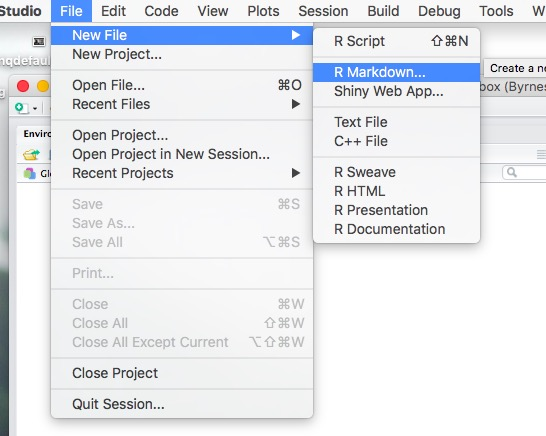
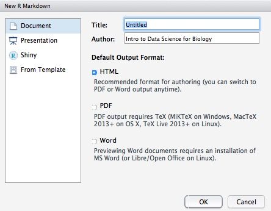

## This is what we want to avoid
<iframe width="560" height="315" src="https://www.youtube.com/embed/s3JldKoA0zw" frameborder="0" allowfullscreen></iframe>

## Why RMarkdown?
One of the central goals of data analysis is to communicate just what in the heck you have found. As you create analyses in any coded language, you'll undoubtedly produce a number of awesome results that will need a wee bit of explanation. Rather than just sent collaborators your R code and say 'run it' (presuming they can run R at all), you want a dynamic document where you can discuss results.

More than that, as you bounce your work back and forth among colleagues (or with reviewers), you're going to need to quickly make changes - both to the analyses and accompanying text. You might even re-run the whole shebang with a whole new set of data.

Enter [RMarkdown](http://rmarkdown.rstudio.com/)

RMarkdown allows you to swiftly and with little to no new knowledge incorporate R into documents - HTML, PDF, Word, etc. By embedding R alongside written text with nice formatting, you can easily communicate your results, and provide a fully reproducible workflow.

##So you want to setup a markdown document 
So how does RMarkdown work? Let's start a markdown document, and you can see.  First, create a new markdown document.



This will lead you to a dialogue box about what kind of markdown document you want to create. Typically, you'll just be whipping up a word, pdf, or html document. As you can see, though, there are a lot of options - from slides to web apps with Shiny to any number of cutomized formats that you can install packages for at http://rmarkdown.rstudio.com/formats.html - for example, the slides I build using Reveal.js are from a custom library.



Let's create an HTML document called `My First Markdown`

## YAML
At the top of the document you'll see a block like
```{r eval=FALSE}
---
title: "My First Markdown"
author: "Intro to Data Science for Biology"
date: "September 8, 2016"
output: html_document
---
```
This is header information in the YAML (Yet Another Markup Language) format. There are a lot of ways to modify YAML, many of which are covered in specific sections of http://rmarkdown.rstudio.com/ - although for now, you'll likely not need to change too much. Note the output type. Indeed, all you need to do is change that line, and you can go from HTML to Word formats seamlessly.

## The markdown
Next you see the actual document which will look something like.

```{r, eval=FALSE}
## R Markdown

This is an R Markdown document. Markdown is a simple formatting syntax for authoring HTML, PDF, and MS Word documents. For more details on using R Markdown see <http://rmarkdown.rstudio.com>.

When you click the **Knit** button a document will be generated that includes both content as well as the output of any embedded R code chunks within the document. 

```

OK, there's a lot here First, note the top with the `##` - that's markdown syntax! It says, make the rest of the line bold. As opposed to the ``**knit**` which just bolds the word Knit.

## What about R code?

Next, note the embedded code

```{r, eval=FALSE}
You can embed an R code chunk like this:

```{r cars}
summary(cars)
```
```

The backtick and bracket notation defines a code block. The code block also is given a name - cars. This is so that as figures, etc., get generated, or if you cache an analysis, you have a good identifier for the output. It also helps with finding a code block later on.

## Including Plots

You can also embed plots, for example:

```{r plotblock, eval=FALSE}
```{r pressure, echo=FALSE}
plot(pressure)
```
```

Which produces

```{r pressureplot, echo=FALSE}
plot(pressure)
```

Note two things here - first, PLOTS! Second, the `echo` argument. You can put in a number of arguments - such as `echo=FALSE`, eval, fig.height, fig.width, and many more. For more arguments, see http://yihui.name/knitr/options/


## That's really it....
At this point, armed with the cheat sheet, that's most of what you'll need to know about RMarkdown. Try knitting the current default document that's created. Then try adding a few code chunks, as well as several kinds of syntax from the cheat sheet. Try italics, emdash, and a list! But the beauty of Rmarkdown - and markdown in general - is its simplicity.
