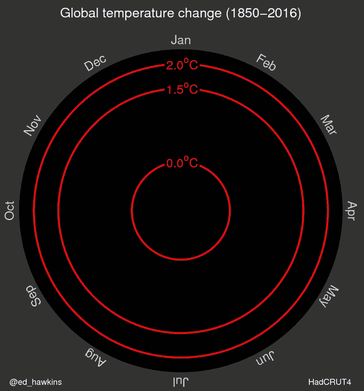

Good data visualizations can have a strong impact on how you think about a phenomena. Earlier in 2016, a single image made by Ed Hawkins brought home how much our global average temperature has changed in a way that even the famous hockey stick graph didn't. 

<center>\
from http://www.climatecentral.org/news/see-earths-temperature-spiral-toward-2c-20332</center>

There is a **lot** going on in this image. It's truly stunning. And a lot of it illustrates all of the best principles of data visualization - and it can be done in ggplot2! So, today, we're going to use this graph as our point of entry into exploring data visualization and ggplot2.

### 1. Load the data

We'll begin by loading in the data using `readr`. We're doing this so that, later, we can do some ordering by month - but can determine that ordering ourselves. We'll also load `dplyr` as we'll use its functions in a few places today.

```{r load_data, messages=TRUE}
library(readr)
library(dplyr)

hadcrut_temp_anomoly <- read_csv("./data/04/hadcrut_temp_anomoly_1850_2015.csv")

hadcrut_temp_anomoly
```

Here we see a data table with year, month, temperature anomoly for that month, and a name for the month. The month name is convenient - but - if we want to use it as an ordered variable later, we're going to have problems. R by default orders alphabetically. 

#### 1.1 Factors and Forcats

To impose a different ordering schema on `month_name`, we'll need to turn it into a `factor` - a character vector that has a set of ordered levels. If we had used `read.csv()` to load the data, this would have already been done - but is generally bad practice to assume.

To create a factor, we can use `factor()`.  We can see the order of the levels with `levels()`.

```{r make_factor}
hadcrut_temp_anomoly <- hadcrut_temp_anomoly %>%
  mutate(month_name = factor(month_name))

levels(hadcrut_temp_anomoly$month_name)
```

Uh oh - alphabetical! Enter `forcats` - a wonderful library from the `tidyverse` designed to work with factors in just such a scenario. There are a number of useful functions such as `fct_recode()` for changing the names of different factor levels, `fct_relevel()` for specifying arbitrary factor level orders, `fct_rev()` for reversing level order, and more. We're going to use `fct_inorder` which specifies level order in the order we see the first appearance of each level. As the data is sorted by month, this should work out just like we need.

```{r forcats_relevel}
library(forcats)


hadcrut_temp_anomoly <- hadcrut_temp_anomoly %>%
  mutate(month_name = fct_inorder(month_name))

levels(hadcrut_temp_anomoly$month_name)
```

Notice now that `month_name`'s class changes when we look at `hadcrut_temp_anomoly`

```{r show_data}
hadcrut_temp_anomoly
```

### 2. Types of plots

#### 2.1 Starting a plot
`ggplot2` contains a number of different types of geometries for displaying points. However, all of them begin by giving ggplot2 some information. What data is going to be used? What elements of that data will map onto different aesthetic values and scales in the plot? We'll start by creating the base of our plot with the x-axis being month and the y-axis being temperature anomoly.

```{r ggplot_base}
library(ggplot2)

had_plot_base <- ggplot(data = hadcrut_temp_anomoly,
                        mapping = aes(x = month_name, y = anomaly))
```

Great! We have the basics of our plot saved as an object. We do this as, like `dplyr`, we build succesively onto each `ggplot` - with addition rather than a pipeline, but the principle is the same.

Now, note, if you just type `had_plot_base` into R right now, a blank plot comes up. That's because, while we've given the plot data to work with, we haven't specified how we want the plot displayed.

#### 2.2 Scatterplots

To take a basic plot and add a geometry choice to it, we use one of the family of `geom_`s in `ggplot2`. One of the most basic plot types we ever encounter is the scatterplot. y versus x. That's all. For that, we have `geom_point()`

```{r ggplot_point}
had_plot_base +
  geom_point()
```

This is great! But, well, a few things.  First, man, lots of points overlap. If only they were kinda transparent. Second, maybe they're too small? Each `geom` has a number of options for different visual elements - color, size, alpha, etc. So, for example, we can modify this plot a bit.

```{r ggplot_point_mod}
had_plot_base +
  geom_point(alpha = 0.5, size=3)
```

Note - all of these are relative to 1. Well, now we can see the distribution of points a bit better, given overlap. But....


#### 2.3 Jitter
Maybe we want to add a bit of random noise to the points, to better visualize what's going on here. For that, there's `geom_jitter`.

```{r jitter}
had_plot_base +
  geom_jitter()
```

Neat! You can see the density of each cluster for each month so much more clearly! Now, you may be wondering - hold on - I only want to add jitter to the x-axis, not the y-axis. For that, there's the width and height argument of how much jitter room there is to spare. So - let's say we want the points to vary in the x by $\pm$ 0.5, but 0 in the y. And let's throw in some alpha for good measure.

```{r jitter_0}
had_plot_base +
  geom_jitter(width=0.5, height=0, alpha=0.8)
```

#### 2.4 Boxplot, Violins, and stacking.
This is all well and good, but, eyeballing is not the same as some solid information on the distribution of the data. For that, there is our old friend the boxplot.

```{r boxplot}
had_plot_base +
  geom_boxplot()
```

Note, with the boxplot, you can monkey with a few other options - both `color` and `fill` are different.

```{r boxplot_color}
had_plot_base +
  geom_boxplot(color="orange", fill="lightblue")
```

Ugly, but you see what I'm getting at.

To see the distribution in more detail, we also have the violin plot from `geom_violin` which shows even more distribution detail with kernel density estimation.

```{r violin}
had_plot_base +
  geom_violin()
```

Neat. What if we want something like a violin plot, but to also see the data? The beauty of having separate geometries for data is that we can layer them.

```{r viopoint}
had_plot_base +
  geom_violin() +
  geom_point(alpha=0.6, size=3)
```

You could also try this with a boxplot and jittering.

#### 2.5 Lines
OK - but if we're going to build the animation, we need lines, no? There is, of course, a `geom_line` that shows lines connecting points, but does not show the points (yes, you can layer both `geom_line` and `geom_point`).

```{r line_bad}
had_plot_base +
  geom_line()
```

UGH - what happened? Welp, because month_name is a factor, all of the points within a month were connected. Oops! There is a way around it, and that is to specify what your groups are, rather than let ggplot define it for you.

One of the nice things about geoms is that we can add aesthetic elements from the data frame. Heck, if you want, you can add a geom with a whole new data set and new aesthetics, but for now, let's just redefine the group aesthetic.

```{r line}
had_plot_base +
  geom_line(mapping = aes(group=year))
```

Perfect! We are on our way!

#### 2.6 Exercises

1) Using `geom_hist`, what does the distribtion of anomolies look like.

1) Plot anomoly by year. First, plot the points.

2) Now, try it as a boxplot. You'll need to add `group = year` to the mapping.

3) Last, try a line plot, using `group = month`.

### 3. Adding information via aesthetic mapping
We've got our line plot working the way we want it to. But we need to add other information for later visualization. 

R provides a number of different scales that can all be tied to a variable inside the `aes` function. Most commonly, we'll use color, fill, alpha, size, and shape. There are other options, such as lty for line type, but those will be specific to the geom.

### 3.1 Color

As color is the most common modification, let's concentrate on that. The lessons can be used broadly for other scales.

```{r color}
had_lines <- had_plot_base +
  geom_line(mapping = aes(group=year, color=year))

had_lines
```

A few things to note. First, year is treated continuously, so it's placed on a gradient. Second the default color gradient is from dark to light blue.

This is great, but what if we want different colors? If your colors are continuous, the first go-to to change them is `scale_color_continuous` - and we add scales just like we added geoms before.  Let's start with a traditional blue to red gradient.

```{r scale_color}
had_lines +
  scale_color_continuous(low = "blue", high = "red")
```

This works great. We could also have used `scale_color_gradient` exactly the same way to achieve the same results. If you want to know more of what colors are available in R, see [this post](http://research.stowers-institute.org/efg/R/Color/Chart/) or 

#### 3.2 More on Gradients

This is **much** better. But it's still hard to see the middle ranges of years  For that, we have the `scale_gradient_2` function, which takes an argument for what the midpoint color should be, but then **you** have to specify the value for that midpoint. Let's just go with the 1925.

```{r scale_color_grad2}
had_lines +
  scale_color_gradient2(low = "blue", mid = "yellow", high = "red",
                        midpoint = 1925)
```

Groovy! What if we wanted something more arbitrary - say, a 7 colors of the rainbow gradient? `scale_color_gradientn` has you covered.


```{r scale_color_gradn}
had_lines +
  scale_color_gradientn(colors=rainbow(7))
```

Note the `rainbow()` function. R comes with a few different color palatte functions (and see the `colors` helpfile for how to view all of the colors in R). For each palatte, we feed it a number of colors, and get a vector back. Using some code from the `rainbow` helpfile, here ar ethe default pallates.

```{r, echo=FALSE}

##------ Some palettes ------------
demo.pal <-
  function(n, border = if (n < 32) "light gray" else NA,
           main = paste("color palettes;  n=", n),
           ch.col = c("rainbow(n, start=.7, end=.1)", "heat.colors(n)",
                      "terrain.colors(n)", "topo.colors(n)",
                      "cm.colors(n)"))
{
    nt <- length(ch.col)
    i <- 1:n; j <- n / nt; d <- j/6; dy <- 2*d
    plot(i, i+d, type = "n", yaxt = "n", ylab = "", main = main)
    for (k in 1:nt) {
        rect(i-.5, (k-1)*j+ dy, i+.4, k*j,
             col = eval(parse(text = ch.col[k])), border = border)
        text(2*j,  k * j + dy/4, ch.col[k])
    }
}
n <- if(.Device == "postscript") 64 else 16
     # Since for screen, larger n may give color allocation problem
demo.pal(n)

```
Try one, and see what it does to you!

#### 3.3 More Organized Gradients

There are of course a ton of packages with other pallates our there. One of the most popular, because it's color selection is based on research looking at color blindness, and how we see sequential or diverging palattes of color, is `RColorBrewer`. You can view a lot more about it at http://colorbrewer2.org/ - for now, let's take a gander at what it provides.

```{r brew}
#install.packages("RColorBrewer")
library(RColorBrewer)

display.brewer.all(n=10, exact.n=FALSE)
```

That's a lot. Which of these do you think is best for seeing differences between years? Why? I admit, I'm often partial to `BrBG`

```{r brewer1}
had_lines +
  scale_color_gradientn(colors=brewer.pal(7, "BrBG"))
```

#### 3.4 More Color Packages
In point of fact, there are **many** different color palette packages out there. I'll just leave you with two more. The first is my *personal* favorite - the Wes Anderson package - https://github.com/karthik/wesanderson. Don't worry, there are install packages on the github page. 

The second is the viridis palatte. This is a pretty common yellow--blue-based palette (and the package - https://cran.r-project.org/web/packages/viridis/vignettes/intro-to-viridis.html - also comes with a 'magma' palette as well.) These two palettes are great as they show up well for people with color blindness. Heck - if you really want to have color-blind safe color schemes, you might also want to check out the [`dichromat`](https://cran.rstudio.com/web/packages/dichromat/index.html) package - it not only contains multiple colorblind safe palettes, but it also allows you to see what your color palette will look like under different forms of color blindness.

So, it's no accident that viridis is what was used for the original animation. Let's make it our own. We'll also add `guide = 'none'` to lose the colorbar at ths side.

```{r viridis}
library(viridis)
had_lines_color <- had_lines +
  scale_color_viridis(guide="none")

had_lines_color
```

#### 3.5 Exercises

1) What happens to our histogram if we add a fill argument. Try `fill = factor(year)` (note that without the factor, nothing happens!).

2) Returning to our line plot of year by anomoly, try coloring *also* by anomoly. First use the default palatte, and then try a blue-white-red.

3) Now color by month. Try at least two different palettes either of your own devising or from an additional package. Note, if you use `month_name`, you'll be mucking about with `scale_color_manual`. RColorBrewer handles discrete groups easily. 


### 4. Facets to see grouped information

Before we get to the circular animation hotness, I wanted to take a brief digression to show another way to visualize multiple dimensions. Figures often have multiple panels, each of which shows a different slice of the data. In `ggplot`, these are called facets. Before we jump whole hog into seeing this big timeseries, I want us to really look at each month and see if there are trends there. So, I want us to begin a slightly different plot - let's look at temperature anomoly over time, but with different lines showing different months, and the x axis is year.

```{r monthly_lines}
had_months <- ggplot(data = hadcrut_temp_anomoly,
       mapping = aes(x= year, y = anomaly, group = month_name)) +
  geom_line()
  
had_months
```

If you'd like, try adding a color and muck about with `scale_color_discrete` and its `values` argument. Categorical groupings are really a place also where `RColorBrewer` and `wesanderson` shine.

But, what if instead of separating by color - as these lines all overlap - we really wanted to see each line on its own in a panel.  There are two functions that can help us here. The first is `facet_wrap()`

```{r facet}
had_months +
  facet_wrap(~month_name)
```

The second is a function that allows us to facet with two variables - one with rows and one with columns.  We can't do that with this example, but, in essence, you would use a similar tilda notation as above - `facet_grid(rows ~ cols)`

#### 4.1 Exercises

1) It's a little bit more difficult to facet our monthly plot. We have too many years. But, what about splitting by decade? Use dplyr to create a decade column where to get decade, simply `round(year/10)*10).

2) Now facet out lineplot by decade.

3) Use dplyr to get the average anomoly for each month/decade combination.

4) Plot the relationship between year and anomoly, faceting by month.


### 5. Visualizing trends and summaries

As we move further into statistical visualization, `ggplot2` has a number of statistical summary plots. THe first, for grouped data, is `stat_summary`. This function will take grouped data and calculate means and other summary information. `fun.data` takes a function as an argument to calculate summary statistics. For example:

```{r mean_se}
had_plot_base +
  stat_summary(fun.data=mean_se)
```

For continuous data, we often look for trends. So going back to our faceted plot before, we can add a smoothed spline to each panel with:

```{r facet_trends, warnings=FALSE, messages=FALSE}
had_months +
  facet_wrap(~month_name) + 
  stat_smooth()
```

If instead we wanted a straight linear model fit or fit from another model, we can use the `method` argument.

```{r facet_trends_lm, warnings=FALSE, messages=FALSE}
had_months +
  facet_wrap(~month_name) + 
  stat_smooth(method="lm")
```

### 6. Making your plot theme your own

OK, getting back to our initial graph - the grey background, the font type, etc., might not really be doing it for you.
```{r echo=FALSE}
had_lines_color
```

Ugh. Grey background. Weird white lines. Maybe we don't like the default.  Ggplot2 provides some alternatives wtih `theme` functions. Now, you can specify what you'd like to your heart's content, but, there are a few canned differnt themes that can be quite nice. The two I use most commonly are `theme_bw()` and `theme_void()`
```{r themes1}
had_lines_color + theme_bw()

had_lines_color + theme_void()
```

The `theme` function is highly dynamic - you can specify simple items, such as the `base_size` for basic font sizes, etc. Or you can customize to your hearts content, with angle of text on axes, different color schemes, etc. See `?theme` or the [theme vignette](http://docs.ggplot2.org/dev/vignettes/themes.html).


But it doesn't stop there. There are whole libraries of themes for you to try! And they are constantly being updated!  Want to make your figure look like it came from Excel, fivethirtyeight.com, or was made by Tufte himself?

```{r}
#install.packages("ggthemes")
library(ggthemes)

had_lines_color +
  theme_excel()

had_lines_color +
  theme_fivethirtyeight()

had_lines_color +
  theme_tufte(base_size=17)
```

See the `ggthemes` [package vignette](https://cran.r-project.org/web/packages/ggthemes/vignettes/ggthemes.html) for more.

But for us, let's go with the solarized theme with the option `light=FALSE`, as it's close to the original.

```{r add_theme}
had_lines_color_theme <- had_lines_color +
  theme_solarized(light=FALSE)
```

#### 6.1 Exercises

1) Take the year by anomoly plots and apply three different themes of your choice to them.

### 7. Plot annotation
OK, now for the fripperies and frills - annotating our plots with information! In the GIF above, we wad demarcations of certain critical threshold as well as a title. There were also years that changed as time went by, but we'll save that for a moment.

#### 7.1 Adding lines
First, there were two critical lines - 1.5 and 2.0 degrees C. To add a vertical or horizontal line to the plot, we use `geom_vline` or `geom_hline`. These accept a `xintercept` or `yintercept`, respectively, to indicate where they should cross a plot. So, to add to our current plot.

```{r add_lines}
had_lines_annotated <- had_lines_color_theme +
  geom_hline(yintercept=c(1.5, 2.0), color="red")

had_lines_annotated
```

### 7.2 Adding text annotations

We also want to have some annotations on the lines that say what each one is. For that, we could use `geom_text`, but, that can get messy with facets, etc. Better to use `annotate`. This function takes an x and y coordinate, a `geom` type, and then all of the arguments needed for that geom. Now, often we use this with just `geom_text`, but that gets tricky given that we want to overlay this on a line.

```{r bad_annotation}
had_lines_annotated +
  annotate(x=c(1,1), y=c(1.5,2), geom="text", label=c("1.5C", "2.0C"))
```

Instead, we want something that is a `label` - something that has a background. We need to specify the background color, which I'll put in in hex code, as I don't know it's name (looked this up in some information about solarized color palattes), and a color for the text - white.

```{r add_text}
had_lines_annotated <- had_lines_annotated+
        annotate(x=c(1,1), y=c(1.5,2), 
                 geom="label", 
                 label=c("1.5C", "2.0C"), 
                 fill="#002b36", 
                 color="white", label.size=0)  

had_lines_annotated
```

Gorgeous!

#### 7.3 Title

And last, titles are easy. There's a function for it! `ggtitle`

```{r add_title}
had_lines_annotated <- had_lines_annotated +
  ggtitle("Global Temperature Change (1850-2015)")

had_lines_annotated
```

### 8. Modifying axes

We're coming down the home stretch. And before we animate, we need to change to that round axis. And remove some of the axis cruft.

#### 8.1 Axis limits

First, we want to have the lines extend all the way to the edges of the graph. So, to do that, we want the limits of the x-axis to be set to Jan and Dec. The `xlim()` function (and there is a `ylim()` function as well) should take care of that. If we had a continuous scale, we'd just feed a vector, with minimum and maximum - e.g. `c(1,12)`. 

But, here we want to feed the factor vector from which everything is derived. We've taken care of ordering, so, we no longer need `xlim()`. Instead, we want to use the `scale_x_discrete` function that lets us set properties of an x axis with discrete values. In our case, we want to alter how much additional space is placed around the first and last month using the `expand` argument. So let's cut that down to 0!

```{r xlim}
had_lines_annotated_final <- had_lines_annotated + 
  scale_x_discrete(expand=c(0,0))
  
had_lines_annotated_final
```

The labels get cut off - but they'll come back in a second!

#### 8.2 Axis modification

There are a number of ways to modify an axis. Using `scale_x_continuous()` provides access to a rich number of ways to modify the x axis (or replace with y, and you get the picture).

Often we're interested in log transforming our axes: 

```{r log, warning=FALSE}
had_lines_annotated_final + 
  scale_y_log10()
```

Here, this isn't a great idea, as we lose the negative numbers. But, you can begin to see the power of how the different axis scales can work. We can invoke an arbitrary scale using the `trans` argument of `scale_x_continuous()`, although there are many already buit in.

We want a circular plot, however, which implies polar coordinates. And there's an option for that, too!

```{r polar}
had_lines_annotated_final <- had_lines_annotated_final +
  coord_polar()
  
had_lines_annotated_final
```

Oh! Fancy! Almost there!

#### 8.3 Axis labeling
The whole month name, anomaly think on the axes is a little odd. Fortunately, we can replace the string labels on either axis. We could have put in other things, but for now, let's go blank.

```{r axis_lab}
had_lines_annotated_final <- had_lines_annotated_final +
  xlab("") +
  ylab("")

had_lines_annotated_final
```

### 9. Animation

The last step we're going to take for now is to make the animation. To make an animation,we need to use the gganimate package and add a new aesthetic to our figure - first, `frame=year` which tells us that year is the property we're going to iterate over. Second, `cumulative=TRUE` which means we'll be building up lines as we go along.

```{r animate, message=FALSE, warning=FALSE, cache=TRUE,  output=FALSE, results="hide"}
library(gganimate)

had_animation <- had_lines_annotated_final +
  aes(frame=year, cumulative = TRUE)

gg_animate(had_animation, saver="gif", "animate.gif", interval=0.2)
```


This works beautifully, but wither year? For that, we'll have to add an additional annotation. We'll do that with `geom_text` as we can add a frame aesthetic.

```{r animate2, message=FALSE, warning=FALSE, cache=TRUE, output=FALSE, results="hide"}
library(gganimate)

had_animation <- had_animation +
  geom_text(mapping=aes(label=year, frame=year, cumulative = FALSE), 
            x=1, y=-1, 
            color="white")

gg_animate(had_animation, saver="gif", "animate_text.gif", interval=0.2)
```


Is it exactly the same? No. And there are things we could have done to clean it up. But, man, that is close - and shows a number of different principles that were used in creating this particular figure.

For more great ggplot2 extensions, see https://www.ggplot2-exts.org/
