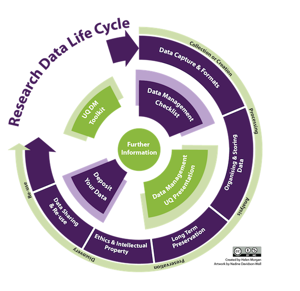

## {data-background="images/01/Sonoma_coast.jpg"}
<!-- comments for next year 
  - Maybe give the what is this class first before technology, etc.
  - It gets janky at the beginning
  - Make first pop quiz ticky box only
-->

<br><br><center><div style="font-size: 2em;font-weight: bold; color:black;background-color:white;opacity:0.8;"> Introduction  to An  Introduction  to  Computational  Data  Analysis  for  Biology  </div>  
  
<br>  
<div style="background-color:white;font-size:1em;opacity:0.8;">Jarrett Byrnes  
UMass Boston  
https://biol607.github.io/</span></center>


## First, Some New Technology
https://etherpad.wikimedia.org/p/607-intro-2018

- This class will use collaborative note-taking

- Research shows that this enhances learning!

- It's also a way to ask me a question during class

## Second, Some Old Technology
  

> - Green: Party on, Wayne 
> - Red: I fell off the understanding wagon  
> - Blue: Write a question/Other


## And Now, A Pop Quiz!
<br><br><center>
<div style="font-size: 2em;font-weight: bold;">http://tinyurl.com/firstPopQuiz</div>
</center><br><br>

## Outline for Today

1. What are we doing here?  
2. Who are we?  
3. How will this course work?  
4. A Philosophy of answering scientific questions with data   

##   


## Computational
<small style="font-size:.7em">
````{r codex, eval=FALSE}
#------------
# Split Data into Train/Test
#------------
keeley_train <- keeley[1:80,] 
keeley_test <- keeley[81:90,] 

#------------
# Random Forest Models
#------------
rf1 <- randomForest(rich ~ cover + firesev + 
                      hetero, data = keeley_train)

rf2 <- randomForest(cover ~ firesev + age + 
                      abiotic + elev, data = keeley_train)           

```
</small>
<p class="fragment" align=center><big style="color:red; font-size:2em;">Code Forces You to Be Explicit About Theory</big></p>

## Computational
<small style="font-size:.7em">
```{r codex, eval=FALSE}
```
</small>
<p class="fragment" align=center><big style="color:red; font-size:2em;">Coding is power</big></p>


## Computational
<small style="font-size:.7em">
```{r codex, eval=FALSE}
```

</small>
<p align=center><span style="color:red; font-size:2em;">Repeatable Research</span></p>

##  {data-background="images/01/gorgeous-wildflowers-37110-37953-hd-wallpapers.jpg"}
<p align=center><span style="font-size:2em; background-color:white">Data (acquisition)</span>
<br><br><br><br>
<br><br><br><br>
<span style="color:red; font-size:1em; background-color:white;">How do I get good data here?</span></p>

## Data (maintaince)
<center></center>

## Analysis (philosophy)


## Analysis (visual)
<center></center>
<footer style="font-size:0.5em; position:fixed; bottom:0; width:100%">
[http://biomedicalcomputationreview.org/](http://biomedicalcomputationreview.org/content/visualization-space-and-time-seamless-pipelines-now-available)</footer>

## Analysis (model)
<small style="font-size:.7em">
```{r, echo=FALSE, out.lines=c(1:4, 14:20)}
library(ggplot2)
eelgrass<-read.csv("./data/15q05EelgrassGenotypes.csv")
summary(lm(shoots ~ treatment.genotypes, data=eelgrass))
``` 

</small>

## for Biology
<center></center>

## for Biology
### SCIENCE FIRST!

  - What is your model(s)?  
  
  - THEN decide on statistical approach  
  
  - Can you get data to paramaterize that model?  
  
  - How does biology inform your modeled results?  

## Avoiding The Replication Crisis


http://simplystatistics.org/2016/08/24/replication-crisis/

## Course Goals

> 1. Learn how to think about your research in a systematic way to design efficient observational & experimental studies.  <br><br> 
> 2. Understand how to get the most bang for your buck from your data.  <br><br> 
> 3. Make you effective collaborators with statisticians.  <br><br> 
> 4. Make you comfortable enough to learn and grow beyond this class.  

## Who are You?
1. Name  

2. Lab  

3. Brief research description  

4. Why are you here?  


<!-- SECTION BREAK -->
## Outline for Today
1. What are we doing here?  
2. Who are we?  
3. <span style="color:red">How will this course work?  </span>
4. A Philosophy of answering scientific questions with data   

## Lecture and Lab
 - M/W Lecutre on Concepts
 - Occasional Paper Discussion
 - F Lab (which will cover some homework problems!)
 

## Yes, Lectures are Coded
R Markdown sometimes with Reveal.js
&nbsp;  
<center></center>
http://github.com/biol607/biol607.github.io

## Readings for Class: W&S


  
  Whitlock, W.C. and Schluter, D. (2014) The Analysis of Biological Data, 2nd Edition. 
  
http://whitlockschluter.zoology.ubc.ca/
  
  Chapter 1 this week!

## Readings for Class: Wickham & Grolemund

<br><br>  
Grolemund, G., and Wickham, W. 2016. R for Data Science.  
http://r4ds.had.co.nz

## Quizes
- Before and After Class

- Measures understanding - and attendance!

- Will drop lowest two

- 10% of your grade

## Problem Sets
- 40% of your grade
- "Adapted"" from Whitlock and Schluter
- Will often require R
- Complete them using Rmarkdown 

## Midterm
 - Advanced problem set

- Due Nov 2nd

- 20% of your grade

## Final Project
- Topic of your choosing
    - Your data, public data, any data!
    - Make it dissertation relevant!
    - If part of submitted manuscript, I will retroactively raise your grade
 &nbsp;  
 
- Dates
  - Proposal Due Oct 11th
  - Presentations on Dec 14th
  - Paper due Dec 18th (but earlier fine!)
 &nbsp;  
 
- 30% of your grade

## Extra Credit 1: Use Github
  

- This whole class is a github repo  
- Having a github presence is becoming a real advantage  
- So.... create a class repository!
- If you submit a link to your homework in a repo, +1 per homework!  
- There will be a github tutorial outside of class hours

## Extra Credit 2: Be Nate Silver (before the general election)


## Extra Credit 2: Be Nate Silver (before the general election)
{width=40%}
  
- 5 points for getting the correct answer  
- 5 extra points for explicitly stating the confidence of your estimates  
- 5 points for a clear explanation of the methodology  
- 1 point for each thing you do beyond a weighted average of polls

## Extra Credit 3: Livin' La Vida Data Science
|                       |                       |
|-----------------------|-----------------------|
|||

## Extra Credit 3: Livin' La Vida Data Science
- Check out http://www.r-bloggers.com/  
- Listen to podcasts like https://itunes.apple.com/us/podcast/not-so-standard-deviations/  
- Follow data science greats on Twitter (see https://twitter.com/jebyrnes/lists/stats-r-on-twitter)  
- +1 point per cool thing you bring up in the beginning of each class


## Extra Credit 4: Further Data Science at UMB


- +3 for joining the UMBRUG slack group and the Biol607 channel
     * https://umbrug.slack.com/ <br> \    
- +5 for attending Stats Snack on Tuesdays in Science S4-6401  

<!-- SECTION BREAK -->
## Outline for Today
1. What are we doing here?  
2. Who are we?  
3. How will this course work?  
4. <span style="color:red">A Philosophy of answering scientific questions with data </span>

## How Biostats is Often Thought of


## Our Philosophy

> 1. What is your question?  
> 2. Conceive of a model of your system  
> 3. How much do you need to know to answer your question?  
> 4. What data do you need to parameterize your model of the world?
>      - Do you need an experiment?  
>      - What breadth of observations do you need?
> 5. Fit your model of the world  
>      - Make sure you didn't burn down Prague  
> 6. Query your model to answer your question

##
<br><br><bR><h3>What is your question?</h5>

## Conceive of a model of your system


## How much do you need to know to answer your question?


## What data do you need to parameterize your model of the world?


<p align="left">http://xkcd.com</p>

## Fit your model of the world  
{width=50%}

## Query your model to answer your question


## Our Approach to Data Analysis
<center>
&nbsp;  
 Data from Reusch et al. 2005 PNAS
</center>


## Start with a Question

<center>


Does seagrass genetic diversity increase productivity?

</center>

## Build an Understanding of the System


1. Literature


2. Observation


3. Disciplinary History

## Conceive of a model of your system  

&nbsp;  
&nbsp;  
<center>


This is your **DATA GENERATING PROCESS**
</center>


## Conceive of a model of your system  
<center>


Big Picture **DATA GENERATING PROCESS**
</center>

## Conceive of a model of your system  
<center>


What is your **ERROR GENERATING PROCESS**?
</center>

## How much do you need to know to answer your question?
<center>


What can you isolate?
</center>


## What data do you need to parameterize your model of the world?

<center>


<div style="background:green; color: black; margin:3px; width:175px; float:center">1<br>Genotype</div>
<div style="background:green; color: black; margin:3px; width:175px; float:center;">3<br>Genotypes</div>
<div style="background:green; color: black; margin:3px; width:175px; float:center; clear:none;">6<br>Genotypes</div>
</center>


## Look at Your Data
```{r, echo=FALSE, warning=TRUE, fig.align='center', fig.height=5, fig.width=7}
qplot(treatment.genotypes, shoots, data=eelgrass, geom="point")+
    geom_point(size=2) +
  xlab("\n# of genotypes") + 
  ylab("# of eelgrass shoots\n") +
  theme_bw(base_size=18)
```
<p class="fragment">Fit a model(s), chosen to suit data & error generating process!</p>

## Fit your model of the world & Query It
```{r genotypes3, echo=FALSE, fig.align='center'}
qplot(treatment.genotypes, shoots, data=eelgrass, geom="point")+
  geom_point(size=2) +
  xlab("\n# of genotypes") + 
  ylab("# of eelgrass shoots\n") +
  theme_bw(base_size=18) +
  stat_smooth(method="glm", method.args=list(family=poisson(link="log")), colour="red", lwd=2)
```

## Build Open Reproducible Research
Many Methods of Sharing Data, Methods, and Results Beyond Publication


1. GitHub - public code repository
  

2. FigShare - share key figures, get a doi
  

3. Blog - open 'notebook' 
  

4. Dryad or Other Repository - post-publication data sharing
  
## 
<br><br><br><br><h2>Questions?</h2>

