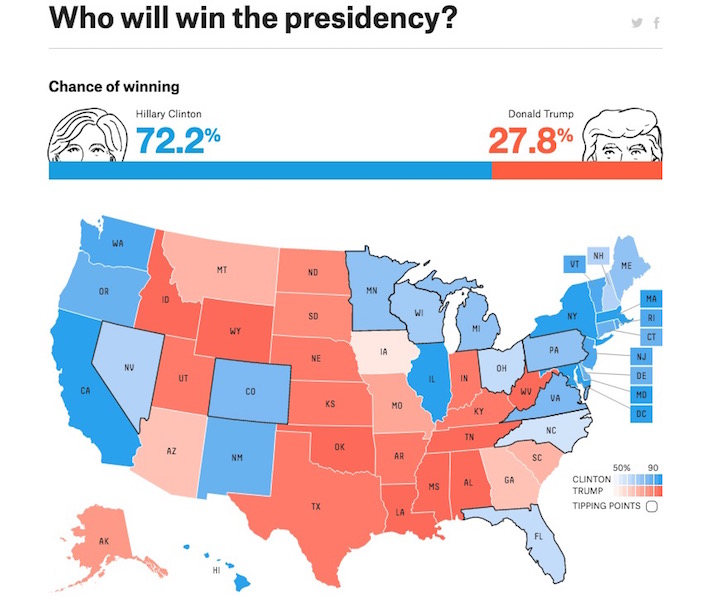
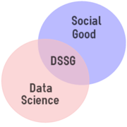
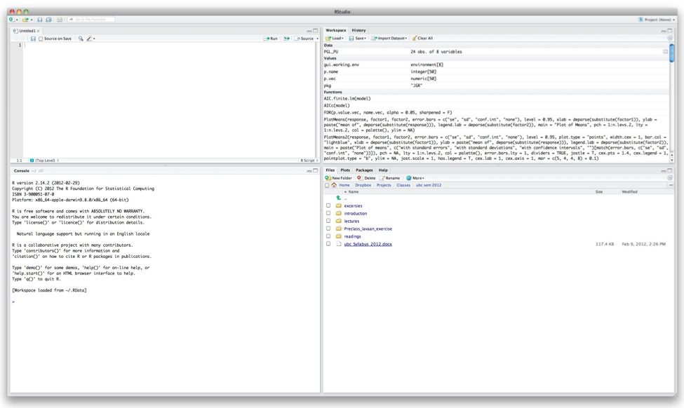
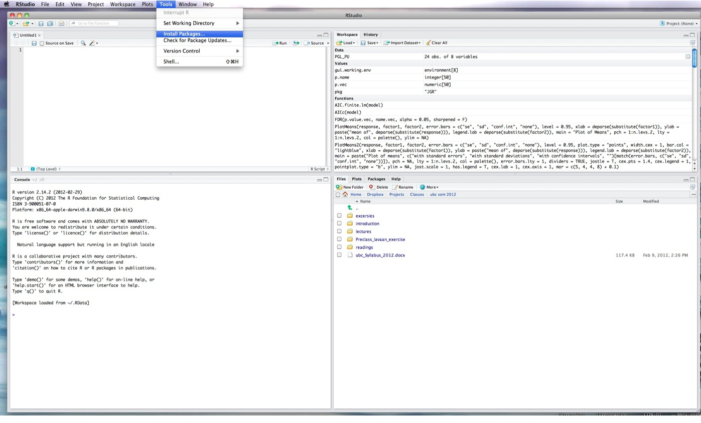
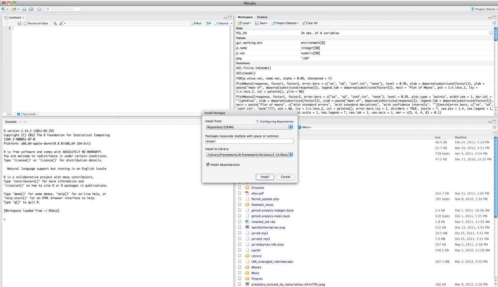

## {data-background="images/01/Sonoma_coast.jpg"}
<br><br><center><div style="font-size: 2em;font-weight: bold; color:black;background-color:white;opacity:0.8;"> Introduction  to An  Introduction  to  Computational  Data  Analysis  for  Biology  </div>  
  
  
<div style="background-color:white;font-size:1em;opacity:0.8;">Jarrett Byrnes  
UMass Boston  
https://biol607.github.io/</span></center>

## But First, A Pop Quiz
<br><br><center>
<div style="font-size: 2em;font-weight: bold;">http://tinyurl.com/firstPopQuiz</div>
</center><br><br>

## Second, Some New Technology
https://etherpad.wikimedia.org/p/607-intro

- This class will use collaborative note-taking

- Research shows that this enhances learning!

- It's also a way to ask me a question during class

## Third, Some Old Technology
  

> - Green: Party on, Wayne 
> - Red: I fell off the understanding wagon  
> - Blue: Write a question/Other

## Outline for Today

1. What are we doing here?  
2. Who are we?  
3. How will this course work?  
4. A Philosophy of answering scientific questions with data   
5. R!  

##   


## Computational
<small style="font-size:.7em">
```{r eval=FALSE}

#subset consumptionData into mixed diet treatments only (mixed diet BOX #'s are multiples of 5)
mixedData<-consumptionData[consumptionData$BOX %% 5 == 0,]
mixedData$delta<-mixedData$ADD_WT - mixedData$REM_WT
mixedData$rate<-mixedData$delta/mixedData$days

#reshape to get species-specific consumption rate table
mixed.summary<-ddply(mixedData,.(BOX,SP_CODE),function(x){
  data.frame(CONSUMPTION_RATE=mean(x$rate,na.rm=TRUE))
	})

#############fit linear models (not including consumption--see below)
LMtestChange <- lm(formula = TEST_CHANGE ~ TREATMENT, data = expData, na.action = na.omit)
```
</small>
<p class="fragment" align=center><big style="color:red; font-size:2em;">Code Forces You to Be Explicity About Theory</big></p>

## Computational
<small style="font-size:.7em">
```{r eval=FALSE}

#subset consumptionData into mixed diet treatments only (mixed diet BOX #'s are multiples of 5)
mixedData<-consumptionData[consumptionData$BOX %% 5 == 0,]
mixedData$delta<-mixedData$ADD_WT - mixedData$REM_WT
mixedData$rate<-mixedData$delta/mixedData$days

#reshape to get species-specific consumption rate table
mixed.summary<-ddply(mixedData,.(BOX,SP_CODE),function(x){
  data.frame(CONSUMPTION_RATE=mean(x$rate,na.rm=TRUE))
	})

#############fit linear models (not including consumption--see below)
LMtestChange <- lm(formula = TEST_CHANGE ~ TREATMENT, data = expData, na.action = na.omit)
```
</small>
<p class="fragment" align=center><big style="color:red; font-size:2em;">Coding is power</big></p>


## Computational
<small style="font-size:.7em">
```{r eval=FALSE}

#subset consumptionData into mixed diet treatments only (mixed diet BOX #'s are multiples of 5)
mixedData<-consumptionData[consumptionData$BOX %% 5 == 0,]
mixedData$delta<-mixedData$ADD_WT - mixedData$REM_WT
mixedData$rate<-mixedData$delta/mixedData$days

#reshape to get species-specific consumption rate table
mixed.summary<-ddply(mixedData,.(BOX,SP_CODE),function(x){
  data.frame(CONSUMPTION_RATE=mean(x$rate,na.rm=TRUE))
  })

#############fit linear models (not including consumption--see below)
LMtestChange <- lm(formula = TEST_CHANGE ~ TREATMENT, data = expData, na.action = na.omit)
```
</small>
<p align=center><span style="color:red; font-size:2em;">Repeatable Research</span></p>

##  {data-background="images/01/gorgeous-wildflowers-37110-37953-hd-wallpapers.jpg"}
<p align=center><span style="font-size:2em; background-color:white">Data (acquisition)</span>
<br><br><br><br>
<br><br><br><br>
<span style="color:red; font-size:1em; background-color:white;">How do I get good data here?</span></p>

## Data (maintaince)
<center></center>

## Analysis (philosophy)


## Analysis (visual)
<center></center>
<footer style="font-size:0.5em; position:fixed; bottom:0; width:100%">
[http://biomedicalcomputationreview.org/](http://biomedicalcomputationreview.org/content/visualization-space-and-time-seamless-pipelines-now-available)</footer>

## Analysis (model)
<small style="font-size:.7em">
```{r, echo=FALSE, out.lines=c(1:4, 14:20)}
library(ggplot2)
eelgrass<-read.csv("./data/15q05EelgrassGenotypes.csv")
summary(lm(shoots ~ treatment.genotypes, data=eelgrass))
``` 

</small>

## for Biology
<center></center>

## for Biology
### SCIENCE FIRST!

  - What is your model(s)?  
  
  - THEN decide on statistical approach  
  
  - Can you get data to paramaterize that model?  
  
  - How does biology inform your modeled results?  

## Avoiding The Replication Crisis


http://simplystatistics.org/2016/08/24/replication-crisis/

## Course Goals

> 1. Learn how to think about your research in a systematic way to design efficient observational & experimental studies.
  
> 2. Understand how to get the most bang for your buck from your data.
  
> 3. Make you effective collaborators with statisticians.
  
> 4. Make you comfortable enough to learn and grow beyond this class.

## Who are You?
1. Name  

2. Lab  

3. Brief research description  

4. Why are you here?  


<!-- SECTION BREAK -->
## Outline for Today
1. What are we doing here?  
2. Who are we?  
3. <span style="color:red">How will this course work?  </span>
4. A Philosophy of answering scientific questions with data   
5. R!  

## Lecture and Lab
 - T/Th Lecutre on Concepts
 - Occasional Paper Discussion
 - Th Lab (which will cover some homework problems!)
 

## Yes, Lectures are Coded
R Markdown sometimes with Reveal.js
&nbsp;  
<center></center>
http://github.com/biol607/biol607.github.io

## Readings for Class: W&S


  
  Whitlock, W.C. and Schluter, D. (2014) The Analysis of Biological Data, 2nd Edition. 
  
http://whitlockschluter.zoology.ubc.ca/
  
  Chapter 1 this week!

## Readings for Class: Grolemund & Wickham

<br><br>  
Grolemund, G., and Wickham, W. 2016. R for Data Science.  
http://r4ds.had.co.nz

## Quizes
- Before and After Class

- Measures understanding - and attendance!

- Will drop lowest two

- 10% of your grade

## Problem Sets
- 40% of your grade
- "Adapted"" from Whitlock and Schluter
- Will often require R
- Complete them using Rmarkdown 

## Midterm
 - Advanced problem set

- Due Nov 4th

- 20% of your grade

## Final Project
- Topic of your choosing
    - Your data, public data, any data!
    - Make it dissertation relevant!
    - If part of submitted manuscript, I will retroactively raise your grade
 &nbsp;  
 
- Dates
  - Proposal Due Oct 7th
  - Presentations on Dec 15th
  - Paper due Dec 16th (but earlier fine!)
 &nbsp;  
 
- 30% of your grade

## Extra Credit 1: Use Github
  

- This whole class is a github repo
- Homeworks will be posted as part of the repo
- If you submit your homework via a pull request, +1
> - There will be a github tutorial outside of class hours

## Extra Credit 2: Be Nate Silver


## Extra Credit 3: Livin' La Vida Data Science
|                       |                       |
|-----------------------|-----------------------|
|||

## Extra Credit 4: Data Science for Social Good


http://www.meetup.com/Data-Science-for-Social-Good/

<!-- SECTION BREAK -->
## Outline for Today
1. What are we doing here?  
2. Who are we?  
3. How will this course work?  
4. <span style="color:red">A Philosophy of answering scientific questions with data </span>
5. R!  


## Our Approach to Data Analysis
<center>
&nbsp;  
 Data from Reusch et al. 2005 PNAS
</center>


## Start with a Question

<center>


Does seagrass genetic diversity increase productivity?

</center>

## Build an Understanding of the System


1. Literature


2. Observation


3. Disciplinary History

## Construct a Causal Model of the System

&nbsp;  
&nbsp;  
<center>


This is your **DATA GENERATING PROCESS**
</center>


## Construct a Causal Model of the System
<center>


Big Picture **DATA GENERATING PROCESS**
</center>

## Construct a Causal Model of the System
<center>


What is your **ERROR GENERATING PROCESS**?
</center>

## Construct a Causal Model of the System
<center>


What can you isolate?
</center>


## Collect the Data to Best Estimate & Test the Model

<center>


<div style="background:green; color: black; margin:3px; width:175px; float:center">1<br>Genotype</div>
<div style="background:green; color: black; margin:3px; width:175px; float:center;">3<br>Genotypes</div>
<div style="background:green; color: black; margin:3px; width:175px; float:center; clear:none;">6<br>Genotypes</div>
</center>


## Look at Your Data
```{r, echo=FALSE, warning=TRUE, fig.align='center', fig.height=5, fig.width=7}
qplot(treatment.genotypes, shoots, data=eelgrass, geom="point")+
    geom_point(size=2) +
  xlab("\n# of genotypes") + 
  ylab("# of eelgrass shoots\n") +
  theme_bw(base_size=18)
```
<p class="fragment">Fit a model(s), chosen to suit data & error generating process!</p>

## Analysis!
```{r genotypes3, echo=FALSE, fig.align='center'}
qplot(treatment.genotypes, shoots, data=eelgrass, geom="point")+
  geom_point(size=2) +
  xlab("\n# of genotypes") + 
  ylab("# of eelgrass shoots\n") +
  theme_bw(base_size=18) +
  stat_smooth(method="glm", method.args=list(family=poisson(link="log")), colour="red", lwd=2)
```

## Build Open Reproducible Research
Many Methods of Sharing Data, Methods, and Results Beyond Publication


1. GitHub - public code repository
  

2. FigShare - share key figures, get a doi
  

3. Blog - open 'notebook' 
  

4. Dryad or Other Repository - post-publication data sharing
  
## Questions


<!-- SECTION BREAK R -->
## Outline for Today
1. What are we doing here?  
2. Who are we?  
3. How will this course work?  
4. A Philosophy of answering scientific questions with data   
5. <span style="color:red">R!  </span>


## What is R?
&nbsp;
&nbsp;
<center> **A programming language uniquely developed for statistical analysis** </center>

## Why R?

1. Free  
2. Huge growing community  
3. Packages to do almost anything  
4. Makes reusable research easy  
5. C-based language  
6. Syntax naturally matches analytical thinking

## What is R Studio?


- Cross-Platform Graphical User Interface for R
- It is not R


## Let's Fire It Up!
<center>
**Open R-Studio.<br><br> Don't have it?  Download it from http://rstudio.org**</center>

## What do you see?

<center></center>

## The Console and Math

&nbsp;  

```{r math1}
1+1
```
&nbsp; 

<span style="color:red">You try - different mathematical operators</span>

## Everything is an Object

&nbsp;
```{r objCode1}
a.number<-1+1
```

```{r objCode2}
a.number
```
&nbsp;  
&nbsp;  

<span style="color:red">You try - what can you save as an object?</span>

## Note: Comment Your Code as You Write with `#`

The text after `#` is not evaluated.  

```{r}
#This is going to be the number two
a.number<-1+1
```

<small style="font-size:.8em">
```{r comment2}
#####----------

# You can get creative with comments to separate code blocks
# And write a lot, which is good practice

#####----------
```
</small>
Your comments tell readers - including yourself - what you are doing


## Functions Work on Objects

&nbsp;

```{r funcCode}
sin(a.number)
```


How to get help for a function
```{r helpCode, eval=FALSE}
?cos

help(cos)

??'cosine function'
```

## Lots of Object Types - like Data!
&nbsp;

```{r dataCode}
head(cars, n=3) #note the n= argument!
```

> <red>Try looking at all of cars and names(cars)</red>  

## Graphics are a Snap

```{r plotCode, fig.width=7, fig.height=5}
plot(speed ~ dist, data=cars)
```

<span class="fragment">Look at ?plot to see other arguments to change appearance</span>


## Installing Packages

<center><center>


## Installing Packages

<center><center>

## Installing Packages

You can also install packages from the command line.  
<small style="font-size:.8em;">

```{r pkg-install, eval=FALSE}
install.packages('ggplot2', repos='http://cran.case.edu/', dependencies=TRUE)
```
</small>  

Using one of the above methods, install the package ggplot2 and its dependencies now.


## Using a Package
```{r qplotCode, fig.align='center', fig.height=5, fig.width=7}
library(ggplot2)

qplot(dist, speed, data=cars)
```

## You Try It

1. Load ggplot2 and look at the mtcars data set  
   
2.Look at the qplot help file & demos  
  
3. Make two plots (ggplot or plot)  

```{r plotcode2,  fig.align='center', fig.width=4, fig.height=4, echo=FALSE}
library(ggplot2)

qplot(factor(cyl), mpg, data=mtcars, geom="boxplot")
```

## Questions
