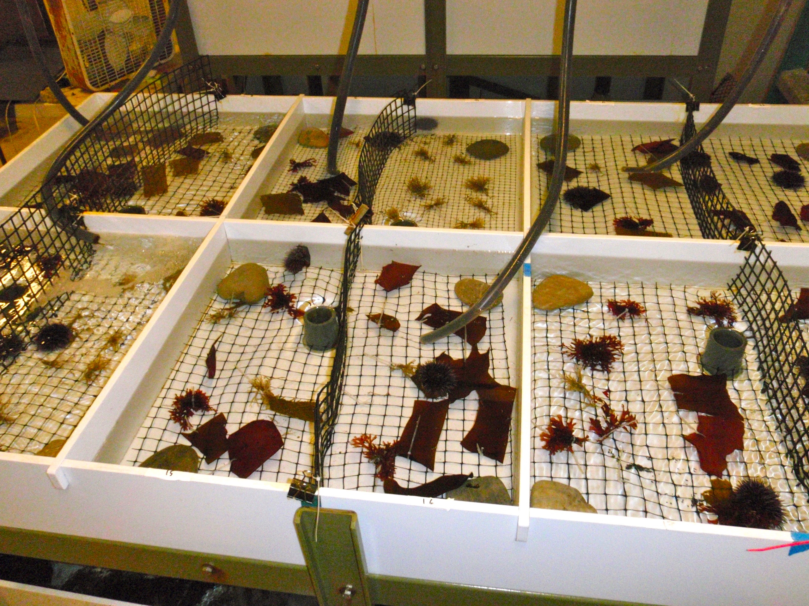
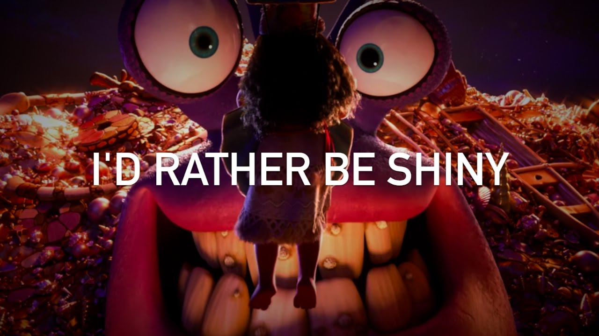
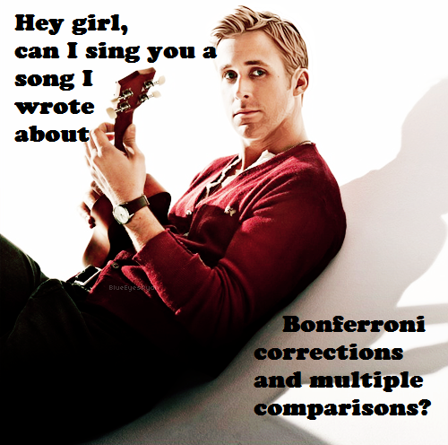
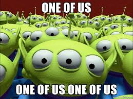

class: center

# Why are we here?

---

# Some zoom ettiquite

- If you *can*, keep your cameras on. I rely on your facial feedback!  
      - But if you don't want to, are eating, are being bodyslammed by toddlers, are at another job, just got out of the shower, etc. *THAT IS FINE*  
      
- As I'm usually full screen, so, to ask questions, chat - it flashes in my screen!  
  
- You can also PM Michael at any time.  
  
- Extra credit for fluffs  

- We will also use Etherpad for communication (next slide!)  
  
- I will record all classes and labs if you cannot make it

---

# Who are You?

1. Name  

2. Lab  

3. Brief research description  

4. Why are you here?  

--
  
    
.center[Write it here: https://etherpad.wikimedia.org/p/607-intro-2020]

---

# Course Goals

1. Learn how to think about your research in a systematic way to design efficient observational & experimental studies.  <br><br> 

--

2. Understand how to get the most bang for your buck from your data.  <br><br> 

--

3. Make you effective collaborators with statisticians.  <br><br> 

--

4. Make you comfortable enough to learn and grow beyond this class.  

---

# What are we doing here?
## Course divided into blocks

--

1. Introduction to computation and reproducibility

--

2. Regression and Inference

--

3. Causal Inference

--

4. Further Adventures in Regression

--

5. ???

---

# Block 1: Computation 

```{r plot_eelgrass, echo=TRUE, eval = FALSE}
# Load the library ####
library(ggplot2)

# Load the data ####
eelgrass <- read.csv("./data/15q05EelgrassGenotypes.csv")

# Plot ####
ggplot(eelgrass,
       aes(y = shoots, x = treatment.genotypes)) +
  geom_point() +
  stat_smooth(method = "lm") +
  theme_classic(base_size = 17) +
  labs(x = "No. of Genotypes", y = "No. of Shoots per sq. m.")
``` 

--
.center[.large[.red[Coding is power!]]]

--

.center[.large[.red[Code Forces You to Be Explicit About Biology]]]

---
class:center

# Block 1: Reproducibility


---
class:center

# Avoiding The Replication Crisis


---

# Block 2: Regression

```{r plot_eelgrass, fig.align='center', message=FALSE, echo=FALSE}
``` 


---

# Block 2: Inference

.center[]

- What is the probability of a hypothesis?
- Is variation explained by a driver of interest?
- Do drivers of interest differ from a null or other expectation?
- How can we generalize from our models to the world?

---
class:center

# Block 3: Causal Inference


---

# Block 3: Causal Inference & Experiments



---

# Block 4: Further Adventures


--
.large[.center[Don't worry! It's all just a line!]]

---
class:center

# Block 5: ???



---

# Lecture and Lab
- T/Th Lecture on Concepts  
      - Paper Discussion, Shiny Apps, etc.  
      - Please bring your most interactive self!  
      - I have a tablet, so, I can sketch concepts, etc!
   
- F Lab
      - Live coding!
      - I will screw up - don't take me as gospel!
      - Be generous with feedback/pace comments  
      - Invite your friends!
 
---
 
# Yes, Lectures are Coded
R Markdown sometimes with Reveal.js or Xarnigan
&nbsp;  
.center[]
http://github.com/biol607/biol607.github.io

---
class: center

# Readings for Class: W&S


  
.left[Whitlock, W.C. and Schluter, D. (2020) The Analysis of Biological Data, 3rd Edition.] 

https://whitlockschluter3e.zoology.ubc.ca/

---
class: center

# Readings for Class:<br>Wickham & Grolemund


.left[Grolemund, G., and Wickham, W. 2016. R for Data Science.]  
http://r4ds.had.co.nz

---

class:center

# There will be memes



--

.large[Extra credit for feeding my #statsmeme addiction]

---

# Quizes

- Before and/or After Class

- Measures understanding - and attendance!

- Will drop lowest two

- 10% of your grade

---
# And Now, A Pop Quiz!
<br><br><center>
<div style="font-size: 2em;font-weight: bold;">http://tinyurl.com/firstPopQuiz</div>
</center><br><br>

---

# Problem Sets
- THE MOST IMPORTANT THING YOU DO  
  
- 40% of your grade  
  
- "Adapted"" from Whitlock and Schluter  
  
- Will often require R  
  
- Complete them using Rmarkdown   
  
- Submit via Dropbox or Github

---

# Midterm
- Advanced problem set

- 20% of your grade

- After Regression

---

# Final Project

- Topic of your choosing
    - Your data, public data, any data!
    - Make it dissertation relevant!
    - If part of submitted manuscript, I will retroactively raise your grade
 &nbsp;  
 
- Dates
  - Proposal Due Oct 9th
  - Presentations on Dec 11th
  - Paper due Dec 18th (but earlier fine!)
 &nbsp;  
 
- 30% of your grade

---

# Extra Credit 1: Use Github
.center[]


- This whole class is a github repo  
- Having a github presence is becoming a real advantage  
- So.... create a class repository!
    - folder for homework, folder for exams, folder for labs
- If you submit a link to your homework in a repo, +1 per homework!  
- There will be a github tutorial outside of class hours?

---

# Extra Credit 2: Be Nate Silver (before the general election)
.center[]

- Submit your forecast with code!  
      - 5 points for getting the correct answer  
      - 5 extra points for explicitly stating the confidence of your estimates  
      - 5 points for a clear explanation of the methodology  
      - 1 point for each thing you do beyond a weighted average of polls
- Applied to exam

---

Extra Credit 3: Livin' La Vida Data Science

- Check out http://www.r-bloggers.com/ and https://rweekly.org/  

- Listen to podcasts like https://itunes.apple.com/us/podcast/not-so-standard-deviations/  

- Start going to local R User Groups like https://www.meetup.com/Boston-useR/  

- Follow data science greats on Twitter (see https://twitter.com/jebyrnes/lists/stats-r-on-twitter)  

- +1 point per cool thing you bring up in the beginning of each class or on the UMBRug slack

---

# Extra Credit 4: Help your fellow students


- Having a problem during homework/exam/etc?
- First, try and solve it yourself (google, stackoverflow, etc.)
- Post a REPRODUCIBLE EXAMPLE to our slack channel
- +1 for answering before I do!
- Will constitute a separate pool of EC at end of semester

---

# Extra Credit 5: Master of the Tidyverse
.center[]

- Write an R package, get a full grade bump
- Yeah, I said it
- See the [http://github.com/covid19R](covid19R project), perhaps?

---

# Welcome!
<br><br>

.center[.middle[]]
