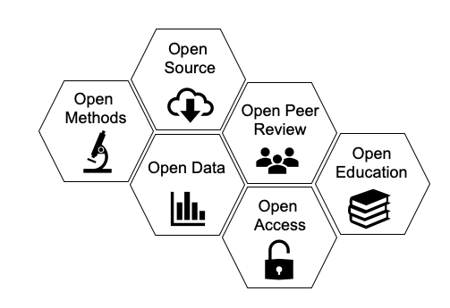
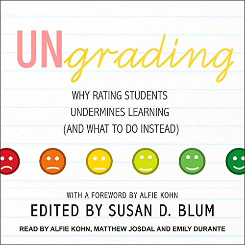
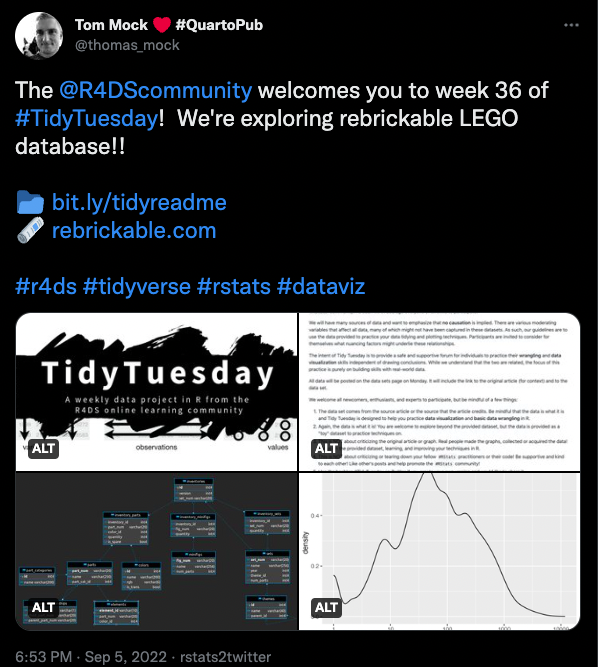

class: center

# Why are we here?


---

# Who are You?

1. Name  

2. Lab  

3. Brief research description  

4. Why are you here?  

--
  
    
.center[Write it here: https://etherpad.wikimedia.org/p/607-intro-2022]

---

# Course Goals

1. Learn how to think about your research in a systematic way to design efficient observational & experimental studies.  <br><br> 

--

2. Understand how to get the most bang for your buck from your data.  <br><br> 

--

3. Make you effective collaborators with statisticians.  <br><br> 

--

4. Learn how to program to expand your scientific toolkit. <br><br>

--

5. Make you comfortable enough to learn and grow beyond this class.  

---

# What are we doing here?
## Course divided into blocks

--

1. Introduction to computation and reproducibility

--

2. Regression and Inference

--

3. Further Adventures in Statistical Modeling

--

3. Causal Inference and Study Design


---

# Block 1: Computation 

```{r plot_eelgrass, echo=TRUE, eval = FALSE}
# Load the library ####
library(ggplot2)

# Load the data ####
eelgrass <- read.csv("./data/15q05EelgrassGenotypes.csv")

# Plot ####
ggplot(eelgrass,
       aes(y = shoots, x = treatment.genotypes)) +
  geom_point() +
  stat_smooth(method = "lm") +
  theme_classic(base_size = 17) +
  labs(x = "No. of Genotypes", y = "No. of Shoots per sq. m.")
``` 

--
.center[.large[.red[Coding is power!]]]

--

.center[.large[.red[Code Forces You to Be Explicit About Biology]]]

---
class:center

# Block 1: Reproducibility


---
class:center

# Furthering Open Science


---

# Block 2: Regression

```{r echo=FALSE, message = FALSE}
library(ggplot2)

# Load the data ####
eelgrass <- read.csv("lectures/data/15q05EelgrassGenotypes.csv")

ggplot(eelgrass,
       aes(y = shoots, x = treatment.genotypes)) +
  geom_point() +
  stat_smooth(method = "lm") +
  theme_classic(base_size = 17) +
  labs(x = "No. of Genotypes", y = "No. of Shoots per sq. m.")
``` 


---

# Block 2: Inference

.center[]

- What is the probability of a hypothesis? Or data given a hypothesis?  
- Is variation explained by a driver of interest?  
- How confident are you in your conclusions?  
- How can we generalize from our models to the world?  

---

# Block 3: Further Adventures

```{r, echo = FALSE}
library(palmerpenguins)
library(ggplot2)

ggplot(penguins |> dplyr::filter(!is.na(flipper_length_mm)),
       mapping = aes(x = species,
                     color = species,
           y = body_mass_g)) +
  stat_summary(fun.data = "mean_sdl", size = 1, show.legend = FALSE) +
  annotate(geom = "text", x=3, y = 6500, label = "*", size = 15) +
  theme_classic(base_size = 16) +
  labs(y = "Body Mass (g)", x = "")

```

--
.large[.center[Don't worry! It's all just a line!]]

---

# Block 3: Further Adventures


--
.large[.center[Don't worry! It's all just a line!]]

---
class:center

# Block 4: Causal Inference


---

# Block 4: Study Design


---

# Lecture and Lab
- T/Th Lecture on Concepts  
      - Also Paper Discussion, Shiny Apps, etc.  
      - Please bring your most interactive self!  
      - I will try and make it easy for folk on Zoom
   
- F Lab
      - Live coding!
      - I will screw up - don't take me as gospel!
      - Be generous with feedback/pace comments  
      - Invite your friends!
 
---
 
# Yes, Lectures are Coded
R Markdown sometimes with Reveal.js or Xarnigan
&nbsp;  
.center[]
http://github.com/biol607/biol607.github.io


---

# Some Old Technology
.center[  ]  

- Green: Party on, Wayne 
--
- Red: I fell off the understanding wagon  
--
- Blue: Write a question/Other


---
class: center

# Readings for Class: W&S


  
.left[Whitlock, W.C. and Schluter, D. (2020) The Analysis of Biological Data, 3rd Edition.] 

https://whitlockschluter3e.zoology.ubc.ca/

---
class: center

# Readings for Class:<br>Wickham & Grolemund


.left[Wickham, H. and Grolemund, G., 2016/2022. R for Data Science.]  
http://r4ds.had.co.nz and https://r4ds.hadley.nz/

---

class:center

# There will be memes


--

.large[please feed my #statsmeme addiction]


---
# And Now, A Pop Quiz!
<br><br><center>
<div style="font-size: 2em;font-weight: bold;">http://tinyurl.com/firstPopQuiz</div>
</center><br><br>


---
# My Actual Policy on Grading

.center[  ]

---

# Problem Sets
- THE MOST IMPORTANT THING YOU DO  
  
- "Adapted"" from Whitlock and Schluter  
  
- Will often require R  
  
- Complete them using Rmarkdown   
  
- Submit via Dropbox or Github

---

# Midterm
- Advanced problem set

- After Regression. Probably.

---

# Final Project

- Topic of your choosing
    - Your data, public data, any data!
    - Make it dissertation relevant!
    - If part of submitted manuscript, I will retroactively raise your grade
 &nbsp;  
 
- Dates
  - Proposal Due Oct 9th
  - Presentations on Dec 11th
  - Paper due Dec 18th (but earlier fine!)
 &nbsp;  
 

---

# Impress Yourself: Use Github
.center[]


- This whole class is a github repo  
- Having a github presence is becoming a real advantage  
- So.... create a class repository!
    - folder for homework, folder for exams, folder for labs
- If you submit a link to your homework in a repo, +1 per homework!  
- There will be a github tutorial outside of class hours?

---

# Life La Vida Data Science

- Check out http://www.r-bloggers.com/ and https://rweekly.org/  

- Listen to podcasts like https://itunes.apple.com/us/podcast/not-so-standard-deviations/  

- Start going to local R User Groups like https://www.meetup.com/Boston-useR/  

- Follow data science greats on Twitter (see https://twitter.com/jebyrnes/lists/stats-r-on-twitter)  

- +1 point per cool thing you bring up in the beginning of each class or on the UMBRug slack

---

# Help your fellow students


- Having a problem during homework/exam/etc?
- First, try and solve it yourself (google, stackoverflow, etc.)
- Post a REPRODUCIBLE EXAMPLE to our slack channel
- +1 for answering before I do!
- Will constitute a separate pool of EC at end of semester

---
# Become Part of the Conversation
Stats and R on Twitter: https://bit.ly/stats_r_twitter

.center[]

---


# Welcome!
<br><br>

.center[.middle[]]
