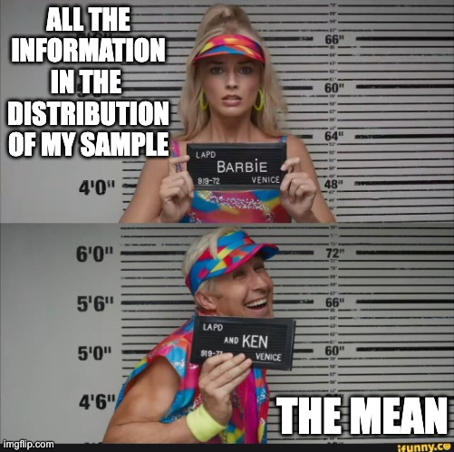
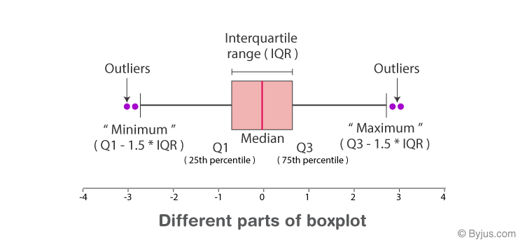

class: middle, center
background-position: center
background-size: cover

```{r setup, include=FALSE}
library(knitr)
library(ggplot2)
library(dplyr)
library(patchwork)
opts_chunk$set(fig.height=7, 
               fig.width = 10,
               fig.align = "center",
               comment=NA, 
               warning=FALSE, 
               echo = FALSE,
               message = FALSE)

options(htmltools.dir.version = FALSE)
read_chunk("lectures/03_sampling_lecture.R")
theme_set(theme_bw(base_size=16))
```
# Sample Distributions
<br>


---
# Outline

1. What is a Good Sample?

2. Sample Distributions and Parameters

3. Non-parameteric Properties of Samples and Populations

---
class:center

# What is a population?

```{r population,  echo=FALSE, fig.align='center',fig.width=6, fig.height=5}
```


**Population** = All Individuals

---
class: center, middle
# Population
.pull-left[
```{r population,  echo=FALSE, fig.align='center',fig.width=6, fig.height=6}
```
]

.pull-right[
```{r normplot3, echo = FALSE, fig.width=6, fig.height=6}
normdat <- tibble(
  x = seq(-3, 3, length.out = 200),
  y = dnorm(x),
  ymin = 0)

normplot <- ggplot(normdat) +
  geom_ribbon(aes(x = x, ymax = y, ymin = 0),
              color = "black", fill = "red", alpha = 0.2) +
  labs(x = "size", y = "")

normplot
```
]
---
class: center

# What is a sample?

```{r sampleSpread,  echo=FALSE, fig.align='center',fig.width=6, fig.height=5}
```

--
A **sample** of individuals in a randomly distributed population.

---
class: center, middle
# Population
.pull-left[
```{r sampleSpread,  echo=FALSE, fig.align='center',fig.width=6, fig.height=6}
```
]

.pull-right[
```{r normplotsamp, echo = FALSE, fig.width=6, fig.height=6}
set.seed(2020)
normsamp <- tibble(
  x = rnorm(50))


normplot + 
  geom_histogram(data = normsamp, 
                 aes(x = x,  
                 y = after_stat(0.4*count/max(count))), 
                 fill = "blue", bins = 30)
```
]


---
# Properties of a good sample

1. Validity  
    - Yes, this is a measure of what I am interested in

2. Reliability  
      - If I sample again, I'll get something similar

3. Representative
      - Sample reflects the population
      - Unbiased


---

# Validity: Is it measuring what I think it's measuring?

.center[]

---

# Reliability: Is my sample/measure repeatable?

.center[]

---

# Are You Representative? Or Biased from Unequal Representation
```{r spatialBias,  echo=FALSE, fig.align='center',fig.width=6, fig.height=5}
```
If you only chose individuals from the bottom, you would only get one range of sizes.

---
class: center, middle

## The key for most statistical models is that a replicates in a sample are i.i.d.  
  
  <br>
  
## Independent and Identically Distributed

---
# Exercise:
<br><br>
### 1. What is a population you sample?  
  <br><br>
  
### 2. How do you ensure validity, reliability, and representativeness of a sample from your population?

---
# Outline

1. What is a Good Sample?

2. .red[Sample Distributions and Parameters]

3. Non-parameteric Properties of Samples and Populations

---
# Taking a Descriptive
```{r sampleSpread,  echo=FALSE, fig.align='center',fig.width=6, fig.height=5}
```

<center>How big are individuals in this population?  

---
# Our 'Sample'

```{r samp, echo=FALSE}
set.seed(2012)
samp <- rnorm(25, 45,5)
knitr::kable(matrix(samp, nrow = 5), "html") %>%
  kableExtra::kable_styling()
samp_data <- data.frame(size = samp)
```

---

# Visualizing Our Sample as Counts with 20 Bins

```{r sampPlot, echo=FALSE}
sample_count_plot <- ggplot(samp_data, aes(x = size)) +
  geom_histogram(bins = 20) 

sample_count_plot
```

---

# Visualizing Our Sample as Frequencies

```{r sampPlotFreq, echo=FALSE}
sample_freq_plot <- ggplot(samp_data, aes(x = size, y = after_stat(density))) +
  geom_histogram(bins = 20) + 
  labs(y = "frequency")

sample_freq_plot
```

--
Frequency = % of Sample with that Value

---

# Visualizing Our Sample as Frequencies

```{r sampPlotFreq, echo=FALSE}
```

Frequency = Probability of Drawing that Value from a Sample


---

# Visualizing Our Sample as Continuous Probability Densities

```{r sampPlotDens, echo=FALSE}
ggplot(samp_data, aes(x = size)) +
  geom_density() 
```

Probability Density = Relative likleihood of encountering a value. Sums to One.

---
class: center, middle

# Our goal is to get samples representative of a population, and estimate population parameters. We assume a **distribution** of values to the population from which we then estimate parameters. Makes it easier to describe nature!

---
# A Population versus Sample Distribution: Normal

```{r normplot, fig.height=7, fig.width = 10}
norm_dat <- tibble(
  size = seq(30,60,length.out=200),
  density = dnorm(size, mean = mean(samp), sd = sd(samp))
)

ggplot(samp_data, aes(x = size)) +
  geom_density(color = "darkgrey") +
  geom_line(data = norm_dat, 
            mapping = aes(y = density),
            color = "red",
            size = 1.5)
```

---

# The Normal (Gaussian) Distribution

```{r normplot2, fig.height=5, fig.width = 9, fig.align = "center"}
ggplot() +
  geom_line(data = norm_dat, 
            mapping = aes(x = size, y = density),
            color = "red",
            size = 1.5)
```

- Arises from some deterministic value and many small additive deviations. 
- Variability is additive over time.
- VERY common.

---
class: center

# Understanding Gaussian Distributions with a Galton Board (Quinqunx)

```{r quincunx, fig.show='animate', cache = TRUE}
#see also https://evamaerey.github.io/little_flipbooks_library/galton_board/galton_board.html#1
animation::quincunx(balls = 100)
```

---

# We see this pattern everywhere - the Random or Drunkard's Walk aka Brownian Motion

```{r walk, echo = FALSE, fig.height = 5}
puce <- "#a95c68"

one_path <- function(steps){
  
  each_step <- c(0, runif(steps, min = -1, max = 1))

  path <- cumsum(each_step)
  
  return(path)
}

#now the simulations
steps <- 100
walk_sims <- purrr::map_df(1:1000, 
                    ~data.frame(sim = .x, 
                                time = -1*(0:steps), 
                                position = one_path(steps)))

ggplot(walk_sims,
       aes(x = time, y = position, group = sim)) +
  geom_line(alpha = 0.1) +
  coord_flip() +
  scale_x_continuous(breaks = -1*seq(0,steps, by = 10),
                     labels = seq(0,steps, by = 10))
```

---

# A Normal Result for Final Position

```{r final_walk}
walk_sims %>%
  filter(time == min(time)) %>%
  ggplot(aes(x = position)) +
  geom_histogram(fill = puce, bins = 100)
```

---

# Other Distributions Possible: Lognormal and Multiplicative error

```{r lnormplot, fig.height=5, fig.width = 9}
lnorm_dat <- tibble(
  x = seq(0,4,length.out=200),
  density = dlnorm(x)
)

ggplot(lnorm_dat, aes(x = x, y = density)) +
  geom_line(lwd = 1.5)
```

- e.g., $N_t = \lambda N_{t-1}, \lambda \sim \mathcal{N}(\mu, \sigma)$
- Error compounds over time

---

# Other Distributions: Binomial from Binary Yes/Nos 
```{r binomplot, fig.height=5, fig.width = 9}
binom_dat <- tibble(
  x = 1:50,
  probability = dbinom(x, size = 50, prob = 0.3 )
)

ggplot(binom_dat, aes(x = x, y = probability)) +
  geom_col(lwd = 1.5)
```

- Discrete, not continuous. 
- From underlying 1/0 trials, e.g., drug success, probability of predation


---
# This is just a sample

```{r}
sample_count_plot + 
  ggtitle("Sample")
```

---
class: center, middle

# We chose it to be representative of the population.

---

# But - how does my sample compare to a population?

```{r samp_pop_plot}
samp_pop <- tibble(x = seq(45-15, 45+15, length.out = 200),
                   y = dnorm(x, 45, 5),
                   ymin = 0,
                   sd_size = "66%") %>%
  mutate(sd_size = case_when(
    x <= 45-10 ~ "5%",
    x >= 45+10 ~ "5%",
    x <= 45-5 ~ "95%",
    x >= 45+5 ~ "95%",
    TRUE ~ "66%"

  ))

sample_demo_plot <- sample_freq_plot +
  xlim(c(25,65)) +
  ggtitle("Sample")

pop_demo_plot <- ggplot()+ 
   geom_ribbon(data = samp_pop, 
              aes(x = x, ymax = y, ymin = ymin),
              fill = "red", alpha = 0.2) +  
   labs(title = "Population", x = "size")

sample_demo_plot + pop_demo_plot
```

---

# Describing a Gaussian population using a representative sample
  
    
--

- **The mean**: If I were to draw from this sample, or it's like, what value would I most likely get?   

--
    
- **The standard deviation**: If I assume a normal distribution, what's the range of 66% or 95% of the variability?    

--
  
- **Skew and kurtosis**: Is this sample peaked, flat, shifted one way or another?

---

# Expected Value: the Mean

```{r, fig.width = 10}
(sample_demo_plot +
   geom_vline(xintercept = mean(samp), col = "blue", lty=2) +
   labs(subtitle = bquote(bar("x") == .(round(mean(samp),2))))) + 
(pop_demo_plot +
   geom_vline(xintercept = 45, col = "blue", lty=2) +
      labs(subtitle = bquote(mu == 45)))
```

---

# Sample Estimate of Population Properties: **Mean**

$$\bar{x} = \frac{ \displaystyle \sum_{i=1}^{n}{x_{i}} }{n}$$

$\large \bar{x}$ - The average value of a sample  
$x_{i}$ - The value of a measurement for a single individual   
n - The number of individuals in a sample  
&nbsp;  
$\mu$ - The average value of a population  
(Greek = population, Latin = Sample)

---

# Sample versus Population

- Latin characters (e.g., $\bar{x}$) for **sample **
  
- Greek chracters (e.g., $\mu$) for **population**

<!--
.center[https://istats.shinyapps.io/sampdist_cont/]
-->

---

# How Variable is the Population

```{r, fig.width = 10}

pop_demo_plot_sd <- ggplot()+ 
    geom_ribbon(data = samp_pop[samp_pop$x>=45,], 
                aes(x = x, ymax = y, ymin = ymin, 
                    fill = sd_size), alpha = 0.2) +  
    geom_ribbon(data = samp_pop[samp_pop$x<=45,], 
                aes(x = x, ymax = y, ymin = ymin, 
                    fill = sd_size), alpha = 0.2) +  
    labs(title = "Population", x = "size", fill = "Fraction\nof Pop.") +
  scale_fill_manual(values = c("red", "blue", "orange"))

(sample_demo_plot +
   geom_vline(xintercept = mean(samp)-2*sd(samp), col = "orange", lty=2) +
   geom_vline(xintercept = mean(samp)-1*sd(samp), col = "blue", lty=2) +
   geom_vline(xintercept = mean(samp)+1*sd(samp), col = "blue", lty=2) +
   geom_vline(xintercept = mean(samp)+2*sd(samp), col = "orange", lty=2) +
   labs(subtitle = bquote(s == .(round(sd(samp),2))))) + 
(pop_demo_plot_sd +
      labs(subtitle = bquote(sigma == 5)))
```

---
# Sample Estimate of Population Properties: **Variance**
How variable was that population?
$$\large s^2=  \frac{\displaystyle \sum_{i=1}^{n}{(X_i - \bar{X})^2}} {n-1}$$

* Sums of Squares over n-1  
* n-1 corrects for biase from estimating from a sample.  
* $\sigma^2$ if describing the population
* Units in square of measurement...

---
# Sample Estimate of Population Properties: Standard Deviation
$$ \large s = \sqrt{s^2}$$  

* Units the same as the measurement
* If distribution is normal, 67% of data within 1 SD
* 95% within 2 SD
* $\sigma$ if describing the population

---
# Sample Estimate of Population Properties: **Skew**
How centrally distributed is your population?
$$\large s^2=  \frac{\displaystyle \sum_{i=1}^{n}{(X_i - \bar{X})^3}} {(n-1)s^3}$$

* Positive, peak is shifted right
* Negative, peak is shifted left
* Zero, it's nice and normal

---
# Sample Estimate of Population Properties: **Kurtosis**
How much of your population is close to the mode versus way out in the tails?
$$\large s^2=  \frac{\displaystyle \sum_{i=1}^{n}{(X_i - \bar{X})^4}} {(n-1)s^4}$$
* Larger than 3, sharply peaked distribution, narrow tails
     - leptokurtic
* Less than 3, flat distribution, wide tails  
     - platykurtic
* 3 - normal  


---

# Always Remember - What is your Sample? What is your Population? Is one representative of the other?

```{r samp_pop_plot}
```

---
# Outline

1. What is a Good Sample?

2. Sample Distributions and Parameters

3. .red[Non-parameteric Properties of Samples and Populations]

---

# What if we don't want to assume Gaussian? Other ways to describe a population from a sample:

--
- **Median**: What is the value smack in the middle?  

--
  
- **Upper and Lower Quantiles/Percentiles**: What are large and small values like?

--
  
- **Interquartile Range**: Is our sample clustered, or waaaay spread out?


---

# The Empirical Cummulative Distribution Plot of our Sample

```{r make_exploratory_plots, echo = FALSE}
ecdf_plot <- ggplot(data = samp_data,
       aes(x = size)) +
  stat_ecdf(geom = "point") +
  stat_ecdf(geom = "step") +
  labs(y = "Cummulative Frequency")

box_plot <- ggplot(data = samp_data,
       aes(y = size)) +
  geom_boxplot(width = 0.2) +
  xlim(c(-0.5, 0.5))

quants <- quantile(samp)
samp_iqs <- c(quants[2] - 1.5*IQR(samp),
              quants[4] + 1.5*IQR(samp))
samp_iqs <- c(sort(samp[samp>samp_iqs[1]], decreasing=FALSE)[1],
              sort(samp[samp<samp_iqs[2]], decreasing=TRUE)[1])
              
```


```{r}
ecdf_plot
```

---

# The Box Plot (or Box-and-Whisker Plot)



---

# The Box Plot (or Box-and-Whisker Plot)

```{r}
box_plot + 
  geom_point(position = position_nudge(x = 1), x = 0.25) +
  xlim(c(-0.3, 0.3))
```

---

# Two ways of seeing the same data

```{r}

ecdf_plot + box_plot
```

---

# Median: Middle of the Sample
```{r}
(ecdf_plot+
  geom_hline(color = "red", yintercept = 0.5)) + 
(box_plot +
  geom_hline(color = "red", yintercept = median(samp)))
```

---

# Mean versus Median

.center[https://istats.shinyapps.io/MeanvsMedian/]

---

# Quartiles: Upper and Lower Quarter

```{r}
(ecdf_plot+
  geom_hline(color = "red", yintercept = c(0.25, 0.75))) +
(box_plot +
  geom_hline(color = "red", yintercept = quants[c(2,4)]))
```


1<sup>st</sup> and 3<sup>rd</sup> **Quartile** = 25<sup>th</sup> and 75<sup>th</sup> **Percentile**

---

# Reasonable Range of Data (Beyond which are Outliers)
```{r}

#make an ecdf function
efun <- ecdf(samp)


(ecdf_plot+
  geom_hline(color = "red", yintercept = efun(samp_iqs)))+
(box_plot +
  geom_hline(color = "red", yintercept = samp_iqs))
```


---

# Where's the action in R?

```{r quantile_demo, echo = TRUE}
# Quantiles
quantile(samp)

# Interquartile range
IQR(samp)
```

