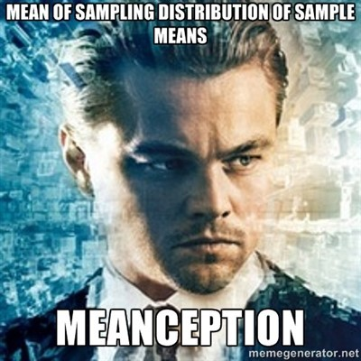
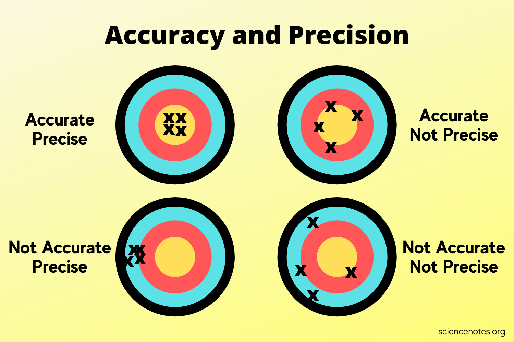

class: middle, center

```{r setup, include=FALSE}
library(knitr)
library(ggplot2)
library(dplyr)
library(tidyr)
library(patchwork)
library(purrr)
library(gganimate)
opts_chunk$set(fig.height=6, 
               fig.width = 9,
               fig.align = "center",
               comment=NA, 
               warning=FALSE, 
               echo = FALSE,
               message = FALSE)

options(htmltools.dir.version = FALSE)
theme_set(theme_bw(base_size=18))
puce <- "#a95c68"
```

# Sampling Distributions



---
# Last Time: Sample Versus Population

```{r samp_pop_plot}
set.seed(2012)
samp <- rnorm(25, 45,5)
samp_data <- data.frame(size = samp)

sample_freq_plot <- ggplot(samp_data, aes(x = size, y = after_stat(density))) +
  geom_histogram(bins = 20) + 
  labs(y = "frequency")

samp_pop <- tibble(x = seq(45-15, 45+15, length.out = 200),
                   y = dnorm(x, 45, 5),
                   ymin = 0,
                   sd_size = "66%") %>%
  mutate(sd_size = case_when(
    x <= 45-10 ~ "5%",
    x >= 45+10 ~ "5%",
    x <= 45-5 ~ "95%",
    x >= 45+5 ~ "95%",
    TRUE ~ "66%"

  ))

sample_demo_plot <- sample_freq_plot +
  xlim(c(25,65)) +
  ggtitle("Sample")

pop_demo_plot <- ggplot()+ 
   geom_ribbon(data = samp_pop, 
              aes(x = x, ymax = y, ymin = ymin),
              fill = "red", alpha = 0.2) +  
   labs(title = "Population", x = "size")

sample_demo_plot + pop_demo_plot
```

---

# Sample Properties: **Mean**

$$\bar{x} = \frac{ \displaystyle \sum_{i=1}^{n}{x_{i}} }{n}$$

$\large \bar{x}$ - The average value of a sample  
$x_{i}$ - The value of a measurement for a single individual   
n - The number of individuals in a sample  
&nbsp;  
$\mu$ - The average value of a population  
(Greek = population, Latin = Sample)

---
class: center, middle

# Our goal is to get samples representative of a population, and estimate population parameters. We assume a **distribution** of values to the population.

---
# Probability Distributions
```{r normplot, fig.height=7, fig.width = 10}
x <- seq(-3,3,length.out=200)
normplot <- qplot(x, dnorm(x), geom = "line") +
  ylab("Probability Density") + xlab("")

normplot
```

---

# Probability Distributions Come in Many Shapes

```{r dists}
x1 <- seq(0,3,length.out=200)
x_discrete <- 0:30

expplot <- qplot(x1, dexp(x1), geom = "line") +
  ylab("Probability Density") + xlab("")

poisplot <- qplot(x_discrete, dpois(x_discrete, 10), geom = "col",
                 fill = I("white"), color = I("black")) +
  ylab("Probability Mass") + xlab("") 

binomsplot <- qplot(x_discrete, 
                    dbinom(x_discrete, size = 30, prob = 0.75), 
                    geom = "col", fill = I("white"), color = I("black")) +
  ylab("Probability Mass") + xlab("") 


normplot + 
  expplot +
  poisplot +
  binomsplot +
  plot_layout(ncol = 2)

```

---

# Sample Versus Sampling Distributions

- A sampling distribution is the distribution of estimates of population parameters if we repeated our study an infinite number of times. 

- For example, if we take a sample with n = 5 of plant heights, we might get a mean of 10.5cm. If we do it again, 8.6cm. Again, 11.3cm, etc....  
  
- Repeatedly sampling gives us a distribution, and a measure of how precise our ability to estimate a population parameter is

---

class:middle

.center[]

- Accuracy represents *is your estimate of a population parameter baised*. 
  
- Precision tells us the *variability in replicate measurements of a population parameter*

---
# A simple simulation

Let's say you sampled a population of corals and assessed Zooxanthelle concentration. You did this with n = 10, an then calculated the average concentration per coral.

```{r conc_10, fig.height = 6}
set.seed(2023)
conc_10 <- tibble(sims = 0, concentration = rnorm(10, 500, 7))

ggplot(conc_10, aes(x = concentration)) +
  geom_histogram(binwidth = 4) +
  geom_vline(xintercept = mean(conc_10$concentration), lty=2, color = 'red') +
  geom_label(x=505, y = 3, label = paste0("mean = ", round(mean(conc_10$concentration), 2)))
```

---
# A simple simulation

Now do it again 10 more times

```{r}
conc_10_10 <- tibble(sims = 1:9) |>
  group_by(sims) |>
  reframe(concentration = rnorm(10, 500, 7)) |>
  ungroup() |>
  bind_rows(conc_10)

conc_10_means <- conc_10_10 |>
  group_by(sims) |>
  summarize(mean_concentration = mean(concentration), .groups = "drop")

ggplot(conc_10_10, aes(x = concentration)) +
  geom_histogram(binwidth = 4) +
  geom_vline(data = conc_10_means,
             aes(xintercept = mean_concentration), lty=2, color = 'red') +
  facet_wrap(vars(sims)) +
  geom_label(data = conc_10_means, 
             x=505, 
             y = 4, 
             mapping = aes(label = round(mean_concentration, 2)))
```

---
# What's the Distribution of Those Means?

```{r mean_dist_10}
ggplot(conc_10_means, aes(x = mean_concentration)) +
  geom_histogram(binwidth = 0.5)
```

---
# What About After 1000 repeated sample events with n = 10?

```{r mean_100}
tibble(sims = 1:1000) |>
  group_by(sims) |>
  mutate(mean_concentration = mean(rnorm(10, 500, 7))) |>
  ungroup() |>
  ggplot(aes(x = mean_concentration)) +
  geom_histogram(bins = 90, fill = puce)
```
--

This is a **sampling distribution** and looks normal for the mean.

---
# Does Sample Size Matter?

```{r mean_many_n}
crossing(n = c(3, 10, 20, 100), sims = 1:1000) |>
  group_by(n, sims) |>
  mutate(mean_concentration = mean(rnorm(n, 500, 7))) |>
  ungroup() |>
  ggplot(aes(x = mean_concentration)) +
  geom_histogram(bins = 100, fill = puce) +
  facet_wrap(vars(n))
```

--

This looks normal, with different SD?

---
class: center, middle
# **Central Limit Theorem** The distribution of means of a sufficiently large sample size will be approximately normal

https://istats.shinyapps.io/sampdist_cont/

https://istats.shinyapps.io/SampDist_discrete/

--

## This is true for many estimated parameters based on means

---
# So what about the SD of the Simulated Estimated Means?

```{r mean_many_n}
```


---
class: center, middle
# The Standard Error
<br><br>
.large[
A standard error is the standard deviation of an estimated parameter if we were able to sample it repeatedly. It measures the precision of our estimate.
]

---
class: large

# So I always have to repeat my study to get a Standard Error?

--

## .center[**No**]

--

Many common estimates have formulae, e.g.:  

$$SE_{mean} = \frac{s}{\sqrt(n)}$$

--
<br>
But remember, this is the SE based on your sample - not of the true sampling distribution.

---

# Others Have Complex Formulae for a Single Sample, but Still Might be Easier to Get Via Simulation - e.g., Standard Deviation

```{r sd_100, fig.height = 5}
sd_sims <- tibble(sims = 1:1000) |>
  group_by(sims) |>
  mutate(sd_concentration = sd(rnorm(3, 500, 7))) |>
  ungroup()
  
ggplot(sd_sims, aes(x = sd_concentration)) +
  geom_histogram(bins = 100, fill = puce)

quantile(sd_sims$sd_concentration, prob = c(0.025, 0.33, 0.66, 0.975))
```


---
class: large

# Standard Error as a Measure of Confidence
--

.center[.red[**Warning: this gets weird**]]

--


- We have calculated our SE from a **sample** - not the **population**

--

- Our estimate ± 1 SE tells us 2/3 of the *means* we could get by **resampling this sample**  

--

- This is **not** 2/3 of the possible **true parameter values**  

--

- BUT, if we *were* to sample the population many times, 2/3 of the time, the sample-based SE will contain the "true" value


---

# Confidence Intervals

.large[
- So, 1 SE = the 66% Confidence Interval  

- ~2 SE = 95% Confidence Interval  

- Best to view these as a measure of precision of your estimate

- And remember, if you were able to do the sampling again and again and again, some fraction of your intervals would *not* contain a true value
]
---

class: large, middle

# Let's see this in action

### .center[.middle[https://istats.shinyapps.io/ExploreCoverage/]]

---

# Frequentist Philosophy

.large[The ideal of drawing conclusions from data based on properties derived from theoretical resampling is fundamentally **frequentist** - i.e., assumes that we can derive truth by observing a result with some frequency in the long run.]

```{r CI_sim, fig.height = 5}
one_sim <- function(){
  p <- rnorm(25, 4, 5)
  tibble(m = mean(p),
         s = sd(p),
         se = s/sqrt(25),
         lwr = m - se,
         upr = m + se)
}

dat <- purrr::map_df(1:100, ~one_sim()) %>%
  mutate(sim = 1:100,
         cover = ifelse(lwr < 4 & upr > 4, "yes", "no"))

ggplot(dat,
       aes(x = sim, y = m,
           ymin = lwr, ymax = upr,
           color = cover)) +
  geom_pointrange() +
  geom_hline(yintercept = 4, lty = 2) +
  coord_flip() +
  xlab("") + ylab("mean") +
  labs(subtitle = paste(sum(dat$cover=="yes"), "% Overlap True Value"), color = "Covers\nTrue\nValue?") +
  scale_color_manual(values = c(puce, "darkblue"))

```

---
# SE, SD, CIs.... They are Different


.bottom[.small[.left[[Cumming et al. 2007 Table 1](http://byrneslab.net/classes/biol-607/readings/Cumming_2007_error.pdf)]]]

---
# SE (sample), CI (sample), and SD (population) visually

.center[] 


.bottom[.small[.left[[Cumming et al. 2007 Table 1](http://byrneslab.net/classes/biol-607/readings/Cumming_2007_error.pdf)]]]

---
# So what does this mean?

```{r one_ci}
library(ggdist)

tibble(sims = 1:1000) |>
  group_by(sims) |>
  mutate(x = mean(rnorm(3, 1, 1))) |>
  ungroup() |>
  ggplot(aes(x = x)) +
  stat_interval(.width = c(0.4, 0.5, 0.6, 0.7, 0.8, 0.9, 0.95)) +
  stat_pointinterval() +
  xlim(c(-2,2)) +
  geom_vline(xintercept = 0, lty = 2, color = "red")
```

---
# 95% CI and Frequentist Logic

- Having 0 in your 95% CI means that, we you to repeat an analysis 100 times, 0 will be in 95 of the CIs of those trials. 

--

- In the long run, you have a 95% chance of being wrong if you say that 0 is not a possible value. 

--

- But..... why 95%? Why not 80% Why not 75%? 95% can be finicky!  

--

- Further, there is no probability of being wrong about sign, just, in the long run, you'll often have a CI overlapping 0 given the design of your study

--

- A lot depends on how well you trust the precision of your estimate based on your study design
