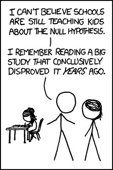
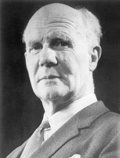

##
<h1>Null Hypothesis Significance Testing & Power</h1>
<center>

## Review

-   Statistical Distributions give us probabilities of observations\
\

-   P-Values allow us to ask $P(x \le Data | H)$\
\

-   We often apply p-values to a *null hypothesis* to assess support for
rejecting the null\
\
```{r prep, echo=FALSE, cache=FALSE, message=FALSE, warning=FALSE}
library(knitr)
opts_chunk$set(fig.height=4, comment=NA, 
               warning=FALSE, message=FALSE, 
               dev="jpeg", echo=FALSE)
library(ggplot2)
```

## Today

1.  Null Hypothesis Tests & Other Distibrutions\
\
2.  Test Statistics: Z-Tests\
\
3.  Null Hypothesis Sigificance Testing\
\
4.  Statistical Power in a NHST framework\
\
5. Power via Simulation\
\

## R.A. Fisher and The P-Value For Null Hypotheses


<div style="position: relative; left: 400px; vertical-align: top; text-align: left; width: 50%"> P-value: The Probability of making an observation or more extreme observation given that the null hypothesis is true.</div>

## We're Thought About P-Values with Normal Distributions...
```{r normal, echo=FALSE}
vals<-seq(-3,3,.01)
ggplot(mapping = aes(x=vals, y=dnorm(vals))) +
  geom_line() +
  xlab("Y") +
  ylab("Proability Density\n") +
  theme_bw(base_size=17)  + 
  geom_area(mapping = (aes(x=seq(-3,-2,.01), y=dnorm(seq(-3,-2,.01)))), fill="purple", alpha=0.4) +
  geom_area(mapping = (aes(x=seq(-2,-1,.01), y=dnorm(seq(-2,-1,.01)))), fill="blue", alpha=0.4) +
  geom_area(mapping = (aes(x=seq(-1,0,.01), y=dnorm(seq(-1,0,.01)))), fill="red", alpha=0.4) +
  annotate(x=-2.2, y=0.01, geom="text", label=round(pnorm(-2), 2))+
  annotate(x=-1.5, y=0.01, geom="text", label=round(pnorm(-1), 2))+
  annotate(x=-0.5, y=0.01, geom="text", label=round(pnorm(-0), 2))
```

<span class="fragment">**The world ain't normal**</span>

## The Lognormal Distribution

<div id="left">
```{r dlnormcode, fig.height=5, fig.width=4}
ggplot(mapping = aes(x=exp(vals), y=dlnorm(exp(vals)))) +
  geom_line() +
  xlab("Y") +
  ylab("Proability Density\n") +
  theme_bw()
```
</div>
<div id="right">
-   An exponentiated normal
  
> -   Generated by multiplicative processes, e.g. growth, as small variations multiply over time

> -   Defined by the mean and standard deviation of its log.

> -   $Y \sim LN(\mu_{log}, \sigma_{log})$

</div>
  
## The Gamma Distribution

<div id="left">
```{r gamma1, echo=FALSE, fig.height=5, fig.width=4}
valsG<-seq(0,15,.01)

gammaPlot<-ggplot(mapping=aes(x=valsG, y=dgamma(valsG, shape = 2, scale=2))) +
  geom_line()+
  xlab("Y") +
  ylab("Proability Density\n") +
  theme_bw(base_size=17)

gammaPlot
```
</div>

<div id="right">
-   Defined by number of events(shape) average time to an event (scale)
    
> - Think of time spent waiting for a bus to arrive
  
> -  Can also use rate (1/scale)
  
> - $Y \sim G(shape, scale)$

</div>

## Waiting for more events
  
```{r gamma2, echo=FALSE}
gammaPlot + geom_line(aes(y=dgamma(valsG, shape = 5, scale=2)), color="red") +
  annotate("text", x=10, y=0.2, label="Shape = 2, scale = 2")+
  annotate("text", x=10, y=0.15, label="Shape = 5, scale = 2", color="red")

```


## Longer average time per event

```{r gamma3, echo=FALSE}
gammaPlot + geom_line(aes(y=dgamma(valsG, shape = 2, scale=3)), color="red")+
  annotate("text", x=10, y=0.2, label="Shape = 2, scale = 2")+
  annotate("text", x=10, y=0.15, label="Shape = 2, scale = 3", color="red")
```


## The Poisson Distribution
<div id="left">
- Discrete distribution for count data
  
> - Think number of mutations in meiosis, or number of flowers in a plot
  
> -   Defined by $\lambda$ - the mean and variance

> -   $Y \sim  P(lambda)$

</div>

<div id="right">
```{r poissonPlot, fig.height=5, fig.width=4}
valsP<-0:30
poisPlot1<-ggplot(mapping=aes(x=factor(valsP), y=dpois(valsP, 5))) +
  geom_bar(width=0.1, stat="identity")+
  scale_x_discrete("Y", breaks=seq(0,30,3))+
  ylab("Proability Density") +
  theme_bw()

poisPlot1
```
<div>


## Note how Variance Scales with Mean
  
```{r poisson2}
poisPlot1 + geom_bar(mapping=aes(y=dpois(0:30, 15)), fill="red", width=0.1, stat="identity")

```

## When Lambda is Large, Approximately Normal
  
```{r poisson3}
poisPlot1 +  geom_line(mapping=(aes(x=seq(0,15,.01), y=dnorm(seq(0,15,.01), 5.5,sqrt(5)))), color="blue")
```


## The Binomial Distribution
<div id="left">
```{r binomPlot,  warning=FALSE, error=FALSE, fig.height=5, fig.width=4, warning=FALSE}
valsB<-0:20
binB<-dbinom(valsB, 20, 0.3)
binB2<-dbinom(valsB, 20, 0.8)
binomPlot1<-ggplot(mapping=aes(x=factor(valsB), y=binB)) +
  geom_bar(width=0.1, stat="identity")+
  scale_x_discrete("Y", breaks=seq(0,20,2))+
  ylab("Proability Density") +
  theme_bw()

binomPlot1
```
</div>

<div id="right">
-   Results from multiple "coin flips"
  
> - e.g., # of Budworms eating a leaf!
  
> - Defined by size (\# of flips) and prob (probability of heads)
 
> - $Y \sim B(size, prob)$
 
> - bounded by 0 and size
 
</div>
   
   
## Increasing Probability Shifts Distribution
   
```{r binomPlot2, echo=FALSE, warning=FALSE, error=FALSE, warning=FALSE}
binomPlot1 + geom_bar(aes(y=binB2), fill="red", width=0.1, stat="identity")
```
 
 
## All of these distributions can be used as for Hypothesis Tests

## Which distribution when?

|        Distribution                  |            Use                |  
|--------------------------------------|-------------------------------|
| Normal | Continuous variable with many small sources of variation | 
| Log-Normal| Continuous variable where sources of variation multiply | 
| Gamma | Positive continuous variable with long-tailed distribution |
| | |
| Poisson | Count data, e.g. # of mutations |
| Binomial | Outcome of multiple yes/no trials |

## We don't need no stinkin' distribution!
> - You can always simulate a reference distribution based on arbitrary rules\
\
> - Then ask what fraction of your observation, or more extreme observations, are in that reference distribution

## Tapir Snouts
<div id="left">
<center>

</center>
</div>
<div id="right">
> - 90% of tapirs have a snout that is 5-10 cm in length, with equal probability

> - 10% of tapirs have a snouth that is 10-15 cm in length, with equal probability of any length

> - We can simulate sampling thousands of tapirs to construct a distribution

</div>

## Simulated Distribution
```{r tapir}
dist <- c(seq(5,10, length.out=1000), seq(10.01,15, length.out=1000))
samp <- sample(dist, 100000, replace=TRUE,
               prob = c(rep(0.9/1000, 1000), rep(0.1/1000, 1000)))
tapir_dist <- ggplot() +
  aes(x=samp, ..density..) +
  geom_histogram(bins=60, fill="lightgrey", color="black") +
  ggtitle("Frequency of Tapir Nose Lengths") +
  xlab("Length (cm)") +
  theme_bw(base_size=17) +
  ylab("Probability")

tapir_dist
```

## Testing a "Tapir"
```{r tapir_test}
tapir_dist +
  geom_vline(xintercept=14.5, lwd=2, lty=2, color="red")
```

p = `r sum(samp>=14.5)/length(samp)` 

## Today

1.  Null Hypothesis Tests & Other Distibrutions\
\
2.  <span style="color:red">Test Statistics: Z-Tests</span> \
\
3.  Null Hypothesis Sigificance Testing\
\
4.  Statistical Power in a NHST framework\
\
5. Power via Simulation\
\

## Evaluation of a Test Statistic

<p align="left">We  use our data to calculate a test statistic that maps to a value
of the null distribution. <br><Br>
We can then calculate the probability of observing our data, or of observing data even more extreme, given that the null hypothesis is true.</p><br><br>

<center>$P(X \leq Data | H_{0})$</center>

## {data-background="images/08/Welchcorgipembroke.JPG"}

## Evaluation of a Test Statistic
Let's say we know the distribution of chest hair lengths on Welsh Corgis
```{r normalTest, echo=FALSE}
corgi <- seq(4,10, .01)
corgiDist <- dnorm(corgi, 7,1)
corgiPlot <- ggplot(data.frame(corgi = corgi, corgiDist = corgiDist)) +
  geom_line(mapping = aes(x=corgi, y=corgiDist)) +
  theme_bw(base_size=17) +
  xlab("Chest Hair Length (cm)") + ylab("Probability Density\n") + 
  scale_y_continuous(expand=c(0.01,0))
corgiPlot
```


## A short-haired Corgi
You have a Corgi with a chest hair that is 5 cm
```{r normalLine, echo=FALSE}
corgiPlot2 <- corgiPlot +
  geom_vline(lty=2, lwd=2, color="red", xintercept=5)
corgiPlot2
```

## A Corgi's P
What is the probability of this or a shorter-haired Corgi?
```{r normalFill, echo=FALSE}
px <- seq(4,5,.01)
py <- dnorm(px, 7, 1)
corgiPlot2 <- corgiPlot2 +
  geom_area(fill="red", alpha=0.4, data=data.frame(px = px, py = py), mapping = aes(x=px, y=py))
corgiPlot2
```

p = `r round(pnorm(5,7,1),4)`\ 

## The Z-Test
> - Let's assume I have a BOX of 15 Corgis. I suspect fraud.\
\
> - I get the average chest hair length of each Corgi - but are they different?\
\
> - So, we're interested in the **difference** between my sample mean and the population mean: $\bar{Y} - \mu$\
\
<span class="fragment">$$\Large H_o: \bar{Y} - \mu = 0$$ 

## When & How to use Z-Test
<center>We want to calculate a test statistic (z) & compare it to the standard normal curve ($\mu = 0, \sigma=1$)</center>
<p align="left">
<span class="fragment"> 1. I have a known population mean ($\mu$) and standard deviation ($\sigma$) </span> \
\
<span class="fragment"> 2. I can calculate a population SE of any estimate of the mean, $\frac{\sigma}{\sqrt{n}}$ </span> \
\
<span class="fragment"> 3. Now calculate a test statistic </span> \
</p>
<span class="fragment">$$\Large z = \frac{\bar{Y} - \mu}{\sigma_{\bar{Y}}}$$</span>

## Side-Note: The Z Transformation

- For any variable, subtract the mean and divide by the SD\
\
-  Variable is now in units of SD from the variables mean\
\
- Useful for rescaling variables with *very* different units

## Our Corgis and Z
```{r refDist}
vals<-seq(-3,3,.01)
normRef <- ggplot(mapping = aes(x=vals, y=dnorm(vals))) +
  geom_line() +
  xlab("Z") +
  ylab("Proability Density\n") +
  theme_bw(base_size=17)
z <- round(3/(1/sqrt(15)),3)
normRef
```

> - Corgis: $\mu = 7, \sigma=1$, N=15 so $s_{\bar{Y}}=$ `r round(1/sqrt(15),3)`
> - Sample, $\bar{Y} = 10$, 10-7 = 3
> - Z = 3/`r round(1/sqrt(15),3)` = `r z`

## Our Corgis and Z
```{r withTest}
normRef +
  geom_vline(xintercept=z, lty=2, lwd=2, color="red")
```

- Z = 3/`r round(1/sqrt(15),3)` = `r z`
- p = `r 2*pnorm(z, lower.tail=FALSE)`

## Today

1.  Null Hypothesis Tests & Other Distibrutions\
\
2.  Test Statistics: Z-Tests\
\
3. <span style="color:red"> Null Hypothesis Sigificance Testing</span>\
\
4.  Statistical Power in a NHST framework\
\
5. Power via Simulation\

## How do we Use P-Values

<span class="fragment">**Confirmationist:** You gather data and look for evidence in support of your research hypothesis. This could be done in various
ways, but one standard approach is via statistical significance testing: the goal is to reject a null hypothesis, and then this rejection will
supply evidence in favor of your preferred research hypothesis.</span> \
\
<span class = "fragment">**Falsificationist:**You use your research hypothesis to make specific (probabilistic) predictions and then gather data and
perform analyses with the goal of rejecting your hypothesis.</span>

## Neyman-Pearson Hypothesis Testing and Decision Making
<div id="left">  
\
Jerzy Neyman
</div>
<div id="right">
\
Egon Pearson
</div>

## Neyman-Pearson Hypothesis Testing

<span class="fragment">1. Establish a critical threshold below which one rejects a null hypothesis - $\alpha$\. *A priori* reasoning sets this threshold.</span>
<br>\
<span class="fragment">2. Neyman and Pearon state that if p $\le$ $\alpha$ then we reject the null. </span>
<br>\
<span class="fragment">3. Fisher pushed for a typical $\alpha$ of 0.05 as indicating **statistical significance**, although eschewed the idea of a decision procedure where a null is abandoned.</span>
<br>
<span class="fragment"><h3>Statistical Significance is NOT Biological Sigficance.</h3> \

## Today

1.  Null Hypothesis Tests & Other Distibrutions\
\
2.  >Test Statistics: Z-Tests\
\
3.  Null Hypothesis Sigificance Testing\
\
4.  <span style="color:red">Statistical Power in a NHST framework</span> \
\
5. Power via Simulation\
\

## Types of Errors in a NHST framework

                          **Ho is True**       **Ho is False**
  ----------------------- ---------------- -------------------------
  **Reject Ho**           Type I Error      Correct OR Type S error
**Fail to Reject Ho**          –               Type II Error

\

- Possibility of Type I error regulated by choice of $\alpha$
  
- Probability of Type II error regulated by choice of $\beta$
  
- Probability of Type S error is called $\delta$
  
## Type S (Sign) Error 
  
  Correctly rejecting the null hypothesis for the wrong reason\
\
This is a Type S, or Type III error - a mistake of sign. Often inherent
in an experiment’s design, or possible by change.\
\
Can determine by mechanistic simulation or a redesigned study.

## Power of a Test

-   If $\beta$ is the probability of comitting a type II error,
1-$\beta$ is the power of a test.\

-   The higher the power, the less of a chance of comitting a type II
error.\

-   We typically want a power of 0.8 or higher. (20% chance of failing
                                                 to reject a false null)\

## $\alpha = 0.05$ & $\beta = 0.20$

5% Chance of Falsely Rejecting the Null, 20% Chance of Falsely Accepting
the Null\
\
Are you comfortable with this? Why or why not?

## What is Power, Anyway?

Given that we often begin by setting our acceptable $\alpha$, how do we
then determine $\beta$ given our sample design?

-   Formula for a specific test, using sample size, effect size, etc.

-   Simulate many samples, and see how often we get the wrong answer
assuming a given $\alpha$!
  
## Today

1.  Null Hypothesis Tests & Other Distibrutions\
\
2.  <span style="color:red">Test Statistics: Z-Tests</span> \
\
3.  Null Hypothesis Sigificance Testing\
\
4.  Statistical Power in a NHST framework\
\
5. <span style="color:red">Power via Simulation</span> \
\

##  Power via Simulation Is a Process

1.  Determine your null hypothesis and model that describes how the
world *really* works\
\

2.  Draw a simulated sample based on your model of the world and
sampling choices (e.g., sample size, additional confounding factors,
                  sample spatial arrangement, etc.)\
\

3.  Calculate the p-value for your one simulated sample\
    - Repeat simulated p-value generation thousands of times\

\
4.  Determine the fraction of times you failed to reject the null based
on your choice of $\alpha$. This is $\beta$\

    - $1-\beta$ is your power!
  


## Example of Sample Size and Power via Simulation

We want to test the effects of a drug on heart rate. We know that the average heart rate of our patients is 80 beats per minute and the SD is 6 BPM. 
<br><br>
How large must our sample size be, assuming that we have an $\alpha$ of 0.05 and want our power to be at least 0.8?\
\
<span class="fragment">**First** What is Ho? How would I turn this into a Z-test</span>


## Simulating the Real World

**Second!** Let’s say we *assume* that the drug *actually*
  speeds up heart rate by 13 beats per minute, on average. This is our *effect size*. We can generate simulated means from trials with different sample sizes
(1-10) with 500 replicate draws for each sample size
```{r powersims}
library(dplyr)
set.seed(2012)

sim_data <- tibble(samps = rep(1:10, 500)) %>%
  group_by(1:n()) %>%
  mutate(sample = mean(rnorm(samps, 90, 6))) %>%
  ungroup()

ggplot(sim_data) +
  geom_point(alpha=0.6, size=3, mapping=
  aes(x=samps, y=sample)) +
  theme_bw(base_size=17) +
  xlab("Sample Size") + ylab("Mean BPM of Sample") +
  geom_hline(yintercept=80, color="red", lty=2, lwd=2) +
  geom_ribbon(data=data.frame(x=1:20, ymax=rep(92,20), ymin=rep(80-12,20)),
              mapping = aes(x=x, ymax=ymax, ymin=ymin), alpha=0.1, fill="red")
```

## Obtain P-values from your Simulations

*Third!*Get the p value of each sim with a Z-test:<br>
(Sample Mean - 80) / (6 / $\sqrt{Sample Size}$)

```{r psim}
sim_data <- sim_data %>%
  mutate(z = (sample-80)/(6/sqrt(samps))) %>%
  mutate(p = 2*pnorm(abs(z), lower.tail=FALSE))

ggplot(sim_data) +
  geom_jitter(alpha=0.6, size=3, mapping=
  aes(x=samps, y=p)) +
  #scale_y_log10() +
  theme_bw(base_size=17) + 
  xlab("Sample Size") + 
  geom_hline(yintercept=0.05, lwd=2, color="red", lty=2)
```

## Turn Many P-Values into Power!

<span>**Third!**</span> Power is 1 - the fraction of those tests which
p $\le \alpha$. So, we group by each sample sizes to get...

```{r power}
sim_power <- sim_data %>%
  group_by(samps) %>%
  summarise(power = 1-sum(p>0.05)/500) %>% 
  ungroup()

ggplot(sim_power) +
  aes(x=samps, y=power) +
  geom_point() + geom_line() +
  theme_bw(base_size=17) +
  xlab("Sample Size")
```

## Tradeoff between $\alpha$ and $\beta$
  
```{r tradeoff}
sim_tradeoff <- sim_data %>%
  tidyr::crossing(alpha = 10^(-1:-10)) %>%
  group_by(samps, alpha) %>%
  summarise(power = 1-sum(p>alpha)/500) %>%
  ungroup()


trade_plot <- ggplot(sim_tradeoff) +
  aes(x=samps, y=power, color=factor(alpha)) +
  geom_point() + geom_line() +
  theme_bw(base_size=17) +
  xlab("Sample Size") +
  scale_color_discrete(guide = guide_legend(title=expression(alpha)))
trade_plot
```   

## Tradeoff between $\alpha$ and $\beta$ 
```{r final_tradeoff}
trade_plot +
  geom_hline(yintercept = 0.8, lty=2)
```
  

## Tradeoff between $\alpha$ and $\beta$
```{r tradeoff_effect}
pow_frame <- sim_tradeoff %>%
  group_by(alpha) %>%
  filter(power>=0.8) %>%
  arrange(power) %>%
  slice(1L) %>%
  ungroup()

qplot(alpha, samps, data=pow_frame, geom=c("line", "point")) +
  theme_bw(base_size=17) + 
  ggtitle("Number of Samples Needed For Power of 0.8")
  ```
  
