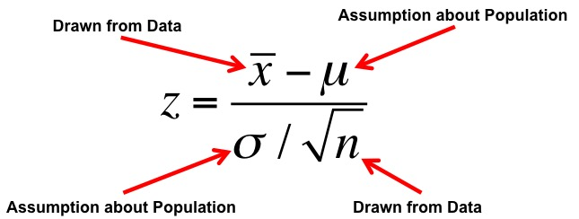
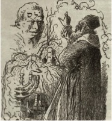
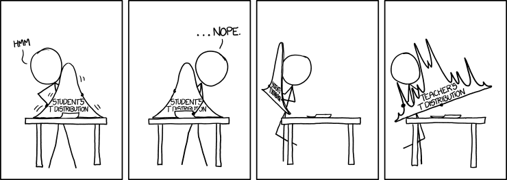
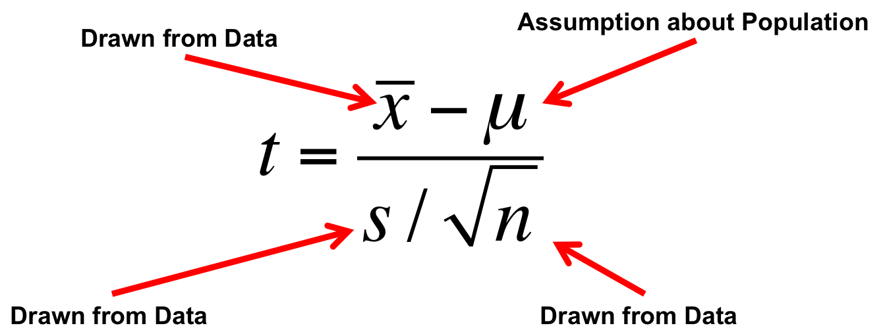
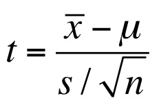
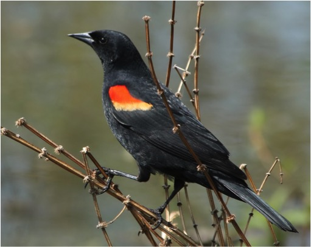
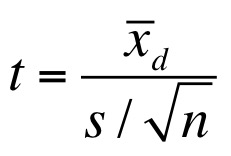

## {data-background="images/09/guiness.png"}
<!-- next year, a few small fixes of formulae - what is sample size 
of unpaired t-test, show more formulae?-->
<br><br><br><br>
<div style="background-color:white; align:center; font-size: 2em;">Differences Between Two Groups</div>

```{r prep, echo=FALSE, cache=FALSE, message=FALSE, warning=FALSE}
library(knitr)
opts_chunk$set(fig.height=4.5, comment=NA, 
               warning=FALSE, message=FALSE, 
               dev="jpeg", echo=FALSE)
library(ggplot2)
library(magrittr)
library(dplyr)
library(tidyr)
```

## Quiz!
<br><br><br>
<h1>http://bit.ly/t-test-pre-2018</h1>

## 
<Br><br><br>
<h1>https://etherpad.wikimedia.org/p/607-t_tests-2018</h1>

## Outline
1. Statistical Golems, Z, and T\
\
2. T-tests in context: Paired data\
\
3. Comparing Means with a t-test

## Statistical Golems
<center>(sensu Richard McElreath)</center>
{width=42%}

## {data-background="images/08/Welchcorgipembroke.JPG"}

## The Z-Test
> - Let's assume I have a BOX of 15 Corgis. I suspect fraud.\
\
> - I get the average chest hair length of each Corgi - but are they different?\
\
> - So, we're interested in the **difference** between my sample mean and the population mean: $\bar{X} - \mu$\
\
<span class="fragment">$$\Large H_o: \bar{X} - \mu = 0$$ 

## Our Philosophy

> 1. What is your question?  
> 2. Conceive of a model of your system  
> 3. How much do you need to know to answer your question?  
> 4. What data do you need to parameterize your model of the world?
>      - Do you need an experiment?  
>      - What breadth of observations do you need?
> 5. Fit your model of the world  
>      - Make sure you don't burn down Prague  
> 6. Query your model to answer your question

## When & How to use Z-Test: Our Model of the World
<center>We want to calculate a test statistic (z) & compare it to the standard normal curve ($\mu = 0, \sigma=1$)</center>
<p align="left">
<span class="fragment"> 1. I have a known population mean ($\mu$) and standard deviation ($\sigma$) </span> \
\
<span class="fragment"> 2. I can calculate a population SE of any estimate of the mean, $\frac{\sigma}{\sqrt{n}}$ </span> \
\
<span class="fragment"> 3. Now calculate a test statistic </span> \
</p>
<span class="fragment">$$\Large z = \frac{\bar{X} - \mu}{\sigma/\sqrt{n}}$$</span>

## This is a Golem

<div id="left"><br>$$\LARGE z = \frac{\bar{X} - \mu}{\sigma/\sqrt{n}}$$</div>

<div id = "right">
```{r norm}
library(ggplot2)
vals <- seq(-3,3,length.out=100);z=dnorm(vals)
normplot <- qplot(vals, z, lwd=I(1.3), geom="line") +
  theme_bw(base_size=17) + xlab("z") +  ylab("Probability Density") + 
  scale_y_continuous(expand=c(0.01,0))

normplot +
  geom_area(mapping=aes(x=seq(1,3,length.out=100), y=dnorm(seq(1,3,length.out=100))), fill="red")
```
</div>

<div class="fragment" style="position:relative">
- What is my data generating process?  
\
- What is my error generating process?
</div>

## What Drives my Golem?
<br><br>
{align="left" id="noborder" width=75%}
{align="right" id="noborder" width=20%}


## Is this a Good Golumn for Realistic Sample Sizes?
```{r t-anim, cache=TRUE}
library(gganimate)
library(dplyr)
library(tidyr)
library(purrr)
set.seed(31415)

samps <- map_df(3:20, ~data.frame(samp = rnorm(.x)), .id = "sample_size")

dists <- ggplot() +
  geom_line(mapping=aes(x=vals, y=z), lwd=1.3) +
  theme_bw(base_size=17) + xlab("z") +  ylab("Probability Density") + 
  geom_density(data = samps, 
               mapping=aes(x=samp, group=sample_size),
               color="red") +
  annotate(1,0.4, geom="text", label="Golem", size=10) +
  transition_states(factor(sample_size), 
                    transition_length = 2,
    state_length = 1) + 
  labs(title = "n = {closest_state}")

animate(dists,device="png")

```

## With your sample size, might you burn down Prague?
```{r t-non-anim, warning=FALSE}
dfd <- data.frame(x=rep(vals, 2), y=rep(z,2), 
                           sample_size=c(rep(6,100), rep(18, 100)))

ggplot() +
  theme_bw(base_size=17) + xlab("z") +  ylab("Probability Density") + 
  geom_density(data = samps %>% filter(sample_size %in% c(6,18)), 
               mapping=aes(x=samp, frame=sample_size, group=sample_size),
               color="red") +
  facet_wrap(~sample_size, 
             label=labeller(sample_size = c("6"="N = 6", "18" = "N = 18"))) +
  geom_line(data=dfd, mapping=aes(x=x, y=y), lwd=1.3) +
    scale_y_continuous(expand=c(0.01,0))
```

> - Fat tails, leptokurtic, but better with higher n

## {data-background="images/09/guiness_full.jpg"}

## {data-background="images/09/gosset.jpg"}

## {data-background="black"}
<Br><br><br>
{width=90%}
<Br><br>
<div style="position:absolute; bottom:0px; left:0px; font-size:0.5em">xkcd</div>

## A T-Distributed Golem: A New Model of the World
\
\
{id="noborder"}

## T Versus Normal
> - A Normal Distribution is defined by a mean and a SD
>        - Both assume this data and error generating process \
\  
> - A T-Distribution assumes a mean of 0, a SD of 1, but changes shape based on its Degrees of Freedom

## Degrees of what?
> - Let’s say you **estimate** a mean\
\
> - Mean = (x1 + x2 + x3)/3\
\
> - If you know the mean, x1, and x2, you can calculate x3
>          - DF = N-1 \
\
> - How much unique information is there in calculating a parameter?\
>          - Will also hear this called # of free parameters


## DF and Distribution Shape
```{r dist_shape_t, fig.height=6}
x_dists <- data.frame(x=seq(-2.5, 2.5, 0.01)) %>%
  mutate(dn = dnorm(x),
         dt_1 = dt(x, 1),
         dt_2 = dt(x, 2),
         dt_3 = dt(x, 3)
  )

x_df <- data.frame(x=rnorm(100), x_unif=runif(100))

ggplot() +
  geom_line(data=x_dists, mapping=aes(x=x, y=dn)) +
  geom_line(data=x_dists, mapping=aes(x=x, y=dt_1), color="red") +
  geom_line(data=x_dists, mapping=aes(x=x, y=dt_2), color="orange") +
  geom_line(data=x_dists, mapping=aes(x=x, y=dt_3), color="blue") +
  theme_classic(base_size=14) +
  annotate(x=c(0.2,0.7,1.1,1.2), y=c(0.4, 0.3, 0.2, 0.1), 
             label=c("Normal","3DF", "2DF", "1DF"), fill="white",
            fontface = "bold", geom="label") +
  ylab("density")
```

## Using our T Statistic
{id="noborder" width=30%}
  
> - To test for difference from 0, we assume $\mu = 0$
> - But other conditions can be used to look at differences

## Outline
1. Statistical Golems, Z, and T\
\
2. <span style="color:red">T-tests in context: Paired data</span> \
\
3. Comparing Means with a t-test


## Does bird immunococompetence decrease after a testosterone impant?



```{r load_blackbird}
blackbird <- read.csv("./data/09/12e2BlackbirdTestosterone.csv") %>%
  mutate(Bird = 1:n())
b_tidy <- gather(blackbird, When, Antibody, -c(Bird)) %>%
  filter((When %in% c("Before", "After")))
```

## Differences in Antibody Performance
```{r blackbird_plot}
ggplot(data=b_tidy, aes(x=When, y=Antibody, group=Bird)) +
  geom_point(color="red") +
  geom_line() +
  theme_bw(base_size=18)
```

## Our Philosophy

> 1. What is your question?  
> 2. Conceive of a model of your system  
> 3. How much do you need to know to answer your question?  
> 4. What data do you need to parameterize your model of the world?
>      - Do you need an experiment?  
>      - What breadth of observations do you need?
> 5. Fit your model of the world  
>      - Make sure you didn't burn down Prague  
> 6. Query your model to answer your question

## Comparing Paired Groups<br>$H_0$: Difference = 0
{id="noborder" width=30%}
  
> - $\bar{x_d}$ is the mean difference between paired samples
> - Evaluate against T Distribution with n-1 Degrees of Freedom
>       - n = # of pairs


## What's The Difference?

```{r blackbird_diff}
ggplot(data=blackbird, aes(x=dif)) +
  geom_histogram(bins=5)+
  theme_classic(base_size=17) +
  xlab("Difference (After-Before)")
```

<span class="fragment" style="color:red">Does this look normal?</span>

## Evaluating Your Golem: Assumptions to Keep Prague Fire-Free

> - Before we look at p-values and all that, we need to test assumptions \
\
> - What assumptions does a t-test make?
>     - Ask, what is the data generating process? Does our data satisfy it?
>     - Ask, what is the error generating process? Is it valid? \ 
\
> - Single mean, normal error

## Assessing Normality
> - There are many ways... \
\ 
> - Our visual inspection *could* be sufficient \
\
> - Visual inspection of QQ plots \
\
> - Formal tests (e.g., Shapiro Wilks)
>       - Can be too sensitive, type I error

## The QQ Plot
```{r qqnorm_diff}
qqnorm(blackbird$dif); qqline(blackbird$dif)
```

<span class="fragment">**What does this mean?**

## Quantiles of a Normal Distribution
We're familiar with quantiles - let's say you have a normally distributed random variable:
```{r quantiles}
set.seed(5000)
samp <- rnorm(10000)
quantile(samp)
```
<div class="fragment"> There are many quantiles - all numbers between between 0% and 100%
```{r quantiles2}
quantile(samp, probs=seq(0,1,.1))
```
</div>

## We Can Event Plot the Quantiles of a Normal Distribution
```{r quant_plot}
nquant <- seq(0,1,length.out=100)
nvals <- qnorm(nquant)
qplot(nquant, nvals, geom="line") +
  theme_bw(base_size=17) +
  ylab("Observation") + xlab("Quantile")
```

<span class="fragment">N.B. Quantiles are the 1-tailed P-Value!</span>

## Our data has Quantiles
```{r dif_quant}
q <- quantile(blackbird$dif, probs=seq(0, 1, length.out=nrow(blackbird)))
q
q_vals <- as.numeric(gsub("\\%", "", names(q)))/100
```
<div id="left">
```{r dif_quant_plot, fig.height=4, fig.width=4}
plot(q_vals, q, main="Data Quantiles", ylab="Observation", xlab="Quantile", cex.lab=1.4)
```
</div>

<div id="right"><span class="fragment"><br><br>A Normal QQ Plot shows these values plotted against the corresponding quantiles of a Normal Distribtion</span>
</div>

## The QQ Plot
```{r qqnorm_diff}
```  

If these values were normally distibuted, there would be a linear relationship, as the pattern of quantiles would be the same.

## Our Golem Is Angry: What to Do about Assumption Violations
> - Choose a different Golem
>       - Choose a different distribution
>       - Non-parametric tests (lower power)
\
\
> - Apply a tranformation to the data to meet assumptions \
\

## Difference on a Log Scale

```{r blackbird_diff_log}
ggplot(data=blackbird, aes(x=dif.in.logs)) +
  geom_density()+
  theme_classic(base_size=17) +
  xlab("Log Difference (log(After) - log(Before))") +
  geom_vline(xintercept=0, lty=2)
```

<div class="fragment">
```{r t-test}
broom::tidy(t.test(blackbird$dif.in.logs)) [-c(5:6)]
```

## General Testing Workflow
1. Build a Test  
\
2. Evaluate Assumptions of Test  
\
3. Evaluate Results  
\
4. Visualize Results

## Outline
1. Statistical Golems, Z, and T\
\
2. T-tests in context: Paired data\
\
3. <span style="color:red">Comparing Means with a t-test</span>


## Horned Lizard Survivorship
{width=50%}

Horns prevent these lizards from being eaten by birds. Are horn lengths different between living and dead lizards?

## The Data
```{r lizard_load, warning=FALSE}
library(readr)
lizards <- read_csv("./data/09/12e3HornedLizards.csv",
                    col_types = "di") %>%
  mutate(Status = ifelse(Survive==1, "Living", "Dead"))

ggplot(lizards) +
  aes(x=Status, y=`Squamosal horn length`, fill=Status) +
  geom_boxplot() +
  theme_bw(base_size=17)
```

<span class="fragment">What is the data generating process?</span>

## Data Generating Process as a Model
<span class="fragment">$$Horn\: Length_{ij} = \beta_i$$</span>
\
<span class="fragment">$$\beta_i = Horn\: Length\, for\, group\: i$$</span>

## Error Generating Process in the Model
$$Horn\: Length_{ij} = \beta_i + \epsilon_j$$
\
$$\beta_i = Horn\: Length\: for\, group\: i$$
\
<span class="fragment">$$\epsilon \sim N(0,\sigma)$$</span>

## The Unpaired T-Test
<br><br>
$$\LARGE t = \frac{\bar{x_1} - \bar{x_2}}{s_{12}\sqrt{2/n}}$$
<span class="fragment"><br><br>s<sub>12</sub> is a pooled standard deviation:<br></span>
<span class="fragment">$$\large s_{12} = \sqrt{(s_1^2 + s_2^2)/2}$$</span>

## Evaluating Error Generating Process
```{r horn_hist}
ggplot(lizards) +
  aes(x=`Squamosal horn length`, fill=Status, ..density..) +
  geom_histogram(bins = 30) +
  theme_bw(base_size=17) +
  facet_grid(.~Status) +
  ylab("frequency")
```

## Evaluating Residuals for Normality
```{r horn_qq}
res <- residuals(lm(`Squamosal horn length` ~ Status, data=lizards))
qqnorm(res); qqline(res)
```

## Unequal Sample Size?
```{r count_lizards, message=TRUE}
l_count <- lizards %>%
  group_by(Status) %>%
  count() %>% ungroup()

ggplot(data=l_count) +
  aes(x=Status, y=n, fill=Status) +
  geom_bar(stat="identity", position=position_dodge()) +
  theme_bw(base_size=17) +
  ylab("Sample Size\n")
```

<span class="fragment">There's a formula for that!</span>

## Keeping Your T-Test from Burning Down Prague
1. Unequal Sample Sizes
        - Alternate Formula for Denominator

2. Unequal Population Variances
        - Welch’s T-Test (different denominator and DF)

3. Residuals Not Normal
        - Transform 
        - Non-Parametric Test
        - Golem with a different error structure

## OK, Query Your Golem and Evaluate the Results!
```{r t_test}
library(kableExtra)
knitr::kable(broom::tidy(t.test(`Squamosal horn length` ~ Status, data=lizards)), digits=3) %>%
  kable_styling(full_width = FALSE, bootstrap_options = "responsive")
```

## Visualization
```{r t_viz, warning=FALSE}
ggplot(lizards) +
  aes(x=Status, y=`Squamosal horn length`) +
  stat_summary() +
  theme_bw(base_size=17) +
  ggtitle("Horn Length and SE")
```

<span class="fragment">What is being shown here?</span>

## T-tests
|Test	|Purpose|	Assumptions|
|------------------|--------------------|--------------------|
1 sample t-test	| Tests whether the mean of a sample is equal to a target value| Normality of population|
|2 sample t-test|	Tests whether the the means of two independent samples are equal | Normality, Equal Variance, Equal Sample Size
|Paired t-test|	Tests whether the mean of the differences between paired observations are equal | Normality of difference |

## Wrap-Up

1. Even if the world is normal, your sample isn't  
\
2. Statistical models are just that - you have to build them  
\
3. Guiness has given us many ways to handle testing one or two means  

## Post-Quiz
<br><br><br>
<h1>http://bit.ly/t-test-post-2018</h1>