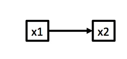
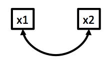
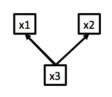
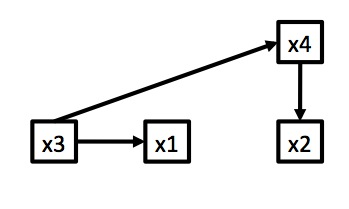
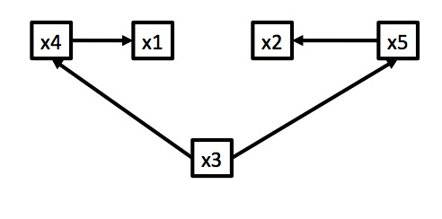
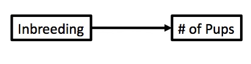
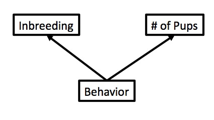
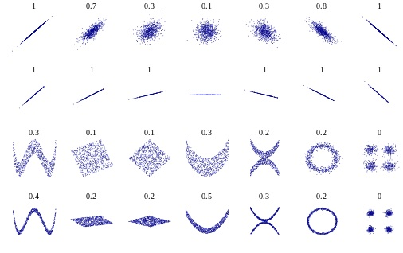

---
title:
output:
  revealjs::revealjs_presentation:
    reveal_options:
      slideNumber: true
      previewLinks: true
    theme: white
    center: false
    transition: fade
    self_contained: false
    lib_dir: libs
    css: style.css
---
##
<!-- next year, more on workflow of correlation test - assumptions and viz 
add lots of what things look like when they go awry, also better 
description of assumption testing - fix bad english
-->
<div style="background-color:white; align:center; font-size: 2em;"> Correlation and The Linear Model </div>\
\
{width=70%}\
```{r prep, echo=FALSE, cache=FALSE, message=FALSE, warning=FALSE}
library(knitr)
opts_chunk$set(fig.height=4.5, comment=NA, 
               warning=FALSE, message=FALSE, 
               dev="jpeg", echo=FALSE)
library(mvtnorm)
library(dplyr)
library(tidyr)
library(modelr)
library(ggplot2)

```
<p align="left" style="font-size:10pt; font-color:black;">https://xkcd.com/552/</p>

## Etherpad
<br><br>
<center><h3>https://etherpad.wikimedia.org/p/607-lm-2018</h3></center>


## Review

-   Testing Hypotheses with P-Values\
    \

-   Z, T, and $\chi^2$ tests for hypothesis testing\
    \

-   Power of different statistical tests using simulation\
    \

## Today

1.  Correlation\
    \

2.  Mechanics of Simple Linear Regression\
    \

3.  Testing Asssumptions of SLR\
    \

## The Steps of Statistical Modeling
1. What is your question?
2. What model of the world matches your question?
3. Build a test
4. Evaluate test assumptions
5. Evaluate test results
6. Visualize

## How are X and Y Related?
<br><br>
<div id="left">
<center>{ id="noborder"}\
Causation (regression)\
\
$x_2 \sim N(\alpha + \beta x_1, \sigma)$  </center>
</div>

<div id="right">
<center>{ id="noborder"}\
Correlation\
\
$X \sim MVN(\mu, \Sigma)$</center>
</div>
<br>  
<center>Your question might not be causal - and that's OK!</center>

## Correlation Can be Induced by Many Mechanisms

{ id="noborder"} &nbsp; &nbsp;
{ id="noborder"}
{ id="noborder"}


## Example: Wolf Inbreeding and Litter Size
<div id="left">

```{r wolf_scatterplot, fig.height=5, fig.width=5}
wolves <- read.csv("./data/11/16e2InbreedingWolves.csv")

ggplot(data=wolves, mapping=aes(x=inbreeding.coefficient, y=pups)) +
xlab("Inbreeding Coefficient") + ylab("# of Pups") +
geom_point(size=3) +
theme_bw(base_size=24)
```

</div>

<div id="right">
<br>
{width=100% id="noborder"}\
</div>

## Example: Wolf Inbreeding and Litter Size

{id="noborder" }\
{id="noborder" }\

We don’t know which is correct - or if another model is better. We can
only examine *correlation*.

## What is Correlation?

> * The porportion change in standard deviations of variable x per change in 1 SD of variable y  
>     * Clear, right?  
>     * And that's just for normal, linear variables
\
\
> * Assesses the degree of association between two variables
\
\
> * But, unitless (sort of)
>     * Between -1 and 1

## Calculating Correlation: Start with Covariance

<p align="left">Describes the relationship between two variables. Not scaled.</p>
<div class="fragment">
$\sigma_{xy}$ = population level covariance  
$s_{xy}$ = covariance in your sample
</div>

<div id="left">
<div class="fragment">
<br><br><br>
$$\sigma_{XY} = \frac{\sum (X-\bar{X})(y-\bar{Y})}{n-1}$$
</div>
</div>

<div id="right">
<div class="fragment" style="vertical-align: text-top;">

```{r rnormPlot_cov, echo=FALSE, fig.height=4, fig.width=5}
#create a data frame to show a multivariate normal distribution
sigma <- matrix(c(3,2,2,4), ncol=2)
vals <- rmvnorm(n=500, mean=c(1,2), sigma=sigma)

nums<-seq(-5,5,.2)
data_mvnorm<-expand.grid(x1=nums, x2=nums)
data_mvnorm$freq<-dmvnorm(data_mvnorm, sigma=sigma)

#make up some fake data
set.seed(697)
data_rmnorm<-as.data.frame(rmvnorm(400, sigma=sigma))
names(data_rmnorm)=c("x", "y")
data_rmnorm$y<-data_rmnorm$y + 3

plot(y~x, pch=19, data=data_rmnorm, cex.lab=1.4)
text(-4,8, paste("cov(x,y) = ",round(cov(data_rmnorm)[1,2],3), sep=""))

```
</div>
</div>

## Pearson Correlation

Describes the relationship between two variables.\
Scaled between -1 and 1.\
\
$\rho_{xy}$ = population level correlation, $r_{xy}$ = correlation in
your sample
<div id="left" class="fragment">
<br><br><br>
$$\Large\rho_{xy} = \frac{\sigma_{xy}}{\sigma_{x}\sigma_{y}}$$
</div>

<div id="right" class="fragment">
```{r rnormPlot_cor, echo=FALSE, fig.height=4, fig.width=5}

plot((y-mean(y))/sd(y)~I(x/sd(x)), pch=19, data=data_rmnorm, 
     xlab="\nZ transformed x", ylab = "Z transformed y", cex.lab=1.4)
text(-2,2, paste("cor(x,y) = ",round(cor(data_rmnorm)[1,2],3), sep=""))

```
</div>


## Assumptions of Pearson Correlation
<br>
<div id = "left">
> -   Observations are from a **random sample**  
\
\
> -   Each observation is **independent**  
\
\
> -   X and Y are from a **Normal Distribution**
</div>

<div id="right">

```{r mvnorm_persp, echo=FALSE, fig.height=5, fig.width=5}

facetCols<-heat.colors(length(unique(data_mvnorm$freq)))
data_mvnorm$fCols<-as.numeric(as.factor(data_mvnorm$freq))
with(data_mvnorm, 
     persp(nums, nums, matrix(freq, nrow=length(nums)),
           xlab="x", ylab="y", zlab="Frequency",
           theta = -90, phi = 25,  ltheta=145, border=gray(0.2),
           col="lightblue", cex.axis=2
           ))
```

</div>


## The meaning of r

Y is perfectly predicted by X if r = -1 or 1.\
$r^2$ = the porportion of variation in y explained by x
```{r corLevels, echo=FALSE, fig.height=5, fig.width=5}

set.seed(1001)
par(mfrow=c(2,2))
for(i in c(0.2, 0.4, 0.6, 0.8)){
  xy<-as.data.frame(rmvnorm(200, sigma=matrix(c(1, i, i, 1), byrow=T, nrow=2)))
  names(xy)<-c("x", "y")
  plot(y~x, data=xy, mar=c(3,1,1,2), main=paste("r = ", round(cor(xy)[1,2],2), sep=""))
  
}
par(mfrow=c(1,1))
```


## Get r in your bones...
<br><br><br>
<center>http://guessthecorrelation.com/</center>

## Testing if r $\ne$ 0

<span class="fragment">Ho is r=0. Ha is r $\ne$ 0.\ </span>  
\
\
<span class="fragment">**Testing: $t= \frac{r}{SE_{r}}$ with df=n-2**</span>  
\
\
<span class="fragment">WHY n-2?\ </span>  
<span class="fragment">$\sigma_{xy}$ Because you use two parameters: $\bar{X}$ and $\bar{Y}$\ </span>  
\
\
<span class="fragment">$$SE_{r} = \sqrt{\frac{1-r^2}{n-2}}$$\ </span>


## Example: Wolf Inbreeding and Litter Size

<div id="left">
```{r wolf_scatterplot, fig.height=5, fig.width=6}
```
</div>
<div id="right">
{width="80.00000%"}\
</div>


## Example: Wolf Inbreeding and Litter Size
<div class="fragment">
```{r wolf_cov}
round(cov(wolves),2)
```
</div>
<br><br>
<div class="fragment">
```{r wolf_cor}
round(cor(wolves),2)
```
</div>
<br><br>

<div class="fragment">

```{r wolves_cor_test}

cTest <- wolves %>% 
  with(cor.test(pups, inbreeding.coefficient)) %>%
  broom::glance()

rownames(cTest) <- ""

knitr::kable(round(cTest[1:4],3), "html")
```
</div>

## Violating Assumptions? 
<div style="font-size:36pt">
> -   Spearman’s Correlation (rank based)  
\
> -   Distance Based Correlation & Covariance (<span>dcor</span>)  
\
> -   Maximum Information Coefficient (nonparametric)  
\
> - All are lower in power for linear correlations  
\
</div>

## Spearman Correlation

1.  Transform variables to ranks, i.e.,2,3... (`rank()`)

2.  Compute correlation using ranks as data

3.  If n $\le$ 100, use Spearman Rank Correlation table

4.  If n $>$ 100, use t-test as in Pearson correlation


## Distance Based Correlation, MIC, etc.

{width=90%}


## Today

1.  Correlation\
    \

2.  <font color="red">Mechanics of Simple Linear Regression </font> \
    \

3.  Testing Asssumptions of SLR\
    \
    
## Least Squares Regression
<br>
$\Large \widehat{y} = \beta_0 + \beta_1 x + \epsilon$\
<Br><br><br>
<div style="font-size:18pt"><p align="left">
Then it’s code in the data, give the keyboard a punch\
Then cross-correlate and break for some lunch\
Correlate, tabulate, process and screen\
Program, printout, regress to the mean\
\
-White Coller Holler by Nigel Russell</p>
</div>

## How are X and Y Related?
<br><br>
<div id="left">
<center>{ id="noborder"}\
Causation (regression)\
\
$x_2 \sim N(\alpha + \beta x_1, \sigma)$  </center>
</div>

<div id="right">
<center>{ id="noborder"}\
Correlation\
\
$X \sim MVN(\mu, \Sigma)$</center>
</div>

## Correlation v. Regression Coefficients

```{r cor_and_reg}

set.seed(1001)
sampdf <- data.frame(x=1:50)
sampdf <- within(sampdf, {
       y1 <- rnorm(50, 3*x, 10)
       y2 <- rnorm(50, 3*x, 40)
       y3 <- y2/3
})

#cor(sampdf)
#lines and slopes
par(mfrow=c(1,3))
par(cex.lab=2, cex.axis=1.1, cex.main=2)
plot(y1 ~ x, data=sampdf, main="Slope = 3, r = 0.98", ylim=c(-60, 180))
abline(lm(y1~x, data=sampdf), lwd=2, col="red")
plot(y2 ~ x, data=sampdf, main="Slope = 3, r = 0.72", ylim=c(-60, 180))
abline(lm(y2~x, data=sampdf), lwd=2, col="red")
plot(y3 ~ x, data=sampdf, main="Slope = 1, r = 0.72", ylim=c(-60, 180))
abline(lm(y3~x, data=sampdf), lwd=2, col="red")
par(mfrow=c(1,1))

```


## Basic Princples of Linear Regression
<br>
<div style="font-size:32pt">
> -   Y is determined by X: p(Y $|$ X=x)\  
\
\
> -   The relationship between X and Y is Linear\  
\
\
> -   The residuals of $\widehat{Y} = \beta_0 + \beta_1 X + \epsilon$ are normally distributed\  
    \
    (i.e., $\epsilon \sim$ N(0,$\sigma$))
</div>


## Basic Principles of Least Squares Regression

$\widehat{Y} = \beta_0 + \beta_1 X + \epsilon$ where $\beta_0$ = intercept, $\beta_1$ = slope

```{r linefit}
set.seed(697)
x<-1:10
y<-rnorm(10, mean=x,sd=2)
a<-lm(y~x)
plot(x,y,pch=19, cex=1.5)
abline(a, lwd=2)
segments(x,fitted(a),x,y, col="red", lwd=2)
``` 

Minimize Residuals defined as $SS_{residuals} = \sum(Y_{i} - \widehat{Y})^2$

## Lots of Possible Lines: Least Squares

```{r lsq}
library(mnormt)
set.seed(697)
x<-1:10
y<-rnorm(10, mean=x,sd=2)
a<-lm(y~x)
ab <- rmnorm(3, coef(a), vcov(a))

par(mfrow=c(1,3))
for(i in 1:3){
  plot(x,y,pch=19, cex=1.5)
  abline(a=ab[i,1], b=ab[i,2], lwd=2)
  segments(x,ab[i,1] + x*ab[i,2],x,y, col="red", lwd=2)
}

```


## Solving for Slope
<br><br>
$\LARGE b=\frac{s_{xy}}{s_{x}^2}$ $= \frac{cov(x,y)}{var(x)}$\
\
\
<span class="fragment">$\LARGE = r_{xy}\frac{s_{y}}{s_{x}}$</span>


## Solving for Intercept
<br><br>
Least squares regression line always goes through the mean of X and Y<br>
$\Large \bar{Y} = \beta_0 + \beta_1 \bar{X}$\
\
<br><br>
<span class="fragment">$\Large \beta_0 = \bar{Y} - \beta_1  \bar{X}$</span>


## Putting Linear Regression Into Practice with Pufferfish
```{r pufferload}
puffer <- read.csv("./data/11/16q11PufferfishMimicry Caley & Schluter 2003.csv")
```
<div id = "left">
- Pufferfish are toxic/harmful to predators  
<br>
- Batesian mimics gain protection from predation - why?
<br><br>
- Evolved response to appearance?
<br><br>
- Researchers tested with mimics varying in toxic pufferfish resemblance
</div>

<div id = "right">
{width="80.00000%"}\
</div>

## The Steps of Statistical Modeling
1. What is your question?
2. What model of the world matches your question?
3. Build a test
4. Evaluate test assumptions
5. Evaluate test results
6. Visualize

## Question: Does Resembling a Pufferfish Reduce Predator Visits?
```{r puffershow}
pufferplot <- ggplot(puffer, mapping=aes(x=resemblance, y=predators)) +
  geom_point(size=2) +
  ylab("Predator Approaches per Trial") + 
  xlab("Dissimilarity to Toxic Pufferfish") +
  theme_bw(base_size=17)

pufferplot
```

## A Preview: But How do we Get Here?
```{r}
pufferplot + 
  stat_smooth(method="lm", color="red", size=1.3)
```

## The World of Pufferfish
<p align='left'>**Data Generating Process:**</p>
$$Visits \sim Resemblance$$<br>
<center>Assume: Linearity (reasonable first approximation)</center>
<br><br>
<p align="left">**Error Generating Process:**</p>
<center>Variation in Predator Behavior<br>Assume: Normally distributed error (also reasonable)</center>

## Quantiative Model of Process
$$\Large Visits_i = \beta_0 + \beta_1 Resemblance_i + \epsilon_i$$
<br><br>
$$\Large \epsilon_i \sim N(0, \sigma)$$

## Today

1.  Correlation\
    \

2.  Mechanics of Simple Linear Regression\
    \

3.  <font color="red">Testing Asssumptions of SLR </font>  \
    \


## Testing Assumptions
> - **Data Generating Process: Linearity**
>     - Examine relationship between fitted and observed values
>     - Secondary evaluation: fitted v. residual values
<br><br>
> - **Error Generating Process:** Normality & homoscedasticity of residuals
>     - Histogram of residuals
>     - QQ plot of residuals
>     - Levene test if needed
<br><br>
> - **Data**
>     - Do we have any outliers with excessive leverage?

```{r fit_puffer}
puffer_lm <- lm(predators ~ resemblance, data=puffer)
puffer<- puffer %>%
  modelr::add_residuals(puffer_lm) %>%
  modelr::add_predictions(puffer_lm)
```

## Linearity of the Puffer Relationship
<h3>Fitted v. Observed</h3>
```{r puffer_fit_pred}
qplot(pred, predators, data=puffer) +
  theme_bw(base_size=17) +
  geom_point(size=1.5) +
  geom_abline(intercept=0, slope=1, lty=2) +
  xlab("Fitted") + ylab("Observed")
```

Points fall on 1:1 line, no systematic deviations


## Linearity and Homoscedasticity of the Puffer Relationship
<h3>Fitted v. Residual</h3>
```{r puffer_fit_resid}
plot(puffer_lm, which=1)
```

No systematic trends in relationship required!

## Normality of Residuals
```{r puffer_resid_hist}
ggplot(puffer, aes(x=resid)) +
  geom_histogram(bins=10, fill="blue")
```

Appears peaked in the middle...


## Normality of Residuals
<h3>QQ Plot!</h3>
```{r puffer_qq}
plot(puffer_lm, which=2, cex.lab=1.4, cex.main=2, cex.axis=1.1)
```


## Any Excessive Outliers?
<h3>Cook's Distance</h3>
```{r puffer_cooks}
plot(puffer_lm, which=4, cex.lab=1.4, cex.main=2, cex.axis=1.1)
```

Nothing with > 1


## Anything Too Influential
<h3>Leverage: How Far is an Observation from the Others</h3>
```{r puffer_leverage}
plot(puffer_lm, which=5, cex.lab=1.4, cex.main=2, cex.axis=1.1)
```

Should be a cloud with no trend


