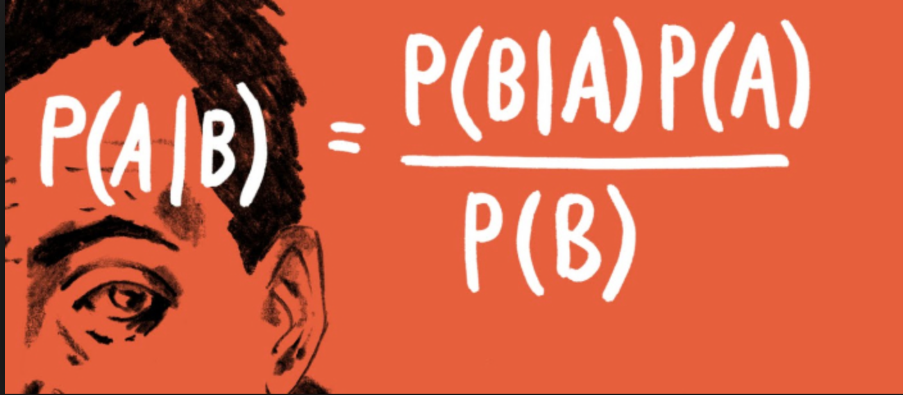
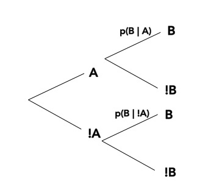
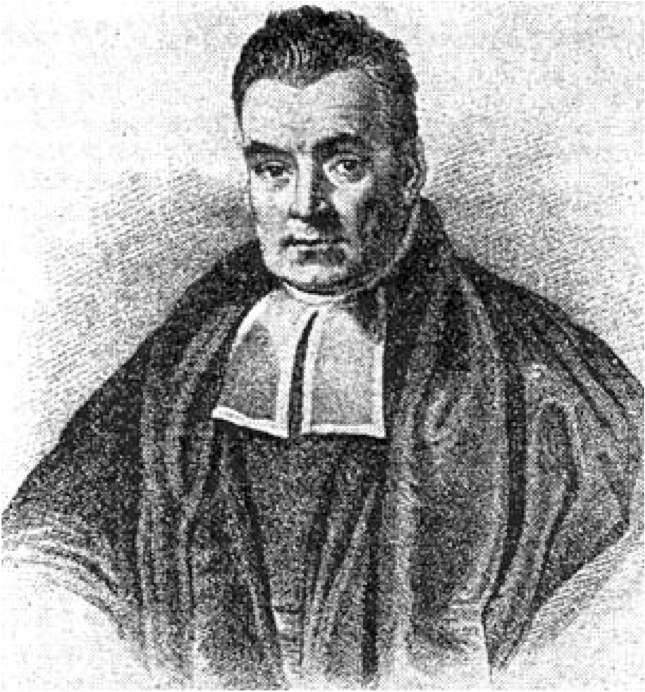
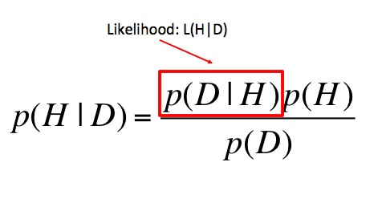
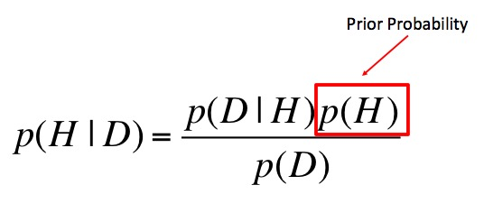
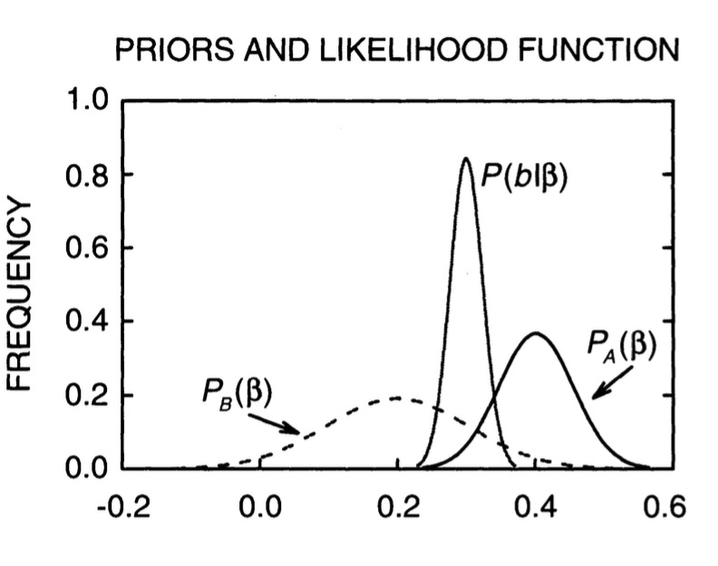
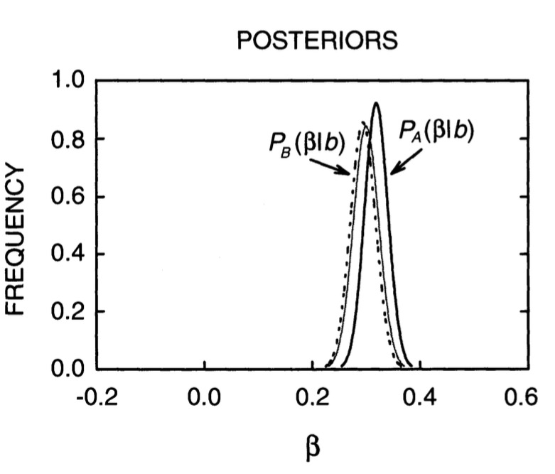
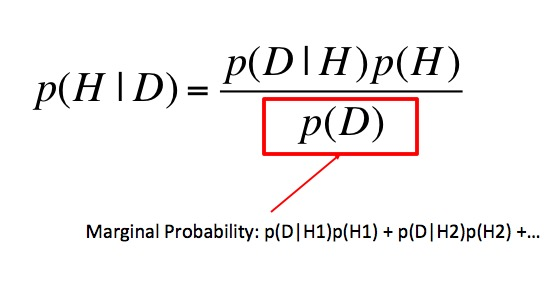
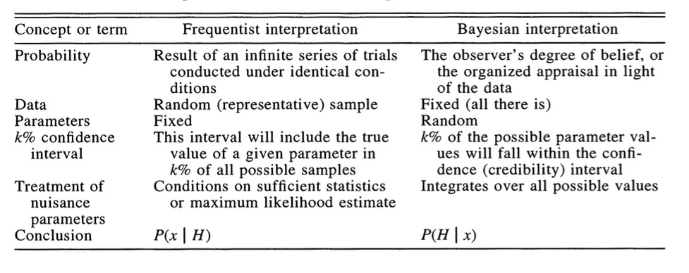

---
title:
output:
  revealjs::revealjs_presentation:
    reveal_options:
      slideNumber: true
      previewLinks: true
    theme: white
    center: false
    transition: fade
    self_contained: false
    lib_dir: libs
    css: style.css
---

## Bayesian Statistics: an introduction
<!-- Objectives
1) Understand Bayes theorem
  - Contrast to likelihood and frequentist approaches
2) Understand what it means in context
  - Credible Intervals v Confidence Intervals
3) Understand how we use it to estimate
  - Posterior Distributions
  - How to use a Credible Interval
-->




```{r prep, echo=FALSE, cache=FALSE, message=FALSE, warning=FALSE}
library(knitr)
opts_chunk$set(fig.height=4.5, comment=NA, 
               warning=FALSE, message=FALSE, 
               dev="jpeg", echo=FALSE)
library(dplyr)
library(tidyr)
library(broom)
library(ggplot2)

```


## Deriving Truth from Data
> - **Frequentist Inference:** Correct conclusion drawn from repeated experiments  
>     - Uses p-values and CIs as inferential engine  
\
> - **Likelihoodist Inference:** Evaluate the weight of evidence for different hypotheses  
>     - Derivative of frequentist mode of thinking  
>     - Uses model comparison (sometimes with p-values...)  
\
> - **Bayesian Inference:** Probability of belief that is constantly updated  
>     - Uses explicit statements of probability and degree of belief for inferences  


## Similarities in Frequentist and Likelihoodist Inference

-  **Frequentist inference** with Linear Models

    -   Estimate ’true’ slope and intercept

    -   State confidence in our estimate

    -   Evaluate probabilty of obtaining data or more extreme data
        given a hypothesis
        
<div class="fragment">
-   **Likelihood inference** with Linear Models

    -   Estimate ’true’ slope and intercept

    -   State confidence in our estimate

    -   Evaluate likelihood of data versus likelihood of alternate
        hypothesis

</div>

## Bayesian Inference

{width="40%"}\

<font size="6">

-   Estimate probability of a parameter

-   State degree of believe in specific parameter values

-   Evaluate probability of hypothesis given the data

-   Incorporate prior knowledge

</font>

##
<h1>
> - Frequentist: p(x &le; D &#x7c; H)  
\
\
> - Likelhoodist: p( D &#x7c; H)  
\
\
> -  Bayesian: p(H &#x7c; D)

</h1>

## Why is p(H &#x7c; D) awesome?

> - Up until now we have never thought about the probability of a hypothesis\
\
> - The probability data (or more extreme data) given a hypothesis provides an answer about a single point hypothesis \
\
> - We have been unable to talk about the probability of different hypotheses (or parameter values) relative to one another \
\
> - p(H | D) results naturally from Bayes Theorey

## Bayes Theorem
We know... \
\
$$\huge p(a\ and\ b) = p(a)p(b|a)$$
<div class="fragment"></div>


## Bayes Theorem
And Also... \
\
$$\huge p(a\ and\ b) = p(b)p(a|b)$$
<div class="fragment"></div><br>
<div class="fragment"><center>as $p(b) = p(b|a)+p(b|!a)$</center></div>

## Bayes Theorem
And so... \
\
$$\huge  p(a)p(b|a) =   p(b)p(a|b) $$


## Bayes Theorem
And thus... \
\
$$\huge  p(a|b) =   \frac{p(b|a)p(a)}{p(b)} $$

<div class = "fragment">{width="40%"}</div>

##
{width="45%"}

## Bayes Theorem and Data 
\
\
$$\huge  p(H|D)  =   \frac{p(D|H)p(H)}{p(D)} $$
\
\
where p(H|D) is your posterior probability of a hypothesis

## What is a posterior distribution?
```{r post_1}
x <- seq(5,20, by = 0.01)
y <- dnorm(x, 13)

post <- qplot(x,y,geom="line") +
  theme_bw(base_size=17) +
  xlab("Parameter") +
  ylab("Probability") 

post
```

## What is a posterior distribution?
```{r post_2}
post +
  geom_vline(xintercept=13, color="red", lty=2)
```

The probability that the parameter is 13 is 0.4

## What is a posterior distribution?
```{r post_3}
post +
  geom_vline(xintercept=13, color="red", lty=2)+
  geom_vline(xintercept=10, color="blue", lty=2)
```

The probability that the parameter is 13 is 0.4  
The probability that the parameter is 10 is 0.044


## What is a posterior distribution?
```{r post2}
x2 <- seq(12,13, by=0.01)
y2 <- dnorm(x2, 13)

post +
  geom_area(mapping=aes(x=x2, y=y2), fill="red")

```

Probability that parameter is between 12 and 13 = `r sum(y2)*0.01`

## Bayesian Credible Interval
```{r post3}
x3 <- seq(11,15, by=0.01)
y3 <- dnorm(x3, 13)

post +
  geom_area(mapping=aes(x=x3, y=y3), fill="red")

```

Area that contains 95% of the probability mass of the posterior distribution


## Evaluation of a Posterior: Bayesian Credible Intervals

<div style="text-align:left">In Bayesian analyses, the <span>**95% Credible Interval**</span> is the
region in which we find 95% of the possible parameter values. The
observed parameter is drawn from this distribution. For normally
distributed parameters:  
\
<span class="fragment">$$\hat{\beta} - 2*\hat{SD} \le \hat{\beta} \le \hat{\beta} +2*\hat{SD}$$ </span>\
\
<span class="fragment">where $\hat{SD}$ is the SD of the posterior distribution of the
parameter $\beta$. Note, for non-normal posteriors, the distribution
may be different.</span>
</div>

## Evaluation of a Posterior: Frequentist Confidence Intervals

<div style="text-align:left">In Frequentist analyses, the <span>**95% Confidence Interval**</span> of
a parameter is the region in which, were we to repeat the experiment an
infinite number of times, the *true value* would occur 95% of the time.
For normal distributions of parameters:</div>  
\
\
$$\hat{\beta} - t(\alpha, df)SE_{\beta} \le \beta \le \hat{\beta} +t(\alpha, df)SE_{\beta}$$

## Credible Intervals versus Confidence Intervals

> - Frequentist Confidence Intervals tell you the region you have confidence a **true value** of a parameter may occur \
\
> - If you have an estimate of 5 with a Frequentist CI of 2, you cannot say how likely it is that the parameter is 3, 4, 5, 6, or 7  
\
> - Bayesian Credible Intervals tell you the region that you have some probability of a parameter value \
\
> - With an estimate of 5 and a CI of 2, you can make statements about degree of belief in whether a parmeter is 3, 4,5, 6 or 7 - or even the probability that it falls outside of those bounds

## Degree of believe in a result

```{r p}
xp <- seq(-2,5, by = 0.001)
yp <- dnorm(xp, 2)

xp1 <- seq(-2,0, by = 0.001)
yp1 <- dnorm(xp1, 2)

 qplot(xp,yp,geom="line") +
  theme_bw(base_size=17) +
  xlab("Parameter") +
  ylab("Probability") +
  geom_area(mapping=aes(x=xp1, y=yp1), fill="red")
```

<div style="text-align:left">You can discuss the probability that your parameter is opposite in sign to its posterior modal estimate. This yields a degree of belief that you at least have the sign correct (i.e., belief in observing a non-zero value)</div>

## Talking about Uncertainty the IPCC Way


## What are the other parts of Bayes Theorem?
\
\
$$\huge  p(H|D)  =   \frac{p(D|H)p(H)}{p(D)} $$
\
\
where p(H|D) is your posterior probability of a hypothesis

## Hello Again, Likelihood 



## Prior Probability

<br><br>
<p align="left"><span class="fragment">This is why Bayes is different from Likelihood!</span></p>

## How do we Choose a Prior?

> -   A prior is a powerful tool, but it can also influence our results of
    chosen poorly. This is a highly debated topic.
\
\
> -   Conjugate priors make some forms of Bayes Theorem analytically
    solveable
\
\
> -   If we have objective prior information - from pilot studies or the
    literature - we can use it to obtain a more informative posterior
    distribution
\
\
> -   If we do not, we can use a weak or flat prior (e.g., N(0,1000)).
    Note: constraining the range of possible values can still be weakly
    informative - and in some cases beneficial


## 


## The Influence of Priors


## The Influence of Priors


## Priors and Sample Size
```{r priorStrong}


bayesParams <- function(samp, priormean=0, priorvar=1){
  wo <- 1/priorvar
  wn <- length(samp)/var(samp)
  ybar <- mean(samp)
  
  m <- (wo*priormean + wn*ybar)/(wo+wn)
  v <- 1/(wo+wn)
  
  return(c(m = m, v=v))
  
}


set.seed(55)
samp3 <- rnorm(3, 1,0.5)
samp20 <- rnorm(20, 1,0.5)

p1 <- bayesParams(samp3, 0,0.1)
p2 <- bayesParams(samp20, 0,0.1)

x<-seq(-3,3,.01)
plot(x, dnorm(x,0,0.1), main="Strong Prior: N(0,0.1), True Mean = 1", type="l", ylim=c(0,4), lwd=1.5,ylab="density", xlab="Estimate of the Mean")
lines(x, dnorm(x, p1[1], sqrt(p1[2])), col="red", lty=2, lwd=1.5)
lines(x, dnorm(x, p2[1], sqrt(p2[2])), col="blue", lty=3, lwd=1.5)
legend(-2,3, col=c("black", "red", "blue"), lty=1:3, legend=c("Prior", "n=3", "n=20"), cex=1.5, lwd=1.5)

```

## p(data) is just a big summation/integral



## Denominator: The Marginal Distribution

\
Essentially, all alternate hypotheses\
\
<div style="text-align:left">Denominator - marginal distribution - becomes an integral of likelihoods
if $B$ is continuous - i.e. fitting a particular parameter value. It
normalizes the equation to be between 0 and 1.</div>

## 


## 


## 


## Bayes Theorem in Action
{width="40%"}

<p align="left" style="font-size:8pt">http://xkcd.com/1132/</p>


## Bayes Theorem in Action

$$p(Sun Explodes | Yes) = \frac{p(Yes | Sun Explodes)p(Sun Explodes)}{p(Yes)}$$
\
<p align="left"><span class="fragment">We know/assume:\
p(Sun Explodes) = 0.0001, P(Yes $|$ Sun Explodes) = 35/36\
</span>
\
<span class="fragment">So...\
p(Yes) = P(Yes $|$ Sun Explodes)p(Sun Explodes) \
= 35/36 \* 0.0001</span> \
<span class="fragment">= 9.7e10^-5</span></p>
<br><br>
<p align="left" style="font-size:10pt">credit: Amelia Hoover</p>

<!--

## Bayes Theorem in Action

$$p(Sun Explodes | Yes) = \frac{p(Yes | Sun Explodes)p(Sun Explodes)}{p(Yes)}$$
  
<p align="left">We can calculate:\
p(Yes) <span class="fragment">= P(Yes $|$ Sun Explodes)p(Sun Explodes) + <br>&nbsp; &nbsp; P(Yes $|$ Sun Doesn’t
Explode)p(Sun Doesn’t Explodes) </span> \
\
<span class="fragment">= 35/36 * 0.0001 + 1/36 * 0.9999  </span> \
\
<span class="fragment">= 0.0277775 </span> \
</p>
<br><br><br>
<p align="left" style="font-size:10pt">credit: Amelia Hoover</p>


## Bayes Theorem in Action

$$p(Sun Explodes | Yes) = \frac{p(Yes | Sun Explodes)p(Sun Explodes)}{p(Yes)}$$\
\
<p align="left"><span class="fragment">$$p(Sun Explodes | Yes) = \frac{0.0001*35/36}{0.028}$$ </span>
<span class="fragment">$$= 0.0035$$ </span>
\
<span class="fragment">Incorporating Prior Information about the Sun Exploding gives us a
<span>*very*</span> different answer</span> \
\
\
<span class="fragment">Note, we can also  evaluate the probability of the alternate
hypothesis - p(Sun Doesn’t Explode $|$ Yes)</span>
</p>
-->

## Where have we gone?

<br><br><div style="text-align:left; position:absolute; top:100%">Ellison 1996</div>
