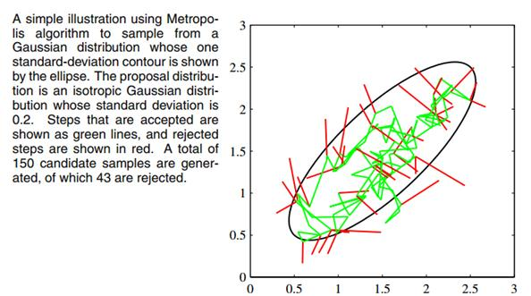
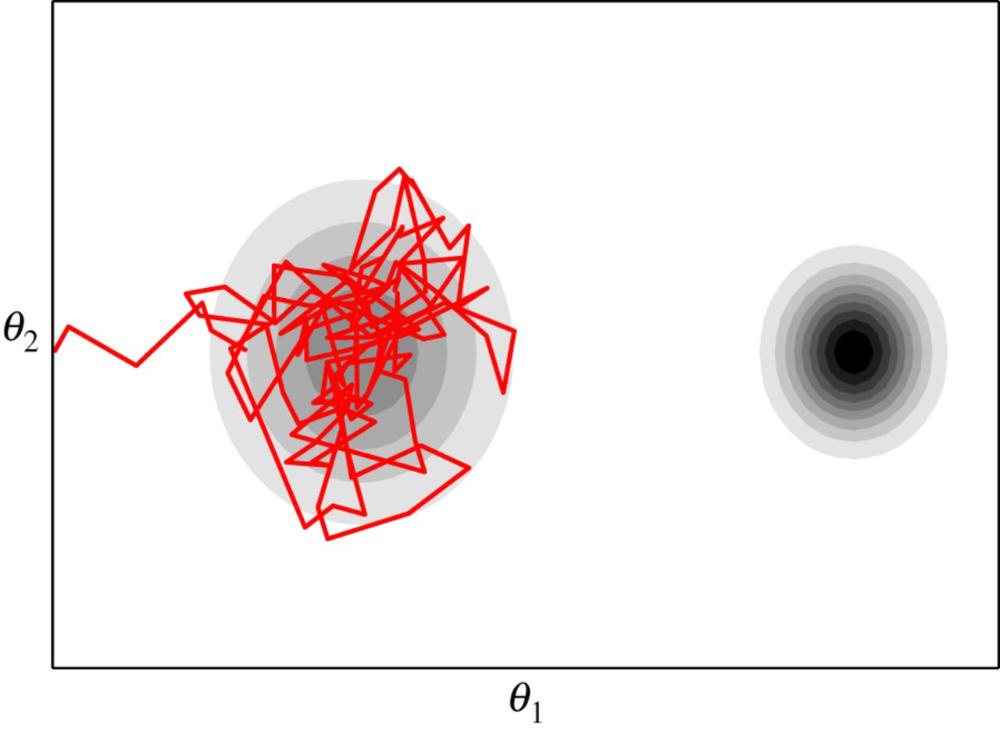
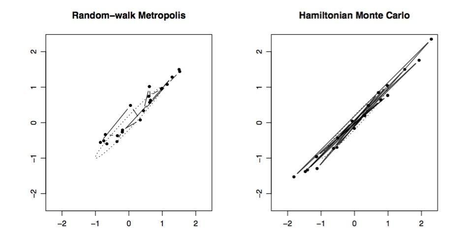
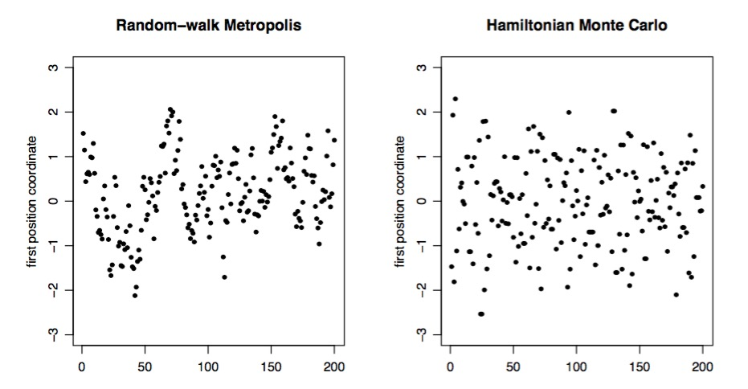
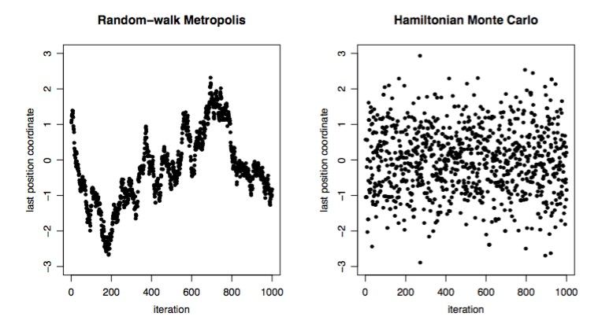
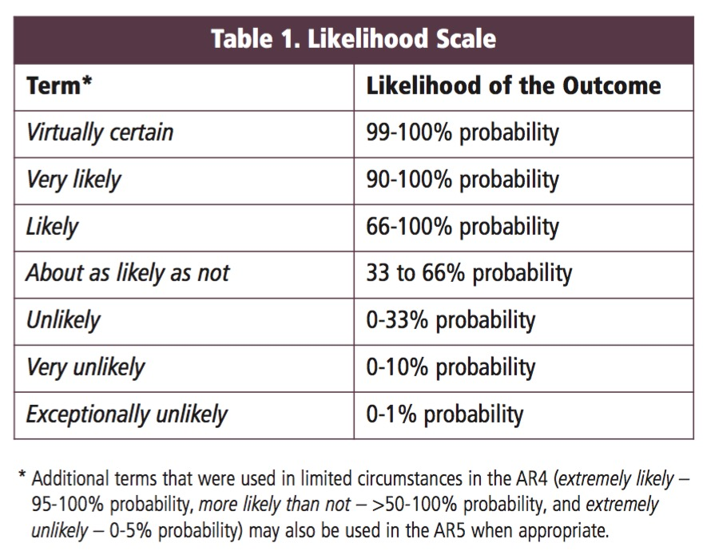

---
title:
output:
  revealjs::revealjs_presentation:
    reveal_options:
      slideNumber: true
      previewLinks: true
    theme: white
    center: false
    transition: fade
    self_contained: false
    lib_dir: libs
    css: style.css
---

## Fitting Linear Models with Bayes
{width="80%"}

```{r prep, echo=FALSE, cache=FALSE, message=FALSE, warning=FALSE}
library(knitr)
opts_chunk$set(fig.height=4.5, comment=NA, 
               warning=FALSE, message=FALSE, 
               dev="jpeg", echo=FALSE)
library(dplyr)
library(tidyr)
library(broom)
library(ggplot2)
library(rstanarm)
library(brms)
library(tidybayes)

#legacy - fix
library(MCMCglmm)
library(coda)

options(mc.cores = parallel::detectCores())
puffer <- read.csv("./data/11/16q11PufferfishMimicry Caley & Schluter 2003.csv")

theme_set(theme_bw(base_size=17))

```

```{r puffer_brms, cache=TRUE, warning=FALSE, results="hide"}
puffer_brms <- brm(predators ~ resemblance, 
                   family = gaussian(link = "identity"),
                   data = puffer)
```

## Our Etherpad
<br><br><br>
https://etherpad.wikimedia.org/p/607-bayes-2018  

## Bayesian Inference

{width="40%"}\

<font size="6">

-   Estimate probability of a parameter

-   State degree of believe in specific parameter values

-   Evaluate probability of hypothesis given the data

-   Incorporate prior knowledge

</font>


## Today

-   Markov Chain Monte-Carlo Sampling

-   Fitting and evaluating linear models fit with MCMC

-   Modifying our Prior


## Bayes Theorem So Far
<br><br><br>
$p(\theta | X) = \frac{p(X | \theta)P(\theta)}{\displaystyle \sum_{i=0}^{j} p(X | \theta_{i})p(\theta_{i})}$

Algebraically Solvable \
\


## What About Continuous Variables
<br><br><br>
$p(\theta | X) = \frac{p(X | \theta)P(\theta)}{\int p(X | \theta)p(\theta)d\theta}$

Analytically Solveable for Conjugate Priors...for linear models \

## But Where are we going?
<br><br><br>
$p(\theta | X) = \frac{\int p(X | \theta)P(\theta|\eta)p(\eta)d\eta}{\int\int p(X | \theta)p(\theta)d\theta d\eta}$

Non-gaussian models, hierarchical models, and more: need numerical integration approach 

## Markov Chain Monte Carlo Sampling (MCMC)

```{r mcmcgraphic, echo=FALSE, cache=TRUE} 
set.seed(100)
mod <- stan_glm(x ~ 1, data=data.frame(x=rnorm(50)), verbose=FALSE, family=gaussian())
plot(mod, plotfun="stan_trace")
```

## Solution: Sampling from the Posterior  
> - We don't need to integrate/sample everything  <br><br>
> - What if we tried candidate values of $\theta$ to get p(X|$\theta$)  <br><br>
> - If we had a clever way of searching parameter space...  <br><br>
> - Maybe, spending more time sampling more likely values?  <br><br>
> - Enter the ATOM BOMB!

## Markov Chain Monte Carlo Sampling (MCMC)

<p align="left">If we cannot analytically solve a distribution, we can still simulate
from it:</p>

-   Chose a set of starting values X at t=0

-   Chose a random set of parameters, Y, based on X

-   Calculate an acceptance ratio, $\alpha$, based on P(Y)/P(X)

-   If $\alpha \ge 1$ X(t+1) = Y

-   Otherwise, select a uniform random number between 0 and 1, U

-   If $U \le \alpha$, X(t+1) = Y. Otherwise, X(t+1) = X.

-   Rinse and repeat

(Note, this is the Metropolis-Hastings Algorithm - there are others)

## King Markov and His Islands (sensu Richard McElreath)


## King Markov and His Islands


## How to move around Islands

<p align="left">
<li class="fragment">Flip a coin. Heads, move. Tails, stay.</li>  
<li class="fragment">Figure out the number of people on each island.</li>  
<li class="fragment">Assign a probability, p = next island / (total population)</li>  
<li class="fragment">Choose a random number. If number &lt; p, move.</li>
<li class="fragment">Rinse and repeat</li>
</p>

```{r mcmc, echo=FALSE}

mcmc_ex <- function(num_weeks = 1e5, current=10, positions = rep(0, num_weeks)){
  for ( i in 1:num_weeks ) {
    # record current position
    positions[i] <- current
  
    # flip coin to generate proposal
    proposal <- current + sample( c(-1,1) , size=1 )
    # now make sure he loops around the archipelago
    if ( proposal < 1 ) proposal <- 10
    if ( proposal > 10 ) proposal <- 1
  
    # move?
    prob_move <- proposal/current
    current <- ifelse( runif(1) < prob_move , proposal , current )
  }

  positions
}

```


## Metropolis MCMC in Action: 10 Weeks
Population = Island Number
```{r met}
par(mfrow=c(1,2))
set.seed(2002)
plot(mcmc_ex(10), xlab="weeks", type="l")
rethinking::simplehist(mcmc_ex(10))
par(mfrow=c(1,1))
```

## Metropolis MCMC in Action: 50 Weeks
Population = Island Number
```{r met_50}
par(mfrow=c(1,2))
set.seed(2002)
plot(mcmc_ex(50), xlab="weeks", type="l")
rethinking::simplehist(mcmc_ex(50))
par(mfrow=c(1,1))
```

## Metropolis MCMC in Action: 1000 Weeks
Population = Island Number
```{r met_1000}
par(mfrow=c(1,2))
set.seed(2002)
plot(mcmc_ex(1000), xlab="weeks", type="l")
rethinking::simplehist(mcmc_ex(1000))
par(mfrow=c(1,1))
```

## Metropolis MCMC For Models
<div id="left">
```{r tmp}
plot(mcmc_ex(100), xlab="weeks", type="l")
```
</div>

<div id="right">
- Each island is a set of parameter choices  
\
- Each "population" is a posterior density  
\
- The path is a 'chain'  
</div>

## Markov Chain Monte Carlo Sampling (MCMC) 

<p align="left">This is a time series. To use it for inference to sample from the final
stationary distribution:</p>

-   Discard a ’burn in’ set of samples

-   'Thin' your chain or use other methods to reduce temporal autocorrelation

-   Examine chain for convergence on your posterior distribution

-   Evaluate multiple chains to ensure convergence to a single
    distribution


## Markov Chain Monte Carlo Sampling (MCMC)

```{r mcmcgraphic1, echo=FALSE} 

set.seed(100)
mod <- MCMCglmm(x ~ 1, data=data.frame(x=rnorm(50)), verbose=FALSE)
modNoThin <- MCMCglmm(x ~ 1, data=data.frame(x=rnorm(50)), verbose=FALSE, thin=1, burnin=0)

plot(modNoThin$Sol[1], type="b", ylab="Value", xlab="Iteration")

```


## Markov Chain Monte Carlo Sampling (MCMC)

```{r mcmcgraphic2, echo=FALSE} 
plot(modNoThin$Sol[1:2], type="b", ylab="Value", xlab="Iteration")

```


## Markov Chain Monte Carlo Sampling (MCMC)

```{r mcmcgraphic3, echo=FALSE} 
plot(modNoThin$Sol[1:3], type="b", ylab="Value", xlab="Iteration")

```


## Markov Chain Monte Carlo Sampling (MCMC)

```{r mcmcgraphic4, echo=FALSE} 
plot(modNoThin$Sol[1:4], type="b", ylab="Value", xlab="Iteration")

```


## Markov Chain Monte Carlo Sampling (MCMC)

```{r mcmcgraphic5, echo=FALSE} 
plot(modNoThin$Sol[1:5], type="b", ylab="Value", xlab="Iteration")

```


## Markov Chain Monte Carlo Sampling (MCMC)

```{r mcmcgraphic6, echo=FALSE} 
plot(modNoThin$Sol[1:6], type="b", ylab="Value", xlab="Iteration")

```


## Markov Chain Monte Carlo Sampling (MCMC)

```{r mcmcgraphic100, echo=FALSE} 
plot(modNoThin$Sol[1:100], type="b", ylab="Value", xlab="Iteration")

```


## Markov Chain Monte Carlo Sampling (MCMC)

```{r mcmcgraphicThinned, echo=FALSE} 
plot(seq(1,100,10),modNoThin$Sol[seq(1,100,10)], type="b", ylab="Value", xlab="Iteration", main="Thinned")
```

## Multiple Chains to Check Convergence and Improve Answer
```{r mcmcgraphic, echo=FALSE, cache=TRUE} 
```

## MCMC In Practice for Models
  
\
\
\
<div style="font-size:11pt">from http://www.cnblogs.com/Nietzsche/p/4255948.html</div>

## MCMC is not a Panacea


## MCMC is not a Panacea


## How can MCMC Fail?

- MCMC (particularly Metropolis) can get stuck  
\
- Start values can still be important  
\
- Particularly a problem with many parameters which are correlated  
\
- One way we try and assess is fit with many chains and make sure they converge


## MCMC Algorithms
<div id="left">
- Metropolis MCMC inefficient  
\
- Many algorithms to come up with clever proposed moves to speed up  
\
- Gibbs sampling used for BUGS, JAGS, etc.\
    - Still has same problems as Metropilis  
\
- Or... Abandon search and use more deterministic sampling
    - Hamiltonian MCMC
</div>

<div id="right">
\
\

</div>

## King Hamilton and His BatBoat (also from McElreath)
{width="80%"}
{width="40%"}

## King Hamilton and His BatBoat


- Boat passes by all of the island, back and forth  
\
- Boat slows to see people in porportion to how many folk  
\
- We sample position through time, more positions in areas where boat is slow

## Metropolis versus Hamiltonian

\
\
\
<div style="font-size:11pt">Neal 2011, http://www.cs.utoronto.ca/~radford/ham-mcmc.abstract.html </div>

## Metropolis versus Hamiltonian

\
\
\
<div style="font-size:11pt">Neal 2011, http://www.cs.utoronto.ca/~radford/ham-mcmc.abstract.html </div>


## Metropolis versus Hamiltonian

\
\
\
<div style="font-size:11pt">Neal 2011, http://www.cs.utoronto.ca/~radford/ham-mcmc.abstract.html </div>

## Implementing HMC via Stan


- A few libraries in R use Stan  <br>
- `rstanarm` is from the Stan team  
     - several pre-compiled models <br>
- `brms` is **constantly** expanding  
     - Models compiled, but, infinitely flexible


##
<br><br><br>
<h1>Linear Modeling with Bayes

## brms

-   Powerful package that fits bayesian models using 
    Hamiltonian Monte-Carlo (reduced autocorrelation in chain)

-   Available tools to tweak priors

-   Flexible in error distribution

-   Can accomodate random effects, autocorrelation, etc

-   Uses STAN to fit models, but same syntax as base R models

-   Constantly updated for more weird models (post an issue, I give it 2 days)  
  
-   Compiles model into C++ code, then samples

-   For maximum flexibility, *rethinking* or *rstan*

## Bayesian Pufferfish
<div id = "left">
- Pufferfish are toxic/harmful to predators  
<br>
- Batesian mimics gain protection from predation
<br><br>
- Evolved response to appearance?
<br><br>
- Researchers tested with mimics varying in toxic pufferfish resemblance
</div>

<div id = "right">
{width="80.00000%"}\
</div>

## Does Resembling a Pufferfish Reduce Predator Visits?
```{r puffershow}
pufferplot <- ggplot(puffer, mapping=aes(x=resemblance, y=predators)) +
  geom_point(size=2) +
  ylab("Predator Approaches per Trial") + 
  xlab("Dissimilarity to Toxic Pufferfish") +
  theme_bw(base_size=17)

pufferplot
```

## The Steps of Statistical Modeling
1. What is your question?
2. What model of the world matches your question?
3. Build a model
4. Evaluate model assumptions
5. Evaluate model results
6. Visualize

## Implementing the Puffer Model in brms

```{r puffer_brms, eval = FALSE, echo=TRUE}
```

## What were the priors?

```{r puffer_brm_showprior, echo=TRUE}
prior_summary(puffer_brms)
```

Note that these are flat (slope) or weakly informative!

## MCMC diagnostics - Convergence and Posterior Behavior
  ```{r converge}
plot(puffer_brms)
```

## 
<br><br><br>
  <h1 style="text-align:left">These are all checks of the model fitting process. If they fail, either tweak the MCMC process (e.g., nsims), or your model is incompatible with the data</h1>
  
    
##
  <br><br><br>
  <h1 style="text-align:left">All assumptions of linear regression hold - and then there are a few checks for MCMC fits</h1>
  
## Good ole' QQ
  
  ```{r qq_stan}
qqnorm(residuals(puffer_brms))
qqline(residuals(puffer_brms))
```


## But - often use simulated posterior estimates
```{r resid_hist}
pp_check(puffer_brms, type = "error_hist", nsamples = 3, binwidth = 3) +
  ggtitle("Residual Histogram for three simulated datasets")
```

## Observed v. Average of Simulated Fitted Value

```{r obs_v_fit}
pp_check(puffer_brms, type = "scatter", nsamples=3)
```

## Do Simulated Posterios of the Data Fit our Observations?
Blue = Distribution of our observations, Lines = Simulations
```{r pp_check}
pp_check(puffer_brms)
```


## Does Distribution of Sample Estimates Match Distribution of Simulated Sample Estimates?
```{r pp_hist}
pp_check(puffer_brms, type = "stat", stat = c("mean"), binwidth=0.5)
```

## Does Distribution of Error Match Distribution of Simulated Error Estimates?
```{r pp_hist_2}
pp_check(puffer_brms, type = "stat_2d", stat =  c("mean", "sd"))
```


## How sensitive is our simulation to leaving out one value?
```{r loo, cache=TRUE}
plot(loo(puffer_brms), label_points = TRUE, cex=1.1)
```

If >1, inspect that point!
  
## 
  <br><br>
  <h1><p align="left">These are all data and error generating process checks. If they fail, you may need to respecify your model (or your prior)</p></h1>
  

## Finally - the Parameters
  ```{r mcmc_params}
puffer_brms %>%
  spread_draws(b_Intercept, b_resemblance, sigma) %>%
  gather(parameter, value, b_Intercept:sigma) %>%
  ggplot(aes(x = value, y = parameter)) +
  geom_halfeyeh( .width = c(0.8, 0.95)) +
  ylab("") +
  ggtitle("Posterior Medians with 80% and 95% Credible Intervals")
```

## So.... what did we get?
```{r puffer_out}
summary(puffer_brms)
```

<Br>Note Rhat values - must = 1!!!

## Or, just look at your Credible Interval
\
\
<p align="left">For 80% Credible Interval:</p>  
  \
```{r posterior}
posterior_interval(puffer_brms, prob=0.8)
```

## What is the weight of the tail less that 0?
```{r pred}
post_puffer <- as.data.frame(puffer_brms)
```
Weight of Intercept &le; 0? `r sum(post_puffer[,1]<0)/nrow(post_puffer)`  
\
Weight of Slope &le; 0? `r sum(post_puffer[,2]<0)/nrow(post_puffer)`

## Talking about Uncertainty the IPCC Way
{width = "80%"}

## Compare to LM
Bayesian Fit
```{r compare_lm}
knitr::kable(tidy(puffer_brms,intervals = TRUE), "html", digits=2) %>%
  kableExtra::kable_styling("striped")
```

LM Fit
```{r compare_lm_2}
knitr::kable(tidy(lm(predators ~ resemblance, data=puffer)), "html", digits=2) %>%
  kableExtra::kable_styling("striped")
```


## Visualize the mean fit...
```{r fit_fig}
pufferplot + 
  geom_abline(slope=fixef(puffer_brms)[2], intercept=fixef(puffer_brms)[1], color="red")
```

## And the distributions of fits
```{r dist_fit}

pufferplot + 
  geom_abline(slope=post_puffer[,2], intercept=post_puffer[,1], color="lightgrey", alpha=0.1) +
  geom_abline(slope=fixef(puffer_brms)[2], intercept=fixef(puffer_brms)[1], color="red")  +
  geom_point()
```

## And the distributions of fits
```{r}
puff_fit <- puffer %>%
  modelr::data_grid(resemblance)%>%
  add_fitted_draws(puffer_brms)

ggplot(puff_fit, aes(x = resemblance, y = predators)) +
  stat_lineribbon(aes(y = .value)) +
scale_fill_brewer(palette = "Greys") +
  scale_color_brewer(palette = "Set2") +
  theme_bw(base_size=17)
```

## Add the distribution of predictions
```{r puffer_pred_brms}
puff_pred <- puffer %>%
  modelr::data_grid(resemblance)%>%
  add_predicted_draws(puffer_brms)

ggplot(puff_pred, aes(x = resemblance, y = predators)) +
  stat_lineribbon(aes(y = .prediction)) +
  scale_fill_brewer(palette = "Greys") +
  scale_color_brewer(palette = "Set2") +
  theme_bw(base_size=17)
````

##

<h1 style="text-align:left">OK, ok, but what about the prior...</h1>
  

## See your posterior relative to your prior
```{r puffer_brm_showprior}
```

## Adding a stronger prior
<br>
  ```{r prior, cache=TRUE, echo=TRUE}
puffer_brms_prior <- brm(predators ~ resemblance, 
                   family = gaussian(link = "identity"),
                   data = puffer,
                   prior = c(prior(normal(3, 1), class = Intercept),
                             prior(normal(1, 0.5), class = b),
                             prior(uniform(0, 10), class = sigma)))
```

## Did it blend?
```{r post_prior_strong, cache=TRUE}
plot(puffer_brms_prior)
```
```{r rhat_strong, echo=TRUE}
rhat(puffer_brms_prior)
```

## Did it blend?
```{r pp_check_strong_prior, cache=TRUE}
pp_check(puffer_brms_prior) + ggtitle("Posterior Simulations v. Data Distribution")
```

## Compare results!
<p align="left">Weak Prior:
  ```{r weak_prior}
posterior_interval(puffer_brms)
```

\
Strong Prior:</p>
  ```{r strong_prior}
posterior_interval(puffer_brms_prior)
```


## Compare results!
```{r prior_preds}
puff_fit_prior <- puffer %>%
  modelr::data_grid(resemblance)%>%
  add_fitted_draws(puffer_brms_prior)


ggplot(puff_fit, aes(x = resemblance, y = predators)) +
  stat_lineribbon(aes(y = .value)) +
  scale_fill_brewer(palette = "Greys") +
  scale_color_brewer(palette = "Set2") +
  stat_lineribbon(data = puff_fit_prior, color = "blue",
                  mapping =aes(y = .value)) +
  geom_point(data= puffer) +
  theme_bw(base_size=17)
```

Red = Weak Priors, Blue = Strong Prior

## In Conclusion...Bayes

- Yes, it's more fidly and there are more assumptions  \
\
- BUT - you can now talk in the language or probability  
\
- AND - drawing from the posterior makes visualization and understanding of uncertainty a snap  
\
- Inherently recognizes "All models are wrong, some are useful"
