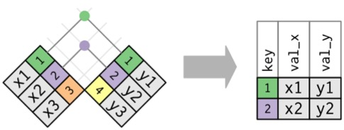
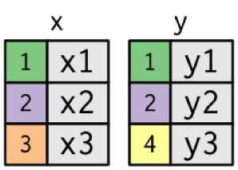
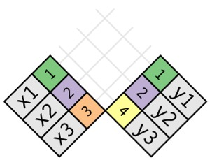
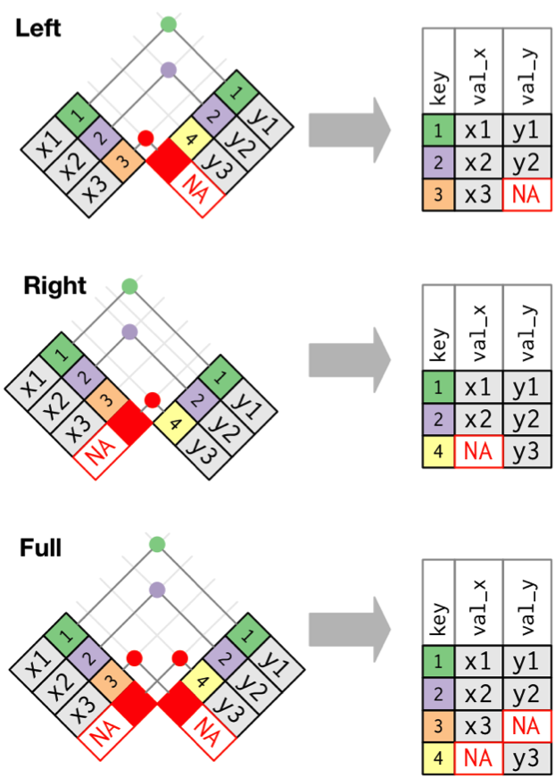
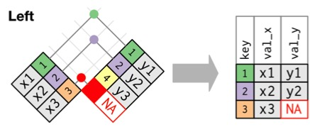
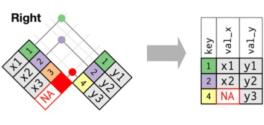
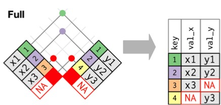
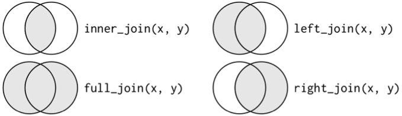
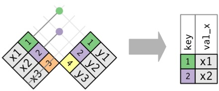
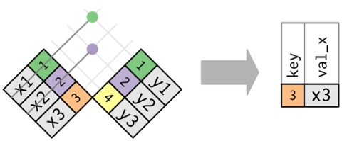

---
title:
output:
  revealjs::revealjs_presentation:
    reveal_options:
      slideNumber: true
      previewLinks: true
    theme: white
    center: false
    transition: fade
    self_contained: false
    lib_dir: libs
    css: style.css
---

## {data-background="images/18/join_title.jpg"}

```{r prep, echo=FALSE, cache=FALSE, message=FALSE, warning=FALSE}
library(knitr)
opts_chunk$set(fig.height=4.5, comment=NA, 
               warning=FALSE, message=FALSE, 
               dev="jpeg", echo=TRUE)
library(readxl)
library(dplyr)
library(tidyr)
```

## Merging Data

- Problem: I have two data sets  
\
- One is biological information  
\
- One is physical information  
\
- They have a common key - e.g., Lat/Long

## Join
<br><br>
{width=55%}

## {data-background="images/18/hemlock.jpg"}

## The data
```{r read_adelgid}
hemlock_data <- read_excel("./data/18/hemlock.xlsx")

str(hemlock_data)
```

## Environmental Information
```{r read_adelgid_envt}
hemlock_sites <- read_excel("./data/18/hemlock.xlsx", sheet=2)

str(hemlock_sites)
```

## The problem
```{r problem}
nrow(hemlock_data)

nrow(hemlock_sites)
```

## Mismatched Data Sets with Common Keys

<br><br>
{width=50%}

## Mismatched Data Sets with Common Keys
<br><br>
{width=50%}


## Inner Join
<br>
{width=55%}  
\
\
Creates new Data with rows that exist in both data sets


## Reducing Data in Inner Joins
```{r inner, message=TRUE}
hem_inner <- inner_join(hemlock_data, hemlock_sites)
```
<div class="fragment">
```{r}
nrow(hemlock_data)
```
</div><div class="fragment">
```{r}
nrow(hemlock_sites)
```
</div><div class="fragment">
```{r}
nrow(hem_inner)
```
</div>

## Plotting Paired Data
```{r plot_inner, echo=FALSE}
library(ggplot2)
qplot(Humus, `Tree Den`, data=hem_inner) +
  geom_point(size=2) +
  theme_bw(base_size=17)
````

## Outer Joins
{width=45%}  

## Left Join: Retain Rows with NAs in First Dataset
{width=45%}  

```{r left, message=TRUE}
hem_left <- left_join(hemlock_data, hemlock_sites)
```
<div class="fragment">
```{r left_2}
nrow(hem_left)
```
</div>

## Right Join: Retain Rows with NAs in Second Dataset
{width=45%}  

```{r right, message=TRUE}
hem_right <- right_join(hemlock_data, hemlock_sites)
```
<div class="fragment">
```{r right_2}
nrow(hem_right)
```
</div>

## Full Join: Bring it All Together

{width=45%}  
**Good to see the full dataset**
<div class="fragment">
```{r full, message=TRUE}
hem_full <- full_join(hemlock_data, hemlock_sites)
```
</div><div class="fragment">
```{r full_2}
nrow(hem_full)
```
</div>

## The Joins
<br><br>
{width=85%}  

## Filtering Joins
- I only want data that matches a set of criteria  
\
\
- Like outer joins with a second na.omit step

## Semi Join: X %in% Y
{width=45%}  
**Good before data pre-processing**
<div class="fragment">
```{r semi, message=TRUE}
hem_semi <- semi_join(hemlock_data, hemlock_sites)
```
</div><div class="fragment">
```{r semi_2}
nrow(hem_semi)
```
</div>

## Anti Join: X NOT %in% Y
{width=45%}  
**Good for diagnosing data mismatch**
<div class="fragment">
```{r anti, message=TRUE}
hem_anti <- anti_join(hemlock_data, hemlock_sites)
```
</div><div class="fragment">
```{r anti_2}
nrow(hem_anti)
```
</div>

## Exercise 1
- You want to plot a map of the sites  
\
- You want size of points to be area  
\
- You want color of points to be dead Hemlock area

## Exercise 2
- You want to plot a map of the sites  
\
- BUT - you want to show which sites are missing environmental data  
\
- AND - you want to show which sites are missing biological data  
\
- (this might be more than one plot and more than one data join!)  
