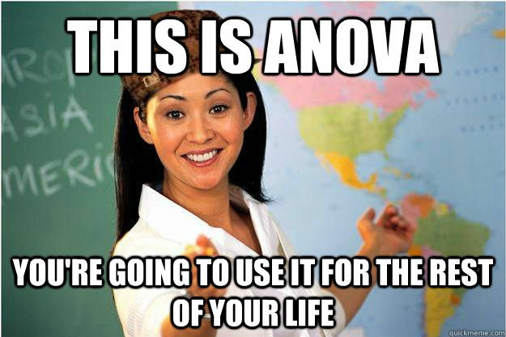
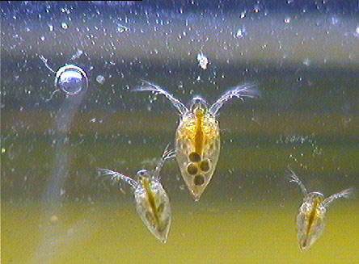
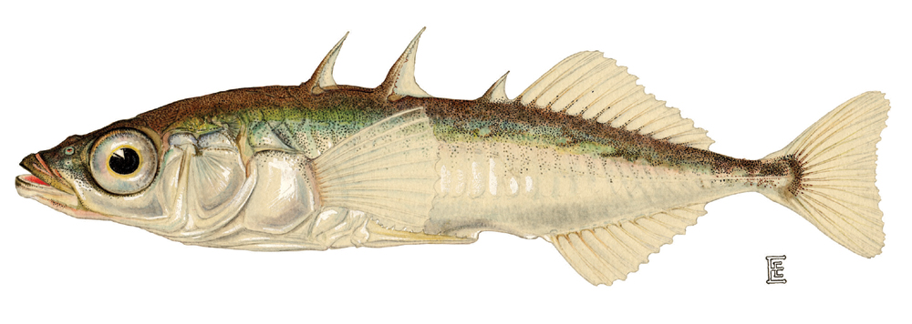
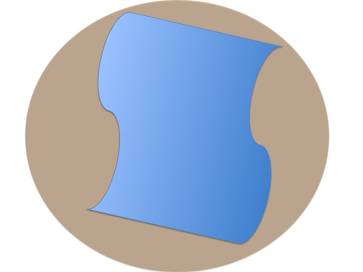
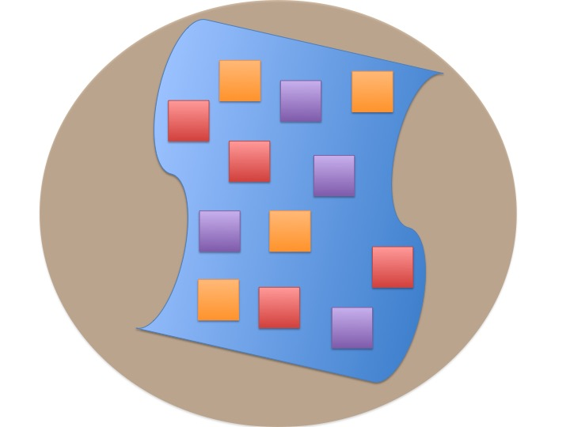
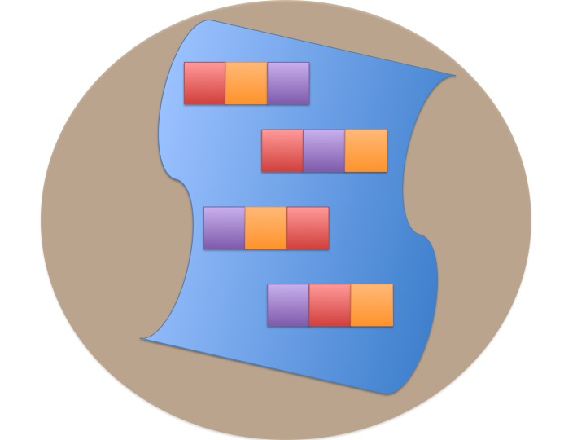

---
title:
output:
  revealjs::revealjs_presentation:
    reveal_options:
      slideNumber: true
      previewLinks: true
    theme: white
    center: false
    transition: fade
    self_contained: false
    lib_dir: libs
    css: style.css
---

## {data-background="images/21/blocked_designs/Slide4.jpg"}
<br>
<!-- review this slide for continuity and some re-ordering in posthocs. That section is a bit of a mess Also Bayes needs more detail. And likelihood tables are ugly. Broom?-->
<h1 style="background-color:white; font-size:68pt">Many Treatments: Multi-Way ANOVA</h1>

```{r prep, echo=FALSE, cache=FALSE, message=FALSE, warning=FALSE}
library(knitr)
opts_chunk$set(fig.height=4.5, comment=NA, 
               warning=FALSE, message=FALSE, 
               dev="jpeg", echo=FALSE)
library(dplyr)
library(tidyr)
library(broom)
library(ggplot2)
library(car)
library(visreg)
library(patchwork)
#library(contrast)
library(emmeans)

```

##
<br><br>
{width="50.00000%"}


## Effects of Stickleback Density on Zooplankton
<br><br>
{width="40.00000%"}
{width="50.00000%"}

## Where Would You Place Replicates?
{width="70.00000%"}

## Randomization
{width="70.00000%"}

<span class="fragment">Costs? Benefits?</span>

## Blocked Design
{width="70.00000%"}  

<span class="fragment">Incorporates Gradient<Br>n=1 per block</span>

## Randomized Controlled Blocked Design
{width="70.00000%"} 

<span class="fragment">Randomization within blocks</span>


## Effects of Stickleback Density on Zooplankton
<br><br>
{width="40.00000%"}
{width="50.00000%"}

Units placed across a lake so that 1 set of each treatment was ’blocked’ together


## Treatment and Block Effects

```{r zooplankton_boxplot}
zoop <- read.csv("./data/21/18e2ZooplanktonDepredation.csv") %>%
  mutate(block = factor(block))
zoop_lm <- lm(zooplankton ~ treatment + block, data=zoop)


par(mfrow=c(1,2))
boxplot(zooplankton ~ treatment, data=zoop, xlab="Treatment", ylab = "Zooplankton Concentration", cex.lab=1.3)
boxplot(zooplankton ~ block, data=zoop, xlab="Block", cex.lab=1.3, ylab = "Zooplankton Concentration")
par(mfrow=c(1,1))
```

## The Steps of Statistical Modeling
1. What is your question?
2. What model of the world matches your question?
3. Build a test
4. Evaluate test assumptions
5. Evaluate test results
6. Visualize


## Multiway ANOVA
>- Many different treatment types  
>     - 2-Way ANOVA is for Treatment and block
>     - 3-Way for, e.g., Sticklebacks, Nutrients, and block
>     - 4-way, etc., all possible  
\
>- Assumes treatments are fully orthogonal  
>        - Each type of treatment type A has all levels of treatment type B
>        - E.g., Each stickleback treatment is present in each block  
\
> - Experiment is **balanced** for **simple effects**  
>      - Simple effect is the unique combination of two or more treatments  
>      - Balance implies the sample size for each treatment combination is the same  

## Model for Multiway ANOVA/ANODEV
\
$$y_{k} = \beta_{0} + \sum \beta_{i}x_{i} + \sum \beta_{j}x_{j} + \epsilon_{k}$$  
\
$$\epsilon_{ijk} \sim N(0, \sigma^{2} ), \qquad x_{i} = 0,1$$ 
\
Or, with matrices...  
\
$$\boldsymbol{Y} = \boldsymbol{\beta X} + \boldsymbol{\epsilon}$$

## Assumptions of Multiway Anova
-   Independence of data points  
  
-   Normality within groups (of residuals)  
  
-   No relationship between fitted and residual values  
  
-   Homoscedasticity (homogeneity of variance) of groups    
  
-   <font color = "red">Additivity of Treatments</font>  

## The Usual Suspects of Assumptions
```{r zoop_assumptions, fig.height=7}
par(mfrow=c(2,2))
plot(zoop_lm, which=c(1,2,5), cex.lab=1.4)
par(mfrow=c(1,1))
```

## Group Residuals
```{r zoop_group_assumptions, fig.height=7}
residualPlots(zoop_lm, cex.lab=1.4, test=FALSE)
```

## Tukey's Test of Non-additivity:
> - Our model is $y_{ij} = \mu + \alpha_i + \beta_j + \epsilon_{ij}$  
\
> - But, if A and B are non-additive, results are incorrect.  
\
> - We don't have the DF with n=1 per treatment combination to calculate an interaction, so...  
\
> - Assume a model of $y_{ij} = \mu + \alpha_i + \beta_j + \lambda\alpha_i\beta_j$  
\
> - We can then test for $SS_{AB}$ using $\lambda\alpha_i\beta_j$  


## Tukey's Test of Non-additivity:
```{r zoop_group_tukey, fig.height=7}
residualPlots(zoop_lm, cex.lab=1.4, plot=FALSE)
```

## Hypotheses for Multiway ANOVA/ANODEV
TreatmentHo: $\mu_{i1} = \mu{i2} = \mu{i3} = ...$\
\
\
Block Ho: $\mu_{j1} = \mu{j2} = \mu{j3} = ...$
\
\
i.e., The variane due to each treatment type is no different than noise


## We Decompose Sums of Squares for Multiway ANOVA

$SS_{Total} = SS_{Between A} + SS_{Between B} + SS_{Within}$

- Factors are Orthogonal and Balanced, so, Model SS can be split\
\
-   F-Test using Mean Squares as Before

## F-Test
```{r zanova}
knitr::kable(broom::tidy(anova(zoop_lm)), digits = 3)
```


## How to evaluate effects of each treatment
1. Examine means estimates  
\
2. Evaluate treatment after parcelling out effect of other treatment  
\
3. Evaluate treatment at the median or mean level of other treatment

## Evaluating Treatment Effects
```{r coefTab}
knitr::kable(tidy(update(zoop_lm, .~.- 1)))
```

## Parcelling Out Second Treatment
```{r visualize_treatments}
crPlots(zoop_lm)
```

Component-Residual Plots take examine unique effect of one treatment after removing influence of the other.

## Median Value of Second Treatment
```{r visreg}
visreg(zoop_lm, "treatment", gg=TRUE) + visreg::visreg(zoop_lm, "block", gg=TRUE)
```

## Comparison of Differences at Average of Other Treatment
```{r lsmeans}
contrast( emmeans(zoop_lm, "treatment"), "tukey", adjust="tukey") %>%
  kable(digits = 3)
```


## What if my design is unbalanced?
<p align="left">Uh oh... a cat ate my treatment!  
\
<span class="fragment">**This is a big problem**</span>  
\
<span class="fragment">Sums of Squares are not 'unbalanced' - more information goes into one than the other</span>  
\
<span class="fragment"> Suddenly, order matters...</p>

## Entering Treatment First
```{r zoop_off}
zoop_off <- zoop[-1,]
zoop_off_lm <- lm(zooplankton ~ treatment+block, data=zoop_off)
zoop_off_lm_2 <- lm(zooplankton ~ block+treatment, data=zoop_off)

cat("zooplankton ~ treatment + block\n")
knitr::kable(anova(zoop_off_lm), digits=3)

cat("zooplankton ~ block + treatment\n")
knitr::kable(anova(zoop_off_lm_2), digits=3)
```

## What’s Going On: Type I and II Sums of Squares

<div style="text-align:left">
**Type I Sums of Squares:**  
<span class="fragment">&nbsp; &nbsp; SS for A calculated from a model with A + Intercept versus just Intercept</span>  
\
<span class="fragment">&nbsp; &nbsp; SS for B calculated from a model with A + B + Intercept versus A + Intercept</span>  
\
\
<span class="fragment">This is **fine** for a balanced design. Variation evenly partitioned.</span>  
</div>

## What’s Going On: Type I and II Sums of Squares

<p align="left">
**Type II Sums of Squares:**  
<span class="fragment">&nbsp; &nbsp; SS for A calculated from a model with A + B +  Intercept versus B + Intercept</span>  
\
<span class="fragment">&nbsp; &nbsp; SS for B calculated from a model with A + B + Intercept versus A + Intercept</span>  
\
\
<span class="fragment">Each SS is the unique contribution of a treatment</span>  
<span class="fragment">If the design is balanced, no different than type I</span>  
</p>

## What’s Going On: Type I and II Sums of Squares

<h4>  

  ------------ ------------ ------------
                  Type I      Type II    
   Test for A     A v. 1     A + B v. B <br><br>  
   Test for B   A + B v. A   A + B v. A <br><br> 
  ------------ ------------ ------------
  
</h4>
\
  Sequential SS v. Marginal SS
  
## Type II SS to the Rescue
```{r Anova}
knitr::kable(Anova(zoop_off_lm), digits=3)
```

<div class="fragment">
Compare to zooplankton ~ treatment + block:
```{r}
knitr::kable(anova(zoop_off_lm), digits=3)
```

</div>

## Type II SS to the Rescue
```{r Anova}
```

Compare to zooplankton ~ block + treatment:
```{r}
knitr::kable(anova(zoop_off_lm_2), digits=3)
```

## Non-Least Squares Approaches
```{r mods, echo=TRUE}
#Likelihood
zoop_glm <- glm(zooplankton ~ treatment + block,
                family = gaussian(link = "identity"),
                data=zoop)

#Bayes
library(brms)
zoom_brms <- brm(zooplankton ~ treatment + block, 
                 family = gaussian(link = "identity"),
                 data=zoop,
                 file = "zoop_brms")
```


## Variance Paritioning Gets More Interesting!
```{r bayes_banova}
library(tidybayes)
add_residual_draws <- function(mod){
  add_predicted_draws(mod, newdata = mod$data) %>%
    ungroup() %>%
    mutate(.residual = .prediction - .[[1]]) %>%
    select(-.prediction)
  
}


zoop_coefs <- as_tibble(zoom_brms)
zoop_residuals <- add_residual_draws(zoom_brms)

finite_pop_sd_tibble <- tibble(
 treatment_sd = zoop_coefs %>% select(contains("treatment")) %>% mutate(zeros = 0) %>% rowwise %>% apply(1, sd),
  block_sd = zoop_coefs %>% select(contains("block")) %>% mutate(zeros = 0)  %>% rowwise %>% apply(1, sd),
  residual_sd = zoop_residuals %>% group_by(.draw) %>% summarize(.sd = sd(.residual)) %>% pull
)


ggplot(finite_pop_sd_tibble %>% gather(type, .sd) %>%
         mutate(type = forcats::fct_relevel(factor(type), "residual_sd", "block_sd", "treatment_sd")),
       aes(y = type, x = .sd)) +
  geom_halfeyeh() +
  theme_bw(base_size = 17)

```

## Beyond 2-Way ANOVA
<p align="left">Latin Squares Design</p>

{width="70.00000%"}

<span class="fragment">Accomodates multiple gradients</span>


## Latin Squares

            Col 1      Col 2     Col 3    Col 4
 --------- --------- --------- --------- ---------
  Row 1    A         B         C         D
  Row 2    B         C         D         A
  Row 3    C         D         A         B
  Row 4    D         A         B         C

\
\
 Every row and column contains one replicate of a treatment.\
 Can be generalized to n gradients
<span class="fragment">
$$y_{ijkl} = \beta_{0} + \sum \beta_{i}x_{i} + \sum \beta_{j}x_{j} + \sum \beta_{k}x_{k} +\epsilon_{ijkl}$$  
\
$$\epsilon_{ijk} \sim N(0, \sigma^{2} ), \qquad x_{i} = 0,1$$ 
</span>

## Many Treatments
{width="70.00000%"}

