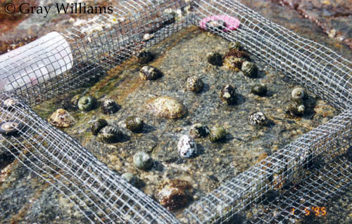
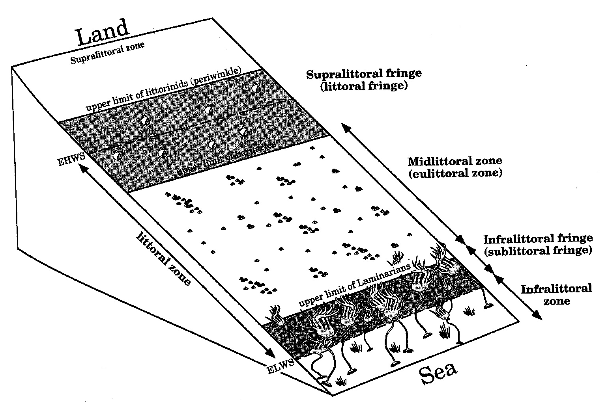
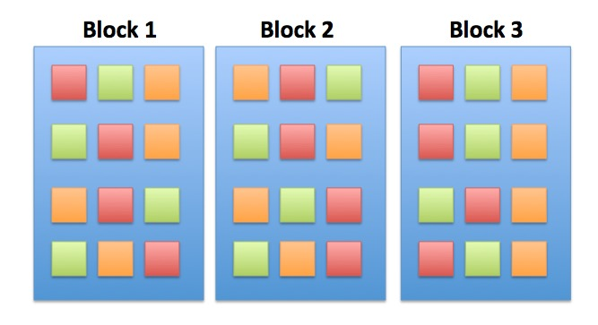
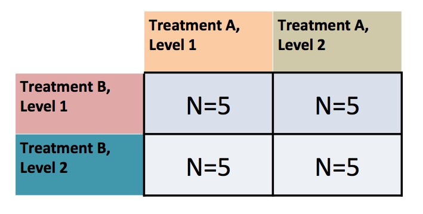
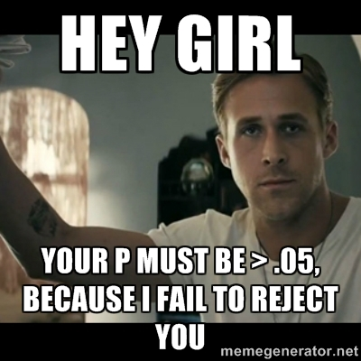
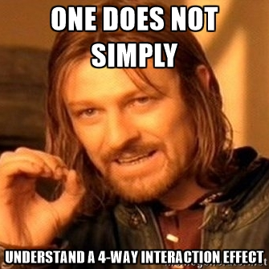

---
title:
output:
  revealjs::revealjs_presentation:
    reveal_options:
      slideNumber: true
      previewLinks: true
    theme: white
    center: false
    transition: fade
    self_contained: false
    lib_dir: libs
    css: style.css
---

## Factorial Designs & Interaction Effects
<!-- make a better cover slide -->

```{r prep, echo=FALSE, cache=FALSE, message=FALSE, warning=FALSE}
library(knitr)
opts_chunk$set(fig.height=4.5, comment=NA, 
               warning=FALSE, message=FALSE, 
               dev="jpeg", echo=FALSE)
#read_chunk("./22_factorial_anova.R")

library(dplyr)
library(tidyr)
library(broom)
library(ggplot2)
library(car)
library(lsmeans)

```

```{r plot_algae}
algae <- read.csv("./data/22/18e3IntertidalAlgae.csv")

algae_plot <- qplot(height, sqrtarea,  data=algae, geom="boxplot", fill=herbivores) + theme_bw(base_size=16)
algae_plot
```


```{r lecture22prep}
```

## Outline
1. Factorial ANOVA  
\
2. Posthocs  
\
3. Unbalanced Designs  

## Is the world additive?

> -   Until now, we have assumed factors combine additively\
\
> -   BUT - what if the effect of one factor depends on another?\
\
> -   This is an **INTERACTION** and is quite common\
\
> -   Yet, challenging to think about, and visualize


## Intertidal Grazing!

{width="70.00000%"}\
Do grazers reduce algal cover in the intertidal?


## Experiment Replicated on Two Ends of a gradient

{width="70.00000%"}\
What happens if you fit this data using \* instead of + in the linear model?

## The Data
```{r plot_algae}
```

## Humdrum Linear Model

<h3 style="text-align:left">sqrtarea ~ height + herbivores</h3>

```{r graze_linear}
algae <- read.csv("./data/22/18e3IntertidalAlgae.csv")
graze_linear <- lm(sqrtarea ~ height + herbivores, data=algae)
knitr::kable(Anova(graze_linear))
```

## Residuals Look Weird
```{r graze_assumptions, fig.height=7}
par(mfrow=c(2,2))
plot(graze_linear, which=c(1,2,5), cex.lab=1.4)
par(mfrow=c(1,1))
```

## Group Residuals Look Odd
```{r zoop_group_assumptions, fig.height=7}
residualPlots(graze_linear, cex.lab=1.4, test=FALSE)
```

## Pattern in Fitted v. Residuals

```{r graze_linear_diagnostics}
residualPlot(graze_linear, variable="fitted", type="response")

```


## Nonlinearity seen in the Tukey Test!

```{r graze_linear_tukey}
knitr::kable(residualPlots(graze_linear, plot=F))
``` 

(Note: This test is typically used when there is no replication within blocks)


## Factorial Blocked Experiment

{width="80.00000%"}\


## Factorial Design

{width="80.00000%"}\
Note: You can have as many treatment types as you want (and then 3-way,
4-way, etc. interactions)


## Problem: Categorical Predictors are Not Additive!

```{r plot_algae}
``` 

You can only see this if you have replication of treatments (grazing) within blocks (tide height)

## The Model For a Factorial ANOVA/ANODEV
$$y_{ijk} = \beta_{0} + \sum \beta_{i}x_{i} + \sum \beta_{j}x_{j} + \sum \beta_{ij}x_{ij} + \epsilon_{ijk}$$  
\
$$\epsilon_{ijk} \sim N(0, \sigma^{2} ), \qquad x_{i} = 0,1$$ 

\

> - Note the new last term  
\
> - Deviation due to treatment combination  

## The General Linear Model

$$\boldsymbol{Y} = \boldsymbol{\beta X} + \boldsymbol{\epsilon}$$

> -   $\boldsymbol X$ can have Nonlinear predictors  
\
> -   e.g., It can encompass A, B, and A\*B


## How do you Fit an Interaction Effect?

```{r graze_interaction, echo=TRUE}
graze_int <- lm(sqrtarea ~ height + herbivores + herbivores:height, 
                data=algae)
```
\
\
<div class="fragment">
```{r graze_interaction2, echo=TRUE}
graze_int <- lm(sqrtarea ~ height*herbivores, data=algae)
```
</div>


## No More Pattern in Fitted v. Residuals

```{r graze_int_resplot}
residualPlot(graze_int, variable="fitted", type="response")
```


## Other Assumptions are Met
```{r graze_assumptions_int, fig.height=7}
par(mfrow=c(2,2))
plot(graze_int, which=c(1,2,5), cex.lab=1.4)
par(mfrow=c(1,1))
```


## F-Tests for Interactions

$SS_{Total} = SS_{A} + SS_{B} + SS_{AB} +SS_{Error}$\
\
$SS_{AB} = n\sum_{i}\sum_{j}(\bar{Y_{ij}} - \bar{Y_{i}}- \bar{Y_{j}} - \bar{Y})^{2}$,
df=(i-1)(j-1)\
\
\
<div class="fragment">
MS = SS/DF, e.g, $MS_{W} = \frac{SS_{W}}{n-k}$\
\

$F = \frac{MS_{AB}}{MS_{Error}}$ with DF=(j-1)(k-1),n - 1 - (i-1) -
(j-1) - (i-1)(j-1)\
</div>


## ANOVA shows an Interaction Effect

```{r graze_interaction_anova}
knitr::kable(Anova(graze_int))
```


## What does the Interaction Coefficient Mean?

```{r graze_interaction_coefs}
```

## What does the Interaction Coefficient Mean?

```{r algae_plot}
knitr::kable(summary(update(graze_int, .~.-1))$coefficients)
```

## Outline
1. Factorial ANOVA  
\
2. <font color="red">Posthocs</font>  
\
3. Unbalanced Designs  

## Post-hoc Tests!
{width="70.00000%"}

## Posthocs and Factorial Designs

-   Must look at simple effects first

    -   The effects of individual treatment combinations

    \
    \

-   Main effects describe effects of one variable in the complete
    absence of the other

    -   Useful only if one treatment CAN be absent


## Posthoc Comparisons Within Blocks

```{r graze_posthoc_trt, warning=TRUE, messages=TRUE}
contrast( lsmeans(graze_int, "herbivores"), "tukey", adjust="none")
```

## Posthoc Comparisons of Blocks

```{r graze_posthoc_block, warning=TRUE, messages=TRUE}
contrast( lsmeans(graze_int, "height"), "tukey", adjust="none")
```


## Posthoc with Simple Effects Model

```{r graze_posthoc}
contrast( lsmeans(graze_int, c("height", "herbivores")), "tukey", adjust="none")
```


## Posthoc with Simple Effects Model

```{r graze_posthoc_plot}
plot(contrast( lsmeans(graze_int, c("height", "herbivores")), "tukey", adjust="none"), cex.lab=1,2, cex.axis=1.3, cex=1.2)
```

## Outline
1. Factorial ANOVA  
\
2. Posthocs  
\
3. <font color="red">Unbalanced Designs</font>  

## Oh no! I lost a replicate (or two)
\
\
\
```{r graze_unbalance, echo=TRUE}
algae_unbalanced <- algae[-c(1:5), ]
```


```{r}
graze_int_unbalanced <- lm(sqrtarea ~ height*herbivores, 
                           data=algae_unbalanced)
```


## Type of Sums of Squares Matters

Type I
```{r graze_unbalance_anova1}
knitr::kable(anova(graze_int_unbalanced))
```
  
\
Type II
```{r graze_unbalance_anova2}
knitr::kable(Anova(graze_int_unbalanced))
```


## Enter Type III

```{r graze_unbalance_anova23}
knitr::kable(Anova(graze_int_unbalanced, type="III"))
```
  
\
<div class="fragment">
Compare to type II
```{r graze_unbalance_anova2}
```

</div>

## What’s Going On: Type I, II, and III Sums of Squares
<p align="left">
**Type I Sums of Squares:**  
<span class="fragment">&nbsp; &nbsp; SS for A calculated from a model with A + Intercept versus just Intercept</span>  
\
<span class="fragment">&nbsp; &nbsp; SS for B calculated from a model with A + B + Intercept versus A + Intercept</span>  
\
<span class="fragment">&nbsp; &nbsp; SS for A:B calculated from a model with A + B + A:B +Intercept versus A + B + Intercept</span>  
\
\
<span class="fragment">This is **fine** for a balanced design. Variation evenly partitioned.</span>  
</p>

## What’s Going On: Type I, II, and III Sums of Squares

<p align="left">
**Type II Sums of Squares:**  
<span class="fragment">&nbsp; &nbsp; SS for A calculated from a model with A + B +  Intercept versus B + Intercept</span>  
\
<span class="fragment">&nbsp; &nbsp; SS for B calculated from a model with A + B + Intercept versus A + Intercept</span>  
\
<span class="fragment">&nbsp; &nbsp; SS for A:B calculated from a model with A + B + A:B +Intercept versus A + B + Intercept</span>  
\
\
<span class="fragment">Interaction not incorporated in assessing main effects</span>  
</p>

## What’s Going On: Type I, II, and III Sums of Squares

<p align="left">
**Type III Sums of Squares:**  
<span class="fragment">&nbsp; &nbsp; SS for A calculated from a model with A + B + A:B + Intercept versus B + A:B + Intercept</span>  
\
<span class="fragment">&nbsp; &nbsp; SS for B calculated from a model with A + B + A:B + Intercept versus A + A:B + Intercept</span>  
\
<span class="fragment">&nbsp; &nbsp; SS for A:B calculated from a model with A + B + A:B +Intercept versus A + B + Intercept</span>  
\
<span class="fragment">Each SS is the unique contribution of a treatment</span>  
<span class="fragment">**very conservative**</span>  
</p>


## Which SS to Use?
> -   Traditionally, urged to use Type III  
\
> -   What do type III models mean?  
>       -   A + B + A:B v. B + A:B  
\
> -   Interactions the same for all, and if A:B is real, main effects not
    important  
\
> -   Type III has lower power for main effects  
\
> -   Type II produces more meaningful results if main effects are a concern - which they are!


## Many Treatments
{width="60.00000%"}

