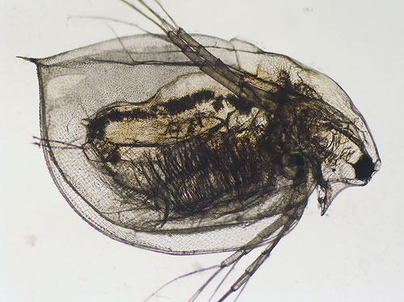
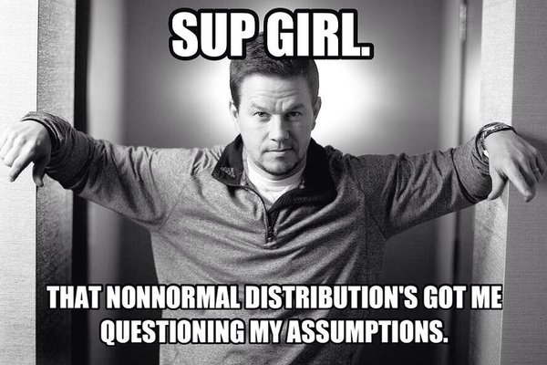

---
title:
output:
  revealjs::revealjs_presentation:
    reveal_options:
      slideNumber: true
      previewLinks: true
    theme: white
    center: false
    transition: fade
    self_contained: false
    lib_dir: libs
    css: style.css
---

##

{width="40.00000%"}\

<h3>Nonlinear Regression and Genearlized Linear Models</h3>


```{r prep, echo=FALSE, cache=FALSE, message=FALSE, warning=FALSE}
library(knitr)
opts_chunk$set(fig.height=4.5, comment=NA, 
               warning=FALSE, message=FALSE, 
               dev="jpeg", echo=FALSE)
library(dplyr)
library(tidyr)
library(broom)
library(ggplot2)
library(car)
library(DHARMa)
```
## Going the Distance

1. Nonlinear Models with Normal Error  
\
2. Generalized Linear Models  
      - Assessing Error Assumptions  
\
3. Poisson Regression  
\
4. Logistic Regression


## The General Linear Model

$$\Large \boldsymbol{Y} = \boldsymbol{\beta X} + \boldsymbol{\epsilon}$$  
\
<div style="text-align:left">
- We have seen this model can accomodate interaction (products)  
\
- X can also have other nonlinear terms  
\
- The key is that nonlinear terms have coefficients and add up  
>         - "Linear" data generating process
\
- ML, Bayes, and Algorithmic Least Squares can all fit these models
</div>

## Daphnia Parasites

```{r load_daphnia}
daphnia <- read.csv("./data/25/17q22DaphniaParasiteLongevity.csv")
```

## Daphnia Parasites
```{r daph_plot}
daph_plot <- ggplot(daphnia, 
                    aes(x=longevity, y=Spores)) +
  geom_point(size=2) +
  theme_bw(base_size=17)

daph_plot
```


## Does this looks right?
```{r daph_plot_line}
daph_plot +
  stat_smooth(method="lm")
```

## What do you do when you don’t have a line?
1. Pray
2. If nonlinear terms are additive fit with OLS  
3. Transform? But think about what it will do to error. 
3. Nonlinear Least Squares  
4. Generalized Linear Models  

## But Model Assessment is Wonky
```{r daph_qq}
daph_lm <- lm(Spores ~ longevity, data=daphnia)
par(mfrow=c(1,2))
plot(daph_lm, which=c(1,2))
par(mfrow=c(1,1))
```

## What is our Data Generating Process?
```{r daph_plot}
```


## The General Linear Model

$$\Large \boldsymbol{Y} = \boldsymbol{\beta X} + \boldsymbol{\epsilon}$$  
\
**Why not have Spores = Longevity + Longevity<sup>2</sup>**  
\
```{r daph_sq}
daph_sq <- lm(Spores ~ longevity + I(longevity^2), data=daphnia)
```

## Those Posthocs are All Right?
```{r daph_qq_sq}
par(mfrow=c(1,2))
plot(daph_sq, which=c(1,2))
par(mfrow=c(1,1))
```

## Squared?
```{r daph_plot_sq}
daph_plot +
  stat_smooth(method="lm", formula=y ~ x + I(x^2))
```

## Going the Distance

1. Nonlinear Models with Normal Error  
\
2. Generalized Linear Models  
      - Assessing Error Assumptions  
\
3. Poisson Regression  
\
4. Logistic Regression

## What if the relationship isn't additive?
```{r metabolism}
metabolism <- read.csv("./data/25/17q16PrimateMassMetabolicRate.csv")
meta_plot <- ggplot(metabolism, mapping=aes(x=mass.g, y=bmr.watts)) +
  geom_point(size=2) +
  theme_bw(base_size=17)

meta_plot
```

Metabolic Rate = a ∗ mass<sup>b</sup>

##Transformations
- log(y): exponential
- log(y) and log(x): power function
- arcsin(sqrt(y)): bounded data
- logit(y): for bounded data (more well behaved)   
- Box-Cox Transform  
\
<span class="fragment">May have to add 0.01, 0.5, or 1 in cases with 0s </span>\
\
<span class="fragment">You must ask, what do the transformed variables mean?</span>

## Log-Log Fit
```{r meta_nonlinear_plot}
meta_plot +
  scale_x_continuous(trans="log") +
  scale_y_continuous(trans="log") +
  xlab("Log Mass.g") +
  ylab("log bmr.watts") +
  stat_smooth(method="lm")
```

log(Metabolic Rate) = a + b*log(mass) + error

## Careful About Error Structure
log(MetabolicRate) = log(a) + b ∗ log(mass) + error implies \
\
$$Metabolic Rate = a ∗ mass^b ∗ error$$
\
but we often want\
\
$$Metabolic Rate = a ∗ mass^b + error$$

## Many Ways to Fit
```{r nls, eval=FALSE, echo=TRUE} 
primate.nls <- nls(bmr.watts ~ a*mass.g^b,
                    data=metabolism, 
                    start=list(a = 0.0172858, b = 0.74160))
```


```{r bbmle, eval=FALSE, echo=TRUE} 
primate.mle <- mle2(bmr.watts ~ dnorm(a*mass.g^b, sigma),
                    data=metabolism, 
                    start=list(a = 0.0172858, b = 0.74160, sigma=5))
```

\
<span class="fragment">But this may not solve the problem as...</span>

## But Not All Error Generating Processes Are Normal
\
\


## The General Linear Model is a Special Case

$$\Large \boldsymbol{Y} = \boldsymbol{\beta X} + \boldsymbol{\epsilon}$$  
\
Implies that:
$$\boldsymbol{\hat{Y}} = \boldsymbol{\beta X}$$ 
\
and
\
$$\boldsymbol{Y} \sim N(\boldsymbol{\hat{Y}})$$
\
<span class="fragment">But what if We don't want a Normal Distribution?

## The Generalized Linear Model
$$\boldsymbol{\eta} = \boldsymbol{\beta X}$$ 
\
$$f(\boldsymbol{\hat{Y}}) = \boldsymbol{\eta}$$ \
\
f(y) is called the **link** function  
\
$$\boldsymbol{Y} = E(\boldsymbol{\hat{Y}}, \theta)$$ 
\
E is any distribution from the Exponential Family\
$\theta$ is an error parameter, and can be a function of Y


## Generalized Linear Models: Link Functions

Basic Premise:

1.  <span>We have a linear predictor, $\eta_i = a+Bx$</span>\
    \

2.  That predictor is linked to the fitted value of $Y_i$, $\mu_i$\
    \

3.  We call this a link function, such that $g(\mu_i) = \eta_i$\

    -   For example, for a linear function, $\mu_i = \eta_i$\

    -   For an exponential function, $log(\mu_i) = \eta_i$


## Some Common Links

-   Identity: $\mu = \eta $ - e.g. $\mu = a + bx$

-   Log: $log(\mu) = \eta $ - e.g. $\mu = e^{a + bx}$

-   Logit: $logit(\mu) = \eta $ - e.g.
    $\mu = \frac{e^{a + bx}}{1+e^{a + bx}}$

-   Inverse: $\frac{1}{\mu} = \eta $ - e.g. $\mu = (a + bx)^{-1}$


## Generalized Linear Models: Error

Basic Premise:

1.  <span>The error distribution is from the <span>*exponential*</span>
    family</span>

    -   e.g., Normal, Poisson, Binomial, and more.

    \
    \

2.  For these distributions, the variance is a funciton of the fitted
    value on the curve: $var(Y_i) = \theta V(\mu_i)$

    -   For a normal distribution, $var(\mu_i) = \theta*1$ as
        $V(\mu_i)=1$\

    -   For a poisson distribution, $var(\mu_i) = 1*\mu_i$ as
        $V(\mu_i)=\mu_i$


## Distributions, Canonical Links, and Dispersion

|Distribution | Canonical Link | Variance Function|
|-------------|-------------|-------------|
|Normal | identity | $\theta$|
|Poisson | log | $\mu$|
|Quasipoisson | log | $\mu\theta$|
|Binomial | logit | $\mu(1-\mu)$|
|Quasibinomial | logit | $\mu(1-\mu)\theta$|
|Negative Binomial | log | $\mu + \kappa\mu^2$|
|Gamma | inverse | $\mu^2$|
|Inverse Normal | $1/\mu^2$ | $\mu^3$|


## Distributions and Other Links
|Distribution |Links|
|--------------|------|
|Normal | identity, log, inverse|
|Poisson | log, identity, sqrt|
|Quasipoisson | log, identity, sqrt|
|Binomial | logit, probit, cauchit, log, log-log|
|Quasibinomial | logit, probit, cauchit, log, log-log|
|Negative Binomial | log, identity, sqrt|
|Gamma | inverse, identity, log|
|Inverse Normal | $1/\mu^2$, inverse, identity, log|

## General -> Generalized Linear Model
$$\boldsymbol{\eta} = \boldsymbol{\beta X}$$ 
\
$$\boldsymbol{\hat{Y}} = \boldsymbol{\eta}$$ \
\
identity **link** function  
\
$$\boldsymbol{Y} \sim N(\boldsymbol{\hat{Y}}, \theta)$$ 
$\theta$ is the SD

## Going the Distance

1. Nonlinear Models with Normal Error  
\
2. Generalized Linear Models  
      - Assessing Error Assumptions  
\
3. Poisson Regression  
\
4. Logistic Regression

## Poisson Regression with a Log Link
$$\boldsymbol{\eta} = \boldsymbol{\beta X}$$ 
\
$$log(\boldsymbol{\hat{Y}}) = \boldsymbol{\eta}$$ \
log(y) translates to an exponential function\
\
$$\boldsymbol{Y} \sim P(\boldsymbol{\hat{Y}})$$ 
$\theta$ is $\hat{y}$

## What is the relationship between kelp holdfast size and number of fronds?


## What About Kelp Holdfasts?
```{r kelp}
kelp <- read.csv("data/25/kelp_holdfast.csv")

kelp_plot <- qplot(HLD_DIAM, FRONDS, data=kelp) +
  theme_bw(base_size=17) +
  geom_point(size=2)
kelp_plot
```

## How 'bout dem residuals?
```{r fit_kelp, echo=TRUE}
kelp_lm <- lm(FRONDS ~ HLD_DIAM, data=kelp)
```

```{r plot_lelp}
plot(kelp_lm, which=2)
```

## What is our data and error generating process?
```{r kelp}
```

## What is our data and error generating process?
> - Data generating process should be exponential
>       - No values less than 1  
\
> - Error generating process should be Poisson
>       - Count data

## What is our data and error generating process?
\
\
```{r kelp glm, echo=TRUE}
kelp_glm <- glm(FRONDS ~ HLD_DIAM, data=kelp,
                family=poisson(link="log"))
```

## But how do we assess assumptions?
> - Should still be no fitted v. residual relationship  
\
> - But QQ plots lose meaning
>     - Not a normal distribution
>     - Mean scales with variance  
\
> - Also many types of residuals
>     - Deviance, Pearson, raw, etc.

## Randomized quantile residuals
> - If model fits well, quantiles of residuals should be uniformly distributed  
\
> - I.E., for any point, if we had its distribution, there should be no bias in its quantile  
\
> - We do this via simulation  
\
> - Works for **many** models, and naturally via Bayesian simuation

## Randomized quantile residuals: Steps
1. Get 250 (or more!) simulations of model coefficients \
\
2. For each response (y) value, create an empirical distribution from the simuations\
\
3. For each response, determine it's quantile from that empirical distribution\
\
4. The quantiles of all y values should be uniformly distributed
      - QQ plot of a uniform distribution!\

## Randomized quantile residuals: Visualize
```{r rqr}
library(ggplot2)
z <- data.frame(vals=rpois(250, 20))
zdist <- ecdf(z$vals)

zplot <- ggplot() +
  geom_histogram(data=z, mapping=aes(vals, ..density..), bins=40) + 
  theme_bw(base_size=17) +
  ylab("Density\n(point or cummulative)")+
  xlim(c(0,35))

zplot
```

## Randomized quantile residuals: Visualize
```{r rqr1}
z <- data.frame(vals=rpois(250, 20))
zdist <- ecdf(z$vals)

zplot <- zplot + 
  stat_ecdf(data=z, mapping=aes(vals)) 

zplot
```

## Randomized quantile residuals: Visualize
```{r rqr2}
v <- data.frame(x=25, y=0, quant = zdist(25))
zplot <- zplot + 
  geom_point(data = v, color = "red",size = 5, mapping=aes(x=x, y=y))
zplot
```


## Randomized quantile residuals: Visualize
```{r rqr3}
zplot <- zplot + 
  geom_segment(data=v, color="red", lty=2, mapping=aes(x=x, y=y, xend=x, yend=quant)) +
  geom_point(data = v, color = "red",size = 5, mapping=aes(x=x, y=quant))
zplot
```

## Randomized quantile residuals: Visualize
```{r rqr4}
zplot <- zplot + 
  geom_segment(data=v, color="red", lty=2, mapping=aes(x=x, y=quant, xend=0, yend=quant))+
  geom_point(data = v, color = "red",size = 5, mapping=aes(x=0, y=quant)) 
zplot
```
 
## Quantile Residuals for Kelp GLM
```{r kelp_resid_dharma, echo=TRUE}
library(DHARMa)
simulationOutput <- simulateResiduals(kelp_glm, 
                                      n = 250)
plot(simulationOutput)
```


## Kelp GLM Results
LR Test
```{r kelp_aov}
knitr::kable(Anova(kelp_glm), digits=5)
```

\
Coefficients:
```{r kelp_summary}
knitr::kable(broom::tidy(kelp_glm))
```

## Kelp GLM Results
```{r kelpplot, eval=FALSE, echo=TRUE}
kelp_plot +
  stat_smooth(method="glm", 
              method.args=list(family=poisson(link="log")))
```

## Kelp GLM Results
```{r kelpplot2}
kelp_plot +
  stat_smooth(method="glm", 
              method.args=list(family=poisson(link="log")))
```

## Going the Distance

1. Nonlinear Models with Normal Error  
\
2. Generalized Linear Models  
      - Assessing Error Assumptions  
\
3. Poisson Regression  
\
4. Logistic Regression

## What about Binary Responses? {data-background="./images/25/cryptosporidiosis-cryptosporidium-hominis.jpeg"}

## {data-background="./images/25/mouseinject.jpg"}

## Cryptosporidum Infection Rates
```{r crypto_data}
crypto <- read.csv("data/25/cryptoDATA.csv") %>%
  mutate(success=Y/N)
```

```{r crypto_plot}

cryptoPlot <- qplot(Dose, Y/N, data=crypto) +
  theme_bw(base_size=16) +
  ylab("Fraction of Mice Infected")
cryptoPlot
```


## Binomial Distribution
$$ Y_i \sim B(prob, size) $$

> * Discrete Distribution
> * prob = probability of something happening
> * size = # of discrete trials
> * Used for frequency or probability data
> * We estimate coefficients that influence prob

## Logit Link
```{r crypto_logit}
cryptoPlot+
  stat_smooth(method="glm", aes(weight=N), 
              method.args=list(family=binomial()),  col="red", lwd=2) 

```

## Generalized Linear Model with Logit Link
```{r glm_crypto, echo=TRUE}
crypto_glm <- glm(Y/N ~ Dose,
                  weight=N,
                  family=binomial(link="logit"),
                  data=crypto)
```

OR, with Success and Failures

```{r glm_crypto2, echo=TRUE, eval=FALSE}
crypto_glm <- glm(cbind(Y, Y-N) ~ Dose,
                  family=binomial(link="logit"),
                  data=crypto)
```

## Quantile Residuals
```{r quant_crypto}
simulationOutput_crypto <- simulateResiduals(crypto_glm, 
                                      n = 250)
plot(simulationOutput_crypto)
```

<span class="fragment">Possible overdispersion, use quasibinomial</span>

## Outputs
```{r crypto_out}
knitr::kable(Anova(crypto_glm))
```

And logit coefficients
```{r crypto_out2}
knitr::kable(broom::tidy(crypto_glm))
```


## The Odds

$$Odds  = \frac{p}{1-p}$$\
\
<div class="fragment">
$$Log-Odds = Log\frac{p}{1-p} = logit(p)$$
</div>


## The Meaning of a Logit Coefficient

Logit Coefficient: A 1 unit increase in a predictor = an increase of
$\beta$ increase in the log-odds of the response.  
\
<div class="fragment">
$$\beta = logit(p_2) - logit(p_1)$$
</div><div class="fragment">
$$\beta =  Log\frac{p_1}{1-p_1} -  Log\frac{p_2}{1-p_2}$$
</div>
\
<div class="fragment">
We need to know both p1 and $\beta$ to interpret this.\
</div><div class="fragment">
If p1 = 0.5, $\beta$ = 0.01347, then p2 = 0.503\ </div>
<div class="fragment">
If p1 = 0.7, $\beta$ = 0.01347, then p2 = 0.702\
</div>

## Our Nonlinear and Non-Normal Adventure
> - You MUST think about your data and error generating process  
\
> - For any data generating process, we can build whatever model we'd like  
\
> - BUT, think about the resulting error, and fit accordingly  
\
> - GLMs are but a beginning  
\
> - We can cook up a **lot** of different error structures, and will in the future!

