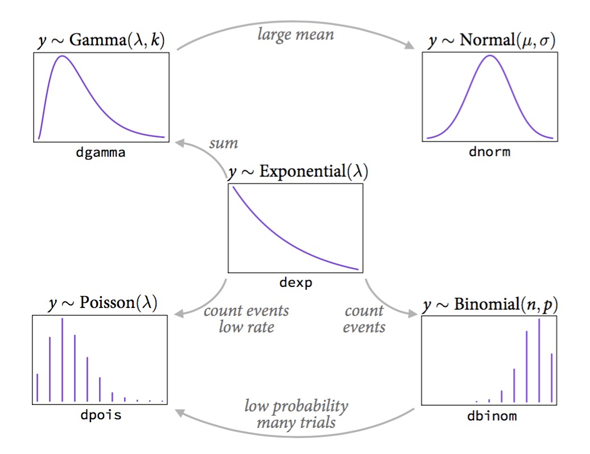

---
title:
output:
  revealjs::revealjs_presentation:
    reveal_options:
      slideNumber: true
      previewLinks: true
    theme: white
    center: false
    transition: fade
    self_contained: false
    lib_dir: libs
    css: style.css
---

##

{width="40.00000%"}\

<h3>Nonlinear Regression and Genearlized Linear Models</h3>


```{r prep, echo=FALSE, cache=FALSE, message=FALSE, warning=FALSE}
library(knitr)
opts_chunk$set(fig.height=4.5, comment=NA, 
               warning=FALSE, message=FALSE, 
               dev="jpeg", echo=FALSE)
library(dplyr)
library(tidyr)
library(broom)
library(ggplot2)
library(car)
library(DHARMa)
library(readr)
theme_set(theme_minimal(base_size = 17))
```
## Going the Distance

1. Nonlinear Models with Normal Error  
      - Nonlinear Terms  
      - Wholly Nonlinear Models  
\
2. Generalized Linear Models  
      - Logistic Regression
      - Assessing Error Assumptions  
\
3. Gamma Regression with Log Links  
\
4. Poisson Regression and Overdispersion


## The General Linear Model

$$\Large \boldsymbol{Y} = \boldsymbol{\beta X} + \boldsymbol{\epsilon}$$  
\
<div style="text-align:left">
- We have seen this model can accomodate interaction (products)  
\
- X can also have other nonlinear terms  
\
- The key is that nonlinear terms have coefficients and add up  
         - "Linear" data generating process
\
- ML, Bayes, and Algorithmic Least Squares can all fit these models
</div>

## Daphnia Parasites

```{r load_daphnia}
daphnia <- read.csv("./data/25/17q22DaphniaParasiteLongevity.csv")
```

## Daphnia Parasites
```{r daph_plot}
daph_plot <- ggplot(daphnia, 
                    aes(x=longevity, y=Spores)) +
  geom_point(size=2) +
  theme_bw(base_size=17)

daph_plot
```


## Does this looks right?
```{r daph_plot_line}
daph_plot +
  stat_smooth(method="lm")
```

## What do you do when you don’t have a line?
1. Pray  
\
2. If nonlinear terms are additive fit with OLS  
\
3. Transform? But think about what it will do to error.  
\
3. Nonlinear Least Squares   
\
4. Generalized Linear Models  

## Is Model Assessment Wonky?
```{r daph_qq}
daph_lm <- lm(Spores ~ longevity, data=daphnia)
par(mfrow=c(1,2))
plot(daph_lm, which=c(1,2))
par(mfrow=c(1,1))
```

## What is our Data Generating Process?
```{r daph_plot}
```


## The General Linear Model

$$\Large \boldsymbol{Y} = \boldsymbol{\beta X} + \boldsymbol{\epsilon}$$  
\
**Why not have Spores = Longevity + Longevity<sup>2</sup>**  
\
```{r daph_sq}
daph_sq <- lm(Spores ~ longevity + I(longevity^2), data=daphnia)
```

## Those Posthocs are All Right?
```{r daph_qq_sq}
par(mfrow=c(1,2))
plot(daph_sq, which=c(1,2))
par(mfrow=c(1,1))
```

## Squared?
```{r daph_plot_sq}
daph_plot +
  stat_smooth(method="lm", formula=y ~ x + I(x^2))
```

## Going the Distance

1. Nonlinear Models with Normal Error  
      - Nonlinear Terms  
      - <font color = "red">Wholly Nonlinear Models</font>  

\
2. Generalized Linear Models  
      - Assessing Error Assumptions  
\
3. Poisson Regression  
\
4. Logistic Regression

## What if the relationship isn't additive?
```{r metabolism}
metabolism <- read.csv("./data/25/17q16PrimateMassMetabolicRate.csv")
meta_plot <- ggplot(metabolism, mapping=aes(x=mass.g, y=bmr.watts)) +
  geom_point(size=2) +
  theme_bw(base_size=17)

meta_plot
```

Metabolic Rate = a ∗ mass<sup>b</sup>

## Transformations
- log(y): exponential  
\
- log(y) and log(x): power function  
\
- arcsin(sqrt(y)): bounded data  
\
- logit(y): for bounded data (more well behaved)   
\
- Box-Cox Transform  
\
<span class="fragment">May have to add 0.01, 0.5, or 1 in cases with 0s </span>\
\
<span class="fragment">You must ask, what do the transformed variables mean?</span>

## Log-Log Fit
```{r meta_nonlinear_plot}
meta_plot +
  scale_x_continuous(trans="log") +
  scale_y_continuous(trans="log") +
  xlab("Log Mass.g") +
  ylab("log bmr.watts") +
  stat_smooth(method="lm")
```

log(Metabolic Rate) = a + b*log(mass) + error

## Careful About Error Structure
<div style="text-align:left">
log(MetabolicRate) = log(a) + b ∗ log(mass) + error implies \
\
$$Metabolic Rate = a ∗ mass^b ∗ error$$
\
but we often want\
\
$$Metabolic Rate = a ∗ mass^b + error$$
</div>

## Nonlinear Least Squares
<div style="text-align:left">
Algorithmically searches to minimize $\sum{(\hat{Y}-Y_i)^2}$
</div>

```{r nls, eval=FALSE, echo=TRUE} 
primate.nls <- nls(bmr.watts ~ a*mass.g^b,
                   
                    data=metabolism, 
                   
                    start=list(a = 0.0172858, 
                               b = 0.74160))
```

## Nonlinear Likelihood

```{r bbmle, eval=FALSE, echo=TRUE} 
library(bbmle)

primate.mle <- mle2(bmr.watts ~ dnorm(a*mass.g^b, sigma),

                    data=metabolism, 
                    
                    start=list(a = 0.0172858, 
                               b = 0.74160, 
                               sigma=5),
                    
                    optimizer = "nlminb",
                    
                    lower=c(sigma=1e-7))
```

\
<span class="fragment">But this may not solve the problem as...</span>

## Not All Error Generating Processes Are Normal
\
\


## Going the Distance

1. Nonlinear Models with Normal Error  
      - Nonlinear Terms  
      - Wholly Nonlinear Models  
\
2. Generalized Linear Models  
      - Logistic Regression
      - Assessing Error Assumptions  
\
3. Gamma Regression with Log Links  
\
4. Poisson Regression and Overdispersion

##  {data-background="./images/25/cryptosporidiosis-cryptosporidium-hominis.jpeg"}
<h2 style="color:white">Infection by Cryptosporidium</h2>

## {data-background="./images/25/mouseinject.jpg"}

## Cryptosporidum Infection Rates
```{r crypto_data}
crypto <- read.csv("data/25/cryptoDATA.csv") %>%
  mutate(success=Y/N)
```

```{r crypto_plot}

cryptoPlot <- qplot(Dose, success, data=crypto) +
  theme_bw(base_size=16) +
  ylab("Fraction of Mice Infected")
cryptoPlot
```

## This is not linear or gaussian

```{r crypto_linear}
cryptoPlot +
  stat_smooth(method="lm")
```

Why?


## The General Linear Model 

$$\Large \boldsymbol{Y} = \boldsymbol{\beta X} + \boldsymbol{\epsilon}$$  
$$\boldsymbol{\epsilon} \sim N(\boldsymbol{0}, \boldsymbol{\sigma})$$

## The General(ized) Linear Model

$$\Large \boldsymbol{\hat{Y}_{i}} = \boldsymbol{\beta X_i} $$ 
\
\
\
\
\
\
$$\Large Y_i \sim \mathcal{N}(\hat{Y_i},\sigma^{2})$$
  
## The General(ized) Linear Model

$$\Large \boldsymbol{\eta_{i}} = \boldsymbol{\beta X_i} $$ 
\
\
$$\Large \hat{Y_i} = \eta_{i}$$
<span class="fragment"><font color="red">Identity Link Function</font></span>
\
\
$$\Large Y_i \sim \mathcal{N}(\hat{Y_i},\sigma^{2})$$
    
## A Generalized Linear Model with a Log Link

$$\Large \boldsymbol{\eta_{i}} = \boldsymbol{\beta X_i} $$ 
\
\
$$\Large Log(\hat{Y_i}) = \eta_{i}$$
<span class="fragment"><font color="red">Log Link Function</font></span>
\
\
$$\Large Y_i \sim \mathcal{N}(\hat{Y_i},\sigma^{2})$$
    
## Log Link
```{r crypto_log}
cryptoPlot +
   stat_smooth(method="glm", 
               method.args=list(family=gaussian(link="log")), formula=y+0.0000001 ~ x)
```

## Isn't this just a transformation?

Aren't we just doing
$$\Large \boldsymbol{log(Y_{i})} = \boldsymbol{\beta X_i} + \boldsymbol{\epsilon_i}$$ 
\
<div class="fragment">NO!</div>
\
<div class="fragment">$$\Large \boldsymbol{Y_{i}} = e^{\boldsymbol{\beta X_i} + \boldsymbol{\epsilon_i}}$$ </div>
\
<div class="fragment">Error is log-normal</div>

## A Generalized Linear Model with a Log Link

$$\Large \boldsymbol{\eta_{i}} = \boldsymbol{\beta X_i} $$ 
\
\
$$\Large Log(\hat{Y_i}) = \eta_{i}$$
\
\
\
$$\Large Y_i \sim \mathcal{N}(\hat{Y_i},\sigma^{2})$$
<span class="fragment"><font color="red">Error is Normal</font></span>
    
## But This is Not Normal
```{r crypto_plot}
```

## The Generalized Linear Model Writ Large
$$\boldsymbol{\eta} = \boldsymbol{\beta X}$$ 
\
$$f(\boldsymbol{\hat{Y}}) = \boldsymbol{\eta}$$ \
\
f(y) is called the **link** function  
\
$$\boldsymbol{Y} = E(\boldsymbol{\hat{Y}}, \theta)$$ 
\
E is any distribution from the Exponential Family\
$\theta$ is an error parameter, and can be a function of Y

## Generalized Linear Models: Error

Basic Premise:

1.  <span>The error distribution is from the <span>*exponential*</span>
    family</span>

    -   e.g., Normal, Poisson, Binomial, and more.

    \
    \

2.  For these distributions, the variance is a funciton of the fitted
    value on the curve: $var(Y_i) = \theta V(\mu_i)$

    -   For a normal distribution, $var(\mu_i) = \theta*1$ as
        $V(\mu_i)=1$\

    -   For a poisson distribution, $var(\mu_i) = 1*\mu_i$ as
        $V(\mu_i)=\mu_i$


## Common Errors from the Exponential Family used in GLMs
Error Generating Proces | Common Use | Typical Data Generating Process Shape|
------------------------|------------|------------------|
Log-Linear              | Error accumulates additively, and then is exponentiated | Exponential|
Binomial                | Frequency, probability data | Logistic |
Poisson                 | Count data | Exponential |
Gamma                   | Waiting times | Inverse or exponential|
    
## The Exponential Family
{width=75%}
<p align="left"><font size=-1>McElreath's Statistical Rethinking</font></p>


## Binomial Distribution
$$ Y_i \sim B(prob, size) $$

> * Discrete Distribution
> * prob = probability of something happening (% Infected)
> * size = # of discrete trials
> * Used for frequency or probability data
> * We estimate coefficients that influence prob

## Generalized Linear Models: Link Functions

Basic Premise:

1.  <span>We have a linear predictor, $\eta_i = a+Bx$</span>\
    \

2.  That predictor is linked to the fitted value of $Y_i$, $\mu_i$\
    \

3.  We call this a link function, such that $g(\mu_i) = \eta_i$\

    -   For example, for a linear function, $\mu_i = \eta_i$\

    -   For an exponential function, $log(\mu_i) = \eta_i$

## Logit Link

<p align="left"><font size=-1>McElreath's Statistical Rethinking</font></p>

## Other Common Links
-   Identity: $\mu = \eta$  
      - e.g. $\mu = a + bx$   
\
-   Log: $log(\mu) = \eta$ 
     - e.g. $\mu = e^{a + bx}$  
\
-   Logit: $logit(\mu) = \eta$ 
    - e.g. $\mu = \frac{e^{a + bx}}{1+e^{a + bx}}$  
\
-   Inverse: $\frac{1}{\mu} = \eta$ 
     - e.g. $\mu = (a + bx)^{-1}$  


## So, Y is a Logistic Curve
\
$$Probability = \frac{1}{1+e^{\beta X}}$$
\
\
<div class="fragment">$$logit(Probability) = \beta X$$</div>

## Generalized Linear Model with a Logit Link

$$\Large \boldsymbol{\eta_{i}} = \boldsymbol{\beta X_i} $$ 
\
\
<span class="fragment">$$\Large Logit(\hat{Y_i}) = \eta_{i}$$</span>
<span class="fragment"><font color="red">Logit Link Function</font></span>
\
\
<span class="fragment">$$\Large Y_i \sim \mathcal{B}(\hat{Y_i}, size)$$<span class="fragment">

## Logitistic Regression
```{r crypto_logit}
cryptoPlot+
  stat_smooth(method="glm", aes(weight=N), 
              method.args=list(family=binomial()),  col="red", lwd=2) 

```

## Generalized Linear Model with Logit Link in R
```{r glm_crypto, echo=TRUE}
crypto_glm <- glm(Y/N ~ Dose,
                  weight=N,
                  family=binomial(link="logit"),
                  data=crypto)
```

OR, with Success and Failures

```{r glm_crypto2, echo=TRUE, eval=FALSE}
crypto_glm <- glm(cbind(Y, Y-N) ~ Dose,
                  family=binomial(link="logit"),
                  data=crypto)
```

## Our two big questions
1. Does our model explain more variation in the data than a null model?
<br><br>
2. Are the parameters different from 0?

## Analysis of Model Results
```{r crypto_out}
knitr::kable(Anova(crypto_glm))
```

\
\


And logit coefficients
```{r crypto_out2}
knitr::kable(broom::tidy(crypto_glm))
```


## The Odds

$$Odds  = \frac{p}{1-p}$$\
\
<div class="fragment">
$$Log-Odds = Log\frac{p}{1-p} = logit(p)$$
</div>


## The Meaning of a Logit Coefficient

Logit Coefficient: A 1 unit increase in a predictor = an increase of
$\beta$ increase in the log-odds of the response.  
\
<div class="fragment">
$$\beta = logit(p_2) - logit(p_1)$$
</div><div class="fragment">
$$\beta =  Log\frac{p_1}{1-p_1} -  Log\frac{p_2}{1-p_2}$$
</div>
\
<div class="fragment">
We need to know both p1 and $\beta$ to interpret this.\
</div><div class="fragment">
If p1 = 0.5, $\beta$ = 0.01347, then p2 = 0.503\ </div>
<div class="fragment">
If p1 = 0.7, $\beta$ = 0.01347, then p2 = 0.702\
</div>


## But What About Assumptions?
> - Should still be no fitted v. residual relationship  
\
> - But QQ plots lose meaning
>     - Not a normal distribution
>     - Mean scales with variance  
\
> - Also many types of residuals
>     - Deviance, Pearson, raw, etc.

## Randomized quantile residuals
> - If model fits well, quantiles of residuals should be uniformly distributed  
\
> - I.E., for any point, if we had its distribution, there should be no bias in its quantile  
\
> - We do this via simulation  
\
> - Works for **many** models, and naturally via Bayesian simuation

## Randomized quantile residuals: Steps
1. Get 1000 (or more!) simulations of model coefficients \
\
2. For each response (y) value, create an empirical distribution from the simuations\
\
3. For each response, determine it's quantile from that empirical distribution\
\
4. The quantiles of all y values should be uniformly distributed
      - QQ plot of a uniform distribution!\

## Randomized quantile residuals: Visualize
```{r rqr}
library(ggplot2)
z <- data.frame(vals=rpois(250, 20))
zdist <- ecdf(z$vals)

zplot <- ggplot() +
  geom_histogram(data=z, mapping=aes(vals, ..density..), bins=40) + 
  theme_bw(base_size=17) +
  ylab("Density\n(point or cummulative)")+
  xlim(c(0,35))

zplot
```

## Randomized quantile residuals: Visualize
```{r rqr1}
z <- data.frame(vals=rpois(250, 20))
zdist <- ecdf(z$vals)

zplot <- zplot + 
  stat_ecdf(data=z, mapping=aes(vals)) 

zplot
```

## Randomized quantile residuals: Visualize
```{r rqr2}
v <- data.frame(x=25, y=0, quant = zdist(25))
zplot <- zplot + 
  geom_point(data = v, color = "red",size = 5, mapping=aes(x=x, y=y))
zplot
```


## Randomized quantile residuals: Visualize
```{r rqr3}
zplot <- zplot + 
  geom_segment(data=v, color="red", lty=2, mapping=aes(x=x, y=y, xend=x, yend=quant)) +
  geom_point(data = v, color = "red",size = 5, mapping=aes(x=x, y=quant))
zplot
```

## Randomized quantile residuals: Visualize
```{r rqr4}
zplot <- zplot + 
  geom_segment(data=v, color="red", lty=2, mapping=aes(x=x, y=quant, xend=0, yend=quant))+
  geom_point(data = v, color = "red",size = 5, mapping=aes(x=0, y=quant)) 
zplot
```
 
## Quantile Residuals for Mouse GLM
```{r crypto_resid_dharma, echo=FALSE}
library(DHARMa)
simulationOutput <- simulateResiduals(crypto_glm, n = 1000)
plotQQunif(simulationOutput)
```

## Are different quantiles of prediction-quantile residual relationship flat?
```{r crypto_resid_quantile, echo=FALSE}
library(DHARMa)
plotResiduals(simulationOutput, quantreg = T)
```

If not - overdispersion - i.e. variance and prediction not scaling well

## Going the Distance

1. Nonlinear Models with Normal Error  
      - Nonlinear Terms  
      - Wholly Nonlinear Models  
\
2. Generalized Linear Models  
      - Logistic Regression
      - Assessing Error Assumptions  
\
3. Gamma Regression with Log Links  
\
4. Poisson Regression and Overdispersion

## Generalized Linear Models Errors
Error Generating Proces | Common Use | Typical Data Generating Process Shape|
------------------------|------------|------------------|
Log-Linear              | Error accumulates additively, and then is exponentiated | Exponential|
Poisson                 | Count data | Exponential |
Binomial                | Frequency, probability data | Logistic |
<font color="red">Gamma </font>                  | Waiting times | Inverse or exponential|

## How long should you fish?
{width=45%}

<font size="-1">Example from http://seananderson.ca/2014/04/08/gamma-glms/</font>

## Mo' Fish = Mo' Variance
```{r, message=FALSE}
fish <- read_csv("./data/25/fishing_time.csv")
fish_plot <- ggplot(fish,
                    aes(x=time_fishing, y = catch)) +
  geom_point()

fish_plot
```

## The Gamma Distribution
$$Y_i \sim Gamma(shape, scale)$$

> * Continuous Distribution, bounded at 0<br><br>
> * Used for **time data**<br><br>
> * $shape$ = number of events waiting for<br><br>
> * $scale$ = time for one event<br><br>
> * Variance increases with square mean<br><br>


## The Gamma Distribution: Rate = 1
```{r}
crossing(x = seq(0.01, 10, length.out=100), shape = 1:5) %>%
  mutate(prob = dgamma(x, shape = shape, scale = 1)) %>%
  ggplot(aes(x,prob, color=factor(shape))) +
  geom_line() +
  guides(color = guide_legend("Shape"))
```

## The Gamma Distribution: Shape = 5
```{r}
crossing(x = seq(0.01, 50, length.out=100), scale = 1:5, shape=5) %>%
  mutate(prob = dgamma(x, shape = shape, scale = scale)) %>%
  ggplot(aes(x,prob, color=factor(scale))) +
  geom_line() +
  guides(color = guide_legend("Rate"))
```


## The Gamma Distribution in Terms of Fit
$$Y_i \sim Gamma(shape, scale)$$

For a fit value $\hat{Y_i}$:

- $shape = \frac{\hat{Y_i}}{scale}$<br><br>
- $scale = \frac{\hat{Y_i}}{shape}$<br><br>
- Variance = $shape \cdot scale^2$

## The Gamma Fit with a Log Link
```{r, echo = TRUE}
fish_fit <- glm(catch ~ time_fishing,
                data = fish,
                family=Gamma(link="log"))
```

```{r}
knitr::kable(car::Anova(fish_fit))
```
  
  <br><br>  
```{r}
knitr::kable(round(summary(fish_fit)$coefficients,4))
```

## Diagnostics of Residuals
```{r}
g_res <- simulateResiduals(fish_fit)
plot(g_res)
```

## Gamma Fit on a Plot
```{r echo=FALSE}
fish_plot +
  stat_smooth(method = "glm", 
              method.args=list(family=Gamma(link="log")),  
              col="red", lwd=2) 
```

## Going the Distance

1. Nonlinear Models with Normal Error  
      - Nonlinear Terms  
      - Wholly Nonlinear Models  
\
2. Generalized Linear Models  
      - Logistic Regression
      - Assessing Error Assumptions  
\
3. Gamma Regression with Log Links  
\
4. <font color = "red">Poisson Regression and Overdispersion</font>


## What is the relationship between kelp holdfast size and number of fronds?


## What About Kelp Holdfasts?
```{r kelp}
kelp <- read.csv("data/25/kelp_holdfast.csv")

kelp_plot <- qplot(HLD_DIAM, FRONDS, data=kelp) +
  theme_bw(base_size=17) +
  geom_point(size=2)
kelp_plot
```

## How 'bout dem residuals?
```{r fit_kelp, echo=TRUE}
kelp_lm <- lm(FRONDS ~ HLD_DIAM, data=kelp)
```

```{r plot_lelp}
plot(kelp_lm, which=2)
```

## What is our data and error generating process?
```{r kelp}
```

## What is our data and error generating process?
> - Data generating process should be exponential
>       - No values less than 1  
\
> - Error generating process should be Poisson
>       - Count data

## What is our data and error generating process?
\
\
```{r kelp glm, echo=TRUE}
kelp_glm <- glm(FRONDS ~ HLD_DIAM, data=kelp,
                family=poisson(link="log"))
```


## Quantile Residuals for Kelp GLM with Log Link
```{r kelp_resid_dharma, echo=FALSE}
simulationOutput <- simulateResiduals(kelp_glm)
plot(simulationOutput)
```

## Ruh Roh! What happened? Overdispersion of Data!
>   - When the variance increases faster than the mean, our data is overdispersed  
\
>    - This can be solved with different distributions whose variance have different properties  
\
> - OR, we can fit a model, then scale it’s variance posthoc with a coefficient  
\
> -  The likelihood of these latter models is called a Quasi-likelihood, as it does not reflect the true spread of the data  

## Prediction Error from Poisson GLM
```{r kelpplot_pos_error}
kelp_plot_pois_fit <- kelp_plot +
  stat_smooth(method="glm", 
              method.args=list(family=poisson(link="log")))

pred <- predict(kelp_glm, 
                type="link",
                newdata = data.frame(HLD_DIAM = 8:100),
                se.fit=TRUE)

pred_data <- data.frame(HLD_DIAM = 8:100,
                        fit = kelp_glm$family$linkinv(pred$fit),
                        lwr.ci = kelp_glm$family$linkinv(pred$fit - 1.96*pred$se.fit),
                        upr.ci = kelp_glm$family$linkinv(pred$fit + 1.96*pred$se.fit)) %>%
  mutate(upr.pred = qpois(0.975, lambda=round(upr.ci)),
         lwr.pred = qpois(0.025, lambda=round(lwr.ci)))

kelp_pred_interval <- kelp_plot_pois_fit +
  geom_line(data=pred_data, mapping=aes(x=HLD_DIAM, y=upr.pred), col="red", lty=2)+
  geom_line(data=pred_data, mapping=aes(x=HLD_DIAM, y=lwr.pred), col="red", lty=2)

kelp_pred_interval
```

## How do we test for overdispersion?
```{r kelp_resid_dharma}
```

## Solutions:
1. Quasi-Poisson  
        - Basically, Variance = $\theta\hat{Y}$  
        - Posthoc estimation of $\theta$
        - Also a similar quasibinomial
        - Need to use QAIC for IC comparison  
\
2. Negative Binomial
  - Variance = $\hat{Y_i}^2 + \kappa\hat{Y_i}^2$|$
  - Increases with the square, not linearly

## How to tell QP v. NB Apart
- For bins of fitted values, get the average squared residual  
\
- Is that relationship linear or squared?  
\
- Ver Hoef and Boveng 2007

## How to tell QP v. NB Apart
```{r get_resid_bins, echo=TRUE}
k <- data.frame(fit = fitted(kelp_glm),
                resid = residuals(kelp_glm)) %>%
  
  mutate(fit_groups = cut_interval(fit, 8)) %>%
  
  group_by(fit_groups) %>%
  summarize(sq_resid = mean(resid^2),
            n = length(resid)) %>%
  ungroup()

```

## How to tell QP v. NB Apart
```{r resid_bins_plot}
qplot(fit_groups, sq_resid, data=k, size=n)
```

<span class="fragment">Is this linear?</span>

## Fits

```{r qp, echo=TRUE}
kelp_glm_qp <- glm(FRONDS ~ HLD_DIAM, data=kelp, 
                 family=quasipoisson(link="log"))
```

OR

```{r nb, echo=TRUE}
library(MASS)
kelp_glm_nb <- glm.nb(FRONDS ~ HLD_DIAM, data=kelp)
```

## QuasiPoisson Results
```{r}
summary(kelp_glm_qp)
```


## Negative Binomial Results
```{r}
summary(kelp_glm_nb)
```

## Prediction Interval for QP
```{r howto_predict, echo=TRUE}
pred_data <- pred_data %>%
  
  mutate(upr.pred.qp = qnorm(0.975, 
                             mean = upr.ci, 
                             sd = sqrt(upr.ci*summary(kelp_glm_qp)$dispersion)),
         
         lwr.pred.qp = qnorm(0.025, mean = lwr.ci,
                             sd = sqrt(lwr.ci*summary(kelp_glm_qp)$dispersion)))
```

## Looks Good!
```{r qp_plot}
kelp_pred_interval_qp <- kelp_plot_pois_fit +
  geom_line(data=pred_data, mapping=aes(x=HLD_DIAM, y=upr.pred.qp), col="red", lty=2)+
  geom_line(data=pred_data, mapping=aes(x=HLD_DIAM, y=lwr.pred.qp), col="red", lty=2)

kelp_pred_interval_qp
```

---------
## Our Nonlinear and Non-Normal Adventure
> - You MUST think about your data and error generating process  
\
> - For any data generating process, we can build whatever model we'd like  
\
> - BUT, think about the resulting error, and fit accordingly  
\
> - GLMs are but a beginning  
\
> - We can cook up a **lot** of different error structures, and will in the future!
>      - See the package `betareg` for example - it's just another glm!

