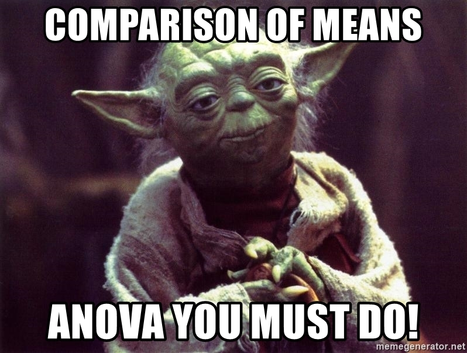
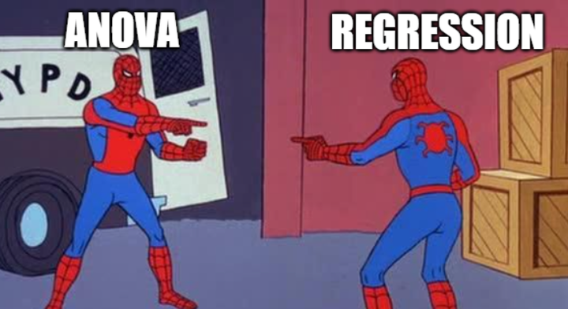

class: center, middle

# Comparing Many Levels of One Category with the Linear Model


```{r setup, include=FALSE}
library(knitr)
library(ggplot2)
library(dplyr)
library(tidyr)
library(broom)
library(readr)
library(performance)
library(ggdist)

opts_chunk$set(fig.height=6, 
               fig.width = 8,
               fig.align = "center",
               comment=NA, 
               warning=FALSE, 
               echo = FALSE,
               message = FALSE)

options(htmltools.dir.version = FALSE,
        knitr.kable.NA = '')
theme_set(theme_bw(base_size=28))

table_out <- . %>%
  knitr::kable("html") %>%
  kableExtra::kable_styling("striped")
```

---
class: center, middle

# Etherpad
<br><br>
<center><h3>https://etherpad.wikimedia.org/p/607-anova-2020</h3></center>

---
class: center, middle

## Is this what you think of when you hear categorical variables?



---
class: center, middle

### Wait, wait wait. What is ANOVA, what is this terminology? New words! AH! (or for some of you, old words - but - you must unlearn what you have learned)

---
class: center, middle

# THROW IT ALL OUT!  

--

### We are talking about linear regression with categorical variables

---
class: center, middle

## What Else Did You Expect?


---

# Categorical Variables with Many Levels

```{r}
library(palmerpenguins)
ggplot(penguins,
       aes(y = body_mass_g, x = species)) +
  geom_point(alpha = 0.3, position = position_jitter(width = 0.2))  +
  stat_summary(fun.data = mean_cl_boot, color = "red") +
  labs(subtitle = "Is Body Mass Different Between\nDifferent Penguin Species?")
```


$$mass_i =  \beta_1 adelie_i + \beta_2 chinstrap_i + \beta_3 gentoo_i + \epsilon_i$$
---
class:center


---
# Many Means, One Category

1. What are models with categorical predictors?  

2. Assumptions of models with categorical predictors  

3. Evaluating fit models  

4. Query: How different are groups?

---
# Categorical Predictors: Gene Expression and Mental Disorders

.pull-left[

]

.pull-right[

]

```{r load_brains}
brainGene <- read.csv("lectures/data/19/15q06DisordersAndGeneExpression.csv") %>%
  mutate(group = forcats::fct_relevel(group, c("control", "schizo", "bipolar")))
```

---
# The data
```{r boxplot}
ggplot(brainGene, aes(x=group, y=PLP1.expression, fill = group)) +
  geom_boxplot() +
  scale_fill_discrete(guide=FALSE)+
  theme_bw(base_size=17)
```

---
# Traditional Way to Think About Categories
```{r meansplot}
ggplot(brainGene, aes(x=group, y=PLP1.expression, color = group)) +
#  geom_boxplot() +
  stat_summary() +
  scale_color_discrete(guide="none") +
  theme_bw(base_size=17)
```

What is the variance between groups v. within groups?

---
# But What is the Underlying Model  ?

```{r brainGene_points}

bgsub1 <- subset(brainGene, brainGene$group != "schizo")
bgPoints <- ggplot(bgsub1, aes(x=group, y=PLP1.expression)) +
                 geom_point(size=1.5) +
  theme_bw(base_size=24)
                   
bgPoints
```


---
# But What is the Underlying Model?

```{r brainGene_points_fit}
bgPoints + stat_smooth(method="lm", mapping=aes(group=1), color="red", lwd=2)

```

--

Underlying linear model with control = intercept, dummy variable for bipolar

---

# But What is the Underlying Model?

```{r brainGene_points_fit1}
bgPoints + stat_smooth(method="lm", mapping = aes(group=1), color="red", lwd=2) +
scale_x_discrete(labels=c("0", "1"))

```

Underlying linear model with control = intercept, dummy variable for bipolar


---
# But What is the Underlying Model  ?

```{r brainGene_points_fit_2}
bgsub2 <- subset(brainGene, brainGene$group != "bipolar")
bgPoints2 <- ggplot(bgsub2, aes(x=group, y=PLP1.expression)) +
  geom_point(size=1.5) +
  theme_bw() + 
  stat_smooth(method="lm", mapping = aes(group=1), color="red", lwd=2)+
  theme_bw(base_size=24)

bgPoints2
```

Underlying linear model with control = intercept, dummy variable for schizo

---

# But What is the Underlying Model?
```{r ctl_schizo}
bgPoints2 +
  scale_x_discrete(labels = c(0,1))
```

Underlying linear model with control = intercept, dummy variable for schizo


---
# Linear Dummy Variable (Fixed Effect) Model
$$\large y_{ij} = \beta_{0} + \sum \beta_{j}x_{ij} + \epsilon_{ij}, \qquad x_{i} = 0,1$$  
$$\epsilon_{ij} \sim N(0, \sigma^{2})$$

- i = replicate, j = group  


- $x_{ij}$ inidicates presence/abscence (1/0) of level j for individual i  
     - This coding is called a **Dummy variable**  

- Note similarities to a linear regression  

- One category set to $\beta_{0}$ for ease of fitting, and other $\beta$s are different from it  

- Or $\beta_{0}$ = 0  

---
# A Simpler Way to Write: The Means Model
$$\large y_{ij} = \alpha_{j} + \epsilon_{ij}$$  
$$\epsilon_{ij} \sim N(0, \sigma^{2} )$$


- i = replicate, j = group  


- Different mean for each group  


- Focus is on specificity of a categorical predictor  
  


---
# Partioning Model to See What Varies

$$\large y_{ij} = \bar{y} + (\bar{y}_{j} - \bar{y}) + ({y}_{ij} - \bar{y}_{j})$$

- i = replicate, j = group  


- Shows partitioning of variation  
     - Between group v. within group variation  


- Consider $\bar{y}$ an intercept, deviations from intercept by treatment, and residuals

- Can Calculate this with a fit model to answer questions - it's a relic of a bygone era
     - That bygone era has some good papers, so, you should recognize this
     
     
---
# Let's Fit that Model

**Using Least Squares**
```{r, echo = TRUE}
brain_lm <- lm(PLP1.expression ~ group, data=brainGene)

tidy(brain_lm) |> 
  select(-c(4:5)) |>
  knitr::kable(digits = 3) |>
  kableExtra::kable_styling()
```

---
# Many Means, One Category

1. What are models with categorical predictors?  

2. .red[Assumptions of models with categorical predictors]  

3. Evaluating fit models  

4. Query: How different are groups?

---
# Assumptions of Linear Models with Categorical Variables - Same as Linear Regression!

-   Independence of data points

-   No relationship between fitted and residual values

-   Homoscedasticity (homogeneity of variance) of groups  
       - This is just an extension of $\epsilon_i \sim N(0, \sigma)$ where $\sigma$ is constant across all groups
  
-   Normality within groups (of residuals)

- No excess leverage, etc....

---
# Fitted v. Residuals for Linearity
```{r}
check_model(brain_lm, check = "linearity") |> plot()
```

Are **residual** variances consistent across groups?

---
# Testing HOV with Standardized Residuals

```{r brainGene_levene}
check_heteroscedasticity(brain_lm) |> plot()

```

We are all good!


---
# Normality of Residuals

```{r}
check_normality(brain_lm) |> plot()
```

---
# Normality of Residuals: QQ

```{r}
check_normality(brain_lm) |> plot("qq")
```


---
# What do I do if I Violate Assumptions?

-   Nonparametric Kruskal-Wallace (rank transform)

-   log(x+1), asinh(x), or otherwise transform

-   Model the variance or a GLM (two weeks!)
     - likely not a huge difference here


---
# Many Means, One Category

1. What are models with categorical predictors?  

2. Assumptions of models with categorical predictors  

3. .red[Evaluating fit models]  

4. Query: How different are groups?


---
# R Fits with Treatment Contrasts
$$y_{ij} = \beta_{0} + \sum \beta_{j}x_{ij} + \epsilon_{ij}$$

```{r trt_means}
tidy(brain_lm) |>
  select(1:3) |>
  knitr::kable(digits = 3) |>
  kableExtra::kable_styling()
```

--

What does this mean?

--

- Intercept ($\beta_{0}$) = the average value associated with being in the control group

- Others = the average difference between control and each other group

- Note: Order is alphabetical

---
# Actual Group Means

$$y_{ij} = \alpha_{j} + \epsilon_{ij}$$


```{r brainGene_noint}
library(emmeans)
brain_em <- emmeans(brain_lm, ~group)

brain_em |>
  tidy() |>
  select(1:3) |>
  knitr::kable("html") %>%
  kableExtra::kable_styling()
```

--

What does this mean?

--

Being in group j is associated with an average outcome of y.

---

# What's the best way to see this?
.center[ ]

---
# Many Ways to Visualize

```{r}
ggplot(brainGene,
       aes(x = group, y = PLP1.expression)) +
  geom_jitter(color = "lightgrey") +
  stat_summary(fun.data = "mean_se", color = "red")
```

---
# Many Ways to Visualize

```{r}
ggplot(brainGene,
       aes(y = group, x = PLP1.expression,
           fill = group)) +
 stat_dotsinterval(dotsize = 0.3, binwidth = 0.1) +
  labs(y="")
```

---
# Many Ways to Visualize

```{r}
library(ggdist)
ggplot(brainGene,
       aes(y = group, x = PLP1.expression,
           fill = group)) +
  stat_halfeye() +
  labs(y="") +
  stat_dots(side = "bottom", dotsize = .17, binwidth = 0.1, color = NA)
```

---
# How Well Do Groups Explain Variation in Response Data?

We can look at fit to data - even in categorical data!

```{r}
r2(brain_lm)
```

--

But, remember, this is based on the sample at hand.

--
Adjusted R<sup>2</sup>: adjusts for sample size and model complexity (k = # params = # groups)

$$R^2_{adj} = 1 - \frac{(1-R^2)(n-1)}{n-k-1}$$


---
# Many Means, One Category

1. What are models with categorical predictors?  

2. Assumptions of models with categorical predictors  

3. Evaluating fit models  

4. .red[Query: How different are groups?]


---
# Which groups are different from each other?
```{r meansplot}
```

--

Many mini-linear models with two means....multiple comparisons!


---
# Post-Hoc Means Comparisons: Which groups are different from one another?

- Each group has a mean and SE

- We can calculate a comparison for each 

- BUT, we lose precision as we keep resampling the model  
  
- Remember, for every time we look at a system, we have some % of our CI not overlapping the true value  

- Each time we compare means, we have a chance of our CI not covering the true value  

- To minimize this possibility, we correct (widen) our CIs for this **Family-Wise Error Rate**


---
# Solutions to Multiple Comparisons and Family-wise Error Rate?

1. Ignore it - 
     + Just a bunch of independent linear models

--
2. Increase your CI given m = # of comparisons
     + If 1 - CI of interest = $\alpha$  
     + Bonferroni Correction $\alpha/ = \alpha/m$
     + False Discovery Rate $\alpha/ = k\alpha/m$ where k is rank of test

--
3. Other multiple comparison corrections
    + Tukey's Honestly Significant Difference  
    + Dunnett's Compare to Control

---

# No Correction: Least Square Differences
```{r pairs, echo=FALSE}
contrast(brain_em, method = "tukey", adjust="none") %>%
  tidy(conf.int = TRUE) |>
  select(c(2,4,7,8)) |>
  knitr::kable("html") %>% kableExtra::kable_styling("striped")
```

---
# Bonferroni Corrections
```{r bonf, echo=FALSE}
contrast(brain_em, method = "tukey", adjust="bonferroni") %>%
  tidy(conf.int = TRUE) |>
  select(c(2,4,7,8)) |>
  knitr::kable("html") %>% kableExtra::kable_styling("striped")
```


---
# Tukey's Honestly Significant Difference
```{r tukey, echo=FALSE}
contrast(brain_em, method = "tukey", adjust="tukey")  %>%
  tidy(conf.int = TRUE) |>
  select(c(2,4,7,8)) |>
  knitr::kable("html") %>% kableExtra::kable_styling("striped")
```

---
# Visualizing Comparisons (Tukey)
```{r tukey-viz, echo=FALSE}
plot(contrast(brain_em, method = "tukey", adjust="tukey")) +
  theme_bw(base_size=17) +
  geom_vline(xintercept = 0, color = "red", lty = 2)
```

---
# Dunnett's Comparison to Controls
```{r dunnett, echo=FALSE}
contrast(brain_em, method = "dunnett", adjust="dunnett")  %>%
  tidy(conf.int = TRUE) |>
  select(c(2,4,7,8)) |>
  knitr::kable("html") %>% kableExtra::kable_styling("striped")

plot(contrast(brain_em, method = "dunnett", adjust="dunnett")) +
  theme_bw(base_size=17) +
  geom_vline(xintercept = 0, color = "red", lty = 2)
```

---

# So, Many Levels of a category

- At the end of the dat, it's just another linear model  
  
- We can understand a lot about groups, though  

- We can also query the model to compare groups  

- To do more, we need an inferential framework  
