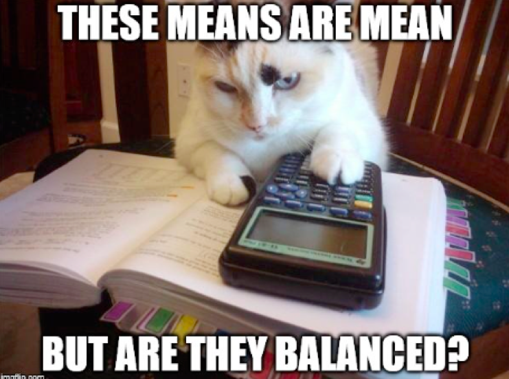

class: center, middle


# Many Types of Categories: Multi-Way and Factorial ANOVA


```{r setup, include=FALSE}
library(knitr)
library(ggplot2)
library(dplyr)
library(tidyr)
library(broom)
library(readr)
library(brms)
library(ggdist)
library(tidybayes)
library(car)
library(AICcmodavg)
library(emmeans)
library(visreg)

opts_chunk$set(fig.height=6, 
               fig.width = 8,
               fig.align = "center",
               comment=NA, 
               warning=FALSE, 
               echo = FALSE,
               message = FALSE)

options(htmltools.dir.version = FALSE,
        knitr.kable.NA = '')
theme_set(theme_bw(base_size=28))

table_out <- . %>%
  knitr::kable("html") %>%
  kableExtra::kable_styling("striped")
```

---
class: center, middle

# Etherpad
<br><br>
<center><h3>https://etherpad.wikimedia.org/p/607-many-predictors-2020</h3></center>

---
# A Non-Additive World

1. Replicating Categorical Variable Combinations: Factorial Models

2. Evaluating Interaction Effects

3. How to Look at Means with an Interaction Effect

4. Unbalanced Data 


---
# The world isn't additive

-   Until now, we have assumed factors combine additively - the effect of one is not dependent on the effect of the other

--

-   BUT - what if the effect of one factor depends on another?

--

-   This is an **INTERACTION** and is quite common

--

- Biology: The science of "It depends..."  

--

-   This is challenging to think about and visualize, but if you can master it, you will go far!

---
# Intertidal Grazing!
.center[


#### Do grazers reduce algal cover in the intertidal?
]

---
# Experiment Replicated on Two Ends of a gradient


---
# Factorial Experiment


---
# Factorial Design


Note: You can have as many treatment types or observed category combinations as you want (and then 3-way, 4-way, etc. interactions)

---
# The Data: See the dependency of one treatment on another?

```{r plot_algae}
algae <- read.csv("./data/22/18e3IntertidalAlgae.csv")

algae_plot <- qplot(height, sqrtarea,  data=algae, geom="boxplot", fill=herbivores) + theme_bw(base_size=16)
algae_plot


```

---
# If we had fit y ~ a + b, residuals look weird
```{r graze_assumptions, fig.height=7}

graze_linear <- lm(sqrtarea ~ height + herbivores, data=algae)

par(mfrow=c(2,2))
plot(graze_linear, which=c(1,2,4), cex.lab=1.4)
par(mfrow=c(1,1))
```

A Tukey Non-Additivity Test would Scream at us

---
# A Factorial Model

$$\large y_{ijk} = \beta_{0} + \sum \beta_{i}x_{i} + \sum \beta_{j}x_{j} + \sum \beta_{ij}x_{ij} + \epsilon_{ijk}$$  

$$\large \epsilon_{ijk} \sim N(0, \sigma^{2} )$$
$$\large x_{i} = 0,1, x_{j} = 0,1, x_{ij} = 0,1$$ 


- Note the new last term  

- Deviation due to treatment combination  


--

<hr>
This is still something that can be in the form

$$\Large \boldsymbol{Y} = \boldsymbol{\beta X} + \boldsymbol{\epsilon}$$
---
# The Data (Four Rows)

```{r dat}
algae   %>%
  group_by(height, herbivores) %>%
  slice(1L) %>%
  table_out
```

---
# The Dummy-Coded Data

```{r modmat}
graze_int <- lm(sqrtarea ~ height + herbivores + 
                  herbivores:height, 
                data=algae)

model.matrix(graze_int) %>% 
  as.data.frame() %>%
  group_by_all() %>%
  slice(1L) %>%
  ungroup() %>% table_out()
```

---
# Fitting

**Least Squares**
```{r lsq_fact, echo = TRUE}
graze_int <- lm(sqrtarea ~ height + herbivores +
                  height:herbivores,
                data=algae)
## OR
graze_int <- lm(sqrtarea ~ height*herbivores,
                data=algae)
```

--

**Likelihood**
```{r glm_fact, echo = TRUE}
graze_int_glm <- glm(sqrtarea ~ height*herbivores,
                data=algae,
                family = gaussian(link = "identity"))
```


**Bayes**
```{r brm_fact, echo = TRUE, results = "hide"}
graze_int_brm <- brm(sqrtarea ~ height*herbivores,
                data=algae,
                family = gaussian(link = "identity"),
                chains = 2,
                file = "intertidal_brms.rds")
```

---
# Assumptions are Met
```{r graze_assumptions_int, fig.height=7}
par(mfrow=c(2,2))
plot(graze_int, which=c(1,2,4), cex.lab=1.4)
par(mfrow=c(1,1))
```

---
# A Non-Additive World

1. Replicating Categorical Variable Combinations: Factorial Models

2. .red[Evaluating Interaction Effects]

3. How to Look at Means with an Interaction Effect

4. Unbalanced Data 


---
# Omnibus Tests for Interactions

- Can do an F-Test

$$SS_{Total} = SS_{A} + SS_{B} + SS_{AB} +SS_{Error}$$

$$SS_{AB} = n\sum_{i}\sum_{j}(\bar{Y_{ij}} - \bar{Y_{i}}- \bar{Y_{j}} - \bar{Y})^{2}$$
$$df=(i-1)(j-1)$$

--


- Can do an ANODEV
    - Compare A + B versus A + B + A:B

--

- Can do CV as we did before, only now one model has an interaction
     - Again, think about what models you are comparing
     
--

- Can look at finite population variance of interaction

---
# ANOVA

```{r fact_anova}
Anova(graze_int) %>%
  table_out
```

---
# ANODEV

```{r fact_anodev}
Anova(graze_int_glm) %>%
  table_out
```

---
# What do the  Coefficients Mean?

```{r graze_interaction_coefs}
tidy(graze_int_glm) %>%
  table_out
```

- Intercept chosen as basal condition (low, herbivores -)

--

- Changing height to high is associated with a loss of 10 units of algae relative to low/-

--


- Adding herbivores is associated with a loss of 22 units of algae relative to low/-

--

- BUT - if you add herbivores and mid, that's also associated with an increase of 25 units of algae relative to low/-

--

.center[**NEVER TRY AND INTERPRET ADDITIVE EFFECTS ALONE WHEN AN INTERACTION IS PRESENT**<Br>that way lies madness]

---
# A Non-Additive World

1. Replicating Categorical Variable Combinations: Factorial Models

2. Evaluating Interaction Effects

3. .red[How to Look at Means with an Interaction Effect]

4. Unbalanced Data 


---
# Let's Look at Means, Figures, and Posthocs

.center[.middle[

]]

---
# This view is intuitive

```{r}
ggplot(algae,
       aes(x = herbivores, y = sqrtarea,
           fill = height)) +
  geom_boxplot(position = "dodge")

```

---
# This view is also intuitive

```{r}
ggplot(algae,
       aes(x = herbivores, y = sqrtarea,
           color = height, fill = height)) +
  stat_summary(fun.data = "mean_se", size = 2)  +
  stat_summary(fun = mean, geom = "line",
               aes(group = height), size = 1.5) 

```

---
# Posthocs and Factorial Designs

-   Must look at simple effects first in the presence of an interaction  
     - The effects of individual treatment combinations
     - If you have an interaction, this is what you do!


--

-   Main effects describe effects of one variable in the complete absence of the other
    - Useful only if one treatment CAN be absent
    - Only have meaning if there is no interaction

---
# Posthoc Comparisons Averaging Over Blocks - Misleading!

```{r graze_posthoc_trt, warning=TRUE, messages=TRUE}
contrast( emmeans(graze_int, "herbivores"), "tukey", adjust="none")
```

---
# Posthoc with Simple Effects

```{r graze_posthoc}
contrast( emmeans(graze_int, c("height", "herbivores")), "tukey", adjust="none") %>%
  table_out()
```

--
.center[**That's a Lot to Drink In!**]

---
# Might be easier visually

```{r graze_posthoc_plot}
plot(contrast( emmeans(graze_int_brm, ~herbivores + height), "tukey", adjust="none")) +
  geom_vline(xintercept = 0, color = "red", lty = 2)
```

---
# We are often interested in something simpler...

```{r graze_posthoc_plot2}
plot(contrast( emmeans(graze_int, ~herbivores | height), "tukey", adjust="none")) +
  geom_vline(xintercept = 0, color = "red", lty = 2)
```

---
# Why think about interactions

- It Depends is a rule in biology

- Context dependent interactions everywhere

- Using categorical predictors in a factorial design is an elegant way to see interactions without worrying about shapes of relationships

- BUT - it all comes down to a general linear model! And the same inferential frameworks we have been dealing with since day 1

---
# Final Thought - You can have 2, 3, and more-way interactions!

.center[.middle[

]]

---
# A Non-Additive World

1. Replicating Categorical Variable Combinations: Factorial Models

2. Evaluating Interaction Effects

3. How to Look at Means with an Interaction Effect

4. .red[Unbalanced Data]

---
# What about unbalanced designs?


----
# Coda: Oh no! I lost a replicate (or two)


```{r graze_unbalance, echo=TRUE}
algae_unbalanced <- algae[-c(1:5), ]
```


```{r}
graze_int_unbalanced <- lm(sqrtarea ~ height*herbivores, 
                           data=algae_unbalanced)
```


---
# Type of Sums of Squares Matters

Type I
```{r graze_unbalance_anova1}
anova(graze_int_unbalanced) %>% table_out
```
  

Type II
```{r graze_unbalance_anova2}
Anova(graze_int_unbalanced) %>% table_out
```

---
# Enter Type III

```{r graze_unbalance_anova23}
Anova(graze_int_unbalanced, type = "III") %>% table_out
```
  
--

Compare to type II
```{r graze_unbalance_anova2}
```

---
# What’s Going On: Type I, II, and III Sums of Squares

**Type I Sums of Squares:**  

--

&nbsp; &nbsp; SS for A calculated from a model with A + Intercept versus just Intercept

--

&nbsp; &nbsp; SS for B calculated from a model with A + B + Intercept versus A + Intercept

--

&nbsp; &nbsp; SS for A:B calculated from a model with A + B + A:B +Intercept versus A + B + Intercept

--

This is **fine** for a balanced design. Variation evenly partitioned.

---
# What’s Going On: Type I, II, and III Sums of Squares

**Type II Sums of Squares:**  

--

&nbsp; &nbsp; SS for A calculated from a model with A + B +  Intercept versus B + Intercept

--

&nbsp; &nbsp; SS for B calculated from a model with A + B + Intercept versus A + Intercept

--

&nbsp; &nbsp; SS for A:B calculated from a model with A + B + A:B +Intercept versus A + B + Intercept

--

Interaction not incorporated in assessing main effects

## What’s Going On: Type I, II, and III Sums of Squares


**Type III Sums of Squares:**  

--

&nbsp; &nbsp; SS for A calculated from a model with A + B + A:B + Intercept versus B + A:B + Intercept

--

&nbsp; &nbsp; SS for B calculated from a model with A + B + A:B + Intercept versus A + A:B + Intercept

--

&nbsp; &nbsp; SS for A:B calculated from a model with A + B + A:B +Intercept versus A + B + Intercept

--

Each SS is the unique contribution of a treatment

--

**very conservative**

---
## What’s Going On: Type I and II Sums of Squares
<h4>  

  ------------ ------------ ------------   ------------
                  Type I      Type II    
   Test for A     A v. 1     A + B v. B     A + B + A:B v B + A:B<br><br>  
   Test for B   A + B v. A   A + B v. A     A + B + A:B v A + A:B<br><br> 
   Test for B   A + B v. A   A + B v. A     A + B + A:B v A + B<br><br> 
  ------------ ------------ ------------   ------------  
</h4>


---

# Which SS to Use?
-   Traditionally, urged to use Type III  

--

-   What do type III models mean?  
       -   A + B + A:B v. B + A:B  

--
-   Interactions the same for all, and if A:B is real, main effects not
    important  

--

-   Type III has lower power for main effects  

--

-   Type II produces more meaningful results if main effects are a concern - which they are!
