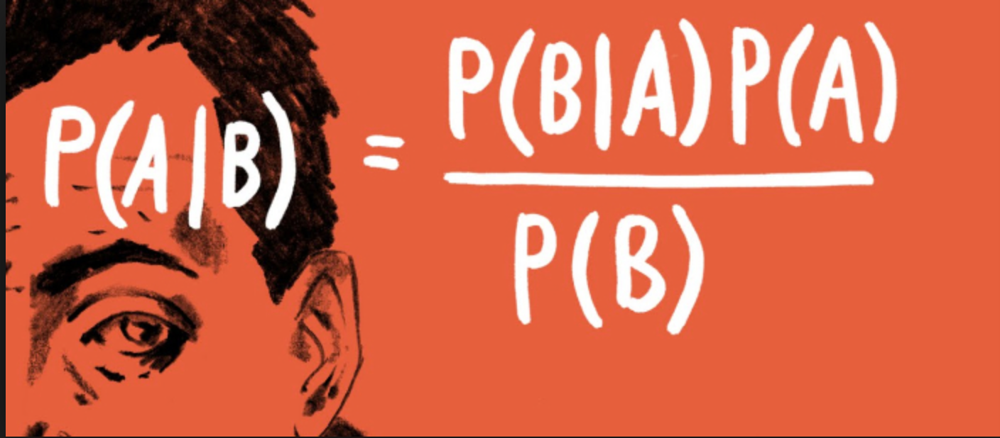

class: center, middle

# Bayesian Data Analysis
<br>


<!-- Objectives
1) Understand Bayes theorem
  - Contrast to likelihood and frequentist approaches
2) Understand what it means in context
  - Credible Intervals v Confidence Intervals
3) Understand how we use it to estimate
  - Posterior Distributions
  - How to use a Credible Interval
-->

```{r setup, include=FALSE}
library(knitr)
library(ggplot2)
library(dplyr)
library(tidyr)
library(brms)
library(bayesplot)
library(broom)

opts_chunk$set(fig.height=6, 
               fig.width = 8,
               fig.align = "center",
               comment=NA, 
               warning=FALSE, 
               echo = FALSE,
               message = FALSE)

options(htmltools.dir.version = FALSE)
theme_set(theme_bw(base_size=18))
```


```{r puffer, include=FALSE}
puffer <- read.csv("./data/11/16q11PufferfishMimicry Caley & Schluter 2003.csv")
puffer_lm <- lm(predators ~ resemblance, data=puffer)
```

---

# I'm a Basic Bayesian

1. Where have we been and where are we going?

2. Bayes theorem

3. The Posterior and Credible Intervals

4. Priors

---


# Consider the Pufferfish

```{r pufferload}
puffer <- read.csv("./data/11/16q11PufferfishMimicry Caley & Schluter 2003.csv")
```

.pull-left[
- Pufferfish are toxic/harmful to predators  
<br>
- Batesian mimics gain protection from predation - why?
<br><br>
- Evolved response to appearance?
<br><br>
- Researchers tested with mimics varying in toxic pufferfish resemblance
]

.pull-right[

]
---

# We have Spent a Lot of Time Here

```{r puffershow}
pufferplot <- ggplot(puffer, mapping=aes(x=resemblance, y=predators)) +
  ylab("Predator Approaches per Trial") + 
  xlab("Dissimilarity to Toxic Pufferfish")  +
  geom_point(size = 3) +
  theme_bw(base_size=24) 

pufferplot + stat_smooth(method = "lm")
```

---
# We have shown that our data or more extreme data explains more variation than a null expectation

```{r puffer_f}
knitr::kable(anova(puffer_lm), digits = 2)
```

---
# We have shown that our data or more extreme data produces a coefficient that is almost certainly not 0

```{r puffer_t}
knitr::kable(tidy(puffer_lm), digits = 2)
```

---
# We have shown that our model with pufferfish resemblance has a greater likelihood to that of one without - our probability of observing the data given estimated parameters was higher!

```{r puffer_lrt}
puffer_glm <- glm(predators ~ resemblance, data = puffer)
puffer_int <- glm(predators ~ 1, data = puffer)
knitr::kable(anova(puffer_int, puffer_glm, test = "LRT"), digits = 2)
```

---
# We have shown that our model with pufferfish resemblance is better at prediction than one without

```{r puff_cv}
knitr::kable(
  AICcmodavg::aictab(list(puffer_int, puffer_glm),
                     modnames = c("Int Only", "Resemblance"))[,1:4]
)
```


---

class: center, middle

# But.... what is the probability of any given value or range of values of that slope estimate? What is the probability of our model given the data - and not vice-verse?

---

class: middle

# What we've done:
$$\LARGE P(D | H)$$
$$\LARGE P(x \lt D | H)$$

--

# What we want - and how we reason and think

$$\LARGE P(H | D)$$

---


# Applying Different Styles of Inference

.grey[
- **Null Hypothesis Testing**: What's the probability that things are not influencing our data?
      - Deductive


- **Cross-Validation**: How good are you at predicting new data?
      - Deductive
      
- **Model Comparison**: Comparison of alternate hypotheses
      - Deductive or Inductive
]

- **Probabilistic Inference**: What's our degree of belief in a data?
      - Inductive

---

# I'm a Basic Bayesian

1. Where have we been and where are we going?

2. .red[Bayes theorem]

3. The Posterior and Credible Intervals

4. Priors

---

class:middle, center


--

$$\huge p(a\ and\ b) = p(a)p(b|a)$$

---
class: middle, center


--

$$\huge p(b) = p(b|a)+p(b|!a)$$

---
class: middle, center


$$\huge p(a\ and\ b) = p(b)p(a|b)$$

---

class: middle, center


## So....

$$\huge  p(a)p(b|a) =   p(b)p(a|b) $$

---

# Bayes Theorem
#### And thus... 

.center[.middle[
$$\huge  p(a|b) =   \frac{p(b|a)p(a)}{p(b)}$$


]]

---

# Bayes Theorem in Context


$$\huge  p(H|D)  =   \frac{p(D|H)p(H)}{p(D)} $$

--


Begin Playing "O Fortuna!" from Carmina Burana

---

# Bayes Theorem in Context


---

# What does Bayes Mean?

.center[

]

---

# What does Bayes Mean?

### You start with a Prior

```{r bayesplot_1}
bdat_unstd <- tibble(
  x = seq(-20,30, length.out = 200),
  prior = dnorm(x, -2, 5),
  likelihood = dnorm(x, 10, 3),
  posterior = prior * likelihood/sum(prior*likelihood)
) %>%
  gather(type, value, -x) %>%
  group_by(type) 

bdat <- bdat_unstd %>%
  mutate(value = value/max(value))

bplot <- ggplot(bdat,
       aes(x = x, y = value, color = type)) +
  geom_line(alpha = 0) +
  geom_line(data= bdat %>% filter(type == "prior"),
            size = 1.4) +
  labs(y = "", color = "", x = "Slope") +
  scale_y_continuous(breaks = NULL) +
  theme_classic(base_size = 24) + 
  scale_color_manual(values = c("red", "blue", "black"))

bplot
```

---

# What does Bayes Mean?

### Obtain the Likelihood of the Data

```{r bayesplot__2}
bplot +
  geom_line(data= bdat %>% filter(type == "likelihood"),size = 1.4)
```

---

# What does Bayes Mean?

### Multiply and Standardize by all possible P(D|H)*P(H)

```{r bayesplot_3}
bplot +
  geom_line(data= bdat ,size = 1.4)
```

---

# Note - here it is on the probability scale

```{r bayesplot_4}

ggplot(bdat_unstd,
       aes(x = x, y = value, color = type)) +
  geom_line(size = 1.4) +
  labs(y = "Probability Density", color = "", x = "Slope") +
  theme_classic(base_size = 24) + 
  scale_color_manual(values = c("red", "blue", "black"))
```

---
class:center, middle
# Let's Draw Some Stones!

---

# I'm a Basic Bayesian

1. Where have we been and where are we going?

2. Bayes theorem

3. .red[The Posterior and Credible Intervals]

4. Priors

---
# What is a posterior distribution?
```{r post_1}
x <- seq(5,20, by = 0.01)
y <- dnorm(x, 13)

post <- qplot(x,y,geom="line") +
  xlab("Parameter") +
  ylab("Probability") 

post
```

---
# What is a posterior distribution?
```{r post_2}
post +
  geom_vline(xintercept=13, color="red", lty=2)
```

The probability that the parameter is 13 is 0.4

---
# What is a posterior distribution?
```{r post_3}
post +
  geom_vline(xintercept=13, color="red", lty=2)+
  geom_vline(xintercept=10, color="blue", lty=2)
```

The probability that the parameter is 13 is 0.4  
The probability that the parameter is 10 is 0.044

---
# What is a posterior distribution?
```{r post2}
x2 <- seq(12,13, by=0.01)
y2 <- dnorm(x2, 13)

post +
  geom_area(mapping=aes(x=x2, y=y2), fill="red")

```

Probability that parameter is between 12 and 13 = `r sum(y2)*0.01`

---
# Bayesian Credible Interval
```{r post3}
x3 <- seq(11,15, by=0.01)
y3 <- dnorm(x3, 13)

post +
  geom_area(mapping=aes(x=x3, y=y3), fill="red")

```

Area that contains 95% of the probability mass of the posterior distribution

---
# Evaluation of a Posterior: Bayesian Credible Intervals

In Bayesian analyses, the **95% Credible Interval** is the region in which we find 95% of the possible parameter values. The observed parameter is drawn from this distribution. For normally distributed parameters:  

$$\hat{\beta} - 2*\hat{SD} \le \hat{\beta} \le \hat{\beta} +2*\hat{SD}$$ 

where $\hat{SD}$ is the SD of the posterior distribution of the parameter $\beta$. Note, for non-normal posteriors, the distribution may be different.
---

# Evaluation of a Posterior: Frequentist Confidence Intervals

In Frequentist analyses, the **95% Confidence Interval** of a parameter is the region in which, were we to repeat the experiment an infinite number of times, the *true value* would occur 95% of the time.
For normal distributions of parameters: 


$$\hat{\beta} - t(\alpha, df)SE_{\beta} \le \beta \le \hat{\beta} +t(\alpha, df)SE_{\beta}$$

---

# Credible Intervals versus Confidence Intervals

- Frequentist Confidence Intervals tell you the region you have confidence a **true value** of a parameter may occur 

--

- If you have an estimate of 5 with a Frequentist CI of 2, you cannot say how likely it is that the parameter is 3, 4, 5, 6, or 7  

--

- Bayesian Credible Intervals tell you the region that you have some probability of a parameter value 

--

- With an estimate of 5 and a CI of 2, you can make statements about degree of belief in whether a parmeter is 3, 4,5, 6 or 7 - or even the probability that it falls outside of those bounds

---
# Degree of beliefe in a result

```{r p}
xp <- seq(-2,5, by = 0.001)
yp <- dnorm(xp, 2)

xp1 <- seq(-2,0, by = 0.001)
yp1 <- dnorm(xp1, 2)

 qplot(xp,yp,geom="line") +
  theme_bw(base_size=17) +
  xlab("Parameter") +
  ylab("Probability") +
  geom_area(mapping=aes(x=xp1, y=yp1), fill="red")
```

You can discuss the probability that your parameter is opposite in sign to its posterior modal estimate. This yields a degree of belief that you at least have the sign correct (i.e., belief in observing a non-zero value)

---
# Talking about Uncertainty the IPCC Way


---
# An Example in Context: Where are Kelp Forests Changing?


---

# I'm a Basic Bayesian

1. Where have we been and where are we going?

2. Bayes theorem

3. The Posterior and Credible Intervals

4. .red[Priors]

---
# Priors
.center[

]
---
# The Influence of Priors


---
# The Influence of Priors


---
# Your Data Can Overwhelm Your Prior with a Large Enough N
```{r priorStrong}


bayesParams <- function(samp, priormean=0, priorvar=1){
  wo <- 1/priorvar
  wn <- length(samp)/var(samp)
  ybar <- mean(samp)
  
  m <- (wo*priormean + wn*ybar)/(wo+wn)
  v <- 1/(wo+wn)
  
  return(c(m = m, v=v))
  
}


set.seed(55)
samp3 <- rnorm(3, 1,0.5)
samp20 <- rnorm(20, 1,0.5)

p1 <- bayesParams(samp3, 0,0.1)
p2 <- bayesParams(samp20, 0,0.1)

x<-seq(-3,3,.01)
plot(x, dnorm(x,0,0.1), main="Strong Prior: N(0,0.1), True Mean = 1", type="l", ylim=c(0,4), lwd=1.5,ylab="density", xlab="Estimate of the Mean")
lines(x, dnorm(x, p1[1], sqrt(p1[2])), col="red", lty=2, lwd=1.5)
lines(x, dnorm(x, p2[1], sqrt(p2[2])), col="blue", lty=3, lwd=1.5)
legend(-2,3, col=c("black", "red", "blue"), lty=1:3, legend=c("Prior", "n=3", "n=20"), cex=1.5, lwd=1.5)

```

---

# How Do We Choose a Prior?

[The Prior Choice Wiki!](https://github.com/stan-dev/stan/wiki/Prior-Choice-Recommendations)

[Lemoine 2019 Oikos](https://onlinelibrary.wiley.com/doi/full/10.1111/oik.05985)


--

1. Determine if there are limits to what is possible for a parameter. Use them!

2. Do you have real prior information? Use it! But perhaps increase uncertainty to be conservative.

3. Do you have no information? Center around 0, but choose how much of a **regularization penalty** you want to impose.

4. Scaling your inputs (z-transform, etc) can often help, as you can then use a normal distribution to set priors.

5. Certain parameter types have favored prior distributions - we'll discuss!

---
# Types of Priors

- Flat prior (not usually recommended);

- Super-vague but proper prior: normal(0, 1e6) (not usually recommended)

- Weakly informative prior, very weak: normal(0, 10)

- Generic weakly informative prior: normal(0, 1);

- Specific informative prior: normal(0.4, 0.2) or whatever matches previous literature or what you know of the natural history of the system 


---

# How Will We Use Bayesian Inference for Linear Regression?

$$\Large p(\theta | D) = \frac{p(D | \theta)P(\theta)}{\int p(D | \theta)p(\theta)d\theta}$$

Remember, $P(D|\theta)$ is just a likelihood - we've done this before for linear models! We can even grid sample this!
