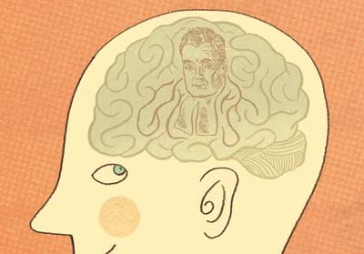

class: center, middle

# Bayesian Inference with Linear Models


```{r setup, include=FALSE}
library(knitr)
library(ggplot2)
library(dplyr)
library(tidyr)
library(brms)
library(tidybayes)
library(ggdist)
library(bayesplot)
library(loo)
options(mc.cores = 3)

color_scheme_set("viridisC")
bayesplot_theme_set(theme_minimal())

opts_chunk$set(fig.height=6, 
               fig.width = 8,
               fig.align = "center",
               comment=NA, 
               warning=FALSE, 
               echo = FALSE,
               message = FALSE)

options(htmltools.dir.version = FALSE)
theme_set(theme_bw(base_size=18))
```


```{r puffer, include=FALSE}
puffer <- read.csv("./data/11/16q11PufferfishMimicry Caley & Schluter 2003.csv")
puffer_lm <- lm(predators ~ resemblance, data=puffer)
```


---
class: center, middle

# Etherpad
<br><br>
.center[
### https://etherpad.wikimedia.org/p/607-bayes-lm-2020
]


---
# Puffers!

```{r pufferload}
puffer <- read.csv("./data/11/16q11PufferfishMimicry Caley & Schluter 2003.csv")
```

.pull-left[
- Pufferfish are toxic/harmful to predators  
<br>
- Batesian mimics gain protection from predation - why?
<br><br>
- Evolved response to appearance?
<br><br>
- Researchers tested with mimics varying in toxic pufferfish resemblance
]

.pull-right[

]

---
# This is our fit relationship
```{r puffershow}
pufferplot <- ggplot(puffer, mapping=aes(x=resemblance, y=predators)) +
  ylab("Predator Approaches per Trial") + 
  xlab("Dissimilarity to Toxic Pufferfish")  +
  geom_point(size = 3) +
  theme_bw(base_size=24) 

pufferplot
```

---
# Implementing the Puffer Model in brms
<br><br>


```{r puffer_brms, cache=TRUE, echo = TRUE, warning=FALSE, message = FALSE}
puffer_brms <- brm(predators ~ resemblance, 
                   family = gaussian(link = "identity"),
                   data = puffer)
```

---
# We converge

  ```{r converge}
plot(puffer_brms)
```

---
# Our distribution of simulations matches observations

```{r pp_check}
pp_check(puffer_brms, nsamples = 100)
```

---
# This is what we have.... so, what can we say?

```{r mcmc_params}
puffer_brms %>%
  spread_draws(b_Intercept, b_resemblance, sigma) %>%
  gather(parameter, value, b_Intercept:sigma) %>%
  ggplot(aes(x = value, y = parameter)) +
  stat_halfeye( .width = c(0.8, 0.95)) +
  ylab("") +
  ggtitle("Posterior Medians with 80% and 95% Credible Intervals")
```
---
# Inference with a Fit Bayesian Linear Model

1. Well, what do the coefficients say?

2. What are the implications of the coefficients?

3. How well does our model fit?

4. How predictive is our model?
     - Even relative to others

---
# The Information About our Fit at 80% CI
```{r puffer_out}
summary(puffer_brms, prob = 0.8)$fixed[,1:5] %>%
  knitr::kable("html", digits = 2)
```

--

Note Rhat values - must = 1!!!


---

# You can think just about the Credible Intervals

.center[.middle[
```{r posterior}
posterior_interval(puffer_brms, prob=0.8) %>%
  knitr::kable(digits = 2)
```
]]

---

# A Visual Understanding of your Coefs Can Be Helpful

```{r mcmc_params}
```

---
# Inference with a Fit Bayesian Linear Model

1. Well, what do the coefficients say?

2. .red[What are the implications of the coefficients?]

3. How well does our model fit?

4. How predictive is our model?
     - Even relative to others
---

# How do you use your posterior?

1. What is the weight of the tail on the other side of 0?
     - Hey....is that.... cheating?
     - Maybe, but...
     - you can talk in terms of degree of belief in the direction of your trend

2. What is the weight of the posterior over a range of values?

3. What is the weight of a posterior &gte; a certain value?

---
# What is the weight of the tail less that 0?

```{r pred}
post_puffer <- as.data.frame(puffer_brms)
post_puffer <- post_puffer %>%
  mutate(slope_under_0 = b_resemblance<0,
         int_under_0 = b_Intercept<0
         )

post_dens <- ggplot(post_puffer,
       aes(x = b_Intercept, 
           y = ..density..)) +
  geom_density() 

d <- ggplot_build(post_dens)$data[[1]]

post_dens +
  geom_area(data = d %>% filter(x < 0),
            aes(x=x, y=y),
            fill = "red")
```

Weight of Intercept &le; 0? `r sum(post_puffer[,1]<0)/nrow(post_puffer)`  

Weight of Slope &le; 0? `r sum(post_puffer[,2]<0)/nrow(post_puffer)`


---

# What is the probability that the slope is between 2 and 4?

```{r slopeprob}
ggplot(post_puffer,
       aes(x = b_resemblance)) +
  stat_halfeye(aes(fill = stat(x < 4 & x > 2))) +
  guides(fill = "none") +
  scale_fill_viridis_d(option = "C") +
  labs(x = "slope", y = "density")
```

Weight of Slope between 2 and 4: `r sum(post_puffer[,2]<4 & post_puffer[,2]>2)/nrow(post_puffer)`

---

# Talking about Uncertainty the IPCC Way

.center[

]

---

# Visualize the mean fit...
```{r fit_fig}
pufferplot + 
  geom_abline(slope=fixef(puffer_brms)[2], intercept=fixef(puffer_brms)[1], color="red")
```

---

# And the distributions of fits
```{r dist_fit}
pufferplot + 
  geom_abline(slope=post_puffer[,2], intercept=post_puffer[,1], color="lightgrey", alpha=0.1) +
  geom_abline(slope=fixef(puffer_brms)[2], intercept=fixef(puffer_brms)[1], color="red")  +
  geom_point()
```

---
# And the distributions of fits
```{r}
puff_fit <- puffer %>%
  modelr::data_grid(resemblance)%>%
  add_fitted_draws(puffer_brms)

ggplot(puff_fit, aes(x = resemblance, y = predators)) +
  stat_lineribbon(aes(y = .value)) +
scale_fill_brewer(palette = "Greys") +
  scale_color_brewer(palette = "Set2") +
  theme_bw(base_size=17)
```

---

# Add the distribution of predictions
```{r puffer_pred_brms}
puff_pred <- puffer %>%
  modelr::data_grid(resemblance)%>%
  add_predicted_draws(puffer_brms)

ggplot(puff_pred, aes(x = resemblance, y = predators)) +
  stat_lineribbon(aes(y = .prediction)) +
  scale_fill_brewer(palette = "Greys") +
  scale_color_brewer(palette = "Set2") +
  theme_bw(base_size=17)
```


---

# What does visualization do for you?

1. Shows trends

2. Shows variability in precision or in prediction

3. Shows you where you can frame your degree of belief


---
# Inference with a Fit Bayesian Linear Model

1. Well, what do the coefficients say?

2. What are the implications of the coefficients?

3. .red[How well does our model fit?]

4. How predictive is our model?
     - Even relative to others
     
---

# Bayesian $R^2$

Classically, we use 

$$1 - \frac{\sigma^2}{s^2_{data}}$$

$$ = \frac{variance \, explained}{total \, variance}$$
But....

- $R^2$ under some draws can be negative 
     - Consider a draw where the slope is *VERY* steep relative to a flat relationship
     - Consider a very very strong prior
     
- $R^2$ depends on the data, and thus isn't a good absolute measure of model goodness of fit

---

# Bayesian $R^2$

$$\large R^2_{bayes} = \frac{variance \, explained}{variance \, explained + residual \, variance}$$

- Cannot be negative

- Based on model fit and draws from posterior relative to data

---

# Bayesian $R^2$ Visualized 

```{r r2}
knitr::kable(bayes_R2(puffer_brms, probs = c(0.1, 0.9)), "html")

ggplot(data = tibble(R2 = bayes_R2(puffer_brms, summary = FALSE)),
       aes(x = R2)) +
  geom_histogram(bins = 100)
```

---
# Inference with a Fit Bayesian Linear Model

1. Well, what do the coefficients say?

2. What are the implications of the coefficients?

3. How well does our model fit?

4. .red[How predictive is our model?
  - Even relative to others
]
     

---

# The Return of Cross-Validation!

- We can calculate MSE of refit models.... but we need something more general

--

- Enter the Pointwise Predictive Density (ELPD)

--

```{r}
puff_13 <- add_fitted_draws(puffer_brms, newdata = puffer[13,])
ggplot(puff_13,
       aes(x = .value,)) +
  stat_halfeye() +
  geom_vline(data = puff_13[1,], aes(xintercept = predators), color = "red", lty=2) +
  labs(subtitle = "Distribution of Posterior for Point 13\nObserved Value in Red")
```

---

# The Log Pointwise Predictive Density

$$\large lppd = \sum_i log \sum_s {p(y_i | \theta_s)}$$

- We take the log of the sum of the pointwise predictive density for all paramater values drawn from a chain

- We then sum this over *all* data points

- Kinda nice, no?

- It will have the same problem as MSE, etc., for overfitting
     - More parameters = better fit = lower llpd!
     
---

# Solutions to Overfitting

- An AIC-like score

- LOO Cross Validation

- K-fold Cross validation

---
# Penalty for Too Many Parameters

- As # of parameters goes up, llpd goes down

- BUT - as # of parameters goes up, variance in llpd for each point goes up
     - More parameters, higher SE per parameter, more variance in llpd

--

$$\large penalty = \sum_ivar(lppd_i)$$
--

- akin to # of parameters pentalty

---
# The Widely Applicable Information Criterion

$$\LARGE WAIC = -2(lppd - penalty)$$

- Akin to AIC

- Can be calculated point by point

--

- But.... sensitive to extreme lppds

---
# WAIC from our Puffers

```{r waic, warning = TRUE, echo = TRUE}
waic(puffer_brms)
```

---
# WAIC Problems from our Puffers
```{r waicplot, warning = FALSE}
puffer_waic <- waic(puffer_brms, pointwise = TRUE)

ggplot(data.frame(puffer_waic$pointwise, r = 1:nrow(puffer_waic$pointwise)), 
       aes(x = r, y = elpd_waic)) + 
  geom_point()
```

---
# WAIC Problems from our Puffers
```{r waicplot_2, warning = FALSE}
puffer_waic <- waic(puffer_brms, pointwise = TRUE)

ggplot(data.frame(puffer_waic$pointwise, r = 1:nrow(puffer_waic$pointwise)), 
       aes(x = r, y = p_waic)) + 
  geom_point()
```

---

# LOO Cross-validation!

- OMG! We have to refit out model for every point? Didn't one take enough?

--

- Fear not, there is a solution!

--

- The posterior, p(H|D), is the *product* of the posterior for all data points

$$p(\theta|y) = \prod p(\theta|y_i)$$
--

- So, We can get our PPD for leaving out one data point by dividing the posterior by $p(\theta | y_i)$ - so deliciously simple!

--

- But, what if the importance of a given point is anomolusly large?

--

- Introducing, pareto smoothing

---

# The Pareto Distribution for Importance

- Vilfredo Pareto introduced the Pareto distribution to describe the distribution of wealth in a society
     - Leads to 80:20 rule, 80% of outcomes due to 20% of causes

- More commonly, a curve to describe relative importance

- We use it to smooth the relative importance values of each $lpd_i$


---

# The Pareto Distribution for Importance

```{r pareto}
dat <- tibble(
  x = seq(1,10,length.out=200),
  y = Pareto::dPareto(x, t = 0.1, alpha = 1.16)
)

ggplot(dat, aes(x = x, y = y)) + geom_line()
```

---

# LOO!

```{r loo, echo = TRUE}
loo(puffer_brms)
```

- k is an estimate of our shape parameter for the Pareto distribution

- if k > 0.5, we use K-Fold Cross validationt

---

# K-fold CV!

```{r kfold, echo = TRUE, cache = TRUE, message = FALSE}
kfold(puffer_brms, K = 5)
```

Expensive, though, as you actually have to refit for each fold

---

# Can then use LOO, WAIC, etc. to compare models

```{r puff_cubic, cache=TRUE, echo = FALSE, include = FALSE, warning=FALSE, message = FALSE}
puffer_cubic <- brm(predators ~ poly(resemblance, 3),
                     family = gaussian(link = "identity"),
                     data = puffer)
```

```{r puff_cubic, eval = FALSE, echo = TRUE}
```

```{r puff_loo_cubic, warning = FALSE, echo = TRUE}
puffer_loo <- loo(puffer_brms)
puffer_cubic_loo <- loo(puffer_cubic)

loo_compare(puffer_loo, puffer_cubic_loo)
```
---

# Wrapping up...

- We can use many of the same inferential frameworks as before, but...

--

- The difference is that now we can begin to talk about our inferences in degree of certainty

--

- To adopt a Bayesian viewpoint on the world is to abandon the idea of a "True" parameter value

--

- We now see parameters as having a distribution

--

- The null is no longer of interest, but rather the probability of possibility is what drives us