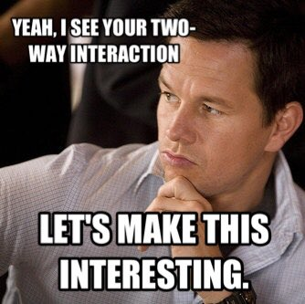

class: center, middle


# When The Effect of One Category Depends on Another


```{r setup, include=FALSE}
library(knitr)
library(ggplot2)
library(dplyr)
library(tidyr)
library(broom)
library(readr)
library(brms)
library(ggdist)
library(car)
library(emmeans)
library(visreg)
library(performance)

opts_chunk$set(fig.height=6, 
               fig.width = 8,
               fig.align = "center",
               comment=NA, 
               warning=FALSE, 
               echo = FALSE,
               message = FALSE)

options(htmltools.dir.version = FALSE,
        knitr.kable.NA = '')
theme_set(theme_bw(base_size=28))

table_out <- . %>%
  knitr::kable("html") %>%
  kableExtra::kable_styling("striped")

perform_plot <- function(x){
   x |> plot() %>%
  `[[`(1) + theme_bw(base_size = 18)
}
```


---
class: center, middle

# Etherpad
<br><br>
<center><h3>https://etherpad.wikimedia.org/p/607-interactions-nonlinearities-2022</h3></center>


---
# The world isn't additive

-   Until now, we have assumed predictors combine additively  
     - the effect of one is not dependent on the effect of the other

--

-   BUT - what if the effect of one variable depends on the level of another?

--

-   This is an **INTERACTION** and is quite common  
     - Heck, a squared term is the interaction of a variable with itself!

--

- Biology: The science of "It depends..."  

--

-   This is challenging to think about and visualize, but if you can master it, you will go far!

---

# We Have Explored Nonliearities Via Transforming our Response

```{r loglinear}
dat <- read_csv("lectures/data/11/16e2InbreedingWolves.csv") |>
  mutate(log_pups = log(pups))

mod <- lm(log_pups ~ inbreeding.coefficient, data = dat)

line <- tibble(inbreeding.coefficient = modelr::seq_range(dat$inbreeding.coefficient, 100)) |>
  augment(mod, newdata = _, interval = "confidence") |>
  mutate(across(c(.fitted:.upper), exp)) |>
  rename(pups = .fitted)

ggplot(line,
       aes(x = inbreeding.coefficient, y = pups)) +
  geom_ribbon(aes(ymin = .lower, ymax = .upper),
              color = "lightgrey", alpha = 0.4) +
  geom_line(color = "red") +
  geom_point(data = dat)
  
```

---

# But We Have Also Always Tested for Non-Additivity of Predictors

```{r, results='hide'}
set.seed(607)
dat <- crossing(a = 1:3,
                b = 10:15,
                n = 1:10) |>
  mutate(val = rnorm(n(), mean = a + b + a*b^2, sd = 15),
         a = as.character(a),
         b = as.character(b))

mod <- lm(val ~ a + b, data = dat)

check_model(mod, check = "linearity", panel = FALSE) |> perform_plot()
```

---

# The Linear Model Can Accomodate Many Flavors of Nonlinearity

$$\hat{y_i} = \beta_0 + \beta_1 x_{1i} = \beta_2 x_{2i}$$
$$y_i \sim N(\hat{y_i}, \sigma)$$
--
Could become...


$$\hat{y_i} = \beta_0 + \beta_1 x_{1i} + \beta_2 x_{1i}^2$$
--
Could be...


$$\hat{y_i} = \beta_0 + \beta_1 x_{1i} + \beta_2 x_{2i} + \beta_3 x_{1i}x_{2i}$$
--
.center[**It is ALL additive terms**]

---
class: center, middle



---
# A Non-Additive World

1. Replicating Categorical Variable Combinations: Factorial Models

2. Evaluating Interaction Effects

3. How to Look at Means  and Differences with an Interaction Effect


---
# Intertidal Grazing!
.center[


#### Do grazers reduce algal cover in the intertidal?
]

---
# Experiment Replicated on Two Ends of a gradient


---
# Factorial Experiment


---
# Factorial Design


Note: You can have as many treatment types or observed category combinations as you want (and then 3-way, 4-way, etc. interactions)

---
# The Data: See the dependency of one treatment on another?

```{r plot_algae}
algae <- read.csv("lectures/data/22/18e3IntertidalAlgae.csv")

algae_plot <- qplot(height, sqrtarea,  data=algae, geom="boxplot", fill=herbivores) + theme_bw(base_size=16)

algae_plot


```

---
# If we had fit y ~ a + b, residuals look weird

```{r graze_assumptions, fig.height=7, results = "hide"}
library(performance)
graze_linear <- lm(sqrtarea ~ height + herbivores, data=algae)

check_model(graze_linear, check = "linearity", panel = FALSE) |> perform_plot()
```


---
# A Factorial Model

$$\large y_{ijk} = \beta_{0} + \sum \beta_{i}x_{i} + \sum \beta_{j}x_{j} + \sum \beta_{ij}x_{ij} + \epsilon_{ijk}$$  

$$\large \epsilon_{ijk} \sim N(0, \sigma^{2} )$$
$$\large x_{i} = 0,1, x_{j} = 0,1, x_{ij} = 0,1$$ 
--

- Note the new last term  

--

- Deviation due to *combination of categories i and j*  


--

<hr>
This is still something that is in  

$$\Large \boldsymbol{Y} = \boldsymbol{\beta X} + \boldsymbol{\epsilon}$$

---
# The Data (Four Rows)

```{r dat}
algae   %>%
  group_by(height, herbivores) %>%
  slice(1L) %>%
  table_out
```

---
# The Dummy-Coded Treatment Contrasts

```{r modmat}
graze_int <- lm(sqrtarea ~ height + herbivores + 
                  herbivores:height, 
                data=algae)

model.matrix(graze_int) %>% 
  as.data.frame() %>%
  group_by_all() %>%
  slice(1L) %>%
  ungroup() %>% table_out()
```

---
# Fitting with Least Squares

```{r lsq_fact, echo = TRUE}
graze_int <- lm(sqrtarea ~ height + herbivores +
                  height:herbivores,
                data=algae)

## OR
graze_int <- lm(sqrtarea ~ height*herbivores,
                data=algae)
```

---
# Now We Are Linear/Additive
```{r, results='hide'}
check_model(graze_int, check = "linearity", panel = FALSE) |> perform_plot()

```

---
# Residuals A-OK
```{r}
check_normality(graze_int) |> plot(type = "qq") + theme_bw(base_size = 18)
```

---
# HOV Good!
```{r}
check_heteroscedasticity(graze_int) |> plot() + theme_bw(base_size = 18)
```


---
# No Outliers
```{r}
check_outliers(graze_int) |> plot(type = "bar")+ 
  theme_bw(base_size = 18) +
  theme(axis.text.x = element_text(angle = -90, hjust = 1))
```

---
# Collinearity is Tricky - unimportant for interaction
```{r}
check_collinearity(graze_int) |> plot()+ theme_bw(base_size = 18)
```

---
# A Non-Additive World

1. Replicating Categorical Variable Combinations: Factorial Models

2. .red[Evaluating Interaction Effects]

3. How to Look at Means  and Differences with an Interaction Effect


---
# What do the  Coefficients Mean?

```{r graze_interaction_coefs}
tidy(graze_int) %>%
  select(1:3) %>%
  table_out
```

--

- Intercept chosen as basal condition (low, herbivores -)  

--

- Changing height to high is associated with a loss of 10 units of algae relative to low/-

--


- Adding herbivores is associated with a loss of 22 units of algae relative to low/-

--

- BUT - if you add herbivores and mid, that's also associated with an additional increase of 25 units of algae relative to mid and + alone  
      - 25.5 - 22.5 - 10.4 = only a loss of 7.4 relative to low/-

--

.center[**NEVER TRY AND INTERPRET ADDITIVE EFFECTS ALONE WHEN AN INTERACTION IS PRESENT**<Br>that way lies madness]


---
# This view is intuitive

```{r}
ggplot(algae,
       aes(x = herbivores, y = sqrtarea,
           fill = height)) +
  geom_boxplot(position = "dodge")

```

---
# This view is also intuitive

```{r}
ggplot(algae,
       aes(x = herbivores, y = sqrtarea,
           color = height, fill = height)) +
  stat_summary(fun.data = "mean_se", size = 2)  +
  stat_summary(fun = mean, geom = "line",
               aes(group = height), size = 1.5) 

```


---
# We Can Still Look at R^2

```{r}
r2(graze_int)
```

Eh, not great, not bad...  

--

- Note: adding more interaction effects will always increase the R<sup>2</sup> so only add if warranted - NO FISHING!

---
# A Non-Additive World

1. Replicating Categorical Variable Combinations: Factorial Models

2. Evaluating Interaction Effects]

3. .red[How to Look at Means  and Differences with an Interaction Effect]


---
# Posthoc Estimated Means and Interactions with Categorical Variables

-   Must look at **simple effects** first in the presence of an interaction  
     - The effects of individual treatment combinations
     - If you have an interaction, this is what you do!


--

-   **Main effects describe effects of one variable in the absence of an interaction**
    - Useful only if there is no interaction  
    - Or useful if one categorical variable can be absent   

---
# Estimated Means with No Interaction - Misleading!
```{r}
emmeans(graze_int, ~ herbivores)

emmeans(graze_int, ~ height)

```

---
# Posthoc Comparisons Averaging Over Blocks - Misleading!

```{r graze_posthoc_trt, warning=TRUE, messages=TRUE}
contrast( emmeans(graze_int, "herbivores"), "pairwise", adjust="none") |>
  confint()
```

---
# Simple Effects Means
```{r}
emmeans(graze_int, ~ height + herbivores)
```


---
# Posthoc with Simple Effects

```{r graze_posthoc}
contrast( emmeans(graze_int, c("height", "herbivores")), "pairwise", adjust="none") %>%
  table_out()
```

--
.center[**That's a Lot to Drink In!**]

---
# Might be easier visually

```{r graze_posthoc_plot}
plot(contrast( emmeans(graze_int, ~herbivores + height), "pairwise", adjust="none")) +
  geom_vline(xintercept = 0, color = "red", lty = 2)
```


---
# We are often interested in looking at differences within levels...
```{r}
emmeans(graze_int, ~herbivores | height) |>
  confint()
```

---
# We Can Then Look at Something Simpler...

```{r graze_posthoc_plot2}
plot(contrast( emmeans(graze_int, ~herbivores | height), "pairwise", adjust="none")) +
  geom_vline(xintercept = 0, color = "red", lty = 2)
```

---
# Why think about interactions

- It Depends is a rule in biology

- Context dependent interactions everywhere

- Using categorical predictors in a factorial design is an elegant way to see interactions without worrying about shapes of relationships

- BUT - it all comes down to a general linear model! And the same inferential frameworks we have been dealing with since linear regression!

---
# Final Thought - You can have 2, 3, and more-way interactions!

.center[.middle[

]]
