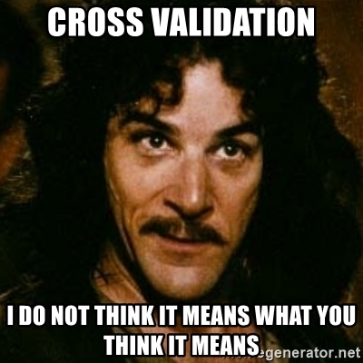
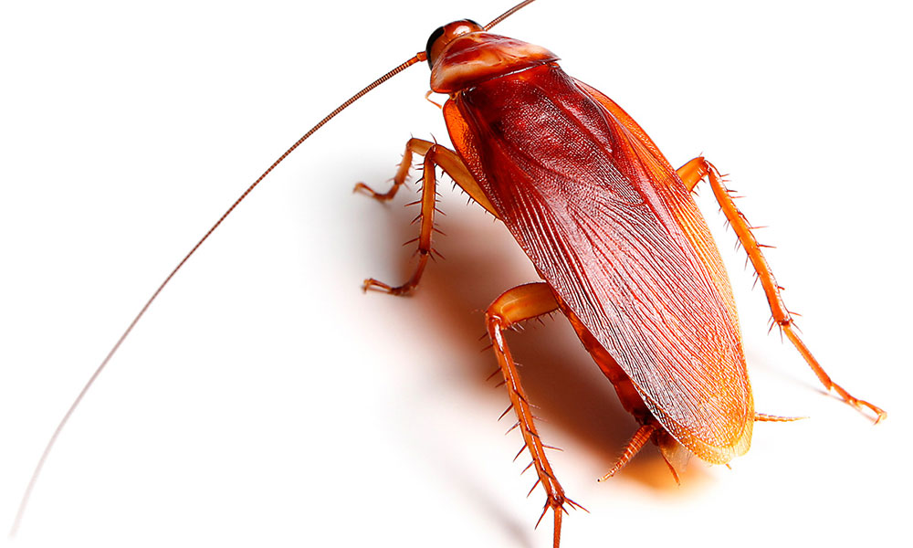
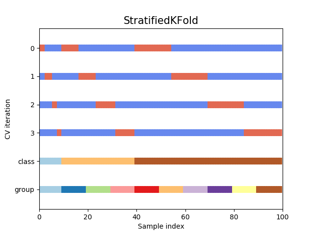

class: center, middle

# Cross-Validation and AIC<br>

<!-- next year, more on overfitting and generality
versus specificity -->


```{r setup, include=FALSE}
library(knitr)
library(ggplot2)
library(dplyr)
library(modelr)
library(rsample)
library(purrr)

opts_chunk$set(fig.height=6, 
               fig.width = 8,
               fig.align = "center",
               comment=NA, 
               warning=FALSE, 
               echo = FALSE,
               message = FALSE)

options(htmltools.dir.version = FALSE)
theme_set(theme_bw(base_size=24))
```

---

# HOT ROACHES!
<br><br>
.pull-left[
- Do American Cockroaches sense surrounding temperatures and respond?

- Survey of activity by the prothoracic ganglion in different temperature regimes

- Murphy and Heath 1983 J. Exp. Biol

]


.pull-right[

]

---

# Which is best?

```{r roach_prep}
roaches <- read.csv("data/chap17f5_4CockroachNeurons.csv")

roach_lm <- lm(rate ~ temperature, data = roaches)
roach_intonly <- lm(rate ~ 1, data = roaches)
```

```{r roachplot_int}
roach_lm_plot <- ggplot(roaches,
       aes(x = temperature, y = rate)) +
  geom_point() +
  stat_smooth(method = "lm", fill = NA, color = "blue") 

roach_lm_plot +
  stat_smooth(method = "lm", fill = NA, formula = y ~ 1,
            color = "red", lty = 2) 
```
  
---

# Which is best?

```{r roach_poly_plot}
roach_lm_plot +
  labs(title = "Polynomial fits", 
       subtitle = "y ~ x\ny ~ x + x^2\n....") +
  stat_smooth(method = "lm", fill = NA, formula = y ~ poly(x,2), color = "red", lty = 2) +
  stat_smooth(method = "lm", fill = NA, formula = y ~ poly(x,3), color = "orange") +
  stat_smooth(method = "lm", fill = NA, formula = y ~ poly(x,4), color = "purple") #+
 # stat_smooth(method = "lm", fill = NA,  color = "black", 
 #             formula = y~(x < 20)) 

```

---

# Applying Different Styles of Inference

- **Null Hypothesis Testing**: What's the probability that things are not influencing our data?
      - Deductive

- **Cross-Validation**: How good are you at predicting new data?
      - Deductive
      
- **Model Comparison**: Comparison of alternate hypotheses
      - Deductive or Inductive

- **Probabilistic Inference**: What's our degree of belief in a data?
      - Inductive
      
---


# Applying Different Styles of Inference

.grey[
- **Null Hypothesis Testing**: What's the probability that things are not influencing our data?
      - Deductive
]

- **Cross-Validation**: How good are you at predicting new data?
      - Deductive
      
- **Model Comparison**: Comparison of alternate hypotheses
      - Deductive or Inductive


.grey[
- **Probabilistic Inference**: What's our degree of belief in a data?
      - Inductive
]

---

# Validating Across Models

1. Out of Sample Prediction

2. Train-Test Random Cross Validation

3. K-Fold Cross Validation

4. LOOCV

5. AIC and Model Comparison

---

# What is Out of Sample Prediction

1. We fit a model  

2. We have a new sample(s) with a full set of predictors

3. We apply the model to our new prediction

4. We see how badly we deviate from our fit model

---

# Common Out of Sample Metrics

$MSE = \frac{1}{n}\sum{(Y_i - \hat{Y})^2}$
     - In units of sums of squares

$RMSE = \sqrt{\frac{1}{n}\sum{(Y_i - \hat{Y})^2}}$
     - In units of response variable!
     - Estimate of SD of out of sample predictions
     
$Deviance = -2 \sum log(\space p(Y_i | \hat{Y}, \theta)\space)$
     - Probability-based
     - Encompasses a wide number of probability distributions
     - Just MSE for gaussian linear models!
     
---
# Evaluating and Out of Sample Point: What if we had left out the 1st row of Roach data?

```{r one_loo_roach}
r_minus_1 <- roaches[-1,]

roach_lm_minus_1 <- lm(rate ~ temperature, data = r_minus_1)

r_minus_1 <- r_minus_1 %>% 
  cbind(predict(roach_lm_minus_1, interval = "prediction"))

r_1 <- roaches[1,] %>%
  add_predictions(roach_lm_minus_1) %>%
  tidyr::gather(type, rate, -temperature) %>%
  mutate(type = gsub("rate", "obs", type))

r1_wide <- r_1 %>%
  tidyr::spread(type, rate) %>%
  rename(rate = obs) %>%
  mutate(mse = mse(roach_lm_minus_1,.))
  
ggplot(r_minus_1,
       aes(x = temperature, y = rate)) +
  stat_smooth(method = "lm", fill = NA) +
  geom_ribbon(aes(ymin = lwr, ymax = upr),
              color = "lightgrey", alpha = 0.2) +
  geom_point(data = r_1, aes(color = type ), size = 4) +
  geom_segment(data = r1_wide,
             aes(x = temperature, 
                 xend = temperature,
                 y = rate, 
                 yend = pred ), color = "red",
             lty = 2) +
  geom_text(data = r1_wide,
            aes(x = temperature + 7,
                y = (rate + pred)/2,
                label = paste0("MSE = ", round(mse,2))),
            size = 10) +
  scale_color_manual(values = c("red", "blue"))
```

---
# We Can See This Model is Worse at Prediction

```{r one_loo_roach_int}

roach_lm_minus_1_int <- lm(rate ~ 1, data = r_minus_1)

r_minus_1_i <- roaches[-1,] %>% 
  cbind(predict(roach_lm_minus_1_int, interval = "prediction"))

r_1_i <- roaches[1,] %>%
  add_predictions(roach_lm_minus_1_int) %>%
  tidyr::gather(type, rate, -temperature) %>%
  mutate(type = gsub("rate", "obs", type))

r1_wide_i <- r_1_i %>%
  tidyr::spread(type, rate) %>%
  rename(rate = obs) %>%
  mutate(mse = mse(roach_lm_minus_1_int,.))
  
ggplot(r_minus_1_i,
       aes(x = temperature, y = rate)) +
  stat_smooth(method = "lm", fill = NA, formula = y ~ 1) +
  geom_ribbon(aes(ymin = lwr, ymax = upr),
              color = "lightgrey", alpha = 0.2) +
  geom_point(data = r_1_i, aes(color = type ), size = 4) +
  geom_segment(data = r1_wide_i,
             aes(x = temperature, 
                 xend = temperature,
                 y = rate, 
                 yend = pred ), color = "red",
             lty = 2) +
  geom_text(data = r1_wide_i,
            aes(x = temperature + 7,
                y = (rate + pred)/2,
                label = paste0("MSE = ", round(mse,2))),
            size = 10) +
  scale_color_manual(values = c("red", "blue"))
```


---
# Evaluating Predictive Ability of Statistical Models: Cross-Validation

1. Fit a model on a **training** data set

2. Evaluate a Model on a **TEST** data set

3. Compare predictive ability of competing models with MSE, Deviance, etc.

---

# But.... what data do I use for training and testing?
## Random Cross-Validation

- Cross-validating on only one point could be biased by choice of poing

- So, choose a random subset of your data!

- Typically use a 60:40 split, or 70:30 for lower sample size

- Calculate fit metrics for alternate models

---
# A Random Cross-Validation Sample

```{r}
roach_rand <- initial_split(roaches, prop = 7/10)

labeled_roach <- bind_rows(
  tibble(training(roach_rand), type = "train"),
  tibble(testing(roach_rand), type = "test")
)

ggplot(labeled_roach,
       aes(x = temperature, y = rate,
           color = type)) +
  geom_point(size = 2)

```

---
# The Fits

```{r}
fit_train <- ggplot(training(roach_rand),
       aes(x = temperature, y = rate)) +
  geom_point(color = "blue",
             size = 2) +
  stat_smooth(method = "lm", fill = NA) +
  stat_smooth(method = "lm", fill = NA, color = "orange",
              formula = y ~ 1)

fit_train
```

---
# Cross-Validation: the Fits

```{r}
ggplot(training(roach_rand),
       aes(x = temperature, y = rate)) +
  geom_point(alpha = 0) +
  stat_smooth(method = "lm", fill = NA) +
  stat_smooth(method = "lm", fill = NA, color = "orange",
              formula = y ~ 1) +
  geom_point(data = testing(roach_rand), color = "red",
             size = 2)

```

---

# Results of Random CV

RMSE Temperature Model:
```{r}
lm(rate ~ temperature, data = analysis(roach_rand)) %>%
  rmse(assessment(roach_rand))
```

RMSE Intercept Only Model:
```{r}
lm(rate ~ 1, data = analysis(roach_rand)) %>%
  rmse(assessment(roach_rand))
```

This is the estimate of the SD of the training set - which is acceptable for your predictions?

---

# Validating Across Models

1. Out of Sample Prediction

2. Train-Test Random Cross Validation

3. .red[K-Fold Cross Validation]

4. LOOCV

5. AIC and Model Comparison

---
class: center, middle

# But, wait, what if I choose a bad section of the data by chance?

---

# K-Fold Cross Validation

- Data is split into K sets of training and testing folds

- Performance is averaged over all sets

.center[

]

---
# Our Models

```{r roachplot_int}
```

---

# Five-Fold CV

```{r kfold}
roach_splits <- vfold_cv(roaches, v = 5) %>%
  mutate(mods = map(splits, 
                    ~lm(rate ~ temperature, data = analysis(.)))) %>%
  mutate(mse = map2_dbl(mods, splits, 
                    ~mse(.x, analysis(.y))),
         rmse = sqrt(mse)) 

knitr::kable(roach_splits %>% dplyr::select(id, mse, rmse))
```

Temperature Model Score: `r sum(roach_splits$mse)/5`  

Intercept Only Score: 788.2974 <!-- eh, I was lazy, and just reran the above with a different model -->

---

# But what if there is some feature in your data that splits it into groups? 
## Stratified K-Fold CV!
.center[.middle[

]]

---

# Validating Across Models

1. Out of Sample Prediction

2. Train-Test Random Cross Validation

3. K-Fold Cross Validation

4. .red[LOOCV]

5. AIC and Model Comparison

---
# Problem: How Many Folds?

- What is a good number?
     - More folds = smaller test dataset
     - Bias-Variance tradeoff if also looking at coefficients

--

- 5 and 10 are fairly standard, depending on data set size

--


- More folds = closer to average out of sample error

--


- But, more folds can be computationally intensive

--

- Still, Leave One Out Cross Validation is very powerful

---
# LOOCV (Leave One Out Cross-Validation)

.center[.middle[


]]

---
# LOOCV (Leave One Out Cross-Validation)
.center[.middle[


]]

---
# LOOCV Comparison of Out of Sample Deviance (MSE)

Rate Model:`r boot::cv.glm(roaches, glm(rate ~temperature, data = roaches))$delta[1] %>% round(2)`


Intercept Only Model: `r boot::cv.glm(roaches, glm(rate ~1, data = roaches))$delta[1] %>% round(2)`

```{r roachplot_int, fig.height = 5, fig.width = 7}
```

---
#What abour our polynomial models?

```{r roach_poly_plot}
```

---

# Using LOOCV to Compare Polynomial Fits

```{r loocv_poly}
loo_dat <- tibble(order = 1:10) %>%
  rowwise(order) %>%
  mutate(loocv = boot::cv.glm(roaches, glm(rate ~ poly(temperature, order), data = roaches), K = 57)$delta[1]) %>%
  ungroup()

ggplot(loo_dat,
       aes(x = order, y= sqrt(loocv))) +
  geom_point() + 
  geom_line() +
  scale_x_continuous(breaks = 1:10) +
  ylab("Average RMSE")
```

---

# Validating Across Models

1. Out of Sample Prediction

2. Train-Test Random Cross Validation

3. K-Fold Cross Validation

4. LOOCV

5. .red[AIC and Model Comparison]


---
class: center, middle

# This is all well and very computationally intensive, but, what about when we have n = 1e5, or many different models?

---

# Can our Training Deviance Provide an Approximation of our Test Deviance?

```{r in_out_dev}
roach_loo <- loo_cv(roaches)

in_out <- function(p){
  roach_loo %>%
    mutate(mod = map(splits, 
                     ~lm(rate ~ poly(temperature, p),
                         data = analysis(.)))) %>%
    mutate(deviance_train = map2_dbl(mod, splits,
                            ~mse(.x, analysis(.y))),
           deviance_test = map2_dbl(mod, splits,
                            ~mse(.x, assessment(.y)))) %>%
    summarise(deviance_train = mean(deviance_train),
              deviance_test = mean(deviance_test))
           
}

train_test_roach <- tibble(order = 1:10) %>%
  mutate(map_df(order, in_out)) %>%
  tidyr::gather(validation, avg_deviance, -order) %>%
  mutate(avg_deviance = avg_deviance/10)

```

```{r traintest_plot}
ggplot(train_test_roach,
       aes(x = order, y = avg_deviance, color = validation)) +
  geom_point() +
  geom_line()  +
  scale_x_continuous(breaks = 1:10) +
  ylab("Average Deviance")

```

---

# Does the Gap Increase with Number of Parameters?

```{r k_plot}
train_test_wide <- train_test_roach %>% 
         tidyr::spread(validation, avg_deviance) %>%
  mutate(diff = deviance_test-deviance_train)

ggplot(train_test_wide,
       aes(x = order, y = diff)) +
  geom_point() +
  stat_smooth(method = "lm", fill = NA) +
  ylab("Difference Between Train and Test") +
    scale_x_continuous(breaks = 1:10) 


gap_traintest_mod <- lm(diff ~ order, data = train_test_wide)
```

.large[.center[Slope = `r round(coef(gap_traintest_mod)[2], 2)` ≈ 2]]

---
# Enter the AIC
.pull-left[

]

.pull-right[
- $E[D_{test}] = D_{train} + 2K$  
  
- This is Akaike's Information Criteria (AIC)  

]

$$\Large AIC = Deviance + 2K$$

---
# AIC and Prediction

- AIC optimized for forecasting (out of sample deviance)  

- Approximates average out of sample deviance from test data

- Assumes large N relative to K  
    - AICc for a correction  

---
# But Sample Size Can Influence Fit...
<br><br>
$$\large AIC = -2log(L(\theta | x)) + 2K$$

<br><br><br>
$$\large AICc = AIC + \frac{2K(K+1)}{n-K-1}K$$


---
# How can we Use AIC Values?

$$\Delta AIC = AIC_{i} - min(AIC)$$


Rules of Thumb from Burnham and Anderson(2002):


--

- $\Delta$ AIC $<$ 2 implies that two models are similar in their fit to the data  

--

- $\Delta$ AIC between 3 and 7 indicate moderate, but less, support for retaining a model

--

- $\Delta$ AIC $>$ 10 indicates that the model is very unlikely 

---
# A Quantitative Measure of Relative Support

$$w_{i} = \frac{e^{-\Delta_{i}/2 }}{\displaystyle \sum^R_{r=1} e^{-\Delta_{i}/2 }}$$

Where $w_{i}$ is the *relative support* for model i
compared to other models in the set being considered.

Model weights summed together = 1

---
# Let's Apply AIC to our Polynomials

```{r roach_poly_plot}
```

---
# Model Information for Polynomial Fits

```{r}
library(AICcmodavg)

mods <- map(1:10, ~lm(rate ~ poly(temperature, .x),
                      data = roaches))

aictab(mods, modnames = paste("Order", 1:10),
       second.ord = FALSE) %>%
  knitr::kable("html", digits = 2)

```

.center[So... how much better are the top models? What about Parsimony? What would you say?]

---
# Inferential Frameworks of Today

- **Cross-Validation**: How good are you at predicting new data?
      - Deductive
      - Chose model with best predictive ability!
      
- **Model Comparison**: Comparison of alternate hypotheses
      - Deductive or Inductive
      - Either compare models to elminiate poor fits
      - Or... compare multiple models to determine how a system works
