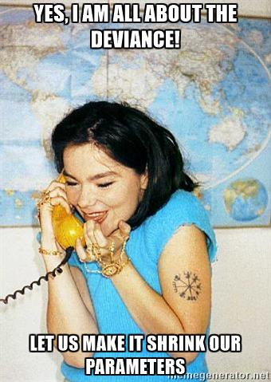

class: center
# Frequentist Tests of Statistical Models


```{r setup, include=FALSE}
library(knitr)
library(ggplot2)
library(dplyr)
library(tidyr)
library(mvtnorm)
library(broom)
library(purrr)

opts_chunk$set(fig.height=6, 
               fig.width = 8,
               fig.align = "center",
               comment=NA, 
               warning=FALSE, 
               echo = FALSE,
               message = FALSE)

options(htmltools.dir.version = FALSE)
theme_set(theme_bw(base_size=18))
```


```{r puffer, include=FALSE}
puffer <- read.csv("lectures/data/11/16q11PufferfishMimicry Caley & Schluter 2003.csv")
puffer_lm <- lm(predators ~ resemblance, data=puffer)

puffer_glm <- glm(predators ~ resemblance, 
                  data = puffer,
                  family = gaussian(link = "identity"))
```

---
## Making P-Values with Models


1. Linear Models  
  
2. Generalized Linear Models & Likelihood  
  
3. Mixed Models

---

# Common Regression Test Statistics

   
- Are my coefficients 0?
    - **Null Hypothesis**: Coefficients are 0  
    - **Test Statistic**: T distribution (normal distribution modified for low sample size)

--

- Does my model explain variability in the data?
     - **Null Hypothesis**: The ratio of variability from your predictors versus noise is 1
     - **Test Statistic**: F distribution (describes ratio of two variances)
  

---
background-image: url(images/09/guiness_full.jpg)
background-position: center
background-size: contain
background-color: black

---
background-image: url(images/09/gosset.jpg)
background-position: center
background-size: contain

---
# T-Distributions are What You'd Expect Sampling a Standard Normal Population with a Small Sample Size

- t = mean/SE, DF = n-1
- It assumes a normal population with mean of 0 and SD of 1

```{r dist_shape_t, fig.height=5}
x_dists <- data.frame(x=seq(-2.5, 2.5, 0.01)) %>%
  mutate(dn = dnorm(x),
         dt_1 = dt(x, 1),
         dt_2 = dt(x, 2),
         dt_3 = dt(x, 3)
  )

x_df <- data.frame(x=rnorm(100), x_unif=runif(100))

ggplot() +
  geom_line(data=x_dists, mapping=aes(x=x, y=dn)) +
  geom_line(data=x_dists, mapping=aes(x=x, y=dt_1), color="red") +
  geom_line(data=x_dists, mapping=aes(x=x, y=dt_2), color="orange") +
  geom_line(data=x_dists, mapping=aes(x=x, y=dt_3), color="blue") +
  theme_classic(base_size=14) +
  annotate(x=c(0.2,0.7,1.1,1.2), y=c(0.4, 0.3, 0.2, 0.1), 
             label=c("Normal","3DF", "2DF", "1DF"), fill="white",
            fontface = "bold", geom="label") +
  ylab("density")
```

---
# Assessing the Slope with a T-Test
<br>
$$\Large t_{b} = \frac{b - \beta_{0}}{SE_{b}}$$ 

#### DF=n-2

$H_0: \beta_{0} = 0$, but we can test other hypotheses

---
# Slope of Puffer Relationship (DF = 1 for Parameter Tests)
```{r puffer_t}
knitr::kable(coef(summary(puffer_lm)), digits = 3)
```

<Br>
p is **very** small here so...  
We reject the hypothesis of no slope for resemblance, but fail to reject it for the intercept.

---

# So, what can we say in a null hypothesis testing framework?

.pull-left[

- We reject that there is no relationship between resemblance and predator visits in our experiment. 

- `r round(summary(puffer_lm)$r.squared, 2)` of the variability in predator visits is associated with resemblance. 
]

.pull-right[

```{r puffershow}
```
]


---
# Does my model explain variability in the data?

Ho = The model predicts no variation in the data.  

Ha = The model predicts variation in the data.

--

To evaluate these hypotheses, we need to have a measure of variation explained by data versus error - the sums of squares! 

--

This is an Analysis of Variance..... **ANOVA**!

--
$$SS_{Total} = SS_{Regression} + SS_{Error}$$
---

# Sums of Squares of Error, Visually
```{r linefit}
set.seed(697)
x<-1:10
y<-rnorm(10, mean=x,sd=2)
a<-lm(y~x)
plot(x,y,pch=19, cex=1.5)
abline(a, lwd=2)
segments(x,fitted(a),x,y, col="red", lwd=2)
``` 


---
# Sums of Squares of Regression, Visually
```{r ssr}
plot(x,y,pch=19, cex=0, cex.lab=1.5, cex.axis=1.1)
abline(a, lwd=2)
abline(b = 0, a = mean(y), col = "blue")
points(mean(x), mean(y), col="blue", pch=15)
points(x, fitted(a), col="blue", pch=1)
segments(x, fitted(a), x, mean(y), col = "blue")
``` 

Distance from $\hat{y}$ to $\bar{y}$

---
# Components of the Total Sums of Squares

$SS_{R} = \sum(\hat{Y_{i}} - \bar{Y})^{2}$, df=1

$SS_{E} = \sum(Y_{i} - \hat{Y}_{i})^2$, df=n-2


--
To compare them, we need to correct for different DF. This is the Mean
Square.

MS=SS/DF

e.g, $MS_{E} = \frac{SS_{E}}{n-2}$

---

# The F Distribution and Ratios of Variances

$F = \frac{MS_{R}}{MS_{E}}$ with DF=1,n-2 

```{r f}

x<-seq(0,6,.01)
qplot(x,df(x,1,25), geom="line",  xlab="Y", ylab="df(Y)") + 
  theme_bw(base_size=17)

```

---
# F-Test and Pufferfish
```{r f-puffer}
knitr::kable(anova(puffer_lm))
```

<br><br>
--
We  reject the null hypothesis that resemblance does not explain variability in predator approaches

---
# Testing the Coefficients

 -  F-Tests evaluate whether elements of the model contribute to variability in the data
      - Are modeled predictors just noise?
      - What's the difference between a model with only an intercept and an intercept and slope?

--

- T-tests evaluate whether coefficients are different from 0

--

- Often, F and T agree - but not always
    - T can be more sensitive with multiple predictors

---

# What About Models with Categorical Variables?

- T-tests for Coefficients with Treatment Contrasts  

- F Tests for Variability Explained by Including Categorical Predictor  
      - **ANOVA**
  
- More T-Tests for Posthoc Evaluation

---
# What Explains This Data? Same as Regression (because it's all a linear model)
```{r brain_anova_viz_1}

brainGene <- read.csv("lectures/data/19/15q06DisordersAndGeneExpression.csv") %>%
  mutate(group = forcats::fct_relevel(group, c("control", "schizo", "bipolar")))

brain_lm <- lm(PLP1.expression ~ group, data=brainGene)

brainGene$subj <- 1:nrow(brainGene)
jls <- brainGene %>%
  group_by(group) %>%
  summarise(mean_expression = mean(PLP1.expression)) %>%
  ungroup()

data_plot <- ggplot(data=brainGene, mapping=aes(x=group, y=PLP1.expression, color=group)) +
  geom_point(mapping=aes(group=subj), position=position_dodge(width=0.5)) +
  theme_bw(base_size=14)

data_plot
```

---
# Variability due to Model (between groups)
```{r brain_anova_viz_2}
model_plot <- data_plot +
    geom_boxplot(data=jls, mapping=aes(x=group, y=mean_expression)) 

model_plot+
  geom_hline(yintercept = mean(brainGene$PLP1.expression), lty = 2) +
  geom_segment(data = bind_cols(jls, data.frame(y = mean(brainGene$PLP1.expression))),
               aes(xend = group, yend = y, y = mean_expression),
               size = 2, color = "black")
```

---
# Variability due to Error (Within Groups)
```{r brain_anova_viz_3}
brainGene <- brainGene %>%
  group_by(group) %>%
  mutate(mean_expression = mean(PLP1.expression)) %>%
  ungroup()

model_plot + 
  geom_linerange(data = brainGene, mapping=aes(x=group, ymin = mean_expression, ymax = PLP1.expression, group=subj), position=position_dodge(width=0.5))
```


---
# F-Test to Compare
<br><br>
$SS_{Total} = SS_{Model} + SS_{Error}$ 

--

(Classic ANOVA: $SS_{Total} = SS_{Between} + SS_{Within}$)

--

Yes, these are the same!

---
# F-Test to Compare

$SS_{Model} = \sum_{i}\sum_{j}(\bar{Y_{i}} - \bar{Y})^{2}$, df=k-1  

$SS_{Error} = \sum_{i}\sum_{j}(Y_{ij} - \bar{Y_{i}})^2$, df=n-k  


To compare them, we need to correct for different DF. This is the Mean Square.  

MS = SS/DF, e.g, $MS_{W} = \frac{SS_{W}}{n-k}$   


---
# ANOVA

```{r brainGene_anova}
brain_lm <- lm(PLP1.expression ~ group, data=brainGene)
knitr::kable(anova(lm(PLP1.expression ~ group, data=brainGene)))
```

We have strong confidence that we can reject the null hypothesis

---
# This Works the Same for Multiple Categorical


TreatmentHo: $\mu_{i1} = \mu{i2} = \mu{i3} = ...$


Block Ho: $\mu_{j1} = \mu{j2} = \mu{j3} = ...$


i.e., The variance due to each treatment type is no different than noise

---
# We Decompose Sums of Squares for Multiple Predictors

$SS_{Total} = SS_{A} + SS_{B} + SS_{Error}$

- Factors are Orthogonal and Balanced, so, Model SS can be split
     -   F-Test using Mean Squares as Before


---

# What About Unbalanced Data or Mixing in Continuous Predictors?

- Let's Assume Y ~ A + B where A is categorical and B is continuous  

--

- F-Tests are really model comparisons

--

- The SS for A is the Residual SS of Y ~ A + B  - Residual SS of Y ~ B 
      - This type of SS is called **marginal SS** or **type II SS**
      
--

- Proceed as normal

--

- This also works for interactions, where interactions are all tested including additive or lower-level interaction components
     - e.g., SS for AB is RSS for A+B+AB - RSS for A+B
     
---

# Warning for Working with SAS Product Users (e.g., JMP)

- You will sometimes see *Type III* which is sometimes nonsensical
     - e.g., SS for A is RSS for A+B+AB - RSS for B+AB
     
--

- Always question the default settings!

---
class:center, middle

# F-Tests tell you if you can reject the null that predictors do not explain anything

---
# Post-Hoc Comparisons of Groups

- **Only compare groups if you reject a Null Hypothesis via F-Test**
      - Otherwise, any results are spurious  
      - This is why they are called post-hocs
      
--

- We've been here before with SEs and CIs  

--

- In truth, we are using T-tests

--

- BUT - we now correct p-values for Family-Wise Error (if at all)

---
## Making P-Values with Models


1. Linear Models   
  
2. .red[Generalized Linear Models & Likelihood]   
  
3. Mixed Models


---
# To Get There to Testing, We Need To Understand Likelihood and Deviance

.center[


---

class: middle

# Likelihood: how well data support a given hypothesis.

--


### Note: Each and every parameter choice IS a hypothesis

---

# Likelihood Defined
<br><br>
$$\Large L(H | D) = p(D | H)$$


Where the D is the data and H is the hypothesis (model) including a both a data generating process with some choice of parameters (often called $\theta$). The error generating process is inherent in the choice of probability distribution used for calculation.

---
class: middle

## The Maximum Likelihood Estimate is the value at which $p(D | \theta)$ - our likelihood function -  is highest.

--

#### To find it, we search across various values of $\theta$

---
# MLE for Multiple Data Points

Let's say this is our data:
```{r}
set.seed(2020)
dat <- rnorm(20, 3, 1)
dat
```

--

We know that the data comes from a normal population with a $\sigma$ of 1.... but we want to get the MLE of the mean.

--

$p(D|\theta) = \prod p(D_i|\theta)$  


--

&nbsp; &nbsp;     = $\prod dnorm(D_i, \mu, \sigma = 1)$
     
---

# Likelihood At Different Choices of Mean, Visually

```{r ml_search}
ml_dat <- crossing(mu = c(0,1,3,5), x = dat) %>%
  mutate(lik = dnorm(x, mu, 1),
         base = 0)

ml_lik <- ml_dat %>%
  group_by(mu) %>%
  summarize(lik = prod(lik))

norm_curves <- crossing(x = seq(-2,7, by = .1),
                        mu = c(0,1,3,5)) %>%
  mutate(lik = dnorm(x,mu,1))

ggplot(norm_curves,
       aes(x = x, y = lik, group = factor(mu))) +
  geom_line() +
  facet_wrap(~mu) +
  geom_segment(data = ml_dat,
               aes(x = x, y = base, xend = x, yend = lik), 
               color = "red") +
  labs(title = "Probability of Points at Different Means",
       x = "",
       y = "probability")
```


---
# The Likelihood Surface

```{r lik_mean_surf}
ml_search <- tibble(mu = seq(-1,7,length.out = 500)) %>%
  rowwise(mu) %>%
  summarise(lik = prod(dnorm(dat, mu, 1)))

mle <- ml_search %>% 
  arrange(desc(lik)) %>% 
  pull(mu) %>% `[`(1) %>%
  round(3)

ggplot(ml_search,
       aes(x = mu, y = lik)) + 
  geom_point() + 
  labs(y = "Likelihood")
```

MLE = `r mle`

---

# The Log-Likelihood Surface

We use Log-Likelihood as it is not subject to rounding error, and approximately $\chi^2$ distributed.

```{r loglik_surf}

ml_search_ll <- tibble(mu = seq(2.1,3.7,length.out = 500)) %>%
  rowwise(mu) %>%
  summarise(lik = sum(dnorm(dat, mu, 1, log = TRUE))) %>% 
  ungroup() %>%
  mutate(base = min(lik))

ggplot(ml_search_ll,
       aes(x = mu, y = lik)) + 
  geom_point() + 
  labs(y = "Log-Likelihood")
```
---

# The $\chi^2$ Distribution

- Distribution of sums of squares of k data points drawn from N(0,1)

- k = Degrees of Freedom

- Measures goodness of fit

- A large probability density indicates a match between the squared difference of an observation and expectation

---

# The $\chi^2$ Distribution, Visually
```{r chisq_dist}
cdat <- crossing(k = seq(1,9,2),
                 x = seq(0.25,8, length.out = 200)) %>%
  mutate(density = dchisq(x, k))

ggplot(cdat,
       aes(x = x, y = density, color = factor(k))) +
  geom_line(size = 1.2) +
  scale_color_brewer(palette = "Set1")

```

---

# Hey, Look, it's the Standard Error!

The 68% CI of  a $\chi^2$ distribution is 0.49, so....

```{r loglik_zoom}
se_ci <- ml_search_ll %>%
  filter(lik >= max(lik)- 0.49) %>%
  filter(row_number()==1 | row_number()==n())

ci_ci <- ml_search_ll %>%
  filter(lik >= max(lik)- 1.92) %>%
  filter(row_number()==1 | row_number()==n())

se_plot <- ggplot(ml_search_ll,
       aes(x = mu, y = lik)) + 
  geom_point() + 
  labs(y = "Log-Likelihood") +
  geom_point(data = ml_search_ll %>% arrange(desc(lik)) %>% slice(1L),
             color = "blue", size = 5) +
  geom_point(data = se_ci, color = "red", size = 4) +
  geom_segment(data = se_ci, aes(x = mu, xend = mu,
                                 y = base, yend = lik), 
               lty = 2, color = "red", size = 2)

se_plot
```

---

# Hey, Look, it's the 95% CI!

The 95% CI of  a $\chi^2$ distribution is 1.92, so....

```{r ll_ci}
se_plot +  
  geom_point(data = ci_ci, color = "purple", size = 4) +
  geom_segment(data = ci_ci, aes(x = mu, xend = mu,
                                 y = base, yend = lik), 
               lty = 2, color = "purple", size = 2)
  
```


---
# The Deviance: -2 * Log-Likelihood

- Measure of fit. Smaller deviance = closer to perfect fit  
- We are minimizing now, just like minimizing sums of squares 
- Point deviance residuals have meaning  
- Point deviance of linear regression = mean square error!

```{r show_dev, fig.height = 5}

ml_search_ll <- ml_search_ll %>%
  mutate(deviance = -2*lik)

ggplot(ml_search_ll,
       aes(x = mu, y = deviance)) + 
  geom_point() 
```


---
# Putting MLE Into Practice with Pufferfish

```{r pufferload}
puffer <- read.csv("lectures/data/11/16q11PufferfishMimicry Caley & Schluter 2003.csv")
```

.pull-left[
- Pufferfish are toxic/harmful to predators  
<br>
- Batesian mimics gain protection from predation - why?
<br><br>
- Evolved response to appearance?
<br><br>
- Researchers tested with mimics varying in toxic pufferfish resemblance
]

.pull-right[

]
---
# This is our fit relationship
```{r puffershow}
puffer_lm <- glm(predators ~ resemblance, data = puffer)

pufferplot <- ggplot(puffer, mapping=aes(x=resemblance, y=predators)) +
  ylab("Predator Approaches per Trial") + 
  xlab("Dissimilarity to Toxic Pufferfish")  +
  geom_point(size = 3) +
  theme_bw(base_size=24) 

pufferplot + stat_smooth(method = "lm")
```

---
# Likelihood Function for Linear Regression
<br><br><br>
<center>Will often see:<br><br>
$\large L(\theta | D) = \prod_{i=1}^n p(y_i\; | \; x_i;\ \beta_0, \beta_1, \sigma)$ </center>

---
# Likelihood Function for Linear Regression: What it Means
<br><br>
$$L(\theta | Data) = \prod_{i=1}^n \mathcal{N}(Visits_i\; |\; \beta_{0} + \beta_{1} Resemblance_i, \sigma)$$
<br><br>
where $\beta_{0}, \beta_{1}, \sigma$ are elements of $\theta$

---

# The Log-Likelihood Surface from Grid Sampling

```{r reg_lik_surf}
puffer_ll <- function(slope, int){
  yhat <- puffer$resemblance * slope + int
  sum(dnorm(yhat, puffer$predators, 3.053)) #from lm
}

coefs <- crossing(int = seq(-30,30, length.out = 200),
                  slope = seq(-5,12, length.out = 200)) %>%
  rowwise(slope, int) %>%
  mutate(logLik = puffer_ll(slope, int)) %>%
  ungroup()

ll_plot_reg <- ggplot(data = coefs,
       aes(x = slope, y = int, fill = logLik)) +
  geom_raster() +
  scale_fill_viridis_c(option = "C")

ll_plot_reg
# 
# ll_plot_reg %>%
#   rayshader::plot_gg(phi = 30, theta = 45, zoom = 0.6)
# rgl::rglwidget()
```


---
# Let's Look at Profiles to get CIs
```{r profileR, echo=FALSE, message=FALSE, warning=FALSE}
library(profileModel)
prof <- profileModel(puffer_glm,
                     objective = "ordinaryDeviance",
                     quantile = qchisq(0.95, 1),
                     verbose = FALSE)

#plot(prof, mfrow=c(1,2))


as.data.frame.profileModel <- function(obj){
  out <- lapply(obj$profiles, function(x){
    x <- as.data.frame(x)
    x$Parameter <- names(x)[1]
    names(x)[1] <- "Value"
    x[c("Parameter", "Value", "Differences")]
  }
  )
  
  do.call(rbind, out)
}

prof_data <- as.data.frame.profileModel(prof)

ggplot(prof_data,
       aes(x = Value, y = Differences)) +
  geom_line() +
  facet_wrap(~Parameter, scale = "free_x") +
  geom_hline(yintercept = 2*1.92, lty = 2, color = "red") +
  ylab("Difference from Minimum Deviance")

```


---
# Evaluate Coefficients
```{r mle_coef}
knitr::kable(tidy(puffer_glm), digits = 3, "html") %>% kableExtra::kable_styling("striped")
```

<br>
Test Statistic is a Wald Z-Test Assuming a well behaved quadratic Confidence Interval

---
class: center, middle

# What about comparing models, or evaluating if variables (continuous or categorical) should be included?


---
# Can Compare p(data | H) for alternate Parameter Values - and it could be 0!

```{r likelihoodDemo3}

ggplot(norm_curves %>% filter(mu %in% c(0,3)),
       aes(x = x, y = lik, group = factor(mu))) +
  geom_line() +
  facet_wrap(~mu) +
  geom_segment(data = ml_dat %>% filter(mu %in% c(0,3)),
               aes(x = x, y = base, xend = x, yend = lik), 
               color = "red") +
  labs(title = "Probability of Points at Different Means",
       x = "",
       y = "probability")

```


Compare $p(D|\theta_{1})$ versus $p(D|\theta_{2})$

---

## Likelihood Ratios
<br>
$$\LARGE G = \frac{L(H_1 | D)}{L(H_2 | D)}$$

- G is the ratio of *Maximum Likelihoods* from each model  
  
--
  
- Used to compare goodness of fit of different models/hypotheses  

--
  
- Most often, $\theta$ = MLE versus $\theta$ = 0  
  
--

- $-2 log(G)$ is $\chi^2$ distributed  

---
# Likelihood Ratio Test

- A new test statistic: $D = -2 log(G)$  

--

- $= 2 [Log(L(H_2 | D)) - Log(L(H_1 | D))]$  

--

- We then scale by *dispersion parameter* (e.g., variance, etc.)  

--

- It's $\chi^2$ distributed!   
     - DF = Difference in # of Parameters  

--

- If $H_1$ is the Null Model, we have support for our alternate model

---
# Likelihood Ratio Test for Regression

- We compare our slope + intercept to a model fit with only an intercept!

- Note, models must have the SAME response variable

```{r intmod, echo = TRUE}
int_only <- glm(predators ~ 1, data = puffer)
```

--

- We then use *Analysis of Deviance* (ANODEV)

---
# Our First ANODEV

```{r}
anova(int_only, puffer_glm, test = "LRT")
```

Note, uses Difference in Deviance / Dispersion where Dispersion = Variance as LRT


---
# Or, R has Tools to Automate Doing This Piece by Piece

```{r}
car::Anova(puffer_glm)
```

Here, LRT = Difference in Deviance / Dispersion where Dispersion = Variance


---
## Making P-Values with Models


1. Linear Models  
  
2. Generalized Linear Models & Likelihood  
  
3. .red[Mixed Models]

---
# Let's take this to the beach with Tide Height: RIKZ


```{r rikz_start, echo=FALSE}
library(Data4Ecologists)

RIKZdat$Beach <- factor(RIKZdat$Beach)
RIKZdat$log_richness <- log(RIKZdat$Richness+1)
```

---
# How is Tidal Height of Measurement Associated With Species Richness?

```{r, echo=FALSE}
library(lme4)
library(modelbased)
library(broom.mixed)

# first the lmer
rikz_varint <- lmer(log_richness ~ NAP +
                      
                      (1|Beach),
                    
                    data = RIKZdat)

rikz_varint_ml <- lmer(log_richness ~ NAP +
                      
                      (1|Beach),
                    
                    data = RIKZdat, 
                    REML = FALSE)

rikz_varint_glm <- glmer(Richness ~ NAP +
                        
                        (1|Beach), 
                        
                        family = poisson,
                    
                    data = RIKZdat)
```

```{r plot_varint}

fixed_pred <- estimate_relation(rikz_varint) 

estimate_relation(rikz_varint, include_random = TRUE) |> 
  plot(ribbon = list(alpha = 0)) +
  geom_line(data = fixed_pred, 
            aes(x = NAP, y = Predicted), linewidth = 2,
            color = "black")+
  labs(title = "")
```

---
class: center, middle

## Before we go any further - keep up to date at 

### https://bbolker.github.io/mixedmodels-misc/glmmFAQ.html#testing-hypotheses

---
class: center, middle

## The Big Question: What are your degrees of freedom in the presence of a random effect?

---

## Approaches to approximating DF

- Satterthwaite approximation - Based on sample sizes and variances within groups  
     - `lmerTest` (which is kinda broken at the moment)
     
- Kenward-Roger’s approximation. 
      - Based on estimate of variance-covariance matrix of fixed effects and a scaling factor  
      - More conservative - in `car::Anova()` and `pbkrtest`
---
# Compare!

Baseline - only for balanced LMMs!
```{r, echo = FALSE}
anova(rikz_varint)
```

Satterwaith
```{r, echo = FALSE}
library(lmerTest)

rikz_varint2 <- lmer(log_richness ~ NAP +
                      
                      (1|Beach),
                    
                    data = RIKZdat)

anova(rikz_varint2)
```

Kenward-Roger
```{r, echo = FALSE}
car::Anova(rikz_varint, test.statistic = "F") 
```


---
## The Smaller Questions and Answers

1. With REML (for lmms), we often are conservative in our estimation of fixed effects. Should we use it?
     - use ML for FE tests if using Chisq 

--

2. Should we use Chi-Square?
     - for GLMMs, yes.
     - Can be unreliable in some scenarios. 
     - Use F tests for lmms
     
---

# F and Chisq

F-test
```{r}
car::Anova(rikz_varint, test.statistic = "F") |> tidy()
```

LR Chisq
```{r}
car::Anova(rikz_varint, test.statistic = "Chisq") |> tidy()
```

--

LR Chisq where REML = FALSE
```{r}
car::Anova(rikz_varint_ml) |> tidy()
```

---

## What about Random Effects

- For LMMs, make sure you have fit with REML = TRUE

--

- One school of thought is to leave them in place  
     - Your RE structure should be determined by sampling design
     - Do you know enough to change your RE structure?
     
--

- But sometimes you need to test!  
     - Can sequentially drop RE effects with `lmerTest::ranova()`  
     - Can simulate models with 0 variance in RE with `rlrsim`, but gets tricky  
     

---

## RANOVA

```{r, echo = TRUE}
ranova(rikz_varint)
```

---

## Testing Mixed Models

1. Yes you can!  

--

2. Some of the fun issues of denominator DF raise their heads

--

3. Keep up to date on the literature/FAQ when you are using them!

---

class: center, middle

