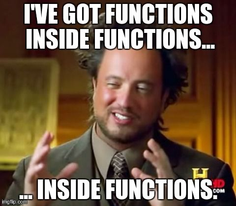

---
title:
css: style.css
output:
  revealjs::revealjs_presentation:
    reveal_options:
      slideNumber: true
      previewLinks: true
    theme: white
    center: false
    transition: fade
    self_contained: false
    lib_dir: libs
---
## 
<br>
<h2><center>Writing Reusable Code with Functions</center></h2>


```{r prep, echo=FALSE, cache=FALSE, message=FALSE, warning=FALSE}
library(knitr)
library(dplyr)
library(ggplot2)
theme_set(theme_bw(base_size=16))

opts_chunk$set(fig.height=5, fig.width=7, comment=NA, 
               warning=FALSE, message=FALSE, 
               dev="jpeg", echo=TRUE)


```

## Let's say you want to do this...

1. Start with sample sizes 3 through 5, and a population mean, and SD.

2. Run 1000 simulations.

3. For each simulation, calculate a mean, and then get the SE of the mean.

4. Have it all appear in a data frame with sample size and SE.


## You could....

```{r, bad_nofun}
m <- 5
s <- 2

my_df <- data.frame(samp_size = 3:5,
                    se = rep(NA, 3))

my_df$se[1] <- sd(replicate(1000, 
                            mean(rnorm(my_df$samp_size[1], m, s))))
my_df$se[2] <- sd(replicate(1000, 
                            mean(rnorm(my_df$samp_size[2], m, s))))
my_df$se[3] <- sd(replicate(1000, 
                            mean(rnorm(my_df$samp_size[3], m, s))))

```

> (yes, this is pre-dplyr)

## So....What is wrong here?
```{r bad_nofun, eval = FALSE}
```

## Some wrong things

1. Copy-pasting is error prone  
  
2. Repeated code can get long  
  
3. Not scalable  
  
4. You were doing 4 things in each line of code! Unreadable?


## 

<br><br><br><h2>Solutions?</h2>

## Solutions
1. Write code for each individual sample size  
    - Lots of copy-paste  
    - What about if you have a different mean and SD?
    
2. Iterate over indices somhow?   
     - Only good for this one case - fragile code   
     
3. FUNCTIONS!

## A Funcitonal Outline
1. Intro to Functions  
     
2. Modular Programming

## When to write a function
<p align="left"><br><br>
"You should consider writing a function whenever you’ve copied and pasted a block of code more than twice" <Br> <br>- H. Wickham
</p>

## Ugh...
```{r eval=FALSE, echo=TRUE}
df <- tibble::tibble(
  a = rnorm(10),
  b = rnorm(10),
  c = rnorm(10),
  d = rnorm(10)
)

df$a <- (df$a - min(df$a, na.rm = TRUE)) / 
  (max(df$a, na.rm = TRUE) - min(df$a, na.rm = TRUE))
df$b <- (df$b - min(df$b, na.rm = TRUE)) / 
  (max(df$b, na.rm = TRUE) - min(df$a, na.rm = TRUE))
df$c <- (df$c - min(df$c, na.rm = TRUE)) / 
  (max(df$c, na.rm = TRUE) - min(df$c, na.rm = TRUE))
df$d <- (df$d - min(df$d, na.rm = TRUE)) / 
  (max(df$d, na.rm = TRUE) - min(df$d, na.rm = TRUE))
```

## What is a function?

```{r eval=FALSE, echo=TRUE}
my_cool_function <- function(arguments){
  
  something_to_give_back <- do_things(arguments)
  
  return(something_to_give_back)
}
```

## What is a function?
1. A new object  
2. A call identifying this as a function  
3. One or more arguments  
4. The body of the function  
5. A return statement that gives something back to the user (if needed)

## What is a function?
```{r fun, echo=TRUE}

add_one <- function(x){
  
  ret_value <- x + 1
  
  return(ret_value)
  
}

```

## What is a function?
```{r fun2, echo=TRUE}

add_one <- function(x){
  
  ret_value <- x + 1
  
  return(ret_value)
  
}

add_one(3)
```

## Simpler ways of writing functions
```{r addone_simpler, echo=TRUE}
add_one <- function(x){
  return(x+1)
}
```

<div class = "fragment"><p align="left">Super short!</p>
```{r addone_simpler2, echo=TRUE}
add_one <- function(x) x+1
```

</div>

## Let's write some functions
```{r fun2, echo=TRUE}
```

## Let's write some functions
```{r fun2_blank, echo=TRUE, eval=FALSE}

square_root <- function(___){
  
  ret_value <- sqrt(___)
  
  return(___)
  
}

square_root(16)
```

Should return 4

## Let's write some functions
```{r fun3, echo=TRUE, eval=FALSE}

max_minus_min <- _______(___){
  
  ret_value <- ___(___) - ___(___)
  
  ___(___)
  
}

max_minus_min(c(4,7,1,6,8))
```

```{r run3_good, echo=FALSE}
max_minus_min <- function(a_vector){
  
  ret_value <- max(a_vector, na.rm=T) - min(a_vector, na.rm=T)
  
  return(ret_value)
  
}

max_minus_min(c(4,7,1,6,8))
```

## On arguments
Functions can take many arguments:

```{r eval=FALSE, echo=TRUE}
my_function <- function(x, y, z, q)
```

These can be of any object type

## Arguments can have default values

```{r echo=TRUE}
add_values <- function(x, y=0){

  return(x+y)

}

add_values(3)
```

## You can have ... to pass many arguments
```{r echo=TRUE}
make_mean <- function(a_vector, ...){
  
  sum_vector <- sum(a_vector, ...)
  
  n <- length(a_vector)
  
  return(sum_vector/n)
  
  }

make_mean(c(4,5,6), na.rm=TRUE)

```

## Exercises
Write a function and paste it into the etherpad that

1. Takes a vector and sums it up after it squares it  
     - use `c(4,5,6)` to test (= 77)  
     
2. Takes a number and combine it into a string with the word "elephants" using `paste()`.  
     - 1 elephants, 2 elephants, 15 elephants  
     
3. Takes a number, a string, and a separator and combines them
     - my_function(3, "hello", "-") makes "3 - hello"  
     
EC. Write a function that takes a sample size, mean, SD, and number of sims, and returns a data frame with a mean and SE of said mean. Have it default to 100 sims.

## Why are we doing this to ourselves?


## A Function For Sampling
```{r read, echo=TRUE}
mean_and_se_sim <- function(n, m, s, sims = 100){
  samps <- replicate(sims, rnorm(n, m, s))
  
  means <- colMeans (samps)
  
  out <- data.frame(mean = mean(means),
                    se_mean = sd(means))
  
  return(out)
}

mean_and_se_sim(n = 5, m = 10, s = 3)
```

## How did I build that function?
1. OK, what's *normally* going to change 
     - Sample size, mean, and SD
     
2. BUT - what could change under some circumstances?
     - number of simulations

3. Write some test code

## Test Code

```{r test, echo=TRUE, eval=TRUE}
# define a sample size, mean, and SD

# draw samples

# calculate means from samples

# create a data frame with mean and se of the mean

# return
```

## Test Code

```{r test2, echo=TRUE, eval=TRUE, message=FALSE}
# define a sample size, mean, and SD
n <- 5
m <-10
s <- 3
sims <- 100

# draw samples
samps <- replicate(sims, rnorm(n, m, s))

# calculate means from samples
means <- colMeans (samps)

# create a data frame with mean and se of the mean
out <- data.frame(mean = mean(means),
                    se_mean = sd(means))
# return

```

## One  Function
```{r read, echo=TRUE}
```


## A Funcitonal Outline
1. Intro to Functions  
     
2. <font color="red">Modular Programming</font>

## Problems with Our Function
1. Two lines to get a bootstrapped mean?
     
2. Why only mean? Can we generalize?

## What to do? Modularize!
```{r read, message=FALSE, eval=FALSE}
```

## What to do? Modularize! 
```{r, echo=TRUE}

get_samp_rep <- function(n, m, s){
  samp <- rnorm(n, m, s)
  mean(samp)
}

mean_and_se_sim <- function(n, m, s, sims = 100){

  means <- replicate(sims, get_samp_rep(n, m, s))
    
  out <- data.frame(mean = mean(means),
                    se_mean = sd(means))
  
  return(out)
}
```

##


## Wait, what is this modular madness?
- Our code is now composed of modular pieces  
  
- This means each modular function can be used in other contexts
     - Enhances code flexibility and future reuse  
  
- It also means it is easier to find where our code has gone wrong  
     - Easier to test and debug
  
- AND - we don't get lost writing one honking single function
  
## How to write complex functions/piplines
1. Start with a wrapper   
     - Write out the steps of what you want to do in comments  
     - Pair those with functions using "snake case" `clean_data`  
     - Use `%>%` for efficiency/readability!  
        
2. Write the subfunctions  
     - Repeat the toplevel comments anf functions  
     
3. Continue until you have the lowest level atomized functions  
     
4. Test THOSE functions. Then test up the chain....

## Reality Check
<br><br><br>
Yes, sometimes you will write long functions - as long as they are simple and readable, meh

## What to do? Generalize! 
```{r, echo=TRUE}

get_samp_rep <- function(n, m, s, fun = mean){
  samp <- rnorm(n, m, s)
  fun(samp)
}

stat_and_se_sim <- function(n, m, s, 
                            fun = mean, sims = 100){

  vals <- replicate(sims, get_samp_rep(n, m, s, fun))
    
  out <- data.frame(stat = mean(vals),
                    se_stat = sd(vals))
  
  return(out)
}
```

## Does it blend?

```{r}
mean_and_se_sim(n = 5, m = 10, s = 3)

stat_and_se_sim(n = 5, m = 10, s = 3)
```

## Does it blend?

```{r}
stat_and_se_sim(n = 5, m = 10, s = 3)

stat_and_se_sim(n = 5, m = 10, s = 3, fun = median)

stat_and_se_sim(n = 5, m = 10, s = 3, fun = sd)
```

## Putting it All Together with Dplyr
```{r}
library(dplyr)

data.frame(samp_size = 5:10) %>%
  rowwise(samp_size) %>%
  summarize(stat_and_se_sim(n = 5, m = 10, s = 3, fun = sd)) %>%
  rename(s = stat, se_s = se_stat)
```
  

## Final Exercises
1. Write a function that will get the mean, sd, median, and IQR of a sample of a population.  
  
2. Write a function that uses this to get 1K resampled values to get the statistic and its SE.
  
3. Wrap it all in dplyr magick to get these statistics for sample sizes 3:5, means 2:5, and sd 1:3. Use tidyr::crossing to make the initial data frame.
