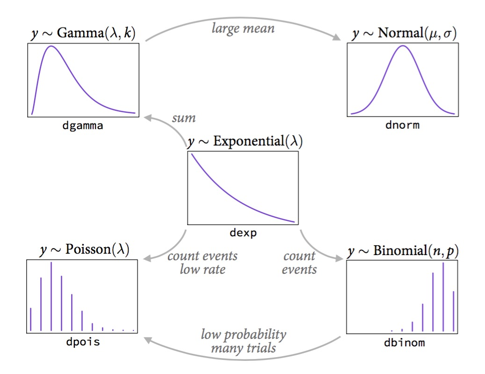
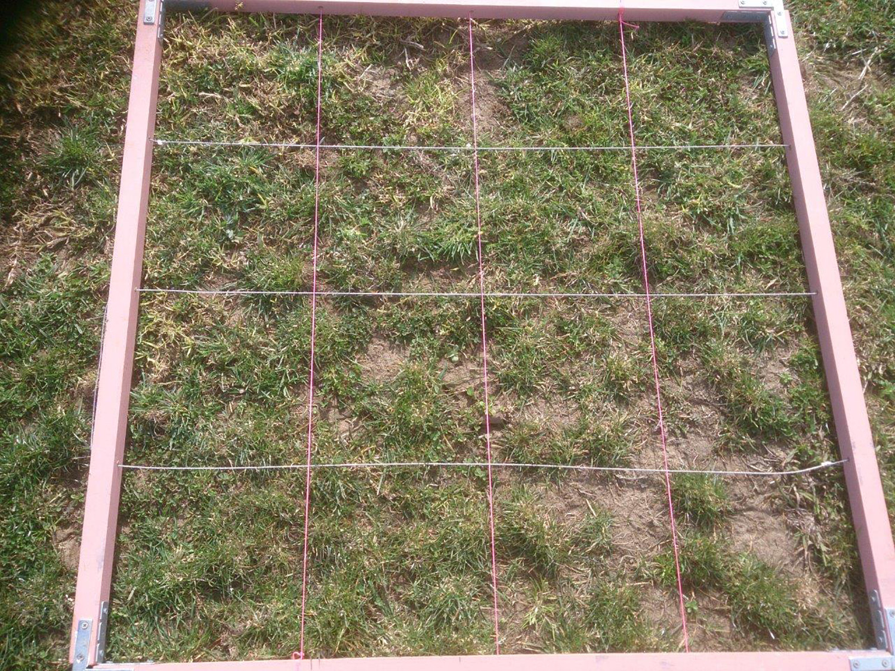
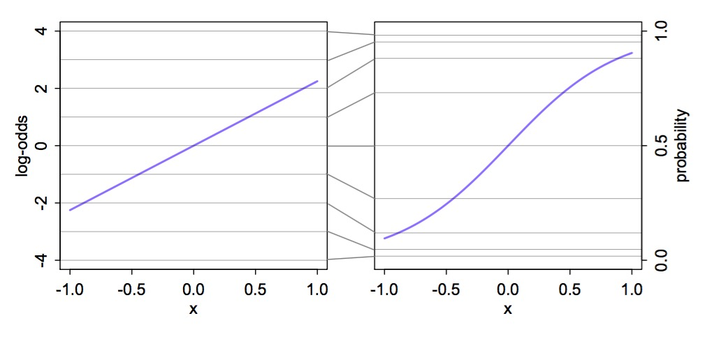
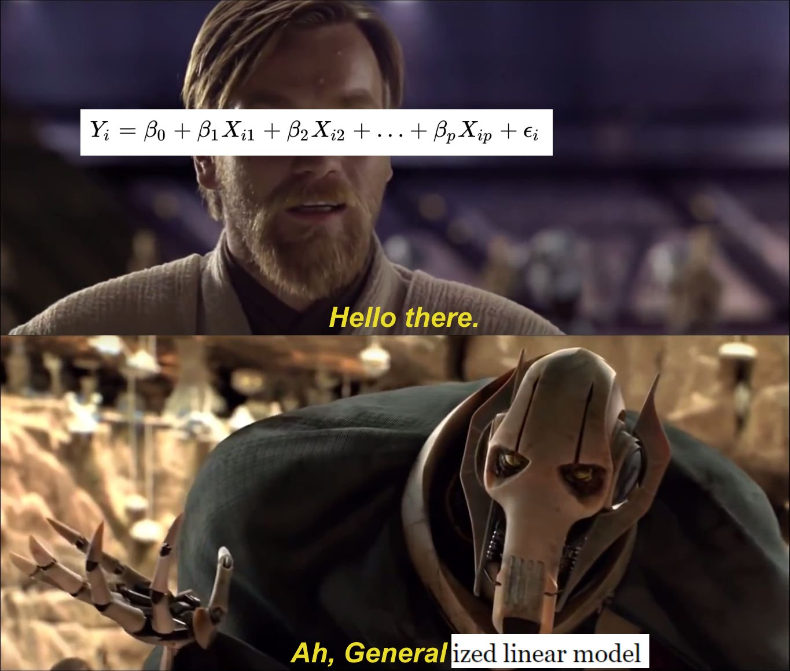

class: center, middle
# Generalized Linear Models


```{r prep, echo=FALSE, cache=FALSE, message=FALSE, warning=FALSE}
library(knitr)


opts_chunk$set(fig.height=7, 
               fig.width = 10,
               fig.align = "center",
               comment=NA, 
               warning=FALSE, 
               echo = FALSE,
               message = FALSE)

options(htmltools.dir.version = FALSE)

library(ggplot2)

library(dplyr)
library(tidyr)
library(broom)
library(broom.mixed)
library(MASS)
library(tibble)
library(performance)
library(glmmTMB)
library(nlme)
library(DHARMa)

theme_set(theme_bw(base_size = 16))
```

```{css, echo = FALSE}
.pull-left-small {
  float: left;
  width: 20%;
}
.pull-right-large {
  float: right;
  width: 80%;
}
```

---
# Where We Have Lived Until Now - a Normal World

```{r}

ggplot(tibble(x = seq(-3,3, length.out=200), y = dnorm(x)),
       aes(x=x, y=y)) +
  geom_line( size = 1.4) +
  labs(y="density", x="") +
  theme_classic(base_size = 18)

```


---
# Gaussian Distributions are Part of a Larger Interconnected Family of Distributions



---
# It Gets Crazy
```{r}
# https://www.randomservices.org/random/special/GeneralExponential.html
```
.center[  ]

See https://www.randomservices.org/random/special/GeneralExponential.html
---
# The Linear Model with Gaussian Error is a Special Case
$$\Large \boldsymbol{\eta_{i}} = \boldsymbol{\beta X_i} $$ 
<br><br>

$$\Large \hat{Y_i} = \eta_{i}$$
<br><br>


$$\Large Y_i \sim \mathcal{N}(\hat{Y_i},\sigma^{2})$$
---
# The Generalized Linear Model
$$\Large \boldsymbol{\eta_{i}} = \boldsymbol{\beta X_i} $$ 
<br><br>


$$\Large f(\hat{Y_i}) = \eta_{i}$$
.red[f is a link function]
<br><br>

$$\Large Y_i \sim \mathcal{D}(\hat{Y_i}, \theta)$$
<br><br>

$\mathcal{D}$ is some distribution from the **exponential family**, and $\theta$ are additional parameters specifying dispersion

---
# A Generalized Linear World

1. Wait, what are these different distributions and links?  

2. A Logistic Regression Example  
  
3. Overdispersion

---
# What Are Properties of Data that is Not Normal?


--

- Bounded

--

- Discrete

--

- Variance scales with mean

--

- Skewed, bimodal, or kurtotic

---
class: center, middle


---
# Count Data - Poisson or Negative Binomial
Discrete, variance-mean relationships (linear or squared)

```{r}
count_dat <- tibble(x = 1:40,
                    `Poisson` = dpois(x, 10),
                    `Negative Binomial` = dnbinom(x, size = 10, prob = 0.4)) |>
  pivot_longer(-x) |>
  mutate(name = factor(name, levels = c("Poisson", "Negative Binomial")))

ggplot(count_dat,
       aes(x = x, y = value, fill = name)) +
  geom_col(position = "nudge") +
  facet_wrap(vars(name)) +
  scale_fill_discrete(guide = "none")
```

---
# Outcomes of Trials - Binomial
Discrete, Yes/No or # of Outcomes of a Class - we model the probability

.pull-left-small[

]

.pull-right-large[
```{r, fig.width = 10}

tibble(x = 1:20,
       y = dbinom(x, 20, 0.2)) |>
  ggplot(aes(x=x, y=y)) +
  geom_col(fill = "purple") +
  labs(x = "# of positivies", y = "probability mass", subtitle = "20 trials, 20% success rate")

```
]

---
# Time to Achieve Outcomes - Gamma
Skewed continuous, variance-mean relationship

.pull-left-small[

]

.pull-right-large[
```{r}
tibble(x = seq(1,20,length.out=300),
       y = dgamma(x, 3, 0.5),
       ymin = 0) |>
  ggplot(aes(x=x, y=y, ymax = y, ymin = ymin, xmax = x)) +
  geom_ribbon(fill = "red") +
  labs(subtitle = "Waiting for 3 events\n one event every 2 units of time",
       y = "probability density", x = "time")
```
]
---
# Percents and Porportions - Beta
Bounded, Unimodal to Bimodal

.pull-left-small[

]

.pull-right-large[

```{r}
beta_df <- crossing(a = c(0.95,  2), b = c(0.95, 2), x=seq(0,1,length.out=200)) %>%
  mutate(dens = dbeta(x, a, b),
         ymin = 0)

ggplot(beta_df, aes(x=x, y=dens, ymax = dens,
                    ymin = ymin, xmin = x,
                    fill=factor(a), 
                    group=paste(a, b, sep=","))) +
  geom_ribbon() +
  facet_grid(a~b, labeller = "label_both") +
  scale_fill_discrete(guide = "none") +
  labs(y = "probability density", x = "porportion")
```

]

---
# The Generalized Linear Model
$$\Large \boldsymbol{\eta_{i}} = \boldsymbol{\beta X_i} $$ 
<br><br>


$$\Large f(\hat{Y_i}) = \eta_{i}$$
.red[f is a link function]
<br><br>

$$\Large Y_i \sim \mathcal{D}(\hat{Y_i}, \theta)$$
<br><br>

$\mathcal{D}$ is some distribution from the **exponential family**, and $\theta$ are additional parameters specifying dispersion

---

# Generalized Linear Models: Distributions


1.  The error distribution is from the **exponential family**
  - e.g., Normal, Poisson, Binomial, and more.  

--

2.  For these distributions, the variance is a funciton of the fitted
    value on the curve: $var(Y_i) = \theta V(\hat{Y_i})$
  - For a normal distribution, $var(Y_i) = \theta*1$ as
        $V(\hat{Y_i})=1$   

  - For a poisson distribution, $var(Y_i) = 1*\mu_i$ as
  $V(\hat{Y_i})=\hat{Y_i}$  

--

3. They have *canonical links* which are link functions that fall out from the shape of the distribution and map on to the domain of possible values  

  - e.g., the identity for the Gaussian  
     
  - We can also use non-canonical links  
        
---
# Distributions, Canonical Links, and Dispersion

|Distribution | Canonical Link | Variance Function|
|-------------|-------------|-------------|
|Normal | identity | $\theta$|
|Poisson | log | $\hat{Y_i}$|
|Binomial | logit | $\hat{Y_i}(1-\hat{Y_i})$|
|Negative Binomial | log | $\hat{Y_i} + \theta\hat{Y_i}^2$|
|Gamma | inverse | $\hat{Y_i}^2$|
| Beta | logit | $\hat{Y_i}(1 - \hat{Y_i})/(\theta + 1)$|

The key is to think about your residual variance and what is appropriate

---
# A Generalized Linear World

1. Wait, what are these different distributions and links?  

2. .red[A Logistic Regression Example]  
  
3. Overdispersion

---
background-image: url("images/25/cryptosporidiosis-cryptosporidium-hominis.jpeg")
background-position: center
background-size: cover
class: inverse, center

# Cryptosporidium Parasite


---
background-image: url("images/25/mouseinject.jpg")
background-position: center
background-size: cover
class: inverse

# What dose is needed to generate infection?

---

# Cryptosporidum Infection Rates
```{r crypto_data}
crypto <- read.csv("lectures/data/25/cryptoDATA.csv") %>%
  mutate(success=Y/N)
```

```{r crypto_plot}

cryptoPlot <- qplot(Dose, success, data=crypto) +
  theme_bw(base_size=16) +
  ylab("Fraction of Mice Infected")

cryptoPlot
```

---
# This is not linear or gaussian

```{r crypto_linear}
cryptoPlot +
  stat_smooth(method="lm")
```

---
class: center, middle

# STOP - before we go any further, you COULD .red[logit transform] a fraction from trials and use a linear model - if it meets assumptions, OK!

---
# Logit Transform


---
# Why GLM then?
1. It might not work,  2. We have unequal # of trials per point, 3. If our response had been binary

```{r}

qplot(Dose, success, data=crypto, size = N) +
  theme_bw(base_size=16) +
  ylab("Fraction of Mice Infected")
```

---
# Binary GLM

```{r}

tibble(Dose = rep(1:30, 100),
       `Infected?` = rbinom(30*100, 1, prob = Dose/30)) |>
  ggplot(aes(x = Dose, y = `Infected?`)) +
  geom_jitter(height = 0.02, width = 0.3, alpha = 0.1) +
  stat_smooth(method = "glm", method.args= list(family = binomial),
              color = "red")


```


---
class: center, middle


---
# Binomial Distribution
$$ Y_i \sim B(prob, size) $$

 * Discrete Distribution
 
--

 * prob = probability of something happening (% Infected)  

--

 * size = # of discrete trials  

--

 * Used for frequency or probability data  
 
--

 * We estimate coefficients that influence *prob*  
 
---
# Generalized Linear Model with a Logit Link

$$\Large \boldsymbol{\eta_{i}} = \boldsymbol{\beta X_i} $$ 
<br><br><br>

$$\Large Logit(\hat{Y_i}) = \eta_{i}$$
.red[Logit Link Function]
<br><br><br>

$$\Large Y_i \sim \mathcal{B}(\hat{Y_i}, size)$$
---
# Generalized Linear Model with Logit Link
```{r glm_crypto, echo=TRUE}
crypto_glm <- glm(Y/N ~ Dose,
                  weights=N,
                  family=binomial(link="logit"),
                  data=crypto)
```

OR, with Success and Failures

```{r glm_crypto2, echo=TRUE, eval=FALSE}
crypto_glm <- glm(cbind(Y, Y-N) ~ Dose,
                  family=binomial(link="logit"),
                  data=crypto)
```

---
# How About those Assumptions?

```{r}
check_predictions(crypto_glm, iterations = 50) |> plot() + theme_bw(base_size = 18)
```

---
# How About those Assumptions?

```{r}
check_outliers(crypto_glm) |> plot() + theme_bw(base_size = 18)
```

---
# Quantile Residuals
```{r}
a <- simulateResiduals(crypto_glm, n = 1e3)
plotQQunif(a, testUniformity = FALSE, testOutliers = FALSE, testDispersion = FALSE)
```

---
# Binned Residuals
### For a  *fitted* probability, look at average residual in a bin around it

```{r}
binned_residuals(crypto_glm, n_bins = 8) |> plot()
```

---
# OK, What Are We Estimating? 
### The Odds


## The Odds

$$Odds  = \frac{p}{1-p}$$
(e.g., 50:50 is an odds ratio of 1, 2:1 odds are pretty good! 1:100 odds is not!)

--

Logit coefficients are in:

$$Log-Odds = Log\frac{p}{1-p} = logit(p)$$

(log of 1 is 0, log of .69, log of .01 is -4.60517)

---
# Coefficients and Interpretation

```{r}
tidy(crypto_glm) |>
  dplyr::select(1:3) |>
  knitr::kable(digits = 3) |>
  kableExtra::kable_styling()
```

--

- Woof. Logit coefficients are tricky (go visualization!)  

--

- In essence, an increase in 1 unit of dose = an exp( 0.0135) increase in the ODDS of infection  
      - 1.014 increase (remember, 1 is a 50:50 chance!)

--

- You *can* use this to estimate change in %, but it requires knowing where you start from on the curve (this is a nonlinear curve after all)

---
# Easier to visualize to interpret
```{r crypto_logit}
cryptoPlot+
  stat_smooth(method="glm", aes(weight=N), 
              method.args=list(family=binomial(link = "logit")),  
              col="red", lwd=2) 
```

---
# Final Note on Logistic Regression

- Ideal for yes/no classification  
     - e.g. if your response variable is purely binary

- Has an extension to *multinomial logistic regression*
      - Many categories, often used for classification

- Only use if you can represent data as indepenent *trials*  
      - Internally, breaks responses into yes/no 
      
---
# A Generalized Linear World

1. Wait, what are these different distributions and links?  

2. A Logistic Regression Example  
  
3. .red[Overdispersion]

---
# What is the relationship between kelp holdfast size and number of fronds?

.center[  ]

---
# What About Kelp Holdfasts?
```{r kelp}
kelp <- read.csv("lectures/data/25/kelp_holdfast.csv")

kelp_plot <- qplot(HLD_DIAM, FRONDS, data=kelp) +
  theme_bw(base_size=17) +
  geom_point(size=2) +
  labs(x = "Holdfast Diameter (cm)", y = "# of Fronds")

kelp_plot 
```
---
# If you had Tried a Linear Model
```{r fit_kelp, echo=TRUE}
kelp_lm <- lm(FRONDS ~ HLD_DIAM, data=kelp)
```

```{r plot_lelp}
check_normality(kelp_lm) |> plot("qq") + theme_bw(base_size = 16)
```

---
# What is our data and error generating process?
```{r kelp}
```

---
# What is our data and error generating process?
- Data generating process should be exponential
       - No values less than 1  

--

- Error generating process should be Poisson
       - Count data

---
# Let's Fit a Model!

```{r kelp glm, echo=TRUE}
kelp_glm <- glm(FRONDS ~ HLD_DIAM, data=kelp,
                family=poisson(link="log"))
```

---
# Quantile Residuals for Kelp GLM with Log Link
```{r kelp_resid_dharma, echo=FALSE}
simulationOutput <- simulateResiduals(kelp_glm)
plotQQunif(simulationOutput, testUniformity = FALSE, testOutliers = FALSE,
           testDispersion = FALSE)
```

---
# Ruh Roh! What happened? Overdispersion of Data!
- When the variance increases faster than the mean, our data is overdispersed  

--

- This can be solved with different distributions whose variance have different properties  
--

 - OR, we can fit a model, then scale it’s variance posthoc with a coefficient  

--

-  The likelihood of these latter models is called a Quasi-likelihood, as it does not reflect the true spread of the data  
      - Good to avoid, as it causes inferential difficulties down the line
      
---
# For Count Data, Two Common Solutions

1. Negative Binomial
  - Variance = $\hat{Y_i}^2 + \theta\hat{Y_i}^2$|$
  - Increases with the square, not linearly
  - Although some forms also do linear...
  - Common for **clumped data**  
  
--

2. Quasi-Poisson  
  - Basically, Variance = $\theta\hat{Y}$  
  - Posthoc estimation of $\theta$
  - (Also a similar quasibinomial)  

--

3. Others where you model dispersion explicitly
  - You are in deeper waters here
       
---
# Plot of Smoothed Binned Residuals v. Predictor
Linear: Quasipoisson, Squared: Negative Binomial

```{r, fig.height = 6}
check_overdispersion(kelp_glm) |> plot() + theme_bw(base_size = 16)
```

See Ver Hoef and Boveng 2007

---
# New Fits


Negative Binomial

```{r nb, echo=TRUE}
library(MASS)
kelp_glm_nb <- glm.nb(FRONDS ~ HLD_DIAM, data=kelp)
```

OR

Quasipoisson
```{r qp, echo=TRUE}
kelp_glm_qp <- glm(FRONDS ~ HLD_DIAM, data=kelp, 
                 family=quasipoisson(link="log"))
```

---
# Checking The Quantile Residuals

```{r}
nb_qr <- simulateResiduals(kelp_glm_nb)
plotQQunif(nb_qr,
           testUniformity = FALSE,
           testOutliers = FALSE,
           testDispersion = FALSE)
```

---
# Looks Good!

```{r}
kelp_plot +
    stat_smooth(method="glm.nb", 
                method.args=list(link="log"))
```

---
# Final Note About GLMs and Overdispersion
### Many Distributions Cannot Handle 0s or 1s

```{r}
x <- rpois(100, 10)
x <- c(x, rep(0,50))

ggplot(data.frame(x=x),
       aes(x=x)) +
  geom_histogram(binwidth = 0.1) +
  labs(title = "This is Count Data", subtitle = "Needs a zero inflated distribution")
```

---
# The GLM Frontier
.pull-left[

]

.pull-right[
- GLMs can be intimidating, but, think about your data and shape of your data generating process  

- They are a jumping off point to more interesting error distributions  

- Mastering GLMs will unlock data that formerly was just frustrating
]