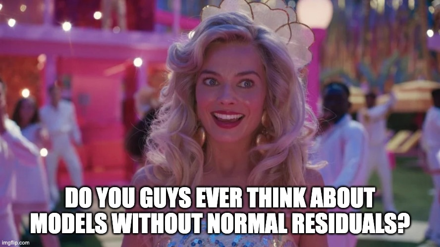
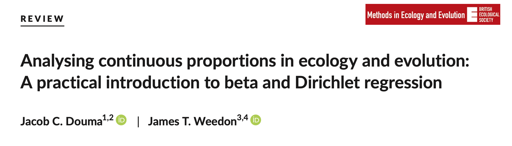
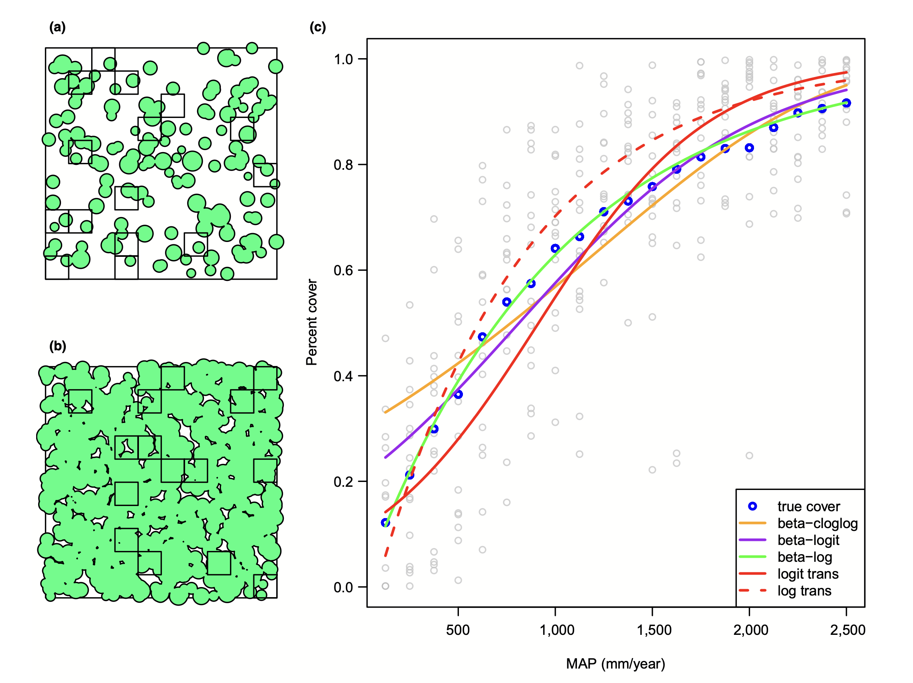

class: center, middle
# Generalized Linear Models


```{r prep, echo=FALSE, cache=FALSE, message=FALSE, warning=FALSE}
library(knitr)


opts_chunk$set(fig.height=7, 
               fig.width = 10,
               fig.align = "center",
               comment=NA, 
               warning=FALSE, 
               echo = FALSE,
               message = FALSE)

options(htmltools.dir.version = FALSE)

library(ggplot2)

library(car)
library(dplyr)
library(tidyr)
library(broom)
library(broom.mixed)
library(MASS)
library(tibble)
library(performance)
library(glmmTMB)
library(nlme)
library(DHARMa)
library(readxl)
library(readr)

theme_set(theme_bw(base_size = 16))
```

```{css, echo = FALSE}
.pull-left-small {
  float: left;
  width: 20%;
}
.pull-right-large {
  float: right;
  width: 80%;
}
```

---
background-image:url("images/glm/4_consumers.png")
background-size: contain

---
background-image:url("images/glm/plate.png")
background-size: contain

---
### My Data
```{r load_dat}
cons_div_aug <- read_xls("data/consumer_div_august_sample.xls") |>
    janitor::clean_names() |>
  dplyr::select(c(block:limpets_start, percent_open)) |>
  group_by(plate) |>
  mutate(abundance = sum(crabs_start,
                         urchins_start, 
                         chitons_start, 
                         limpets_start,
                         na.rm = TRUE)) |>
  ungroup() |>
         mutate(across(crabs_start:limpets_start, \(x) grepl("[0-9]", x)),
         predator_richness = crabs_start + urchins_start + chitons_start + limpets_start,
         is_replace = (abundance == 4 | abundance == 0)) |>
  dplyr::select(-c(crabs_start:limpets_start, x1:x4))|>
  filter(is_replace)

cons_div_aug |>
  dplyr::select(predator_richness, percent_open) |>
  head(10) |>
  kable() |> kableExtra::kable_paper()
```

---
## So....

```{r cons_plot}
ggplot(cons_div_aug,
       aes(x = predator_richness,
           y = percent_open)) +
  geom_point(position = position_jitter(width = 0.2))+
  stat_smooth(method = "lm")
```

---
## That was a Terrible Idea
```{r}
cons_lm <- lm(percent_open ~ predator_richness, data = cons_div_aug)

check_posterior_predictions(cons_lm) |> plot()
```


---
## That was a Terrible Idea
```{r}
plot(cons_lm, which = 1)
```

---
## That was a Terrible Idea
```{r}
check_normality(cons_lm) |> plot()
```

---
## Log (and other transformations) are not better
```{r}
lm(log(percent_open/100) ~ predator_richness, data = cons_div_aug) |>
check_normality() |> plot()
```

---
## The Answer is Not Normal.... or Linear
```{r}
cons_div_aug <- cons_div_aug |>
  mutate(porportion_open = percent_open/100)

breg <- glmmTMB(porportion_open ~ predator_richness,
                data = cons_div_aug,
                family = ordbeta())

cda <- augment(breg, type = "response", conf.int = TRUE,
               newdata = data.frame(predator_richness = seq(0,4, length.out = 200))) |>
  mutate(
         .lower = boot::inv.logit(.fitted - 2*.se.fit),
         .upper = boot::inv.logit(.fitted + 2*.se.fit),
         .fitted = boot::inv.logit(.fitted))

ggplot(cons_div_aug,
       aes(x = predator_richness,
           y = percent_open)) +
  geom_point(position = position_jitter(width = 0.2)) +
  geom_line(data = cda, aes(y = .fitted*100), color = "red") +
  geom_ribbon(data = cda, aes(y = .fitted*100,
                              ymin = 100*.lower,
                              ymax = 100*.upper),
              alpha = 0.2, color = "grey")
```

---
class:center, middle



---
# A Generalized Linear World

1. The Generalized Linear Model 
  
2. Logistic Regression & Assumption Tests 
  
3. Logit Curves with Continuous Data

---
# We Have Lived In a Normal World - Until Now

```{r}

ggplot(tibble(x = seq(-3,3, length.out=200), y = dnorm(x)),
       aes(x=x, y=y)) +
  geom_line( size = 1.4) +
  labs(y="density", x="") +
  theme_classic(base_size = 18)

```


---
# Gaussian Distributions are Part of a Larger Interconnected Family of Distributions


---
# It Gets Crazy
```{r}
# https://www.randomservices.org/random/special/GeneralExponential.html
```
.center[  ]

See https://www.randomservices.org/random/special/GeneralExponential.html

---
# The Linear Model with Gaussian Error 
$$\Large \hat{Y_i} = \boldsymbol{\beta X_i} $$ 
<br><br>


$$\Large Y_i \sim \mathcal{N}(\hat{Y_i},\sigma^{2})$$


---
# Let's Make a Small Change
$$\Large \boldsymbol{\eta_{i}} = \boldsymbol{\beta X_i} $$ 
<br><br>

$$\Large \hat{Y_i} = \eta_{i}$$
<br><br>


$$\Large Y_i \sim \mathcal{N}(\hat{Y_i},\sigma^{2})$$


---
# Another Teeeny Change - Link Functions
$$\Large \boldsymbol{\eta_{i}} = \boldsymbol{\beta X_i} $$ 
<br><br>

$$\Large f(\hat{Y_i}) = \eta_{i}$$
.red[f is a link function]  
.red[for linear regression, we call this an **identity link**]  


$$\Large Y_i \sim \mathcal{N}(\hat{Y_i},\sigma^{2})$$


---
## Hold up, isn't this just transformation?

- No.

--

- $log(Y) = \beta X + \epsilon$ means that $Y = exp(\beta X + \epsilon)$

--

- A **log link** with a normal residual means that
    - $log(\widehat{Y}) = \beta X$ but $\epsilon$ is additive to $\widehat{Y}$  
    - SO $Y = exp(\beta X) + \epsilon$


---
# So if THIS is the Generalized Linear Model with a Gaussian Error and an Identity Link...
$$\Large \boldsymbol{\eta_{i}} = \boldsymbol{\beta X_i} $$ 
<br><br>

$$\Large\hat{Y_i} = \eta_{i}$$

<br><br>


$$\Large Y_i \sim \mathcal{N}(\hat{Y_i},\sigma^{2})$$


---
# The Generalized Linear Model
$$\Large \boldsymbol{\eta_{i}} = \boldsymbol{\beta X_i} $$ 
<br><br>


$$\Large f(\hat{Y_i}) = \eta_{i}$$
.red[our link doesn't have to be linear]
<br><br>

$$\Large Y_i \sim \mathcal{D}(\hat{Y_i}, \theta)$$
<br><br>

$\mathcal{D}$ is some distribution from the **exponential family**, and $\theta$ are additional parameters specifying dispersion

---
# What Are Properties of Data that is Not Normal?


--

- Bounded

--

- Discrete

--

- Variance scales with mean

--

- Skewed, bimodal, or kurtotic

---
class: center, middle


---
# Count Data - Poisson or Negative Binomial
Discrete, variance-mean relationships (linear or squared)

```{r}
count_dat <- tibble(x = 1:40,
                    `Poisson` = dpois(x, 10),
                    `Negative Binomial` = dnbinom(x, size = 10, prob = 0.4)) |>
  pivot_longer(-x) |>
  mutate(name = factor(name, levels = c("Poisson", "Negative Binomial")))

ggplot(count_dat,
       aes(x = x, y = value, fill = name)) +
  geom_col(position = "nudge") +
  facet_wrap(vars(name)) +
  scale_fill_discrete(guide = "none")
```

---
# Outcomes of Trials - Binomial
Discrete, Yes/No or # of Outcomes of a Class - we model the probability

.pull-left-small[

]

.pull-right-large[
```{r, fig.width = 10}

tibble(x = 1:20,
       y = dbinom(x, 20, 0.2)) |>
  ggplot(aes(x=x, y=y)) +
  geom_col(fill = "purple") +
  labs(x = "# of positivies", y = "probability mass", subtitle = "20 trials, 20% success rate")

```
]

---
# Time to Achieve Outcomes - Gamma
Skewed continuous, variance-mean relationship

.pull-left-small[

]

.pull-right-large[
```{r}
tibble(x = seq(1,20,length.out=300),
       y = dgamma(x, 3, 0.5),
       ymin = 0) |>
  ggplot(aes(x=x, y=y, ymax = y, ymin = ymin, xmax = x)) +
  geom_ribbon(fill = "red") +
  labs(subtitle = "Waiting for 3 events\n one event every 2 units of time",
       y = "probability density", x = "time")
```
]
---
# Percents and Porportions - Beta
Bounded, Unimodal to Bimodal

.pull-left-small[

]

.pull-right-large[

```{r}
beta_df <- crossing(a = c(0.95,  2), b = c(0.95, 2), x=seq(0,1,length.out=200)) %>%
  mutate(dens = dbeta(x, a, b),
         ymin = 0)

ggplot(beta_df, aes(x=x, y=dens, ymax = dens,
                    ymin = ymin, xmin = x,
                    fill=factor(a), 
                    group=paste(a, b, sep=","))) +
  geom_ribbon() +
  facet_grid(a~b, labeller = "label_both") +
  scale_fill_discrete(guide = "none") +
  labs(y = "probability density", x = "porportion")
```

]

---
# The Generalized Linear Model
$$\Large \boldsymbol{\eta_{i}} = \boldsymbol{\beta X_i} $$ 
<br><br>


$$\Large f(\hat{Y_i}) = \eta_{i}$$
.red[f is a link function]
<br><br>

$$\Large Y_i \sim \mathcal{D}(\hat{Y_i}, \theta)$$
<br><br>

$\mathcal{D}$ is some distribution from the **exponential family**, and $\theta$ are additional parameters specifying dispersion

---

# Generalized Linear Models: Distributions


1.  The error distribution is from the **exponential family**
  - e.g., Normal, Poisson, Binomial, and more.  

--

2.  For these distributions, the variance is a funciton of the fitted
    value on the curve: $var(Y_i) = \theta V(\hat{Y_i})$
  - For a normal distribution, $var(Y_i) = \theta*1$ as
        $V(\hat{Y_i})=1$   

  - For a poisson distribution, $var(Y_i) = 1*\mu_i$ as
  $V(\hat{Y_i})=\hat{Y_i}$  

--

3. They have *canonical links* which are link functions that fall out from the shape of the distribution and map on to the domain of possible values  

  - e.g., the identity for the Gaussian  
     
  - We can also use non-canonical links  
        
---
# Distributions, Canonical Links, and Dispersion

|Distribution | Canonical Link | Variance Function|
|-------------|-------------|-------------|
|Normal | identity | $\theta$|
|Poisson | log | $\hat{Y_i}$|
|Binomial | logit | $\hat{Y_i}(1-\hat{Y_i})$|
|Negative Binomial | log | $\hat{Y_i} + \theta\hat{Y_i}^2$|
|Gamma | inverse | $\hat{Y_i}^2$|
| Beta | logit | $\hat{Y_i}(1 - \hat{Y_i})/(\theta + 1)$|

The key is to think about your residual variance and what is appropriate

---
# A Generalized Linear World

1. The Generalized Linear Model 
  
2. .red[Logistic Regression & Assumption Tests]  
  
3. Logit Curves with Continuous Data

---
background-image: url("images/25/cryptosporidiosis-cryptosporidium-hominis.jpeg")
background-position: center
background-size: cover
class: inverse, center

# Cryptosporidium Parasite


---
background-image: url("images/25/mouseinject.jpg")
background-position: center
background-size: cover
class: inverse

# What dose is needed to generate infection?

---

# Cryptosporidum Infection Rates
```{r crypto_data}
crypto <- read.csv("data/25/cryptoDATA.csv") %>%
  mutate(success=Y/N)
```

```{r crypto_plot}

cryptoPlot <- ggplot(data = crypto,
                     mapping = aes(x = Dose, y = success))+
  geom_point() +
  theme_bw(base_size=16) +
  ylab("Fraction of Mice Infected")

cryptoPlot
```

---
# This is not linear or gaussian

```{r crypto_linear}
cryptoPlot +
  stat_smooth(method="lm")
```

---
class: center, middle

# STOP - before we go any further, you COULD .red[logit transform] a fraction from trials and use a linear model - if it meets assumptions, OK!

---
# Logit Transform


---
# Why GLM then?
1. It might not work,  2. Unequal # of trials per point, 3. A binary response 

```{r}

ggplot(data = crypto,
                     mapping = aes(x = Dose, 
                                   y = success,
                                   size = N))+
  geom_point() +
  theme_bw(base_size=16) +
  ylab("Fraction of Mice Infected")
```

---
# Binary GLM

```{r}

tibble(Dose = rep(1:30, 100),
       `Infected?` = rbinom(30*100, 1, prob = Dose/30)) |>
  ggplot(aes(x = Dose, y = `Infected?`)) +
  geom_jitter(height = 0.02, width = 0.3, alpha = 0.1) +
  stat_smooth(method = "glm", method.args= list(family = binomial),
              color = "red")


```


---
class: center, middle


---
# Binomial Distribution (coin flips!)

$$ Y_i \sim B(prob, size) $$

 * Discrete Distribution
 
--

 * prob = probability of something happening (% Infected)  

--

 * size = # of discrete trials  

--

 * Used for frequency or probability data  
 
--

 * We estimate coefficients that influence *prob*  
 
---
# Generalized Linear Model with a Logit Link

$$\Large \boldsymbol{\eta_{i}} = \boldsymbol{\beta X_i} $$ 
<br><br><br>

$$\Large Logit(\hat{Y_i}) = \eta_{i}$$
.red[Logit Link Function]
<br><br><br>

$$\Large Y_i \sim \mathcal{B}(\hat{Y_i}, size)$$
---
# Generalized Linear Model with Logit Link
```{r glm_crypto, echo=TRUE}
crypto_glm <- glm(Y/N ~ Dose,
                  weights=N,
                  family=binomial(link="logit"),
                  data=crypto)
```

OR, with Success and Failures

```{r glm_crypto2, echo=TRUE, eval=FALSE}
crypto_glm <- glm(cbind(Y, Y-N) ~ Dose,
                  family=binomial(link="logit"),
                  data=crypto)
```

---
# How About those Assumptions?

1. Is there a match between observations and predictions?  

2. No Outliers 

3. Quantile Residuals  

---
# How About those Assumptions?

```{r}
check_predictions(crypto_glm, 
                  type = "discrete_dots") |> plot() + theme_bw(base_size = 18)
```

---
# How About those Assumptions?

```{r}
check_outliers(crypto_glm) |> plot() + theme_bw(base_size = 18)
```

---
# Assessing Assumptions when Modeling Variance: Quantile Residuals

- Every residual point comes from a distribution  

--

- Every distribution has a *cummulative distribution function*

--

- The CDF of a probability distribution defines it's quantiles - from 0 to 1.

--

- We can determine the quantile of any point relative to its distribution

---
# A Quantile from a Distribution: Say this is your distribution 

```{r}
distplot <- tibble(x = seq(-3,3, length.out=200),
                   dens = dnorm(x),
                   cdf = pnorm(x))
x_obs <- 1.4

p <- ggplot(distplot, aes(x = x, y = dens)) +
  geom_line() +
  labs(x = "", y = "Density or Cummulative Density")

p
```

---
# A Quantile from a Distribution: Overlay the CDF
```{r}
 p <- p +
  geom_line(aes(y = cdf), color = "blue")

p
```

---
# A Quantile from a Distribution: This is our Point
```{r}
p + geom_point(x = x_obs, y = 0, color = "red", size = 2)
```

---
# A Quantile from a Distribution: We see where it lies on the CDF

```{r}
p + geom_point(x = x_obs, y = 0, color = "red", size = 2) +
  geom_segment(x = x_obs, y = 0,
               xend = x_obs, yend = pnorm(x_obs), 
               lty = 2, color = "red")
```

---
# A Quantile from a Distribution: And we can get its quantile


```{r}
p + geom_point(x = x_obs, y = 0, color = "red", size = 2) +
  geom_segment(x = x_obs, y = 0,
               xend = x_obs, yend = pnorm(x_obs), 
               lty = 2, color = "red") +
  geom_segment(x = x_obs, y = pnorm(x_obs),
               xend = -3.3, yend = pnorm(x_obs), 
               lty = 2, color = "red")

```

---
# Randomized quantile residuals

- Every observation is distributed around an estimated value

--

- We can calculate its quantile

--

- If model fits well, quantiles of residuals should be uniformly distributed  

--
- I.E., for any point, if we had its distribution, there should be no bias in its quantile  

--

- We do this via simulation for flexibility  

--

- Works for **many** (any?) models

---
# Randomized quantile residuals: Steps
1. Get 1000 (or more!) simulations of model coefficients 

--

2. For each response (y) value, create an empirical distribution from the simuations  

--

3. For each response, determine it's quantile from that empirical distribution

--
4. The quantiles of all y values should be uniformly distributed  
      - QQ plot of a uniform distribution!  
      
---
# Randomized quantile residuals: Visualize
```{r rqr}
z <- data.frame(vals=rpois(250, 20))
zdist <- ecdf(z$vals)

zplot <- ggplot() +
  geom_histogram(data=z, mapping=aes(vals, ..density..), bins=40) + 
  theme_bw(base_size=17) +
  ylab("Density\n(point or cummulative)")+
  xlim(c(0,35))

zplot
```

---
# Randomized quantile residuals: Visualize
```{r rqr1}
z <- data.frame(vals=rpois(250, 20))
zdist <- ecdf(z$vals)

zplot <- zplot + 
  stat_ecdf(data=z, mapping=aes(vals)) 

zplot
```

---
# Randomized quantile residuals: Visualize
```{r rqr2}
v <- data.frame(x=25, y=0, quant = zdist(25))
zplot <- zplot + 
  geom_point(data = v, color = "red",size = 5, mapping=aes(x=x, y=y))
zplot
```

---
# Randomized quantile residuals: Visualize
```{r rqr3}
zplot <- zplot + 
  geom_segment(data=v, color="red", lty=2, mapping=aes(x=x, y=y, xend=x, yend=quant)) +
  geom_point(data = v, color = "red",size = 5, mapping=aes(x=x, y=quant))
zplot
```

---
# Randomized quantile residuals: Visualize
```{r rqr4}
zplot <- zplot + 
  geom_segment(data=v, color="red", lty=2, mapping=aes(x=x, y=quant, xend=0, yend=quant))+
  geom_point(data = v, color = "red",size = 5, mapping=aes(x=0, y=quant)) 
zplot
```

---
# Randomized Quantile Residuals from Squid Model

```{r}
crypto_res <- simulateResiduals(crypto_glm, n = 1000)

plotQQunif(crypto_res, testUniformity = FALSE,
           testOutliers = FALSE, testDispersion = FALSE)
```

---
# OK, What Are We Estimating? 
### The Odds


## The Odds

$$Odds  = \frac{p}{1-p}$$
(e.g., 50:50 is an odds ratio of 1, 2:1 odds are pretty good! 1:100 odds is not!)

--

Logit coefficients are in:

$$Log-Odds = Log\frac{p}{1-p} = logit(p)$$

(log of 1 is 0, log of .69, log of .01 is -4.60517)

---
# Coefficients and Interpretation

```{r}
tidy(crypto_glm) |>
  dplyr::select(1:3) |>
  knitr::kable(digits = 3) |>
  kableExtra::kable_styling()
```

--

- Woof. Logit coefficients are tricky (go visualization!)  

--

- In essence, an increase in 1 unit of dose = an exp( 0.0135) increase in the ODDS of infection  
      - 1.014 increase (remember, 1 is a 50:50 chance!)

--

- You *can* use this to estimate change in %, but it requires knowing where you start from on the curve (this is a nonlinear curve after all)

---
# Easier to visualize to interpret
```{r crypto_logit}
cryptoPlot+
  stat_smooth(method="glm", aes(weight=N), 
              method.args=list(family=binomial(link = "logit")),  
              col="red", lwd=2) 
```

---
# Final Note on Logistic Regression

- Ideal for yes/no classification  
     - e.g. if your response variable is purely binary

- Has an extension to *multinomial logistic regression*
      - Many categories, often used for classification

- Only use if you can represent data as indepenent *trials*  
      - Internally, breaks responses into yes/no 

---
# A Generalized Linear World

1. The Generalized Linear Model 
  
2. Logistic Regression & Assumption Tests  
  
3. .red[Logit Curves with Continuous Data]

---
background-image:url("images/glm/plate.png")
background-size: contain

---
### My Data
```{r the_data}
cons_div_aug |>
  dplyr::select(predator_richness, percent_open) |>
  head(10) |>
  kable() |> kableExtra::kable_paper()
```

---
# This was wrong

```{r cons_plot}
```


---
# Dirchlet (and Beta) Regression


- Dirchlet distribution describes probability density for **many** variables that are constrained to sum together to 1.  

- Beta distribution is a special case of the Dirchlet where there are only two variables that must sum to one. For example:
     - Percent cover  
     - Completion rates  
     - Purity of distillate 

---
# Percents and Porportions - Beta
Bounded, Unimodal to Bimodal

.pull-left-small[

]

.pull-right-large[

```{r}
beta_df <- crossing(a = c(0.95,  2), b = c(0.95, 2), x=seq(0,1,length.out=200)) %>%
  mutate(dens = dbeta(x, a, b),
         ymin = 0)

ggplot(beta_df, aes(x=x, y=dens, ymax = dens,
                    ymin = ymin, xmin = x,
                    fill=factor(a), 
                    group=paste(a, b, sep=","))) +
  geom_ribbon() +
  facet_grid(a~b, labeller = "label_both") +
  scale_fill_discrete(guide = "none") +
  labs(y = "probability density", x = "porportion")
```

]

---
# The Beta Generalized Linear Model


$$\Large \boldsymbol{\eta_{i}} = \boldsymbol{\beta X_i} $$ 
<br><br>


$$\Large f(\hat{Y_i}) = \eta_{i}$$
.red[canonical link is logit, so] $0 < \hat{Y_i} < 1$  
<br><br>

$$\Large Y_i \sim \mathcal{B}(\hat{Y_i}, \phi)$$
<br><br>

$\mathcal{D}$ is the Beta Distribution and $\phi$ is a parameter that changes with the mean so that $Var(Y) = \hat{Y_i}(1-\hat{Y_i})/(1+\phi)$

---
# A Few Other Links



---
## Our Model

```{r, echo = TRUE}
library(glmmTMB)

cons_div_aug <- cons_div_aug |>
  mutate(porportion_open = percent_open/100)

breg <- glmmTMB(porportion_open ~ predator_richness,
                data = cons_div_aug,
                family = ordbeta())
```

(note, ordbeta allows for 0, 1 - ordered beta regression)
---
# Check Your Quantile Residuals!
```{r}
simulateResiduals(breg) |> plotQQunif()
```

---
# Let's Plot Instead of Coefficients

```{r}
cda <- augment(breg, type = "response", conf.int = TRUE,
               newdata = data.frame(predator_richness = seq(0,4, length.out = 200))) |>
  mutate(
         .lower = boot::inv.logit(.fitted - 2*.se.fit),
         .upper = boot::inv.logit(.fitted + 2*.se.fit),
         .fitted = boot::inv.logit(.fitted))

ggplot(cons_div_aug,
       aes(x = predator_richness,
           y = percent_open)) +
  geom_point(position = position_jitter(width = 0.2)) +
  geom_line(data = cda, aes(y = .fitted*100), color = "red") +
  geom_ribbon(data = cda, aes(y = .fitted*100,
                              ymin = 100*.lower,
                              ymax = 100*.upper),
              alpha = 0.2, color = "grey")
```


---
# The GLM Frontier
.pull-left[

]

.pull-right[
- GLMs can be intimidating, but, think about your data and shape of your data generating process  

- They are a jumping off point to more interesting error distributions  

- Mastering GLMs will unlock data that formerly was just frustrating
]