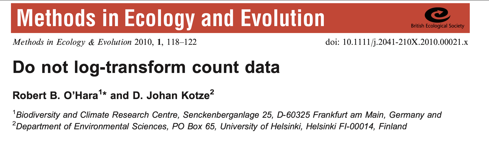

class: center, middle

# Generalized Linear Models and Overdispersion
 


```{css, echo = FALSE}
.pull-left-small {
  float: left;
  width: 20%;
}
.pull-right-large {
  float: right;
  width: 80%;
}
```


```{r prep, echo=FALSE, cache=FALSE, message=FALSE, warning=FALSE}
library(knitr)


opts_chunk$set(fig.height=6, 
               fig.width = 10,
               fig.align = "center",
               comment=NA, 
               warning=FALSE, 
               echo = FALSE,
               message = FALSE)

options(htmltools.dir.version = FALSE)

library(ggplot2)

library(dplyr)
library(tidyr)
library(broom)
library(broom.mixed)
library(MASS)
library(tibble)
library(performance)
library(glmmTMB)
library(DHARMa)
library(patchwork)

theme_set(theme_bw(base_size = 16))
```
---
# A Generalized Linear World
  
1. How do we fit this: Likelihood  

2. Count Data and GLMs  

3. Overdispersion


---
class: middle, left

# Likelihood: how well data support a given hypothesis.

--
<br><br><br>

### Note: Each and every parameter choice IS a hypothesis</span></h4>

---
## Likelihood Defined
<br><br>
$$\Large L(H | D) = p(D | H)$$


Where the D is the data and H is the hypothesis (model) including a both a data generating process with some choice of parameters (often called $\theta$). The error generating process is inherent in the choice of probability distribution used for calculation.

---
## Example of Maximum Likelihood Fit

Let’s say we have counted 10 individuals in a plot. Given that the
population is Poisson distributed, what is the value of $\lambda$?

<div id = "left" style="width:60%">
```{r likelihoodSapply, fig.width=6, fig.height=5}
count <- 10
#
l <- sapply(0:20, function(x) dpois(count, lambda=x) ) 
#
plot(0:20, l, ylab="Likelihood", xlab=expression(lambda), pch=19, cex.lab=1.5)
abline(v=10, col="red", lwd=2, lty=2)

```

</div>

<div id="right", style="width:40%">
<br><br>
$$p(x) = \frac{\lambda^{x}e^{-\lambda}}{x!}$$ 
<br>where we search all possible values of &lambda;
</div>

---
## Likelihood Function

$$\Large p(x) = \frac{\lambda^{x}e^{-\lambda}}{x!}$$ 
<br><br>  

- This is a **Likelihood Function** for one sample 
     - It is the Poisson Probability Density function

--

- $Dpois = \frac{\lambda^{x}e^{-\lambda}}{x!}$

---
## What is the probability of many data points given a parameter?

<div id="left", style="width:60%">
```{r likelihoodDemo2, fig.width=6, fig.height=7}

set.seed(697)
counts <- rpois(10, 15)
lambdaVals <- 0:50


colvec<-rep("white", 50)
colvec[counts]<-"red"
poisCurve10 <- dpois(lambdaVals, 10)

barplot(poisCurve10,  ylab="Probability Density", xlab=expression(lambda), col=colvec, width=1, xlim=c(0,50), main="Density Function at Lambda = 10", cex.lab=1.5)

```

</div>

<div id="right", style="width:40%">
<br><br>
p(a and b) = p(a)p(b)  
<br><br><br>
$$p(D | \theta) = \prod_{i=1}^n p(d_{i} | \theta)$$
<br><br>
<span class="fragment">$$    = \prod_{i=1}^n \frac{\theta^{x_i}e^{-\theta}}{x_!}$$</span>
</div>

---

## Can Compare p(data | H) for alternate Parameter Values

```{r likelihoodDemo3}
poisCurve15 <- dpois(lambdaVals, 15)

par(mfrow=c(1,2))
barplot(poisCurve10,  ylab="Probability Density", xlab=expression(lambda), col=colvec, width=1, xlim=c(0,50), main="Lambda = 10", cex.lab=1.5)
barplot(poisCurve15,  ylab="Probability Density", xlab=expression(lambda), col=colvec, width=1, xlim=c(0,50), main="Lambda = 15", cex.lab=1.5)
par(mfrow=c(1,1))

```

Compare $p(D|\theta_{1})$ versus $p(D|\theta_{2})$, choose the one with higher likelihood 

---
# In Practice We Use Log-Likelihood Surfaces for Computation and Shape to find the Maximum Likelihood
## (Or Really, Deviance, -2 LL, for optimization)

```{r likelihoodSapply1Plot, fig.height = 5}

lik <- sapply(lambdaVals, 
             function(x) prod( dpois(counts, lambda=x) ) )

ll_pois <- sapply(lambdaVals, 
             function(x) sum( dpois(counts, lambda=x, log=TRUE) ) )

par(mfrow=c(1,2))
plot(lambdaVals, lik, ylab="Likelihood", xlab=expression(lambda), pch=19, cex.lab=1.5)
plot(lambdaVals, ll_pois, ylab="Log-Likelihood", xlab=expression(lambda), pch=19, cex.lab=1.5)
par(mfrow=c(1,1))
```
<!--
Maximum Likelihood: `r max(lik)` at `r lambdaVals[which(lik==max(lik))]`  
Maximum Log Likelihood: `r max(ll_pois)` at `r lambdaVals[which(ll_pois==max(ll_pois))]`
Deviance: `r -2 * max(ll_pois)`
-->

---
## Optimizing over Multiple Parameters get's Harder

```{r sealMLE, cache=TRUE}
seals <- read.csv("lectures/data/13/17e8ShrinkingSeals Trites 1996.csv")

seal_m <- seq(3630.246, 3830.246, length.out=500)
seal_s <-  seq(1253.485, 1333.485, length.out=500)

sealSurf <- crossing(m = seal_m,
                   s = seal_s) %>%
  rowwise() %>%
  mutate(ll = sum(dnorm(seals$age.days, m, s, log=TRUE)))
```

```{r mleSurfPersp, fig.height=6, fig.width=6}
persp(seal_m, seal_s, z=matrix(sealSurf$ll, ncol=500), xlab="Mean", ylab="SD", zlab="Log-Likelihood",
      theta = -30, phi = 25, border=NA, col="lightblue")
```

Want to find the Maximum Likelihood (or minimum Deviance) to get the MLE (Maximum Likelihood Estimate) of parameters
---

## Contour Plot of a Likelihood Surface
```{r contour_LL}
mll_seals <- max(sealSurf$ll)
m_seals <- sealSurf$m[which(sealSurf$ll==mll_seals)]
s_seals <- sealSurf$s[which(sealSurf$ll==mll_seals)]

ll_contour <- ggplot() +
  geom_contour(data=sealSurf, mapping=aes(x=m, y=s, z=ll, colour = after_stat(level)), bins=35) +
  theme_bw(base_size=17) +
  scale_colour_gradient(low="black", high="lightgrey", guide=guide_colorbar(title="Log Likelihood")) +
  ylab("SD") + xlab("Mean")

ll_contour +  geom_point(mapping=aes(x=m_seals, y=s_seals), color="red", size=4) 
```

<p align="left">
MLEs: mean = `r round(m_seals, 2)`, SD = `r round(s_seals, 2)`
</p>

---

## Issues with Likelihood and Models

1.  What Values Are Used for 95% CI?

2.  Grid Sampling Becomes Slow

3.  Algorithmic Solutions Necessary

4.  Specification of Likelihood Function Unwieldy

---
## Likelihood Profile of One Coefficient Along ML Estimates of the Other
<font color="red">Mean profile</font>, <font color="blue">SD Profile</font>

```{r profileBrute4}


sealSurf_S <- sealSurf %>% 
  group_by(m) %>%
  summarise( s = s[which(ll == max(ll))],
             ll = max(ll)
  ) %>%
  ungroup()

sealSurf_M <- sealSurf %>% 
  group_by(s) %>%
  summarise( m = m[which(ll == max(ll))],
             ll = max(ll)
  ) %>%
  ungroup()

ll_contour + 
    geom_line(data = sealSurf_S, mapping = aes(x=m, y=s),color="red") + 
    geom_line(data = sealSurf_M, mapping = aes(x=m, y=s),color="blue") 
``` 

---
## Then Use Likelihood Profiles to get CIs (more on this later)

```{r mleWolvesMeanProfile, fig.height = 5.5}
library(bbmle)
mleSeals <- mle2(age.days ~ dnorm(mean=mean, sd=sd), 
                  data=seals, start=list(mean=3700,sd=1300))

plot(profile(mleSeals), conf = c( 95, 90, 80)/100,
     ylab="Signed square root deviance")

confint(mleSeals)
```

---

## How Do We Search Multiparameter Likelihood Space?

We use <span style="color:red">Algorithms</span>

-   Newtown-Raphson (algorithmicly implemented in <span>nlm</span> and
    <span>BFGS</span> method) uses derivatives
     - good for smooth surfaces & good start values  

--

-   Nelder-Mead Simplex (<span>optim</span>’s default)
     - good for rougher surfaces, but slower  

--

-   Simulated Annealing (<span>SANN</span>) uses Metropolis Algorithm search
     - global solution, but slow  

--

- For GLMs, we use **Iteratively Reweighted Lease Squares**
     - fast
     - specific to models from the exponential family 

---
# A Generalized Linear World
  
1. How do we fit this: Likelihood  

2. .red[Count Data and GLMs]  

3. Overdispersion


---

# Remember our Wolves?

.pull-left[

```{r wolf_scatterplot, fig.height=5, fig.width=5}
wolves <- read.csv("lectures/data/11/16e2InbreedingWolves.csv")

wolfplot <- ggplot(data=wolves, mapping=aes(x=inbreeding.coefficient, y=pups)) +
xlab("Inbreeding Coefficient") + ylab("# of Pups") +
geom_point(size=3) +
theme_bw(base_size=24)

wolfplot
```

]

.pull-right[

<br><br>

]

---

# We Had to Log Transform The Count of Pups

$$log(y_i) = \beta_0 + \beta_1 x_i + \epsilon_i$$
  - using count data  
  - relationship is curved
  - cannot have negative pups 
  
```{r logplot, fig.height=5, fig.width = 8}
wolfplot +
  stat_smooth(method = "glm", 
              method.args = list(family=gaussian(link = "log")))
```

---
# But...



--

Note, there is a healthy back-and-forth about this paper in the literature... but I think it has some REALLY good points

---
# Why? Count Data is Discrete - so we need an appropriate distribution
### Enter the Poisson!

In a Poisson, Variance = Mean

```{r, fig.height = 5}
pois_dat <- tidyr::crossing(lambda = c(4,20), x = 1:40) |>
  mutate(mass = dpois(x, lambda),
         lambda = as.character(lambda))

ggplot(pois_dat,
       aes(x = x, y = mass, fill = lambda)) +
  geom_col(alpha = 0.5, position = "nudge") +
  scale_fill_manual(values = c("red", "blue")) +
  labs(x = "", y = "probability mass", fill = "Lambda\n(mean)")
```

---
# The Poisson Generalized Linear Model with its Canonical Link

$$\Large \boldsymbol{\eta_{i}} = \boldsymbol{\beta X_i} $$ 
<br><br>

$$\Large log(\hat{Y_i}) = \eta_{i}$$
<br><br>


$$\Large Y_i \sim \mathcal{P}(\hat{Y_i})$$

---
# Wait - isn't this just a log transform?

--
No.
--

$$\Large \boldsymbol{log(Y_{i})} = \boldsymbol{\beta X_i} + \boldsymbol{\epsilon_i}$$ 
implies...
 
--
$$\Large \boldsymbol{Y_{i}} = e^{\boldsymbol{\beta X_i} + \boldsymbol{\epsilon_i}}$$
--

This is multiplicative error!  

--

We want additive error - which we get from a GLM with a log link:

$$\Large y = e^{\beta X} + \epsilon$$


---
# The Code Matches the Model

```{r, echo=TRUE}
wolves_glm <- glm(pups ~ inbreeding.coefficient, 
                  
                  family = poisson(link = "log"),
                  
                  data = wolves)
```

--
Compare to...


```{r, echo=TRUE}
wolves_lm <- lm(log(pups) ~ inbreeding.coefficient, 
                  
                  data = wolves)
```

---
# We Still Check Some of the Same Assumptions
```{r}
check_model(wolves_glm, check = c("pp_check", "outliers"))
```


---
# But Now Quantile Residuals Help Assessment
```{r}
wolves_res <- simulateResiduals(wolves_glm, n = 1e3)
plotQQunif(wolves_res,
           testDispersion = FALSE,
           testUniformity = FALSE,
           testOutliers = FALSE)
```

---

# Coefficients... Here Have the Same Meaning as a Log-Normal Model
```{r}
tidy(wolves_glm) |>
  dplyr::select(1:3) |>
  knitr::kable(digits = 3) |>
  kableExtra::kable_styling()
```

- If inbreeding is 0, there are ~ 7 pups ( $e^{1.946}$ )

- An increase in 1 unit of inbreeding is a ~93% loss in # of pups
      - $1-e^{-2.656}$

---
# Did it make a difference?

```{r}
log_pred <- augment(wolves_lm, interval = "confidence",
                    newdata = data.frame(
                      inbreeding.coefficient = 
                        seq(0.001,0.4, length.out=200))) |>
  rename(pups = .fitted) |>
  mutate(pups = exp(pups),
         .lower = exp(.lower),
         .upper = exp(.upper))

w1 <- wolfplot +
  stat_smooth(method = "glm", 
              method.args = list(family=gaussian(link = "log"))) +
  labs(subtitle = "Poisson GLM")+
  ylim(c(0,11))

w2 <- wolfplot +
  geom_ribbon(data = log_pred, aes(ymin = .lower, ymax = .upper),
              fill = "grey", alpha = 0.5) +
    geom_line(data = log_pred, color = "red", size = 1) +
  labs(subtitle = "Log LM") +
  ylim(c(0,11))

w1+w2
```


---
# A Generalized Linear World
  
1. How do we fit this: Likelihood  
  
2. Count Data and GLMs  

3. .red[Overdispersion]

---
# What is the relationship between kelp holdfast size and number of fronds?
  
  .center[  ]

---
# What About Kelp Holdfasts?
```{r kelp}
kelp <- read.csv("lectures/data/25/kelp_holdfast.csv")

kelp_plot <- qplot(HLD_DIAM, FRONDS, data=kelp) +
  theme_bw(base_size=17) +
  geom_point(size=2) +
  labs(x = "Holdfast Diameter (cm)", y = "# of Fronds")

kelp_plot 
```
---
# If you had Tried a Linear Model
```{r fit_kelp, echo=TRUE}
kelp_lm <- lm(FRONDS ~ HLD_DIAM, data=kelp)
```

```{r plot_lelp}
check_normality(kelp_lm) |> plot("qq") + theme_bw(base_size = 16)
```

---
# What is our data and error generating process?
```{r kelp}
```

---
# What is our data and error generating process?
  - Data generating process should be exponential
- No values less than 1  

--
  
  - Error generating process should be Poisson
- Count data

---
# Let's Fit a Model!
  
```{r kelp glm, echo=TRUE}
kelp_glm <- glm(FRONDS ~ HLD_DIAM, data=kelp,
                family=poisson(link="log"))
```

---
# Quantile Residuals for Kelp GLM with Log Link
```{r kelp_resid_dharma, echo=FALSE}
simulationOutput <- simulateResiduals(kelp_glm)
plotQQunif(simulationOutput, testUniformity = FALSE, testOutliers = FALSE,
           testDispersion = FALSE)
```

---
# Ruh Roh! What happened? Overdispersion of Data!

- When the variance increases faster than it should from a model, your data is overdispersed 
     - Underdispersion is also possible

--
  
- This can be solved with different distributions whose variance have different properties  
  
--
  
- OR, we can fit a model, then scale it’s variance posthoc with a coefficient  

--
  
-  The likelihood of these latter models is called a Quasi-likelihood, as it does not reflect the true spread of the data  
     - Good to avoid, as it causes inferential difficulties down the line

---
# For Count Data, Two Common Solutions
  
1) Negative Binomial
- Variance = $\hat{Y_i}^2 + \theta\hat{Y_i}^2$|$
   - Increases with the square, not linearly
- Although some forms also do linear...  
- Common for **clumped data**  
  
--
  
2) Quasi-Poisson  
- Basically, Variance = $\theta\hat{Y}$  
- Posthoc estimation of $\theta$
- (Also a similar quasibinomial)  

--
  
3) Others where you model dispersion explicitly
- You are in deeper waters here

---
# Plot of Smoothed Residuals v. Predictor
Linear: Quasipoisson, Squared: Negative Binomial

```{r, fig.height = 6}
check_overdispersion(kelp_glm) |> plot() + theme_bw(base_size = 16)
```

See Ver Hoef and Boveng 2007

---
# New Fits
  
Negative Binomial

```{r nb, echo=TRUE}
library(MASS)
kelp_glm_nb <- glm.nb(FRONDS ~ HLD_DIAM, data=kelp)
```

OR

Quasipoisson
```{r qp, echo=TRUE}
kelp_glm_qp <- glm(FRONDS ~ HLD_DIAM, data=kelp, 
                   family=quasipoisson(link="log"))
```

---
# Checking The Quantile Residuals
  
```{r}
nb_qr <- simulateResiduals(kelp_glm_nb)
plotQQunif(nb_qr,
           testUniformity = FALSE,
           testOutliers = FALSE,
           testDispersion = FALSE)
```

---
# Looks Good!
  
```{r}
kelp_plot +
  stat_smooth(method="glm.nb", 
              method.args=list(link="log"))
```

---
# What if Fronds Had Been Continuous and We Wanted to Model Overdispersion?

- Can Use a continuous distribution with overdispersion
     - Gamma
     - Variance is $\hat{Y_i}^2$
     
- Can model the overdispersion
     - $y_i \sim \mathcal{N}(\widehat{y_i}, \sigma^2_i)$
     - Can be a function of predictors

---
# Gamma
Skewed continuous, variance-mean relationship

.pull-left-small[

]

.pull-right-large[
```{r}
tibble(x = seq(1,20,length.out=300),
       y = dgamma(x, 3, 0.5),
       ymin = 0) |>
  ggplot(aes(x=x, y=y, ymax = y, ymin = ymin, xmax = x)) +
  geom_ribbon(fill = "red") +
  labs(subtitle = "Waiting for 3 events\n one event every 2 units of time",
       y = "probability density", x = "time")
```
]

---

# Similar to Negative Binomial, So, Does it Blend with a log link?

```{r, echo = TRUE}
kelp_gamma <- glm(FRONDS ~ HLD_DIAM,
                     family = Gamma(link = "log"),
                     data = kelp)
```

```{r, fig.height = 5}
simulateResiduals(kelp_gamma) |> plotQQunif(testUniformity = FALSE,
                                           testOutliers =  FALSE,
                                           testDispersion = FALSE)

```

---

# Or, Modeling Variance

$$log(\widehat{Y_i}) = \beta X_i$$
  
$$Y_i \sim \mathcal{N}(\widehat{Y_i}, \sigma^2_i)$$
  
  
$$\sigma^2_i = \gamma X_i$$
Variance can be **linear** function of predictors, or otherwise

---
# Would simple Scaling the Variance have Worked Here?


```{r, echo = TRUE}
kelp_var <- glmmTMB(FRONDS ~ HLD_DIAM,
                
                family = gaussian(link = "log"),
                
                dispformula = ~ HLD_DIAM,
                
                data = kelp)
```

```{r, fig.height = 4.5}
simulateResiduals(kelp_var) |> plotQQunif(testUniformity = FALSE,
                                           testOutliers =  FALSE,
                                           testDispersion = FALSE)

```

---
# Final Note About GLMs and Overdispersion
### Many Distributions Cannot Handle 0s or 1s
  
```{r}
x <- rpois(100, 10)
x <- c(x, rep(0,50))

ggplot(data.frame(x=x),
       aes(x=x)) +
  geom_histogram(binwidth = 0.4) +
  labs(title = "This is Count Data", subtitle = "Needs a zero inflated distribution")
```

---
class: center, middle

