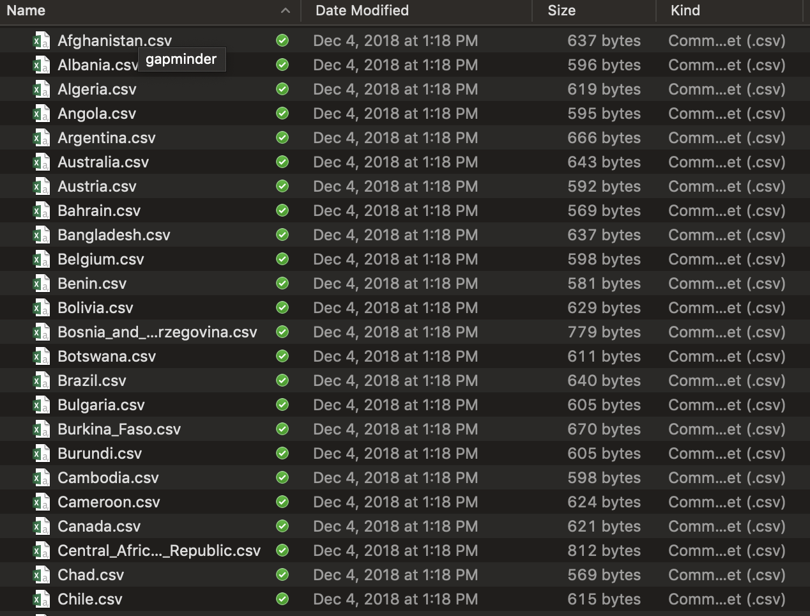
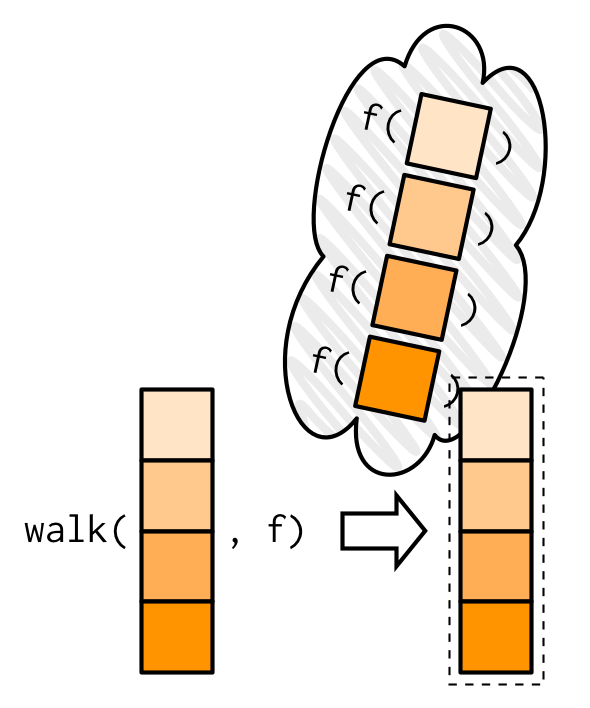
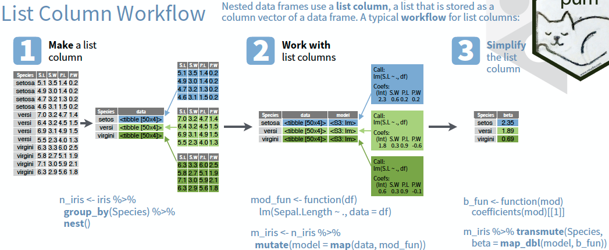

---
title:
css: style.css
output:
  revealjs::revealjs_presentation:
    reveal_options:
      slideNumber: true
      previewLinks: true
    theme: white
    center: false
    transition: fade
    self_contained: false
    lib_dir: libs
---
## {data-background="./images/iteration/maxresdefault.jpg"}

<br><br><br>
<h1 style="background-color:white; font-size: 300%;"><center>Iteration</center></h2>

```{r prep, echo=FALSE, cache=FALSE, message=FALSE, warning=FALSE}
library(knitr)
library(tidyverse)
library(readr)
library(ggplot2)
library(ggthemes)
theme_set(theme_economist_white(gray_bg = FALSE, base_size = 16))

opts_chunk$set(fig.height=5, fig.width=7, comment=NA, 
               warning=FALSE, message=FALSE, 
               dev="jpeg", echo=TRUE, eval = TRUE)


```

## A Repetitive Workflow
- Often, we want to perform the same task on different data sets  
\
- Until now, we've done this with `group_by` and `summarize`  
\
- But what if we need to do more than a simple summary?  

## The Gapminder Data


## Questions we can ask
- How does the relationship change by year?  
\
- How does the relationship differ by country?  
\
- What is the ditribution of slopes by year, country, or both!

## But here is where we start...


<div class="fragment"><h2>So many files...</h2></div>

## What do we know how to do?
> - Write a workflow for one file!  
\
> - `read_csv()`  
\
> - `lm()`  
\
> - `broom:tidy()`  
\
> - But we want to iterate over all files and lots of models...

## Isn't this what computers/robots are all about?
<Br><br>


## The Map Paradigm


## 
{width=60%}

## Map functions
- Take a list or vector as input  
     
- Apply a function to each elment of the list/vector  
     - (note, see the R apply, sapply, and lapply functions, too)
     
- Return the corresponding object, bound together into a prespecified type

## Map in visual terms


## Median Example
```{r purrr}
df <- tibble(
  a = rnorm(10),
  b = rnorm(10),
  c = rnorm(10),
  d = rnorm(10)
)
```

## Median Example
```{r}
#This actually already loaded with tidyverse
library(purrr) 

map(df, median)
```

## The Map Paradigm


## What if I don't want a list


## The world of maps
- `map()` makes a list.
- `map_df()` makes a tibble/data frame.
- `map_lgl()` makes a logical vector.
- `map_int()` makes an integer vector.
- `map_dbl()` makes a double vector.
- `map_chr()` makes a character vector.

## More medians
```{r}
map_dbl(df, median)

map_chr(df, median)

map_df(df, median)
```

## What if I have more than one argument?
```{r}
#add extra arguments at the end
map_dbl(df, median, na.rm=T)

```

## What if I have more than one argument?


## What if I want a more flexible syntax?
```{r map_dbl}
#using ~ and . (or .x)
map_dbl(df, ~median(.x, na.rm=T))
```

## You try!
1. What does `map(-2:2, rnorm, n = 5)` do? How is it different from `map_dbl(-2:2, rnorm, n = 5)`?  
     
2. Get the mean of each column of `df`  
     
3. Compute the number of unique values in each column of `iris` (hint, you'll need length and unique)!

## Now, what about our problem?
- We have a lot of files  
     
- They are all in the same format, so...

## Your turn again!
- Make one big tibble using `list.files()`, `map_df()`, and `read_csv()`  

- Make a list of tibbles `list.files()`, `map()`, and `read_csv()`  as well


- You might need to use `paste0()` or `stringr::str_c` to make a full file path with the output of `list.files()`
     
## One Line to load them all
```{r, message=FALSE}
files <- list.files("./data/gapminder/") %>%
  str_c("./data/gapminder/", .)

gapminder_df <- map_df(files, read_csv)

gapminder_df
```


## Or - keep 'em in a list
```{r, message=FALSE,}
gapminder_list <- map(files, read_csv)
```

The nice thing about a list is that we can just use `map()` on it in the future!

##


## Is there More?
<br><br>
Oh, so much more - see<br> https://adv-r.hadley.nz/functionals.html  

## Map with Two Lists

Or use `~` with `.x` and `.y`

## Map with an arbitrary number of lists


## Invisible Outputs (e.g. for plotting)


## Use list values AND indices
(SUPER useful for time series, etc.)
```{r}
x <- runif(10)

imap_dbl(x, ~ .x + .y)
```

## And more...
```{r reduce}
r <- 1.5
k <- 100
pop <- accumulate(1:30, ~r*.x*(1-.x/k), init = 2)
plot(pop, type = "l", ylab = "N", xlab = "time")
```

## Back to our problem
> - We have loaded everything  
\
> - But - how do we get a distribution of lifeExp ~ pop by country?  
\
> - `map` to the rescue!

## The Simple List-based solution for model fits
Just fit for each tibble!

```{r, echo = TRUE}
fits <- map(gapminder_list, ~lm(lifeExp ~ pop, data = .x))
```

Shockingly simple, no?

## And those coefficients? Map again to the rescue!
```{r, echo = TRUE}
library(broom)
slopes <- map_df(fits, tidy, .id = "Country") %>%
  filter(term == "pop")

slopes
```

## And the distribution...
```{r, echo=FALSE}
ggplot(slopes,
       aes(x = estimate)) + 
  geom_density()
```

## Your turn!
Start with:
```{r, echo = TRUE}
g_by_year <- split(gapminder_df, gapminder_df$year)
```

- Plot the relationship between slope and year for `lifeExp ~ pop` 

## Solution
```{r, eval = FALSE, echo = TRUE}
year_fits <- map(g_by_year, ~lm(lifeExp ~ pop, data = .x))

year_slopes <- map_df(year_fits, tidy, .id = "year")  %>% 
  filter(term == "pop")

ggplot(year_slopes, aes(x = year, y = estimate)) +
  geom_point()
```

## But I don't like lists! Enter - the list-column!


## Let's nest a listcolumn!
```{r, echo = TRUE}
gapminder_df %>%
  
  group_by(country) %>%
  
  nest()
```


## Map + Listcolumns = Love
```{r, echo = TRUE}
gapminder_mods <- gapminder_df %>%
  
  group_by(country) %>%
  
  nest() %>%
  
  mutate(mods = map(data, ~lm(lifeExp ~ pop, data = .)))
```

## What did we do?
```{r}
gapminder_mods
```

## What about coefficients?
```{r, echo = TRUE}
gapminder_mods <- gapminder_mods %>%
  
  mutate(coefs = map(mods, tidy))
```

## And...getting it back?
```{r, echo = TRUE}
gapminder_coefs <- gapminder_mods %>%
  
  unnest(coefs) %>%
  
  filter(term == "pop")
```

## And...getting it back?
```{r echo = FALSE}
gapminder_coefs
```


## You try!
- Fit the relationship by year  
\
- Plot coefficients (slope and intercept) by year (facet the term!)

## Solution
```{r, echo = TRUE}
gapminder_by_year <- gapminder_df %>%
  
  group_by(year) %>%
  
  nest() %>%
  
  mutate(mods = map(data, ~lm(lifeExp ~ pop, data = .))) %>%
  
  mutate(coefs = map(mods, tidy)) %>%
  
  unnest(coefs)
```

## Solution (cont'd)
```{r, echo = FALSE}
ggplot(gapminder_by_year,
       aes(x = year, y = estimate,
           color = term)) + 
  geom_point(size = 2) +
  facet_wrap(~term, scale = "free_y")
```

##

