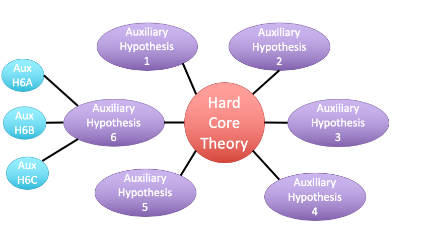

class: center, middle

# Evaluating Fit Linear Models
<br>


```{r setup, include=FALSE}
library(knitr)
library(ggplot2)
library(dplyr)
library(tidyr)
library(mvtnorm)
library(broom)

opts_chunk$set(fig.height=6, 
               fig.width = 8,
               fig.align = "center",
               comment=NA, 
               warning=FALSE, 
               echo = FALSE,
               message = FALSE)

options(htmltools.dir.version = FALSE)
theme_set(theme_bw(base_size=18))
```


```{r puffer, include=FALSE}
puffer <- read.csv("./data/11/16q11PufferfishMimicry Caley & Schluter 2003.csv")
puffer_lm <- lm(predators ~ resemblance, data=puffer)
```


---
class: center, middle

# Etherpad
<br><br>
<center><h3>https://etherpad.wikimedia.org/p/607-lm-2020</h3></center>


---


# Putting Linear Regression Into Practice with Pufferfish

```{r pufferload}
puffer <- read.csv("./data/11/16q11PufferfishMimicry Caley & Schluter 2003.csv")
```

.pull-left[
- Pufferfish are toxic/harmful to predators  
<br>
- Batesian mimics gain protection from predation - why?
<br><br>
- Evolved response to appearance?
<br><br>
- Researchers tested with mimics varying in toxic pufferfish resemblance
]

.pull-right[

]
---
## Question of the day: Does Resembling a Pufferfish Reduce Predator Visits?
```{r puffershow}
pufferplot <- ggplot(puffer, mapping=aes(x=resemblance, y=predators)) +
  ylab("Predator Approaches per Trial") + 
  xlab("Dissimilarity to Toxic Pufferfish")  +
  geom_point(size = 3) +
  theme_bw(base_size=24) 

pufferplot + stat_smooth(method = "lm")
```

```{r wolf_scatterplot, include = FALSE}
wolves <- read.csv("./data/11/16e2InbreedingWolves.csv") %>%
  mutate(inbreeding_coefficient = inbreeding.coefficient)

wolfplot <- ggplot(data=wolves, mapping=aes(x=inbreeding.coefficient, y=pups)) +
xlab("Inbreeding Coefficient") + ylab("# of Pups") +
geom_point(size=3) +
theme_bw(base_size=24) 

wolf_mod <- lm(pups ~ inbreeding_coefficient,
               data = wolves)

wolfplot + stat_smooth(method = "lm")
```


---

# Digging Deeper into Regression

1. Assumptions: Is our fit valid? 

2. How did we fit this model?

3. How do we draw inference from this model?


---

# You are now a Statistical Wizard. Be Careful. Your Model is a Golem.
(sensu Richard McElreath)


.center[.middle[]]

---

# A Case of "Great" versus "Not as Great" Fits...

.pull-left[


]

.pull-right[


]

---
# The Two Fits

.pull-left[
<br><br>
```{r puffershow, fig.height=5, fig.width=5}
```

]

.pull-right[

<br><br>
```{r wolf_scatterplot, fig.height=5, fig.width=5}
```
]

---
# Assumptions (in rough descending order of importance)

1. Validity

2. Representativeness

3. Model captures features in the data

4. Additivity and Linearity

5. Independence of Errors

6. Equal Variance of Errors 

7. Normality of Errors

8. Minimal Outlier Influence

---
# Validity: Do X and Y Reflect Concepts I'm interested In


```{r puffershow, fig.height=7, fig.width=7}
```


What if predator approaches is not a good measure of recognition?  Or mimics just don't look like fish?

---
class: middle

# Solution to lack of validity:  


## Reframe your question! Change your framing! Question your life choices!

---

# Representativeness: Does Your Data Represent the Population?

#### For example, say this is your result...


```{r predictionRange1}
set.seed(10201)
par(mfrow=c(1,2))
x <- sort(runif(100,0,100))
y1 <- rnorm(10, 0.5*x[51:60], 2)
y <- rnorm(100, 0.5*x, 2)

poorlm <- lm(y1 ~ x[51:60])
plot(y1 ~ x[51:60], pch=19, xlab="X", ylab="Y")
aplot <- qplot(x[51:60], y1)  + theme_bw(base_size=16) + xlab("X") + ylab("Y")+ stat_smooth(method="lm", lwd=1.5, col="red", lty=2)
aplot
```

---
class: center, middle

# But is that all there is to X in nature?

---
# Representativeness: Does Your Data Represent the Population?

#### What if you are looking at only a piece of the variation in X in your population?

```{r predRange2}
aplot+xlim(c(0,100))
```

---
# Representativeness: Does Your Data Represent the Population?

#### How should you have sampled this population for a representative result?

```{r PredictionRange3}
bplot <- aplot+geom_point(mapping=aes(x=x, y=y))  + 
  theme_bw(base_size=16) + xlab("X") + ylab("Y")
bplot
```

---
# Representativeness: Does Your Data Represent the Population?

#### It's better to have more variation in X than just a bigger N


```{r predRange4}
y2 <- y[seq(0,100,10)]
x2 <- x[seq(0,100,10)]
cplot <- qplot(x2, y2) + geom_point(size=3)  + theme_bw(base_size=16) + xlab("X") + ylab("Y")+ stat_smooth(method="lm", lwd=1.5, col="blue", lty=1)
cplot
```

---
# Representativeness: Does Your Data Represent the Population?

- Always question if you did a good job sampling

- Use natural history and the literature to get the bounds of values

- If experimenting, make sure your treatment levels are representative

- If you realize post-hoc they are not, **qualify your conclusions**

---
# Model captures features in the data
```{r puffershow}
```

Does the model seem to fit the data? Are there any deviations? Can be hard to see...


---
# Simulating implications from the model to see if we match features in the data

```{r sims}
sims_simulate <- simulate(puffer_lm, nsim = 100)%>%
  pivot_longer(cols = everything(),
               names_to = "sim",
               values_to = "predators")


ggplot() +
  geom_density(data = sims_simulate, 
               aes(x = predators, group = sim), lwd = 0.1) +
  geom_density(data = puffer, aes(x = predators),
               lwd = 2, color = "blue") +
  labs(title = "Distribution of Predator Visits in Our Data\nand as Predicted By Model")
```

Is anything off?

---
# But what to wolves say to you?

```{r wolfsims}
sims_simulate <- simulate(wolf_mod, nsim = 100)%>%
  pivot_longer(cols = everything(),
               names_to = "sim",
               values_to = "pups")


ggplot() +
  geom_density(data = sims_simulate, 
               aes(x = pups, group = sim), lwd = 0.1) +
  geom_density(data = wolves, aes(x = pups),
               lwd = 2, color = "blue") +
  labs(title = "Distribution of Pups in Our Data\nand as Predicted By Model")
```

---

# Additivity and Linearity: Should account for all of the variation between residual and fitted values - what you want

```{r pufferadd}

ggplot(data = puffer,
       aes(x = predators, y = fitted(puffer_lm))) +
  geom_point() +
  stat_smooth(method = "lm", fill = NA)
```

---

# Additivity and Linearity: Wolf Problems?

```{r wolfadd}
ggplot(data = wolves,
       aes(x = pups, y = fitted(wolf_mod))) +
  geom_point() +
  stat_smooth(method = "lm", fill = NA)
```

--
**Solutions:** Nonlinear transformations or a better model!

---

# Independence of Errors

- Are all replicates TRULY independent

- Did they come from the same space, time, etc.

- Non-independence can introduce **BIAS**
     - SEs too small (at the least)
     - Causal inference invalid
     
- Incoporate Non-independence into models (many methods)

---

# Equal Variance of Errors: No Pattern to Residuals and Fitted Values

```{r resfit_puffer}
library(ggfortify)
autoplot(puffer_lm, which = 1, ncol = 1)
```

---

# Equal Variance of Errors: What is up with intermediate Wolf Values
```{r resfit}
autoplot(wolf_mod, which = 1, ncol = 1)
```
---

# Equal Variance of Errors: Problems and Solutions

- Shapes (cones, footballs, etc.) with no bias in fitted v. residual relationship

- A linear relationship indicates an additivity problem

- Can solve with a better model (more predictors)

- Can solve with weighting by X values, if source of heteroskedasticity known
     - This actually means we model the variance as a function of X
     - $\epsilon_i \sim(N, f(x_i))$
 
- Minor problem for coefficient estimates

- Major problem for doing inference and prediction as it changes error

---
# Normality of errors: Did we fit the error generating process that we observed?

- We assumed $\epsilon_i \sim N(0,\sigma)$ - but is that right?

- Can assess with a QQ-plot
     - Do quantiles of the residuals match quantiles of a normal distribution?
     
- Again, minor problem for coefficient estimates  

- Major problem for doing inference and prediction, as it changes error

---
# Equal Variance of Errors: Puffers

```{r pufferqq}
autoplot(puffer_lm, which = 2, ncol = 1)
```

---
# Equal Variance of Errors: Wolves underpredict at High Levels

```{r wolfqq, fig.height = 5, fig.width = 6}
autoplot(wolf_mod, which = 2, ncol = 1)
```

--

```{r}
shapiro.test(residuals(wolf_mod))
```

---
# Outliers: Cook's D

```{r pufferout}
autoplot(puffer_lm, ncol = 1, which = 4)
```

Want no values > 1

---
# Outliers: Cook's D - wolves OK

```{r pufferout_cook}
autoplot(wolf_mod, ncol = 1, which = 4)
```

---

# Everyone worries about outliers, but...

- Are they real?

- Do they indicate a problem or a nonlinearity?

- Remove only as a dead last resort

- If from a nonlinearity, consider transformation

---

# Assumptions (in rough descending order of importance)

1. Validity: only you know!

2. Representativeness: look at nature

3. Model captures features in the data: compare model v. data!

4. Additivity and Linearity: compare model v. data!

5. Independence of Errors: consider sampling design

6. Equal Variance of Errors: evaluate res-fit 

7. Normality of Errors: evaluate qq and levene test

8. Minimal Outlier Influence: evaluate Cook's D

---

# Digging Deeper into Regression

1. Assumptions: Is our fit valid? 

2. .red[How did we fit this model?]

3. How do we draw inference from this model?

---
# So, uh.... How would you fit a line here?

```{r puffer_only_scatter}
pufferplot
```

---

# Lots of Possible Lines - How would you decide?

```{r lsq}
library(mnormt)
set.seed(697)
x<-1:10
y<-rnorm(10, mean=x,sd=2)
a<-lm(y~x)
ab <- rmnorm(3, coef(a), vcov(a))

par(mfrow=c(1,3))
for(i in 1:3){
  plot(x,y,pch=19, cex=1.5)
  abline(a=ab[i,1], b=ab[i,2], lwd=2)
  segments(x,ab[i,1] + x*ab[i,2],x,y, col="red", lwd=2)
}

```

---

# Method of Model Fitting

1. Least Squares
  - Conceptually Simple
  - Minimizes distance between fit and residuals
  - Approximations of quantities based on frequentist logic
  
2. Likelihood
  - Flexible to many error distributions and other problems
  - Produces likelihood surface of different parameter values
  - Equivalent to least square for Gaussian likelihood
  - Approximations of quantities based on frequentist logic

3. Bayesian
  - Incorporates prior knowledge
  - Probability for any parameter is likelihood * prior
  - Superior for quantifying uncertainty
  - With "flat" priors, equivalent to least squares/likelihood
  - Analytic or simulated calculation of quantities

---

# Basic Principles of Least Squares Regression

$\widehat{Y} = \beta_0 + \beta_1 X + \epsilon$ where $\beta_0$ = intercept, $\beta_1$ = slope

```{r linefit}
set.seed(697)
x<-1:10
y<-rnorm(10, mean=x,sd=2)
a<-lm(y~x)
plot(x,y,pch=19, cex=1.5)
abline(a, lwd=2)
segments(x,fitted(a),x,y, col="red", lwd=2)
``` 

Minimize Residuals defined as $SS_{residuals} = \sum(Y_{i} - \widehat{Y})^2$

---
class: center, middle

# Let's try it out!

---

# Analytic Solution: Solving for Slope
<br><br>

$\LARGE b=\frac{s_{xy}}{s_{x}^2}$ $= \frac{cov(x,y)}{var(x)}$

--

$\LARGE = r_{xy}\frac{s_{y}}{s_{x}}$


---

# Analytic Solution: Solving for Intercept
<br><br>
Least squares regression line always goes through the mean of X and Y  


$\Large \bar{Y} = \beta_0 + \beta_1 \bar{X}$

<br><br>

--
$\Large \beta_0 = \bar{Y} - \beta_1  \bar{X}$

---

# Digging Deeper into Regression

1. Assumptions: Is our fit valid? 

2. How did we fit this model?

3. .red[How do we draw inference from this model?]

---
# Inductive v. Deductive Reasoning

<br><br>
**Deductive Inference:** A larger theory is used to devise
many small tests.


**Inductive Inference:** Small pieces of evidence are used
to shape a larger theory and degree of belief.
---

# Applying Different Styles of Inference

- **Null Hypothesis Testing**: What's the probability that things are not influencing our data?
      - Deductive

- **Cross-Validation**: How good are you at predicting new data?
      - Deductive

- **Model Comparison**: Comparison of alternate hypotheses
      - Deductive or Inductive

- **Probabilistic Inference**: What's our degree of belief in a data?
      - Inductive

---
# Null Hypothesis Testing is a Form of Deductive Inference

.pull-left[


Falsification of hypotheses is key! <br><br>

A theory should be considered scientific if, and only if, it is falsifiable.

]

--
.pull-right[


Look at a whole research program and falsify auxilliary hypotheses
]


---
# A Bigger View of Dedictive Inference



.small[https://plato.stanford.edu/entries/lakatos/#ImprPoppScie]

---

# Reifying Refutation - What is the probability something is false?

What if our hypothesis was that the resemblance-predator relationship was 2:1. We know our SE of our estimate is 0.57, so, we have a distribution of what we **could** observe.

```{r slopedist, fig.height = 5}
dat_slope <- tibble(x = seq(-1,5,length.out = 200),
                    y = dnorm(x, 2, 0.57))

slopedist <- ggplot(dat_slope,
                    aes(x = x, y = y)) +
  geom_line() +
  labs(x = "Hypothesized Slope", y = "Probability Density")

slopedist
```

---
# Reifying Refutation - What is the probability something is false?

BUT - our estimated slope is 3.

```{r add_obs, fig.height = 5}
slopedist +
  geom_vline(xintercept = 3, color = "red", lty = 2) 
```

---
# To falsify the 2:1 hypothesis, we need to know the probability of observing 3, or something GREATER than 3.

We want to know if we did this experiment again and again, what's the probability of observing what we saw or worse (frequentist!)

```{r add_p, fig.height = 5}
dat_obs <- tibble(x = seq(3,5,length.out = 200),
                    y = dnorm(x, 2, 0.57),
                  ymin = 0)

slopedist +
  geom_vline(xintercept = 3, color = "red", lty = 2) +
  geom_ribbon(aes(ymin = ymin, ymax = y), 
              data = dat_obs, fill = "red", alpha = 0.5)
```
--

Probability = `r round(1-pnorm(3, 2, 0.57),3)`

--
Note: We typically would multiply this by 2 to look at extremes in both tails.

---
class: center, middle

# Null hypothesis testing is asking what is the probability of our observation or more extreme observation given that some null expectation is true.

### (it is .red[**NOT**] the probability of any particular alternate hypothesis being true)

---
# R.A. Fisher and The P-Value For Null Hypotheses

.pull-left[

]

.pull-right[
P-value: The Probability of making an observation or more extreme
observation given that the null hypothesis is true.
]

---
# Applying Fisher: Evaluation of a Test Statistic

We  use our data to calculate a **test statistic** that maps to a value
of the null distribution. 

We can then calculate the probability of observing our data, or of observing data even more extreme, given that the null hypothesis is true.


$$\large P(X \leq Data | H_{0})$$


---
# Problems with P

- Most people don't understand it.
     - See American Statistical Society' recent statements
     
--
- Like SE, it gets smaller with sample size!
--
- Neyman-Pearson Null Hypothesis Significance Testing
     - For Industrial Quality Control, NHST was introduced to establish cutoffs of reasonable p, called an $\alpha$
     - This corresponds to Confidence intervals - 1-$\alpha$ = CI of interest
     - This has become weaponized so that $\alpha = 0.05$ has become a norm.... and often determines if something is worthy of being published?
     - Chilling effect on science
     
--
- We don't know how to talk about it

---
# How do you talk about results from a p-value?

- Based on your experimental design, what is a reasonable range of p-values to expect if the null is false

- Smaller p values indicate stronger support for rejection, larger ones weaker. Use that language.

- Accumulate multiple lines of evidence so that the entire edifice of your research does not rest on a single p-value!!!!

---
# For example, what does p = 0.061 mean?

- There is a 6.1% chance of obtaining the observed data or more extreme data given that the null hypothesis is true.

- If you choose to reject the null, you have a ~ 1 in 16 chance of being wrong

- Are you comfortable with that? 

- OR - What other evidence would you need to make you more or less comfortable?

---

# Common Regression Test Statistics

- Does my model explain variability in the data?
     - **Null Hypothesis**: The ratio of variability from your predictors versus noise is 1
     - **Test Statistic**: F distribution (describes ratio of two variances)
     
- Are my coefficients not 0?
    - **Null Hypothesis**: Coefficients are 0  
    - **Test Statistic**: T distribution (normal distribution modified for low sample size)
    
---
# Does my model explain variability in the data?

Ho = The model predicts no variation in the data.  

Ha = The model predicts variation in the data.

--

To evaluate these hypotheses, we need to have a measure of variation explained by data versus error - the sums of squares!

--
$$SS_{Total} = SS_{Regression} + SS_{Error}$$
---

# Sums of Squares of Error, Visually
```{r linefit}
``` 

---
# Sums of Squares of Regression, Visually
```{r grandmean}
set.seed(697)

plot(x,y,pch=19, cex=0, cex.lab=1.5, cex.axis=1.1)
abline(a, lwd=2)
#segments(x,fitted(a),x,y, col="red", lwd=2)
points(mean(x), mean(y), col="blue", pch=15)
``` 

---
# Sums of Squares of Regression, Visually
```{r ssr}
set.seed(697)

plot(x,y,pch=19, cex=0, cex.lab=1.5, cex.axis=1.1)
abline(a, lwd=2)
points(mean(x), mean(y), col="blue", pch=15)
points(x, fitted(a), col="blue", pch=1)
``` 

Distance from $\hat{y}$ to $\bar{y}$

---
# Components of the Total Sums of Squares

$SS_{R} = \sum(\hat{Y_{i}} - \bar{Y})^{2}$, df=1

$SS_{E} = \sum(Y_{i} - \hat{Y}_{i})^2$, df=n-2


--
To compare them, we need to correct for different DF. This is the Mean
Square.

MS=SS/DF

e.g, $MS_{E} = \frac{SS_{E}}{n-2}$

---

# The F Distribution and Ratios of Variances

$F = \frac{MS_{R}}{MS_{E}}$ with DF=1,n-2 

```{r f}

x<-seq(0,6,.01)
qplot(x,df(x,1,25), geom="line",  xlab="Y", ylab="df(Y)") + 
  theme_bw(base_size=17)

```

---
# F-Test and Pufferfish
```{r f-puffer}
knitr::kable(anova(puffer_lm))
```

<br><br>
--
We  reject the null hypothesis that resemblance does not explain variability in predator approaches

---
# Testing the Coefficients

 -  F-Tests evaluate whether elements of the model contribute to variability in the data
      - Are modeled predictors just noise?
      - What's the difference between a model with only an intercept and an intercept and slope?

--

- T-tests evaluate whether coefficients are different from 0

--

- Often, F and T agree - but not always
    - T can be more sensitive with multiple predictors

---
background-color: black
class: center, middle, inverse


.small[xkcd]

---
background-image: url(images/09/guiness_full.jpg)
background-position: center
background-size: contain

---
background-image: url(images/09/gosset.jpg)
background-position: center
background-size: contain

---
# T-Distributions are What You'd Expect Sampling a Standard Normal Population with a Small Sample Size

- t = mean/SE, DF = n-1
- It assumes a normal population with mean of 0 and SD of 1

```{r dist_shape_t, fig.height=5}
x_dists <- data.frame(x=seq(-2.5, 2.5, 0.01)) %>%
  mutate(dn = dnorm(x),
         dt_1 = dt(x, 1),
         dt_2 = dt(x, 2),
         dt_3 = dt(x, 3)
  )

x_df <- data.frame(x=rnorm(100), x_unif=runif(100))

ggplot() +
  geom_line(data=x_dists, mapping=aes(x=x, y=dn)) +
  geom_line(data=x_dists, mapping=aes(x=x, y=dt_1), color="red") +
  geom_line(data=x_dists, mapping=aes(x=x, y=dt_2), color="orange") +
  geom_line(data=x_dists, mapping=aes(x=x, y=dt_3), color="blue") +
  theme_classic(base_size=14) +
  annotate(x=c(0.2,0.7,1.1,1.2), y=c(0.4, 0.3, 0.2, 0.1), 
             label=c("Normal","3DF", "2DF", "1DF"), fill="white",
            fontface = "bold", geom="label") +
  ylab("density")
```

---
# Error in the Slope Estimate
<br>


$\Large SE_{b} = \sqrt{\frac{MS_{E}}{SS_{X}}}$


#### 95% CI = $b \pm t_{\alpha,df}SE_{b}$  

(~ 1.96 when N is large)


---
# Assessing the Slope with a T-Test
<br>
$$\Large t_{b} = \frac{b - \beta_{0}}{SE_{b}}$$ 

##### DF=n-2

$H_0: \beta_{0} = 0$, but we can test other hypotheses

---
# Slope of Puffer Relationship (DF = 1 for Parameter Tests)
```{r puffer_t}
knitr::kable(coef(summary(puffer_lm)))
```

<Br>
We reject the hypothesis of no slope for resemblance, but fail to reject it for the intercept.

---

# So, what can we say?

.pull-left[
- We reject that there is no relationship between resemblance and predator visits in our experiment. 
- `r round(summary(puffer_lm)$r.squared, 2)` of the variability in predator visits is associated with resemblance. 
]

.pull-right[
```{r puffershow}
```
]