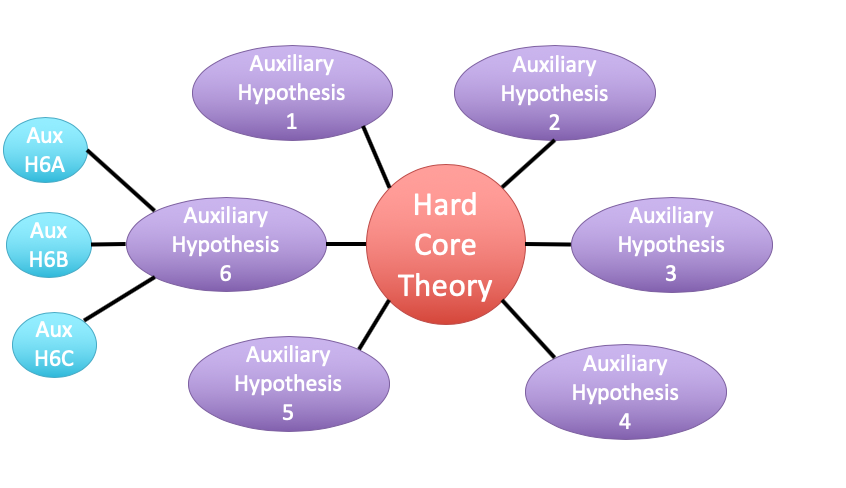
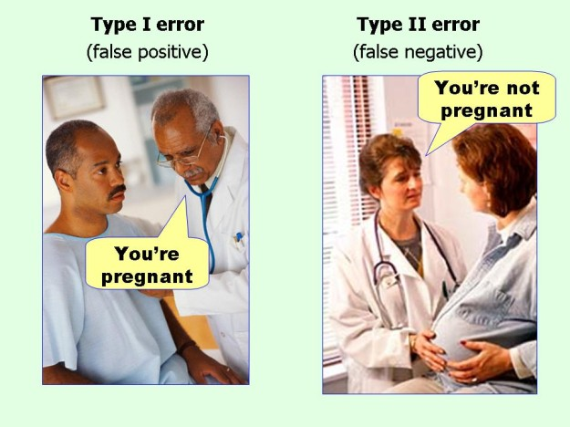
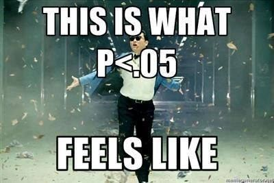
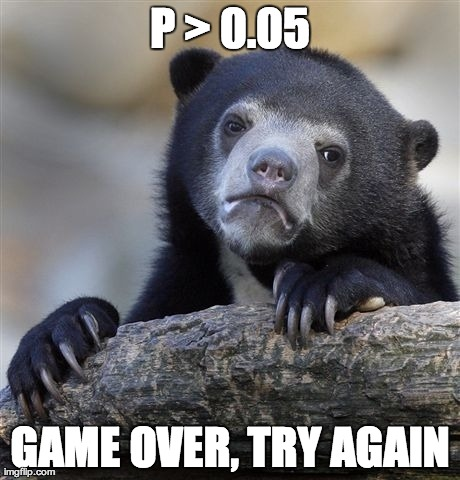

class: center, middle

# Linear Regression and Frequentist Hypothesis Testing
<br>

.left[.small[https://xkcd.com/882/]]
```{r setup, include=FALSE}
library(knitr)
library(ggplot2)
library(dplyr)
library(tidyr)
library(mvtnorm)
library(broom)

opts_chunk$set(fig.height=6, 
               fig.width = 8,
               fig.align = "center",
               comment=NA, 
               warning=FALSE, 
               echo = FALSE,
               message = FALSE)

options(htmltools.dir.version = FALSE)
theme_set(theme_bw(base_size=18))
```


```{r puffer, include=FALSE}
puffer <- read.csv("./data/11/16q11PufferfishMimicry Caley & Schluter 2003.csv")
puffer_lm <- lm(predators ~ resemblance, data=puffer)
```


---
class: center, middle

# Etherpad
<br><br>
<center><h3>https://etherpad.wikimedia.org/p/607-lm-eval-2020</h3></center>


---


# Putting Linear Regression Into Practice with Pufferfish

```{r pufferload}
puffer <- read.csv("./data/11/16q11PufferfishMimicry Caley & Schluter 2003.csv")
```

.pull-left[
- Pufferfish are toxic/harmful to predators  
<br>
- Batesian mimics gain protection from predation - why?
<br><br>
- Evolved response to appearance?
<br><br>
- Researchers tested with mimics varying in toxic pufferfish resemblance
]

.pull-right[

]
---
# Question of the day: Does Resembling a Pufferfish Reduce Predator Visits?
```{r puffershow}
pufferplot <- ggplot(puffer, mapping=aes(x=resemblance, y=predators)) +
  ylab("Predator Approaches per Trial") + 
  xlab("Dissimilarity to Toxic Pufferfish")  +
  geom_point(size = 3) +
  theme_bw(base_size=24) 

pufferplot + stat_smooth(method = "lm")
```

```{r wolf_scatterplot, include = FALSE}
wolves <- read.csv("./data/11/16e2InbreedingWolves.csv") %>%
  mutate(inbreeding_coefficient = inbreeding.coefficient)

wolfplot <- ggplot(data=wolves, mapping=aes(x=inbreeding.coefficient, y=pups)) +
xlab("Inbreeding Coefficient") + ylab("# of Pups") +
geom_point(size=3) +
theme_bw(base_size=24) 

wolf_mod <- lm(pups ~ inbreeding_coefficient,
               data = wolves)

wolfplot + stat_smooth(method = "lm")
```

---

# Testing Our Models

1. How do we Know

2. Evaluating a Null Hypothesis.

3. Null Hypothesis Significance Testing: Friend of Foe of Science?

4. Testing Linear Models

---
class: center, middle

# So.... how do you draw conclusions from an experiment or observation?


---
# Inductive v. Deductive Reasoning

<br><br>
**Deductive Inference:** A larger theory is used to devise
many small tests.


**Inductive Inference:** Small pieces of evidence are used
to shape a larger theory and degree of belief.
---

# Applying Different Styles of Inference

- **Null Hypothesis Testing**: What's the probability that things are not influencing our data?
      - Deductive

- **Cross-Validation**: How good are you at predicting new data?
      - Deductive

- **Model Comparison**: Comparison of alternate hypotheses
      - Deductive or Inductive

- **Probabilistic Inference**: What's our degree of belief in a data?
      - Inductive

---
# Null Hypothesis Testing is a Form of Deductive Inference

.pull-left[


Falsification of hypotheses is key! <br><br>

A theory should be considered scientific if, and only if, it is falsifiable.

]

--
.pull-right[


Look at a whole research program and falsify auxilliary hypotheses
]


---
# A Bigger View of Dedictive Inference



.small[https://plato.stanford.edu/entries/lakatos/#ImprPoppScie]

---

# Testing Our Models

1. How do we Know

2. .red[Evaluating a Null Hypothesis.]

3. Null Hypothesis Significance Testing: Friend of Foe of Science?

4. Testing Linear Models
---

# Reifying Refutation - What is the probability something is false?

What if our hypothesis was that the resemblance-predator relationship was 2:1. We know our SE of our estimate is 0.57, so, we have a distribution of what we **could** observe.

```{r slopedist, fig.height = 5}
dat_slope <- tibble(x = seq(-1,5,length.out = 200),
                    y = dnorm(x, 2, 0.57))

slopedist <- ggplot(dat_slope,
                    aes(x = x, y = y)) +
  geom_line() +
  labs(x = "Hypothesized Slope", y = "Probability Density")

slopedist
```

---
# Reifying Refutation - What is the probability something is false?

BUT - our estimated slope is 3.

```{r add_obs, fig.height = 5}
slopedist +
  geom_vline(xintercept = 3, color = "red", lty = 2) 
```

---
# To falsify the 2:1 hypothesis, we need to know the probability of observing 3, or something GREATER than 3.

We want to know if we did this experiment again and again, what's the probability of observing what we saw or worse (frequentist!)

```{r add_p, fig.height = 5}
dat_obs <- tibble(x = seq(3,5,length.out = 200),
                    y = dnorm(x, 2, 0.57),
                  ymin = 0)

slopedist +
  geom_vline(xintercept = 3, color = "red", lty = 2) +
  geom_ribbon(aes(ymin = ymin, ymax = y), 
              data = dat_obs, fill = "red", alpha = 0.5)
```
--

Probability = `r round(1-pnorm(3, 2, 0.57),3)`

--
Note: We typically would multiply this by 2 to look at extremes in both tails.

---
class: center, middle

# Null hypothesis testing is asking what is the probability of our observation or more extreme observation given that some null expectation is true.

### (it is .red[**NOT**] the probability of any particular alternate hypothesis being true)

---
# R.A. Fisher and The P-Value For Null Hypotheses

.pull-left[

]

.pull-right[
P-value: The Probability of making an observation or more extreme
observation given that the null hypothesis is true.
]

---
# Applying Fisher: Evaluation of a Test Statistic

We  use our data to calculate a **test statistic** that maps to a value
of the null distribution. 

We can then calculate the probability of observing our data, or of observing data even more extreme, given that the null hypothesis is true.


$$\large P(X \leq Data | H_{0})$$


---
# Problems with P

- Most people don't understand it.
     - See American Statistical Society' recent statements

--

- We don't know how to talk about it
--

- Interpretation of P-values as confirmation of an alternative hypothesis
     
--
- Like SE, it gets smaller with sample size!

--

- Misususe of setting a threshold for rejecting a hypothesis

---

# Testing Our Models

1. How do we Know

2. Evaluating a Null Hypothesis.

3. .red[Null Hypothesis Significance Testing: Friend of Foe of Science?]

4. Testing Linear Models

---
# Neyman-Pearson Hypothesis Testing and Decision Making: What if you have to make a choice?

.pull-left[ 


Jerzy Neyman
]

.pull-right[


Egon Pearson
]

---
# Neyman-Pearson Null Hypothesis Significance Testing

- For Industrial Quality Control, NHST was introduced to establish cutoffs of reasonable p, called an $\alpha$

- This corresponds to Confidence intervals - 1-$\alpha$ = CI of interest

- This has become weaponized so that $\alpha = 0.05$ has become a norm.... and often determines if something is worthy of being published?
     - Chilling effect on science
     
---

# NHST in a nutshell

1. Establish a critical threshold below which one rejects a null hypothesis - $\alpha$\. *A priori* reasoning sets this threshold.

--

2. Neyman and Pearon state that if p $\le$ $\alpha$ then we reject the null. 
     - Think about this in a quality control setting - it's GREAT!
--

3. Fisher suggested a typical $\alpha$ of 0.05 as indicating **statistical significance**, although eschewed the idea of a decision procedure where a null is abandoned. 
     - Codified by the FDA for testing!
     
--
.center[
## But... Statistical Significance is NOT Biological Signficance.
]

---
# Types of Errors in a NHST framework

```{r}
type_dat <- tibble::tribble(
  ~` `, ~`Ho is True`, ~`Ho is False`,
  "Reject Ho", "Type I Error", "Correct or Type S Error",
  "Fail to Reject Ho", "-", "Type II Error"
)
knitr::kable(type_dat)
```


- Possibility of Type I error regulated by choice of $\alpha$
  
- Probability of Type II error regulated by choice of $\beta$
  
- Probability of Type S error is called $\delta$

---
# Type I & II Error

.center[

]
---
# Power of a Test

-   If $\beta$ is the probability of committing a type II error,
1 - $\beta$ is the power of a test.

-   The higher the power, the less of a chance of committing a type II
error.

-   We often want a power of 0.8 or higher. (20% chance of failing to reject a false null)

### $\alpha = 0.05$ & $\beta = 0.20$

5% Chance of Falsely Rejecting the Null, 20% Chance of Falsely Accepting the Null

--

Are you comfortable with this? Why or why not?

---

# What is Power, Anyway?

Given that we often begin by setting our acceptable $\alpha$, how do we
then determine $\beta$ given our sample design?

-   Formula for a specific test, using sample size, effect size, etc.

-   Simulate many samples, and see how often we get the wrong answer
assuming a given $\alpha$!

---
# How do you talk about results from a p-value?

- Based on your experimental design, what is a reasonable range of p-values to expect if the null is false

- Smaller p values indicate stronger support for rejection, larger ones weaker. Use that language! Not significance!

- Accumulate multiple lines of evidence so that the entire edifice of your research does not rest on a single p-value!!!!

---
# For example, what does p = 0.061 mean?

- There is a 6.1% chance of obtaining the observed data or more extreme data given that the null hypothesis is true.

- If you choose to reject the null, you have a ~ 1 in 16 chance of being wrong

- Are you comfortable with that? 

- OR - What other evidence would you need to make you more or less comfortable?

---
# How I talk about p-values

- At different p-values, based on your study design, you will have different levels of confidence about rejecting your null. For example, based on the design of one study...

--

- A p value of less than 0.0001 means I have very high confidence in rejecting the null

--

- A p-value of 0.01 means I have high confidence in rejecting the null

--

- A p-value between 0.05 and 0.1 means I have some confidence in rejecting the null

--

- A p-value of > 0.1 means I have low confidence in rejecting the null

---
# My Guiding Light
.center[

]

---

# Why we need to be careful (because power!)

- In the search for the Higgs Boson, scientists studied billions of particles

- They used a "five-sigma" threshold (e.g., an observation beyond 5 SD)

- This corresponds to an $\alpha$ of 0.0000003

.center[

]

---

# Problems with NHST When Used by Humans

.pull-left[


]

.pull-right[

]

---
class: center, middle

## Take home: p-values are great for some kinds of inference. But, they only provide *one* answer at a time. Use carefully, and never depend on one p-value alone!

---

# Testing Our Models

1. How do we Know

2. Evaluating a Null Hypothesis.

3. Null Hypothesis Significance Testing: Friend of Foe of Science?

4. .red[Testing Linear Models]

---

# Common Regression Test Statistics

- Does my model explain variability in the data?
     - **Null Hypothesis**: The ratio of variability from your predictors versus noise is 1
     - **Test Statistic**: F distribution (describes ratio of two variances)
     
- Are my coefficients not 0?
    - **Null Hypothesis**: Coefficients are 0  
    - **Test Statistic**: T distribution (normal distribution modified for low sample size)
    
---
# Does my model explain variability in the data?

Ho = The model predicts no variation in the data.  

Ha = The model predicts variation in the data.

--

To evaluate these hypotheses, we need to have a measure of variation explained by data versus error - the sums of squares!

--
$$SS_{Total} = SS_{Regression} + SS_{Error}$$
---

# Sums of Squares of Error, Visually
```{r linefit}
set.seed(697)
x<-1:10
y<-rnorm(10, mean=x,sd=2)
a<-lm(y~x)
plot(x,y,pch=19, cex=1.5)
abline(a, lwd=2)
segments(x,fitted(a),x,y, col="red", lwd=2)
``` 

---
# Sums of Squares of Regression, Visually
```{r grandmean}
set.seed(697)

plot(x,y,pch=19, cex=0, cex.lab=1.5, cex.axis=1.1)
abline(a, lwd=2)
#segments(x,fitted(a),x,y, col="red", lwd=2)
points(mean(x), mean(y), col="blue", pch=15)
``` 

---
# Sums of Squares of Regression, Visually
```{r ssr}
set.seed(697)

plot(x,y,pch=19, cex=0, cex.lab=1.5, cex.axis=1.1)
abline(a, lwd=2)
points(mean(x), mean(y), col="blue", pch=15)
points(x, fitted(a), col="blue", pch=1)
``` 

Distance from $\hat{y}$ to $\bar{y}$

---
# Components of the Total Sums of Squares

$SS_{R} = \sum(\hat{Y_{i}} - \bar{Y})^{2}$, df=1

$SS_{E} = \sum(Y_{i} - \hat{Y}_{i})^2$, df=n-2


--
To compare them, we need to correct for different DF. This is the Mean
Square.

MS=SS/DF

e.g, $MS_{E} = \frac{SS_{E}}{n-2}$

---

# The F Distribution and Ratios of Variances

$F = \frac{MS_{R}}{MS_{E}}$ with DF=1,n-2 

```{r f}

x<-seq(0,6,.01)
qplot(x,df(x,1,25), geom="line",  xlab="Y", ylab="df(Y)") + 
  theme_bw(base_size=17)

```

---
# F-Test and Pufferfish
```{r f-puffer}
knitr::kable(anova(puffer_lm))
```

<br><br>
--
We  reject the null hypothesis that resemblance does not explain variability in predator approaches

---
# Testing the Coefficients

 -  F-Tests evaluate whether elements of the model contribute to variability in the data
      - Are modeled predictors just noise?
      - What's the difference between a model with only an intercept and an intercept and slope?

--

- T-tests evaluate whether coefficients are different from 0

--

- Often, F and T agree - but not always
    - T can be more sensitive with multiple predictors

---
background-color: black
class: center, middle, inverse


.small[xkcd]

---
background-image: url(images/09/guiness_full.jpg)
background-position: center
background-size: contain
background-color: black

---
background-image: url(images/09/gosset.jpg)
background-position: center
background-size: contain

---
# T-Distributions are What You'd Expect Sampling a Standard Normal Population with a Small Sample Size

- t = mean/SE, DF = n-1
- It assumes a normal population with mean of 0 and SD of 1

```{r dist_shape_t, fig.height=5}
x_dists <- data.frame(x=seq(-2.5, 2.5, 0.01)) %>%
  mutate(dn = dnorm(x),
         dt_1 = dt(x, 1),
         dt_2 = dt(x, 2),
         dt_3 = dt(x, 3)
  )

x_df <- data.frame(x=rnorm(100), x_unif=runif(100))

ggplot() +
  geom_line(data=x_dists, mapping=aes(x=x, y=dn)) +
  geom_line(data=x_dists, mapping=aes(x=x, y=dt_1), color="red") +
  geom_line(data=x_dists, mapping=aes(x=x, y=dt_2), color="orange") +
  geom_line(data=x_dists, mapping=aes(x=x, y=dt_3), color="blue") +
  theme_classic(base_size=14) +
  annotate(x=c(0.2,0.7,1.1,1.2), y=c(0.4, 0.3, 0.2, 0.1), 
             label=c("Normal","3DF", "2DF", "1DF"), fill="white",
            fontface = "bold", geom="label") +
  ylab("density")
```

---
# Error in the Slope Estimate
<br>


$$\Large SE_{b} = \sqrt{\frac{MS_{E}}{SS_{X}}}$$

.center[
#### 95% CI = $b \pm t_{\alpha,df}SE_{b}$  


(~ 1.96 when N is large)
]

---
# Assessing the Slope with a T-Test
<br>
$$\Large t_{b} = \frac{b - \beta_{0}}{SE_{b}}$$ 

#### DF=n-2

$H_0: \beta_{0} = 0$, but we can test other hypotheses

---
# Slope of Puffer Relationship (DF = 1 for Parameter Tests)
```{r puffer_t}
knitr::kable(coef(summary(puffer_lm)), digits = 3)
```

<Br>
We reject the hypothesis of no slope for resemblance, but fail to reject it for the intercept.

---

# So, what can we say in a null hypothesis testing framework?

.pull-left[

- We reject that there is no relationship between resemblance and predator visits in our experiment. 

- `r round(summary(puffer_lm)$r.squared, 2)` of the variability in predator visits is associated with resemblance. 
]

.pull-right[

```{r puffershow}
```
]