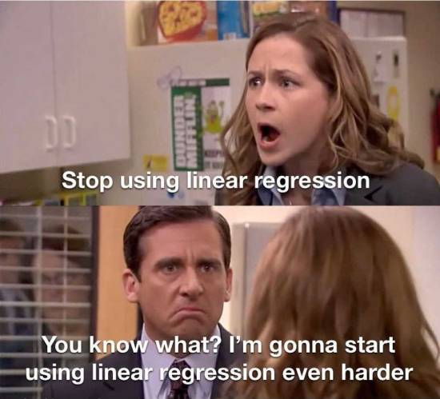
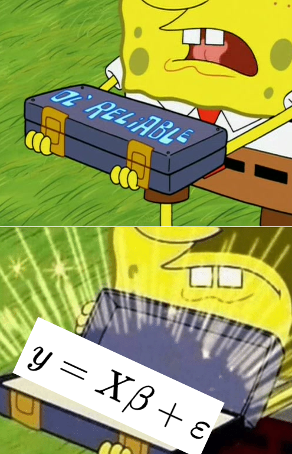
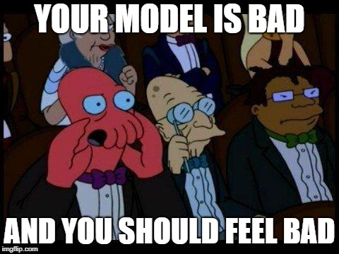
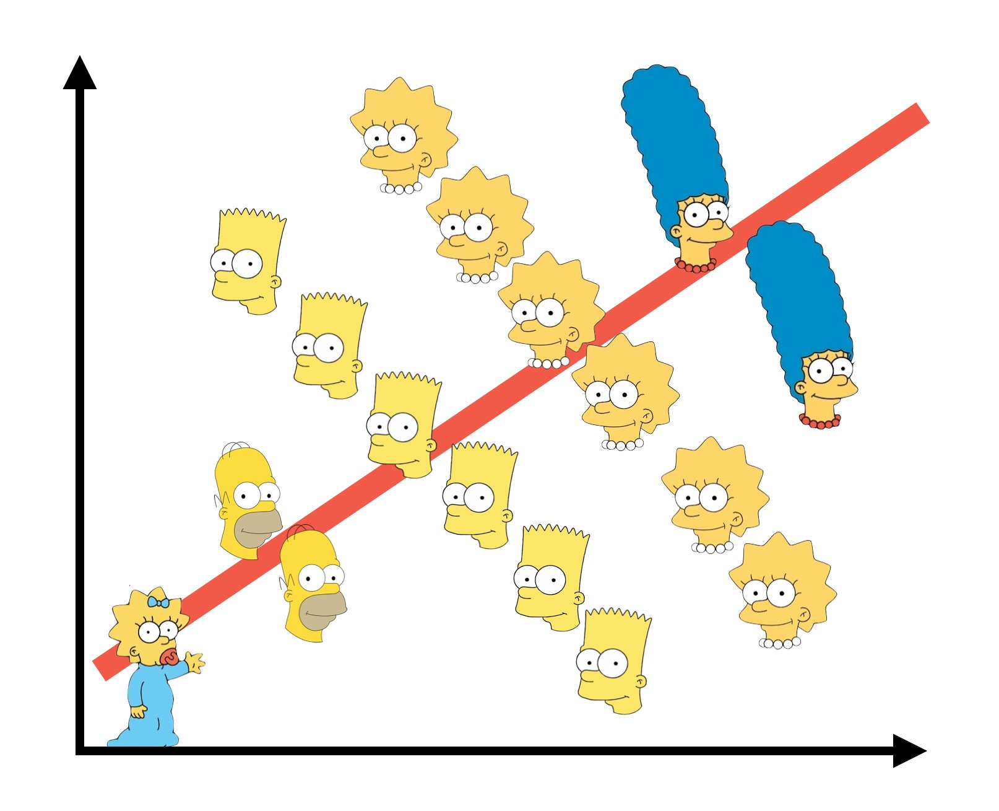
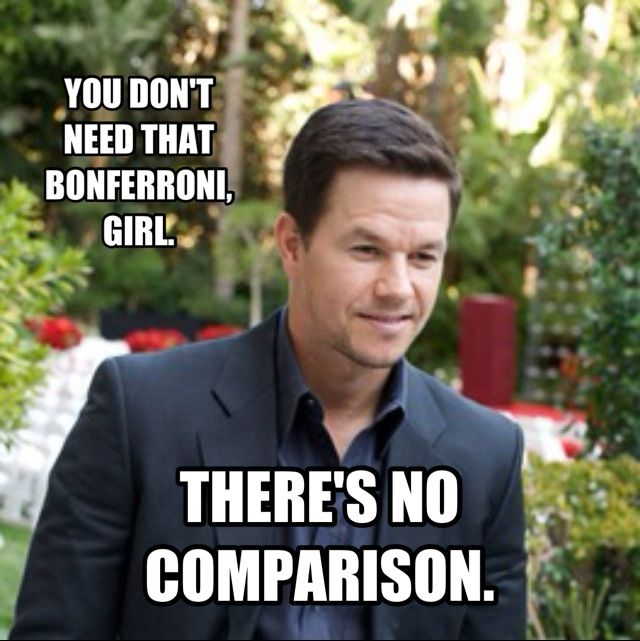

class: center, middle

# Many Types of Predictors


```{r setup, include=FALSE}
library(knitr)
library(ggplot2)
library(dplyr)
library(tidyr)
library(broom)
library(readr)
library(patchwork)
library(ggdist)
library(car)
library(emmeans)
library(visreg)
library(performance)

opts_chunk$set(fig.height=6, 
               fig.width = 9,
               fig.align = "center",
               comment=NA, 
               warning=FALSE, 
               echo = FALSE,
               message = FALSE)

options(htmltools.dir.version = FALSE,
        knitr.kable.NA = '')
theme_set(theme_bw(base_size=28))

table_out <- . %>%
  knitr::kable("html") %>%
  kableExtra::kable_styling("striped")
```

---


# We've Now Done Multiple Continuous Predictors


$$\large y_{i} = \beta_{0} + \sum \beta_{j}x_{ij} + \epsilon_{i}$$

$$\large \epsilon_{i} \sim \mathcal{N}(0, \sigma)$$
---
# We've Previously Done One Categorical Variable with Many Levels 

$$\large y_{ij} = \beta_{0} + \sum \beta_{j}x_{ij} + \epsilon_{ij}$$
  
$$\large \epsilon_{ij} \sim \mathcal{N}(0, \sigma), \qquad x_{i} = 0,1$$  

--
<br><br>

(hey, wait, isn't that kinda the same model.... but where you can only belong to one level of one category?)

---
# Now... Two Categories, Each with Many Levels, as Predictors

$$\large y_{ijk} = \beta_{0} + \sum \beta_{i}x_{ik} + \sum \beta_{j}x_{jk} + \epsilon_{ijk}$$  
  
$$\large \epsilon_{ijk} \sim N(0, \sigma^{2} ), \qquad x_{\_k} = 0,1$$ 

--

- This model is similar to MLR, but, now we multiple categories instead of multiple continuous predictors  
 
--

- This can be extended to as many categories as we want with linear algebra  
  
$$Y = \beta X + \epsilon$$
---
class: center, middle



---
# Multiple Predictors: A Graphical View

.center[  ]


- Curved double-headed arrow indicates COVARIANCE between predictors that we account for.  

- We estimate the effect of each predictor **controlling** for all others.  
  
- Can be continous or categorical predictors

---
# We Commonly Encounter Multiple Predictors in Randomized Controlled Blocked Designs
.center[  ]

---
# An Experiment with Orthogonal Treatments: A Graphical View

.center[]

- Orthogonality breaks correlation  
  
- This is convenient for estimation  

- Observational data is not always so nice, which is OK!  

---
# Effects of Stickleback Density on Zooplankton
<br><br>
.pull-left[]
.pull-right[]  
   
   
.bottom[Units placed across a lake so that 1 set of each treatment was ’blocked’ together]

---
# Treatment and Block Effects

```{r zooplankton_boxplot}
zoop <- read.csv("data/21/18e2ZooplanktonDepredation.csv") %>%
  mutate(block = factor(block))

a <- ggplot(zoop,
       aes(x = treatment, y = zooplankton)) +
  geom_boxplot()

b <- ggplot(zoop,
       aes(x = block, y = zooplankton)) +
  geom_boxplot()

a + b
```

---
# Multiway Categorical Model
- Many different treatment types  
     - 2-Way is for Treatment and block
     - 3-Way for, e.g., Sticklebacks, Nutrients, and block
     - 4-way, etc., all possible  

--

- For experiments, we assume treatments are fully orthogonal  
      - Each type of treatment type A has all levels of treatment type B
      - E.g., Each stickleback treatment is present in each block  

--

- Experiment is **balanced** for **simple effects**  
      - Simple effect is the unique combination of two or more treatments  
      - Balance implies the sample size for each treatment combination is the same 
      - But, hey, this is more for inference, rather than **estimation**

---
# Fitting a Model with Mutiple Categorical Predictors
```{r, echo = TRUE}
zoop_lm <- lm(zooplankton ~ treatment + 
                block, data=zoop)

zoop_lm
```

--
 Note the treatment contrasts!

---
# Assumptions of Categorical Models with Many Categories
-   Independence of data points  

-   No relationship between fitted and residual values  
     - **Additivity (linearity) of Treatments**  
  
-   Normality within groups (of residuals)  
  
-   Homoscedasticity (homogeneity of variance) of groups  
  
- No *collinearity* between levels of different categories
  

---
# The Usual on Predictions
```{r}
check_predictions(zoop_lm) |> plot()
```

---
# Linearity (and additivity!)
```{r}
check_model(zoop_lm, check = "linearity") |> plot()
```

---
# What is Non-Additivity?
The effect of category depends on another - e.g. this grazing experiment

```{r}
algae <- read.csv("data/22/18e3IntertidalAlgae.csv")

graze_linear <- lm(sqrtarea ~ height + herbivores, data=algae)

ggplot(algae, aes(x = height, y = sqrtarea, color = herbivores)) +
  geom_boxplot()
```

---
# Non-Additivity is Parabolic

```{r}
algae <- read.csv("data/22/18e3IntertidalAlgae.csv")

graze_linear <- lm(sqrtarea ~ height + herbivores, data=algae)

check_model(graze_linear, check = "linearity") |> plot()
```

---
class: center, middle



---
# Normality!

```{r}
check_normality(zoop_lm) |> plot(detrend = FALSE)
```

---
# HOV!

```{r}
check_heteroscedasticity(zoop_lm) |> plot()
```

---
# Collinearity!
```{r}
check_collinearity(zoop_lm) |> plot()
```

- by definition, not a problem in an experiment

---
# How do We Understand the Modeled Results?

- Coefficients (but treatment contrasts)  
  
  
- Expected means of levels of each category
     - Average over other categories
  
  
- Differences between levels of each category

---
# Coefficients and Treatment Contrasts

```{r trt_cont}
tidy(zoop_lm)|>
  dplyr::select(1:3) |>
  knitr::kable(digits = 2) |>
  kableExtra::kable_styling()
```

- Intercept is block 1, treatment control  
  
- Other coefs are all deviation from control in block 1  

---
# Means Averaging Over Other Category

```{r}
emmeans(zoop_lm, ~treatment)


emmeans(zoop_lm, ~block)
```

---
# Visualize the Expected Means

```{r}

trt_m <- emmeans(zoop_lm, ~treatment) |>
  confint() |>
  tidy()

ggplot(zoop,
       aes(x = treatment, y = zooplankton)) +
  geom_point(color = "grey") +
  geom_pointrange(data = trt_m,
                  mapping = aes(y = estimate,
                      ymin = estimate - std.error,
                      ymax = estimate + std.error),
                  color = "red")
```

---
# Differences Between Treatments

```{r}
emmeans(zoop_lm, ~treatment) |>
  contrast("pairwise") |>
  confint(adjust = "none") 
```


---
# Many Additive Predictors

1.   Multiple Linear Regression

2.   Many Categories with Many Levels  

3.   <font color = "red">Combining Categorical and Continuous Predictors</font>

---
# It's All One

**The Linear Model**
$$\boldsymbol{Y} = \boldsymbol{b X} + \boldsymbol{\epsilon}$$

--

**Multiple Continuous Predictors**
$$y_{i} = \beta_{0} + \sum \beta_{j}x_{ij} + \epsilon_{i}$$

--

**Many Categorical Predictors**
$$y_{ijk} = \beta_{0} + \sum \beta_{i}x_{ik} + \sum \beta_{j}x_{jk} + \epsilon_{ijk}$$  


---
# Mixing Continuous and Categorical Predictors: Analysis of Covariance

$$y_{ij} = \beta_0   + \beta_{1}x_{1i} + \sum\beta_j x_{ij} +  + \epsilon_{ij}$$  

$$ x_{ij} = 0,1 \qquad \epsilon \sim \mathcal{N}(0,\sigma)$$


-   Categorical Variable + a continuous predictor  
  
-   Often used to correct for a gradient or some continuous variable affecting outcome  
  
-   OR used to correct a regression due to additional groups that may throw off slope estimates  
      - e.g. Simpson's Paradox: A positive relationship between test scores and academic performance can be masked by gender differences

---
# Simpson's Paradox



---
# What is Simpson's Paradox: Penguin Example

```{r}
library(palmerpenguins)

ggplot(penguins,
       aes(x = bill_length_mm, y = bill_depth_mm)) +
  geom_point() +
  stat_smooth(method = "lm")
```


---
# What is Simpson's Paradox: Penguin Example

```{r}

ggplot(penguins,
       aes(x = bill_length_mm, y = bill_depth_mm,
           color = species)) +
  geom_point() +
  stat_smooth(method = "lm")
```

--

Note: This can happen with just continuous variables as well

---

# Neanderthals and Categorical/Continuous Variables

.center[  ]  

Who had a bigger brain: Neanderthals or us?

---
# The Means Look the Same...

```{r neand_boxplot}
neand <- read.csv("data/23/18q09NeanderthalBrainSize.csv")
neand_plot_box <- qplot(species, lnbrain, data=neand, fill=species, geom="boxplot") 

neand_plot_box
```


---
# But there appears to be a Relationship Between Body and Brain Mass

```{r neand_plot}
neand_plot <- qplot(lnmass, lnbrain, data=neand, color=species, size=I(3))  
neand_plot
```


---
# And Mean Body Mass is Different

```{r neand_boxplot2}
neand_plot_box2 <- qplot(species, lnmass, data=neand, fill=species, geom="boxplot")  

neand_plot_box2
```

---
class: center, middle 


---
# Categorical Model with a Continuous Covariate for Control

```{r neand_model, echo=FALSE}
neand_lm <- lm(lnbrain ~ species + lnmass, data=neand)

```


```{r neand_plot_fit, fig.height=5, fig.width=9}
neand <- cbind(neand, predict(neand_lm, interval="confidence"))

neand_fit <- ggplot(data = neand,
       aes(x = lnmass, y = lnbrain, color = species, group = species)) +
  geom_point(size = 3) +
  geom_line(aes(y=fit)) + 
  geom_ribbon(aes(ymin=lwr, ymax=upr), 
              fill="lightgrey", 
              color = NA,
              alpha=0.5) 

neand_fit
```

Evaluate a categorical effect(s), controlling for a *covariate* (parallel lines)  
   
Groups modify the *intercept*.


---
# Assumptions are the Same!
  
-   Independence of data points
  
-   Additivity of Treatment and Covariate (Parallel Slopes)  
  
-   Normality and homoscedacticity within groups (of residuals)  
  
-   No relationship between fitted and residual values  
  

---
# Linearity Assumption KEY
```{r zoop_assumptions, fig.height=7}
check_model(neand_lm, check = "linearity") |> plot()
```

---
# Test for Parallel Slopes
We fit a model where slopes are not parallel:

$$y_{ijk} = \beta_0 + \beta_{1}x_1  + \sum_{j}^{i=1}\beta_j x_{ij} + \sum_{j}^{i=1}\beta_{k}x_1 x_{ij} + \epsilon_ijk$$

--

```{r parallel_slopes}
neand_lm_int <- lm(lnbrain ~ species * lnmass, data=neand)

tidy(neand_lm_int) |>
  dplyr::select(1:3) |>
knitr::kable() |>
  kableExtra::kable_styling()
```

--

If you have an interaction, welp, that's a different model - slopes vary by group!

---
# VIF Also *Very* Important
```{r}
check_collinearity(neand_lm) |> plot()
```

---
# Usual Normality Assumption
```{r}
check_normality(neand_lm) |>plot(detrend = FALSE)
```

---
# Usual HOV Assumption
```{r}
check_heteroscedasticity(neand_lm) |>plot()
```

---
# Usual Outlier Assumption
```{r}
check_outliers(neand_lm) |>plot()
```

---
# The Results

- We can look at coefficients  
  
- We can look at means adjusted for covariate   
  
- Visualize! Visualize! Visualize!  

---
# Those Coefs

```{r}
tidy(neand_lm) |>
  dplyr::select(1:3) |>
  knitr::kable(digits = 2) |>
  kableExtra::kable_styling()
```

- Intercept is species = neanderthal, but lnmass = 0?  
  
- Categorical coefficient is change in intercept for recent  
  
- lnmass coefficient is change in ln brain mass per change in 1 unit of ln mass  

---
# Groups Means at Mean of Covariate
```{r cr_lsmanes}
emmeans(neand_lm, ~species) %>%
  confint() |>
 knitr::kable(digits=3) |>
  kableExtra::kable_styling()
```

Can also evaluate for other levels of the covariate as is interesting

---
# We Can Compare Groups Adjusting for Covariates
.center[  ]

---
# Difference Between Groups at Mean of Covariate
```{r cr_lsmanes_diff}
contrast(emmeans(neand_lm, ~species,
                 at = list(lnmass = mean(neand$lnmass))), method = "tukey") %>%
  confint() |>
 knitr::kable(digits=3) |>
  kableExtra::kable_styling()
```

---
# Visualizing Result Says it All!
```{r}
neand_fit
```

---
# Or Plot at the Mean Level of the Covariate
```{r}
visreg::visreg(neand_lm, "species", gg = TRUE) 
```

---
# Extensions of the Linear Additive Model

- Wow, we sure can fit a lot in there!  

- Categorical is just continuous as 0/1   
  
- So, we can build a LOT of models, limited only by our imagination!  

--

- But what was that nonadditive thing again...? Wait a minuite...
