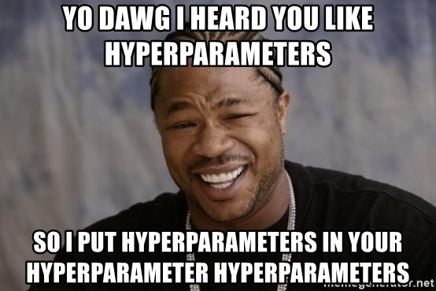

class: center, middle
<!-- make the interaction plots make more sense and relate to a question -->

# Mixed Models


```{r setup, include=FALSE}
library(knitr)
library(ggplot2)
library(patchwork)
library(dplyr)
library(tidyr)
library(broom.mixed)
library(readr)
library(ggdist)
library(glmmTMB)
library(lme4)
library(merTools)
library(emmeans)
library(visreg)
library(performance)
library(modelbased)
library(Data4Ecologists)
library(mvtnorm)

theme_set(theme_bw(base_size=18))


opts_chunk$set(fig.height=6, 
               fig.width = 8,
               fig.align = "center",
               comment=NA, 
               warning=FALSE, 
               echo = FALSE,
               message = FALSE)

options(htmltools.dir.version = FALSE,
        knitr.kable.NA = '')

table_out <- . %>%
  knitr::kable("html") %>%
  kableExtra::kable_styling("striped")
```

---
## A Mixed Outline

1. Mixed Models  
  
2. A Variable Intercept Mixed Model  
      - Yes, there will be assumption checks
  
3. Variable Slopes and Intercepts  

4. GLMMs - a digression
  
5. Visualizing Uncertainty with Mixed Models

---
class: center, middle


---

## A Random Effects Model for a Clustered Mean

$$Y_{ij} =  \alpha_{j} + \epsilon_{ij}$$
  
  
$$\alpha_{j} \sim \mathcal{N}(\mu_{\alpha}, \sigma^2_{\alpha})$$

  
$$\epsilon_{ij} \sim \mathcal{N}(0, \sigma^2)$$


---

## A Random Effects Model for a Clustered Mean

$$Y_{ij} =  \beta_0 + \alpha_{j} + \epsilon_{ij}$$
  
  
$$\alpha_{j} \sim \mathcal{N}(0, \sigma^2_{\alpha})$$

  
$$\epsilon_{ij} \sim \mathcal{N}(0, \sigma^2)$$

- here $\beta_0$ is the grand mean

- $\alpha_j$ is the random effect due to being in cluster j

---
## Now add predictors: Mixed Models with Variable Intercepts
  
  
$$Y_{ij} =  \beta_0 + \beta_1 X_{ij} + \alpha_{j} + \epsilon_{ij}$$

  
$$\alpha_{j} \sim \mathcal{N}(0, \sigma^2_{\alpha})$$
  
  
$$\epsilon_{ij} \sim \mathcal{N}(0, \sigma^2)$$

- Here, $alpha_j$ is the deviation from the grand mean due to being in cluster j

---

## Wait.... Isn't this Just a Model with a Categorical variable and a Continuous Variable?
  
  
$$Y_{ij} =  \beta_0 + \beta_1 X_{ij} + \alpha_{j} + \epsilon_{ij}$$

--
Let's Re-write
--

$$Y_{ij} =  \beta_0 + \beta_1 X_{1i} + \sum \beta_j X_{ij} + \epsilon_{ij}$$
$$X_{ij} = 0,1$$

--
- Yup -  THE SAME as a linear model with a categorical and continuous predictor

--

- BUT -  $\alpha_j$ in model 1 or $\beta_j$ in model 2 is constrained by a gaussian distribution 

--
- And we do not control for the categorical variable when estimating $\beta_1$  
     - Endogeneity assumption!

---

## Now add predictors: Mixed Models with Variable Slopes and Intercepts

$$Y_{ij} = \alpha_{j} + \beta_{j}X_{ij} + \epsilon_{ij}$$
  
  
  
$$\begin{pmatrix}
\alpha_{j}  \\  \beta_{j}  \end{pmatrix} \sim 
\mathcal{MVN}
\left ( \begin{pmatrix} \mu_{\alpha}  \\  \mu_{\beta}  \end{pmatrix} ,  \begin{pmatrix}  \sigma_{\alpha}^{2}& \sigma_{\alpha \beta}\\
\sigma_{\alpha \beta} & \sigma_{\beta}^{2} \end{pmatrix}  \right )$$
  
  

$$\epsilon_{ij} \sim \mathcal{N}(0, \sigma^2)$$

- Here we see the slope and intercept vary around a grand mean. 
     - Those grand means are often refered to as the fixed effects.
     
--

- The slope and intercept covary, and hence follow a multivariate normal distribution.

---

## Now add predictors: Mixed Models with Variable Slopes and Intercepts

$$Y_{ij} = \beta_0 + \beta_1 X_{ij} + \alpha_{j} + \gamma_{j}X_{ij} + \epsilon_{ij}$$  


$$\begin{pmatrix}
\alpha_{j}  \\  \gamma_{j}  \end{pmatrix} \sim \mathcal{MVN}
\left ( \begin{pmatrix} 0  \\  0  \end{pmatrix} ,  
\begin{pmatrix}  \sigma_{\alpha}^{2} & \sigma_{\alpha \gamma}\\ 
\sigma_{\alpha \gamma} & \sigma_{\beta}^{2} \end{pmatrix}  \right )$$
  
  
$$\epsilon_{ij} \sim \mathcal{N}(0, \sigma^2)$$

- Here $\beta_0 + \beta_1 X_{ij}$ is the average model for the population.
     - You might see these refered to as the fixed effects. 

--
     
- $\alpha_j + \gamma_j X_{ij}$ are the random effects.  

--
  
- We still have a MVN of the RE


---
## Why MVN?

When the slope changes, the intercept must also change so that the center of the line is close to $\bar{X}$ and $\bar{Y}$

```{r mvn, warning = FALSE}
ab <- mvtnorm::rmvnorm(5000, c(0,1), 
              sigma = matrix(c(1,-0.8, -0.8, 1), nrow=2, byrow=TRUE)) %>%
  as_tibble()

ggplot(ab) +
  geom_abline(aes(slope = V2, intercept = V1), alpha = 0.02) +
  geom_abline(slope = 1, intercept = 0, color = "red", lwd = 2) +
  xlim(c(-10,10)) +
  ylim(c(-10,10))

```

---

# Wait, isn't this just an interaction effect?

Consider the Following Model
$$Y_{ij} = \beta_0 + \beta_1 X_{ij} + \alpha_{j} + \gamma_{j}X_{ij} + \epsilon_{ij}$$  

--

- If $\alpha_j$ and $\gamma_j$ are drawn from a MVN distribution, this is a mixed model. 
  
--

- If they are not, this is a model with an interaction between cluster and a covariate

--

Consider the model re-written:
$$Y_{ij} = \beta_0 + \beta_1 X_{i} + \sum \alpha_{j} X_j + \sum \gamma_{j}X_{i} X_j + \epsilon_{ij}$$ 

$$X_j = 0,1$$

--

- This is ye olde interaction between a continuous and categorical predictor
     - It's the same model, re-written - it's all about constraining our terms & assuming exogeneity of the RE
     
---

# THE BIG DIFFERENCE between RE and FE

- Up until now, we have been fitting models where $\alpha_j$ could be anything. 

--

- In truth, that made an assumption:
$$\alpha_j ~ N(0, \infty)$$

--

- With an RE, we assume
$$\alpha_j ~ N(0, \sigma^2_{cluster})$$

--

- BUT we also assume that covariate levels do not depend on clusters
      - i.e., if we were to resample X in our clusters, the rank order of the mean values of X per cluster would change every time

---
## A Mixed Outline

1. Mixed Models  
  
2. .red[ A Variable Intercept Mixed Model ]  
      - Yes, there will be assumption checks
  
3. Variable Slopes and Intercepts  

4. GLMMs - a digression
  
5. Visualizing Uncertainty with Mixed Models

---
# Let's take this to the beach with Tide Height: RIKZ


Richness of benthic species in 45 sampling stations along the coastline of The Netherlands, measured by two researches of the the RIKZ (Rijksinstituut voor Kust en Zee), i.e., the Dutch Institute for Coastal and Marine Management.

```{r rikz_start, echo=FALSE}
RIKZdat$Beach <- factor(RIKZdat$Beach)
RIKZdat$log_richness <- log(RIKZdat$Richness+1)
```

---
# How is Tidal Height of Measurement Associated With Species Richness?

```{r plot_varint}
rikz_plot_base <- ggplot(RIKZdat, aes(x=NAP, y=log_richness, color=Beach)) +
  geom_point(size=3) +
  theme_bw(base_size=17)

rikz_plot_base + labs(subtitle = "Varying intercepts by beach?")
```

(note, log as this is count data, which, really....)
---

# A Variable Intercept Model


$$Y_{ij} =  \beta_0 + \beta_1 X_{ij} + \alpha_{j} + \epsilon_{ij}$$

  
$$\alpha_{j} \sim \mathcal{N}(0, \sigma^2_{\alpha})$$
  
  
$$\epsilon_{ij} \sim \mathcal{N}(0, \sigma^2)$$

- Here, $\beta_0$ is the grand mean (fixed effect) intercept. 

- $\alpha_{j}$ is the deviation from that due to random beach-to-beach variation


---
# Quick Endogeneity Check

```{r}
 ggplot(RIKZdat, aes(y=NAP,  x=Beach)) +
  geom_point(size=3) +
  theme_bw(base_size=17)

```

- In truth, this should come from system-specific knowledge. 
  
- Also some formal tests (e.g., Hausman test), but, not always useful

---
# The R model, two ways

LME4: From Doug Bates, Ben Bolker, and Many More
```{r, echo=TRUE}
library(lme4)

# first the lmer
rikz_varint <- lmer(log_richness ~ NAP +
                      
                      (1|Beach),
                    
                    data = RIKZdat)
```

Using Template Model Builder from Mollie Brooks, Ben Bolker, and more
```{r, echo=TRUE}
library(glmmTMB)

# now with TMB
rikz_varint_tmb <- glmmTMB(log_richness ~ NAP +
                             
                      (1|Beach),
                    
                    data = RIKZdat)
```

---
# The R model, two ways

LME4: From Doug Bates, Ben Bolker, and Many More
```{r, echo=TRUE, eval=FALSE}
library(lme4)

# first the lmer
rikz_varint <- lmer(log_richness ~ NAP +
                      
                      `(1|Beach)`,
                    
                    data = RIKZdat)
```

Using Template Model Builder from Mollie Brooks, Ben Bolker, and more
```{r, echo=TRUE, eval=FALSE}
library(glmmTMB)

# now with TMB
rikz_varint_tmb <- glmmTMB(log_richness ~ NAP +
                             
                      `(1|Beach)`,
                    
                    data = RIKZdat)
```

---
# You Knew Assumption Checks Were Coming, Right?

1. Check your prediction distribution!
  
2. For LMMs, all linearity and normality assumptions hold. 
  
3. BUT - we are now also assuming our REs have a normal distribution

---
# Ye Olde Predictions
```{r}
check_predictions(rikz_varint) |> plot()
```


---
# Ye Olde QQ Plot

```{r}
check_normality(rikz_varint) |> plot(type = "density")
```


---
# Ye Olde HOV Plot

```{r}
check_heteroscedasticity(rikz_varint) |> plot()
```

---
# Are Our REs Normal?

```{r}
check_normality(rikz_varint, effects = "random") |> plot()
```

---
class: center, middle

# Next: Evaluate!

---

# Coefficients and SDs

```{r}
tidy(rikz_varint) |>
  knitr::kable(digits = 2) |>
  kableExtra::kable_styling("striped")
```

- Our fixed slope and intercept mean what they did as an lm. 

--

- Note, these are FEs - for the entire population

--

- We also get the SD of the RE

---

# What are my REs?

```{r}
broom.mixed::tidy(rikz_varint_tmb, effects="ran_vals") |>
  knitr::kable(digits = 2) |>
  kableExtra::kable_styling("striped")
```

---

# Visualizing REs?
```{r}
modelbased::estimate_grouplevel(rikz_varint) |> plot()
```

---

# Combined coefficients

```{r}
coef(rikz_varint)$Beach |> 
  knitr::kable(digits = 2) |>
  kableExtra::kable_styling("striped")
```


---

# Whither the R2?

```{r}
r2(rikz_varint_tmb)
```

--

- The *Marginal R<sup>2</sup>* is the R<sup>2</sup> due to fixed effects alone
     - The fit explained by population-level effects
     
--

- The *Conditional R<sup>2</sup>* is the R<sup>2</sup> due to fixed + random effects
     - The fit explained by both population level effects and individual variation
     
--

- The Conditional R<sup>2</sup> will always be larger  
     - If Marginal = 0.01, but Conditional = 0.99, what have you explained?
---
class: center, middle

# And now, some model visualization

---
# Visualizing Fixed (Marginal) Effects Only

```{r}
estimate_relation(rikz_varint) |> plot() +
  labs(title = "")
```

---
# Visualizing Conditional Effects Only

```{r}
estimate_relation(rikz_varint, include_random = TRUE) |> plot()
```

---
# Putting it All Together


```{r}

fixed_pred <- estimate_relation(rikz_varint) 

estimate_relation(rikz_varint, include_random = TRUE) |> 
  plot(ribbon = list(alpha = 0)) +
  geom_line(data = fixed_pred, 
            aes(x = NAP, y = Predicted), linewidth = 2,
            color = "black")+
  labs(title = "")
  
```

---
# Putting it All Together

```{r}
fixed_pred <- estimate_relation(rikz_varint) 

re_pred <- estimate_relation(rikz_varint, include_random = TRUE) 

ggplot(data = RIKZdat,
       aes(x = NAP, y = log_richness)) +
  geom_point(aes(color = Beach)) +
  geom_line(data = re_pred,aes(x = NAP, y = Predicted, group = Beach),
            color = "grey") +
  geom_line(data = fixed_pred, 
            aes(x = NAP, y = Predicted), linewidth = 2,
            color = "black")+
  labs(title = "")
  
```

---
# Putting it All Together


```{r}

ggplot(data = RIKZdat,
       aes(x = NAP, y = log_richness)) +
  geom_point() +
  geom_line(data = re_pred,aes(x = NAP, y = Predicted, group = Beach),
            color = "grey") +
  geom_line(data = fixed_pred, 
            aes(x = NAP, y = Predicted), linewidth = 2,
            color = "black")+
  labs(title = "")
  
```


---
## A Mixed Outline

1. Mixed Models  
  
2. A Variable Intercept Mixed Model  
      - Yes, there will be assumption checks
  
3. .red[ Variable Slopes and Intercepts ] 

4. GLMMs - a digression
  
5. Visualizing Uncertainty with Mixed Models

---
class: center, middle


---

## Now add predictors: Mixed Models with Variable Slopes and Intercepts

$$Y_{ij} = \beta_0 + \beta_1 X_{ij} + \alpha_{j} + \gamma_{j}X_{ij} + \epsilon_{ij}$$  


$$\begin{pmatrix}
\alpha_{j}  \\  \gamma_{j}  \end{pmatrix} \sim \mathcal{MVN}
\left ( \begin{pmatrix} 0  \\  0  \end{pmatrix} ,  
\begin{pmatrix}  \sigma_{\alpha}^{2} & \sigma_{\alpha \gamma}\\ 
\sigma_{\alpha \gamma} & \sigma_{\beta}^{2} \end{pmatrix}  \right )$$
  
  
$$\epsilon_{ij} \sim \mathcal{N}(0, \sigma^2)$$

- Here, we will allow the effect of NAP to vary by Beach

---
# Level-1, Level-2 Model Style

- What if you want to be explicit about where different sources of variation entered from?  

--

- For example, what if we had sample nested in beach nested in region nested in country, nested in....

--

- This can get a bit crazy, but, it makes life easier to separate models into levels, with the replicate/individual level as Level-1, the lowest level cluset as level-2, etc...

---
# Level-1, Level-2 Model Style

 
Level-1 Model (the measurement level)

$$Y_{ij} = \beta_{0j} + \beta_{1j} X_{ij} + \epsilon_{ij}$$

--

Level-2 Model (the beach level)

$$\beta_{0j} = \beta_0 + \alpha_{j}$$

$$\beta_{1j} = \beta_1 + \gamma_{j}$$

--

We now refer to parameters in the level-2 model as **hyperparameters**

---
# Variable Slope-Intercept Models in R

```{r, echo = FALSE}
rikz_varslopeint <- lmer(log_richness ~ NAP +
                             
                      (NAP + 1|Beach),
                    
                    data = RIKZdat)
```

```{r, echo = TRUE, eval = FALSE}
rikz_varslopeint <- lmer(log_richness ~ NAP +
                             
                      `(NAP + 1|Beach)`,
                    
                    data = RIKZdat)
```

- Including both slope and intercept in random term. 
  
- Could have left off intercept

---
# Diagnostics on Multiple REs

```{r, results="hide"}
check_normality(rikz_varslopeint, effects = "random") |> plot()
```

---
# Visualize As Before


```{r}

fixed_pred <- estimate_relation(rikz_varslopeint) 

estimate_relation(rikz_varslopeint, include_random = TRUE) |> 
  plot(ribbon = list(alpha = 0)) +
  geom_line(data = fixed_pred, 
            aes(x = NAP, y = Predicted), linewidth = 2,
            color = "black")+
  labs(title = "")

r2(rikz_varslopeint)  |> as_tibble() |> knitr::kable()
```

---
class:center, middle


---

# Let's Get Hierarchical

- Clusters can have **cluster-level predictors**. 
  
--

- Think infection of cells within individuals within counties within states within...
     - Individuals might have different jobs that bring them into contact with different numbers of other infected people 
     - Counties will have different levels of masking prevalence 
     - States will have different levels of funding for testing
--

- For example, in the RIKZ data, each beach has a different wave exposure  

--

- Hierarchical predictors can affect outcomes - they could even affect slopes


---
# Level-1, Level-2 Model Style Makes this Easier

 
Level-1 Model (the measurement level)

$$Y_{ij} = \beta_{0j} + \beta_{1j} X_{ij} + \epsilon_{ij}$$

--

Level-2 Model (the beach level)

$$\beta_{0j} = \beta_0 + \alpha_{j} + \beta_2 X_j$$

$$\beta_{1j} = \beta_1 + \gamma_{j}$$


---

class: center, middle




---

## Or All One

$$Y_{ij} = \beta_0 + \beta_1 X_{ij} + \beta_2 X_{j} + \alpha_{j} + \gamma_{j}X_{ij} + \epsilon_{ij}$$  


$$\begin{pmatrix}
\alpha_{j}  \\  \gamma_{j}  \end{pmatrix} \sim \mathcal{MVN}
\left ( \begin{pmatrix} 0  \\  0  \end{pmatrix} ,  
\begin{pmatrix}  \sigma_{\alpha}^{2} & \sigma_{\alpha \gamma}\\ 
\sigma_{\alpha \gamma} & \sigma_{\beta}^{2} \end{pmatrix}  \right )$$
  
  
$$\epsilon_{ij} \sim \mathcal{N}(0, \sigma^2)$$

---
# The Model in R

```{r, echo = TRUE}
rikz_hier <- lmer(log_richness ~ NAP +
                           
                           exposure +
                           
                           (NAP + 1|Beach),
                    
                    data = RIKZdat)
```


---
# We can look at All Paremeters

```{r}
tidy(rikz_hier) |>
  as_tibble() |>knitr::kable(digits = 2) |>
  kableExtra::kable_styling("striped")
```


---

# More Coefficients - some vary some don't

```{r}
coef(rikz_hier)$Beach |>
  as_tibble() |>knitr::kable(digits = 2) |>
  kableExtra::kable_styling("striped")
```

---

# Visualization is an MLR Problem

```{r}
v <- visreg(rikz_hier, gg = TRUE)

v[[1]] + v[[2]] 
```

---

# Plotting Fixed Effects of Multiple Predictors
```{r, warning = FALSE}
pred <- ggeffects::data_grid(rikz_hier, terms = c("NAP", "exposure"),
                  condition = c(Beach = 1)) 

library(merTools)
#The fit values
predDF <- predictInterval(rikz_hier,
                          newdata=pred,
                          which="fixed",
                          include.resid.var = FALSE) |>
  bind_cols(pred) |>
  mutate(log_richness = fit)

ggplot(predDF ,
       aes(x = NAP, y = log_richness, color = exposure,
           fill = exposure, group = exposure)) +
  geom_point(data = RIKZdat) +
  geom_line(data = predDF) +
  geom_ribbon(aes(ymin = lwr, ymax = upr), alpha = 0.3) +
  scale_color_viridis_c() +
  scale_fill_viridis_c()

```


---

# Plotting Everything
```{r, warning = FALSE}
pred <- ggeffects::data_grid(rikz_hier, terms = c("NAP", "exposure", "Beach")) 

joiner <- RIKZdat |>
  dplyr::select(exposure, Beach) |>
  group_by(Beach) |>
  slice(1L) |>
  ungroup()

pred <- left_join(joiner, pred)

#The fit values
predDF_all <- predictInterval(rikz_hier,
                          newdata=pred,
                          which="full",
                          include.resid.var = FALSE) |>
  bind_cols(pred) |>
  mutate(log_richness = fit)

ggplot(predDF_all,
       aes(x = NAP, y = log_richness, color = exposure,
           fill = exposure, group = Beach)) +
  geom_point(data = RIKZdat) +
  geom_line(data = predDF_all) +
  scale_color_viridis_c() +
  scale_fill_viridis_c()

```

---

# Mixed Model Structure

- You can build models as complex as you want, but...

--

- Your RE structure should reflect your sampling design

--

- Sometimes variance components are close to 0. Do they need to be there?

--

- Also, do not forget your endogeneity assumption!

--
- Hierarchies: you can do a lot with level-1 and level-2 thinking!


---
## A Mixed Outline

1. Mixed Models  
  
2. A Variable Intercept Mixed Model  
      - Yes, there will be assumption checks
  
3. Variable Slopes and Intercepts  

4. .red[ GLMMs - a digression ]
  
5. Visualizing Uncertainty with Mixed Models

---

class: center, middle


---
# This is Not Normal

```{r}
ggplot(data = RIKZdat,
       aes(x = NAP, y = Richness)) +
  geom_point()
```

---

# We CAN fit Generalized Linear Mixed Models

Let's try this for a variable-slope variable intercept Poisson model with a Log Link


$$\large \eta_{ij} =  \alpha + \beta_{j}$$
  
  
$$\ \beta_{j} \sim \mathcal{N}(0, \sigma^2_{site})$$
  
  
  
$$\large log(\widehat{Y_{ij}}) = \eta_{ij}$$
  

$$\large Y_{ij} \sim \mathcal{P}(\widehat{Y_{ij}})$$

---
# We can fit with glmer or glmmTMB


```{r, echo = TRUE}
rikz_pois <- glmer(Richness ~ NAP +
                           
                           (NAP + 1|Beach),
                   
                    family = poisson(link = "log"),
                   
                    data = RIKZdat)
```

---
# Check that prediction

```{r}
check_predictions(rikz_pois)
```


---
# Check that Overdispersion

```{r}
check_overdispersion(rikz_pois) |> plot()
```

---
# Check that Overdispersion

```{r}
library(DHARMa)
simulateResiduals(rikz_pois) |> plotQQunif()
```

---
# Check the Random Effects

```{r}
check_normality(rikz_pois, effect = "random") |> plot()
```

---

# Evaluate Away!

```{r}

fixed_pred <- estimate_relation(rikz_pois) 

estimate_relation(rikz_pois, include_random = TRUE) |> 
  plot(ribbon = list(alpha = 0)) +
  geom_line(data = fixed_pred, 
            aes(x = NAP, y = Predicted), linewidth = 2,
            color = "black")+
  labs(title = "")

r2(rikz_pois) |> as_tibble()
```

---

# Final Thoughts on Mixed Models

- These are *very* powerful

--

- They let you cope with data structures FE would fail on

--

- They are more efficient with respect to DF and hence narrower CIs

--

- Shrinkage is philosophically a real plus

--

- BUT - they will take some fiddling, as MANY parameters and hyperparameters as well as complex likelihood functions