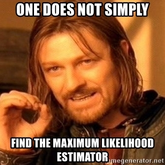
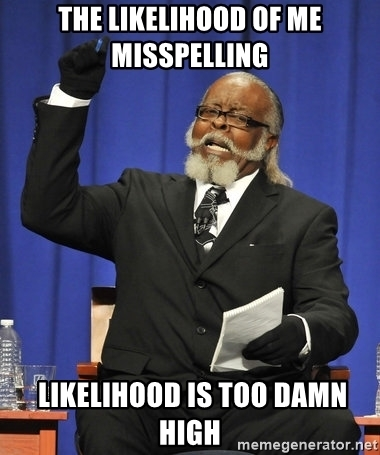

class: center, middle

# Maximum Likelihood Estimation and Likelihood Ratio Testing<br>


```{r setup, include=FALSE}
library(knitr)
library(ggplot2)
library(dplyr)
library(tidyr)
library(mvtnorm)
library(broom)

opts_chunk$set(fig.height=6, 
               fig.width = 8,
               fig.align = "center",
               comment=NA, 
               warning=FALSE, 
               echo = FALSE,
               message = FALSE)

options(htmltools.dir.version = FALSE)
theme_set(theme_bw(base_size=18))
```


```{r puffer, include=FALSE}
puffer <- read.csv("lectures/data/11/16q11PufferfishMimicry Caley & Schluter 2003.csv")
puffer_lm <- lm(predators ~ resemblance, data=puffer)
```


---
class: center, middle

# Etherpad
<br><br>
<center><h3>https://etherpad.wikimedia.org/p/607-nht-2022</h3></center>

---

# Applying Different Styles of Inference

- **Null Hypothesis Testing**: What's the probability that things are not influencing our data?
      - Deductive

- **Model Comparison**: Comparison of alternate hypotheses
      - Deductive or Inductive
      
- **Cross-Validation**: How good are you at predicting new data?
      - Deductive

- **Probabilistic Inference**: What's our degree of belief in a data?
      - Inductive
      
---


# Applying Different Styles of Inference

.grey[
- **Null Hypothesis Testing**: What's the probability that things are not influencing our data?
      - Deductive
]

- **Model Comparison**: Comparison of alternate hypotheses
      - Deductive or Inductive
      
- **Cross-Validation**: How good are you at predicting new data?
      - Deductive

.grey[
- **Probabilistic Inference**: What's our degree of belief in a data?
      - Inductive
]

---
# To Get There, We Need To Understand Likelihood and Deviance

.center[

]

---
# A Likely Lecture

1. Introduction to Likelihood

2. Maximum Likelihood Estimation

3. Maximum Likelihood and Linear Regression

4. Comparing Hypotheses with Likelihood

---

class: middle

# Likelihood: how well data support a given hypothesis.

--


### Note: Each and every parameter choice IS a hypothesis

---

# Likelihood Defined
<br><br>
$$\Large L(H | D) = p(D | H)$$


Where the D is the data and H is the hypothesis (model) including a both a data generating process with some choice of parameters (often called $\theta$). The error generating process is inherent in the choice of probability distribution used for calculation.

---
# Thinking in Terms of Models and Likelihood

- First we have a **Data Generating Process**

     - This is our hypothesis about how the world works
     
     - $\hat{y}_i = \beta_0 + \beta_1 x_i$ 
     
--

- Then we have a likelihood of the data given this hypothesis
     - This allows us to calculate the likelihood of observing our data given the hypothesis
     
     - Called the **Likelihood Function**
     
     - $y_{i} = N(\hat{y}_i, \sigma)$

---
# All Kinds of Likelihood functions
- Probability density functions are the most common  

--

- But, hey, $\sum(y_{i} - \hat{y}_i)^2$ is one as well

--

- Extremely flexible

--

- The key is a function that can find a minimum or maximum value, depending on your parameters

---
# Likelihood of a Single Value
What is the likelihood of a value of 1.5 given a hypothesized Normal distribution where the mean is 0 and the SD is 1?

```{r norm_lik}
x <- seq(-3,3, length.out=200)
y <- dnorm(x)
normplot <- qplot(x,y, geom="line") + theme_bw(base_size=17) +
  ylab("Density") + xlab("X")

normplot
```

---
# Likelihood of a Single Value
What is the likelihood of a value of 1.5 given a hypothesized Normal distribution where the mean is 0 and the SD is 1. 

```{r norm_lik_2} 
normline <- normplot + 
  geom_segment(mapping=aes(x=1.5, xend=1.5, y = 0, yend = dnorm(1.5)), size=1.3, color="red")

normline
```

--

$$\mathcal{L}(\mu = 0, \sigma = 1 | Data = 1.5) = dnorm(1.5,  \mu = 0, \sigma = 1)$$

---
# A Likely Lecture

1. Introduction to Likelihood

2. .red[Maximum Likelihood Estimation]

3. Maximum Likelihood and Linear Regression

4. Comparing Hypotheses with Likelihood

---
class: middle

## The Maximum Likelihood Estimate is the value at which $p(D | \theta)$ - our likelihood function -  is highest.

--

#### To find it, we search across various values of $\theta$

---
# MLE for Multiple Data Points

Let's say this is our data:
```{r}
set.seed(2020)
dat <- rnorm(20, 3, 1)
dat
```

--

We know that the data comes from a normal population with a $\sigma$ of 1.... but we want to get the MLE of the mean.

--

$p(D|\theta) = \prod p(D_i|\theta)$  


--

&nbsp; &nbsp;     = $\prod dnorm(D_i, \mu, \sigma = 1)$
     
---

# Likelihood At Different Choices of Mean, Visually

```{r ml_search}
ml_dat <- crossing(mu = c(0,1,3,5), x = dat) %>%
  mutate(lik = dnorm(x, mu, 1),
         base = 0)

ml_lik <- ml_dat %>%
  group_by(mu) %>%
  summarize(lik = prod(lik))

norm_curves <- crossing(x = seq(-2,7, by = .1),
                        mu = c(0,1,3,5)) %>%
  mutate(lik = dnorm(x,mu,1))

ggplot(norm_curves,
       aes(x = x, y = lik, group = factor(mu))) +
  geom_line() +
  facet_wrap(~mu) +
  geom_segment(data = ml_dat,
               aes(x = x, y = base, xend = x, yend = lik), 
               color = "red") +
  labs(title = "Probability of Points at Different Means",
       x = "",
       y = "probability")
```


---
# The Likelihood Surface

```{r lik_mean_surf}
ml_search <- tibble(mu = seq(-1,7,length.out = 500)) %>%
  rowwise(mu) %>%
  summarise(lik = prod(dnorm(dat, mu, 1)))

mle <- ml_search %>% 
  arrange(desc(lik)) %>% 
  pull(mu) %>% `[`(1) %>%
  round(3)

ggplot(ml_search,
       aes(x = mu, y = lik)) + 
  geom_point() + 
  labs(y = "Likelihood")
```

MLE = `r mle`

---

# The Log-Likelihood Surface

We use Log-Likelihood as it is not subject to rounding error, and approximately $\chi^2$ distributed.

```{r loglik_surf}

ml_search_ll <- tibble(mu = seq(2.1,3.7,length.out = 500)) %>%
  rowwise(mu) %>%
  summarise(lik = sum(dnorm(dat, mu, 1, log = TRUE))) %>% 
  ungroup() %>%
  mutate(base = min(lik))

ggplot(ml_search_ll,
       aes(x = mu, y = lik)) + 
  geom_point() + 
  labs(y = "Log-Likelihood")
```
---

# The $\chi^2$ Distribution

- Distribution of sums of squares of k data points drawn from N(0,1)

- k = Degrees of Freedom

- Measures goodness of fit

- A large probability density indicates a match between the squared difference of an observation and expectation

---

# The $\chi^2$ Distribution, Visually
```{r chisq_dist}
cdat <- crossing(k = seq(1,9,2),
                 x = seq(0.25,8, length.out = 200)) %>%
  mutate(density = dchisq(x, k))

ggplot(cdat,
       aes(x = x, y = density, color = factor(k))) +
  geom_line(size = 1.2) +
  scale_color_brewer(palette = "Set1")

```

---

# Hey, Look, it's the Standard Error!

The 68% CI of  a $\chi^2$ distribution is 0.49, so....

```{r loglik_zoom}
se_ci <- ml_search_ll %>%
  filter(lik >= max(lik)- 0.49) %>%
  filter(row_number()==1 | row_number()==n())

ci_ci <- ml_search_ll %>%
  filter(lik >= max(lik)- 1.92) %>%
  filter(row_number()==1 | row_number()==n())

se_plot <- ggplot(ml_search_ll,
       aes(x = mu, y = lik)) + 
  geom_point() + 
  labs(y = "Log-Likelihood") +
  geom_point(data = ml_search_ll %>% arrange(desc(lik)) %>% slice(1L),
             color = "blue", size = 5) +
  geom_point(data = se_ci, color = "red", size = 4) +
  geom_segment(data = se_ci, aes(x = mu, xend = mu,
                                 y = base, yend = lik), 
               lty = 2, color = "red", size = 2)

se_plot
```

---

# Hey, Look, it's the 95% CI!

The 95% CI of  a $\chi^2$ distribution is 1.92, so....

```{r ll_ci}
se_plot +  
  geom_point(data = ci_ci, color = "purple", size = 4) +
  geom_segment(data = ci_ci, aes(x = mu, xend = mu,
                                 y = base, yend = lik), 
               lty = 2, color = "purple", size = 2)
  
```


---
# The Deviance: -2 * Log-Likelihood

- Measure of fit. Smaller deviance = closer to perfect fit  
- We are minimizing now, just like minimizing sums of squares 
- Point deviance residuals have meaning  
- Point deviance of linear regression = mean square error!

```{r show_dev, fig.height = 5}

ml_search_ll <- ml_search_ll %>%
  mutate(deviance = -2*lik)

ggplot(ml_search_ll,
       aes(x = mu, y = deviance)) + 
  geom_point() 
```

---
# A Likely Lecture

1. Introduction to Likelihood

2. Maximum Likelihood Estimation

3. .red[Maximum Likelihood and Linear Regression]

4. Comparing Hypotheses with Likelihood

---
# Putting MLE Into Practice with Pufferfish

```{r pufferload}
puffer <- read.csv("lectures/data/11/16q11PufferfishMimicry Caley & Schluter 2003.csv")
```

.pull-left[
- Pufferfish are toxic/harmful to predators  
<br>
- Batesian mimics gain protection from predation - why?
<br><br>
- Evolved response to appearance?
<br><br>
- Researchers tested with mimics varying in toxic pufferfish resemblance
]

.pull-right[

]
---
# This is our fit relationship
```{r puffershow}
puffer_lm <- glm(predators ~ resemblance, data = puffer)

pufferplot <- ggplot(puffer, mapping=aes(x=resemblance, y=predators)) +
  ylab("Predator Approaches per Trial") + 
  xlab("Dissimilarity to Toxic Pufferfish")  +
  geom_point(size = 3) +
  theme_bw(base_size=24) 

pufferplot + stat_smooth(method = "lm")
```

---
# Likelihood Function for Linear Regression
<br><br><br>
<center>Will often see:<br><br>
$\large L(\theta | D) = \prod_{i=1}^n p(y_i\; | \; x_i;\ \beta_0, \beta_1, \sigma)$ </center>

---
# Likelihood Function for Linear Regression: What it Means
<br><br>
$$L(\theta | Data) = \prod_{i=1}^n \mathcal{N}(Visits_i\; |\; \beta_{0} + \beta_{1} Resemblance_i, \sigma)$$
<br><br>
where $\beta_{0}, \beta_{1}, \sigma$ are elements of $\theta$

---

# The Log-Likelihood Surface from Grid Sampling

```{r reg_lik_surf}
puffer_ll <- function(slope, int){
  yhat <- puffer$resemblance * slope + int
  sum(dnorm(yhat, puffer$predators, 3.053)) #from lm
}

coefs <- crossing(int = seq(-30,30, length.out = 200),
                  slope = seq(-5,12, length.out = 200)) %>%
  rowwise(slope, int) %>%
  mutate(logLik = puffer_ll(slope, int)) %>%
  ungroup()

ll_plot_reg <- ggplot(data = coefs,
       aes(x = slope, y = int, fill = logLik)) +
  geom_raster() +
  scale_fill_viridis_c(option = "C")

ll_plot_reg
# 
# ll_plot_reg %>%
#   rayshader::plot_gg(phi = 30, theta = 45, zoom = 0.6)
# rgl::rglwidget()
```

---
# Searching Likelihood Space: Algorithms


.pull-left[

- Grid sampling tooooo slow


-   Newtown-Raphson (algorithmicly implemented in `nlm` and
    `optim` with the `BFGS` method) uses derivatives
     - good for smooth surfaces & good start values  


-   Nelder-Mead Simplex (`optim`’s default)
     - good for rougher surfaces, but slower  


-   Maaaaaany more....
]

--

.pull-right[

]

---
# Quantiative Model of Process Using Likelihood

<br><br>
**Likelihood:**  
$Visits_i \sim \mathcal{N}(\hat{Visits_i}, \sigma)$  
<br><br><br>

**Data Generating Process:**  
$\hat{Visits_i} = \beta_{0}  +  \beta_{1} Resemblance_i$

---
# Fit Your Model!

```{r puffer_lm, echo=TRUE}
puffer_glm <- glm(predators ~ resemblance, 
                  data = puffer,
                  family = gaussian(link = "identity"))
```

--

- GLM stands for **Generalized Linear Model**

--

- We specify the error distribution and a 1:1 link between our data generating process and the value plugged into the error generating process

--

- If we had specified "log" would be akin to a log transformation.... sort of
---
# The *Same* Diagnostics
.pull-left[
```{r diag1, fig.height=6, fig.width=5}

plot(puffer_glm, which = 1)
```
]

.pull-right[
```{r diag2, fig.height=6, fig.width=5}
plot(puffer_glm, which = 2)
```
]

---
# Well Behaved Likelihood Profiles

- To get a profile for a single paramter, we calculate the MLE of all other parameters at different estimates of our parameter of interest

- This *should* produce a nice quadratic curve, as we saw before

- This is how we get our CI and SE (although we usually assume a quadratic distribution for speed)

- BUT - with more complex models, we can get weird valleys, multiple optima, etc.

- Common sign of a poorly fitting model - other diagnostics likely to fail as well

---
# But - What do the Likelihood Profiles Look Like?
```{r profileR, echo=FALSE, message=FALSE, warning=FALSE}
library(profileModel)
prof <- profileModel(puffer_glm,
                     objective = "ordinaryDeviance",
                     quantile = qchisq(0.95, 1),
                     verbose = FALSE)

#plot(prof, mfrow=c(1,2))


as.data.frame.profileModel <- function(obj){
  out <- lapply(obj$profiles, function(x){
    x <- as.data.frame(x)
    x$Parameter <- names(x)[1]
    names(x)[1] <- "Value"
    x[c("Parameter", "Value", "Differences")]
  }
  )
  
  do.call(rbind, out)
}

prof_data <- as.data.frame.profileModel(prof)

qplot(x = Value, y = Differences, data = prof_data, geom = "line") +
  facet_wrap(~Parameter, scale = "free_x") +
  geom_hline(yintercept = 2*1.92, lty = 2, color = "red") +
  ylab("Difference from Minimum Deviance")

```

---

# Are these nice symmetric slices?

### Sometimes Easier to See with a Straight Line
tau = signed sqrt of difference from deviance

```{r profile, fig.height = 12}
library(MASS)
plot(profile(puffer_glm), cex.lab=1.5)
```


---
# Evaluate Coefficients
```{r mle_coef}
knitr::kable(tidy(puffer_glm), digits = 3, "html") %>% kableExtra::kable_styling("striped")
```

<br>
Test Statistic is a Wald Z-Test Assuming a well behaved quadratic Confidence Interval


---
# A Likely Lecture

1. Introduction to Likelihood

2. Maximum Likelihood Estimation

3. Maximum Likelihood and Linear Regression

4. .red[Comparing Hypotheses with Likelihood]

---


# Applying Different Styles of Inference

.grey[
- **Null Hypothesis Testing**: What's the probability that things are not influencing our data?
      - Deductive
]

- **Model Comparison**: Comparison of alternate hypotheses
      - Deductive or Inductive
      
.grey[
- **Cross-Validation**: How good are you at predicting new data?
      - Deductive

- **Probabilistic Inference**: What's our degree of belief in a data?
      - Inductive
]

---
# Can Compare p(data | H) for alternate Parameter Values

```{r likelihoodDemo3}

ggplot(norm_curves %>% filter(mu %in% c(0,3)),
       aes(x = x, y = lik, group = factor(mu))) +
  geom_line() +
  facet_wrap(~mu) +
  geom_segment(data = ml_dat %>% filter(mu %in% c(0,3)),
               aes(x = x, y = base, xend = x, yend = lik), 
               color = "red") +
  labs(title = "Probability of Points at Different Means",
       x = "",
       y = "probability")

```


Compare $p(D|\theta_{1})$ versus $p(D|\theta_{2})$

---

## Likelihood Ratios
<br>
$$\LARGE G = \frac{L(H_1 | D)}{L(H_2 | D)}$$

- G is the ratio of *Maximum Likelihoods* from each model  
--

- Used to compare goodness of fit of different models/hypotheses  
--

- Most often, $\theta$ = MLE versus $\theta$ = 0  

--

- $-2 log(G)$ is $\chi^2$ distributed  

---
# Likelihood Ratio Test

- A new test statistic: $D = -2 log(G)$  

--

- $= 2 [Log(L(H_2 | D)) - Log(L(H_1 | D))]$  

--

- We then scale by *dispersion parameter* (e.g., variance, etc.)  

--

- It's $\chi^2$ distributed!   
     - DF = Difference in # of Parameters  

--

- If $H_1$ is the Null Model, we have support for our alternate model

---
# Likelihood Ratio Test for Regression

- We compare our slope + intercept to a model fit with only an intercept!

- Note, models must have the SAME response variable

```{r intmod, echo = TRUE}
int_only <- glm(predators ~ 1, data = puffer)
```

--

- We then use *Analysis of Deviance* (ANODEV)

---
# Our First ANODEV

```{r}
anova(int_only, puffer_glm, test = "LRT")
```

Note, uses Difference in Deviance / Dispersion where Dispersion = Variance as LRT


---
# Or, R has Tools to Automate Doing This Piece by Piece

```{r}
car::Anova(puffer_glm)
```

Here, LRT = Difference in Deviance / Dispersion where Dispersion = Variance

---
# When to Use Likelihood?


.pull-left[
- Great for **complex models** (beyond lm)

- Great for anything with an **objective function** you can minimize

- AND, even lm has a likelihood!

- Ideal for **model comparison**

- As we will see, Deviance has many uses...
]

.pull-right[

]
