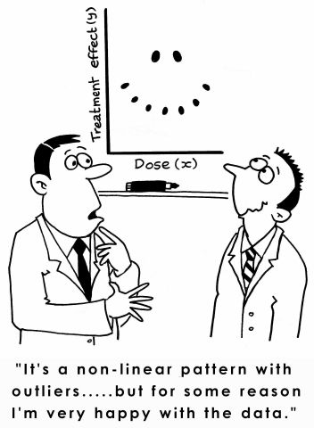

class: center, middle


# Interactions and Nonlinearities with Linear Models and Continuous Variables


```{r setup, include=FALSE}
library(knitr)
library(ggplot2)
library(dplyr)
library(tidyr)
library(broom)
library(readr)
library(car)
library(modelr)
library(emmeans)
library(visreg)
library(performance)

opts_chunk$set(fig.height=6, 
               fig.width = 8,
               fig.align = "center",
               comment=NA, 
               warning=FALSE, 
               echo = FALSE,
               message = FALSE)

options(htmltools.dir.version = FALSE,
        knitr.kable.NA = '')
theme_set(theme_bw(base_size=28))

table_out <- . %>%
  knitr::kable("html") %>%
  kableExtra::kable_styling("striped")
```

---
class: center, middle

# Etherpad
<br><br>
<center><h3>https://etherpad.wikimedia.org/p/607-interactions-nonlinearities-2022</h3></center>


---
# The world isn't additive

-   Until now, we have assumed predictors combine additively  
     - the effect of one is not dependent on the effect of the other

--

-   BUT - what if the effect of one variable depends on the level of another?

--

-   This is an **INTERACTION** and is quite common  
     - Heck, a squared term is the interaction of a variable with itself!

--

- Biology: The science of "It depends..."  

--

-   This is challenging to think about and visualize, but if you can master it, you will go far!

---

# The Linear Model Can Accomodate Many Flavors of Nonlinearity

$$\hat{y_i} = \beta_0 + \beta_1 x_{1i} = \beta_2 x_{2i}$$
$$y_i \sim N(\hat{y_i}, \sigma)$$
--
Could become...


$$\hat{y_i} = \beta_0 + \beta_1 x_{1i} + \beta_2 x_{1i}^2$$
--
Could be...


$$\hat{y_i} = \beta_0 + \beta_1 x_{1i} + \beta_2 x_{2i} + \beta_3 x_{1i}x_{2i}$$
--
.center[**It is ALL additive terms**]

---
# We Saw How One Category Can Influence Another

$$\large y_{ijk} = \beta_{0} + \sum \beta_{i}x_{i} + \sum \beta_{j}x_{j} + \sum \beta_{ij}x_{ij} + \epsilon_{ijk}$$ 

```{r plot_algae}
algae <- read.csv("lectures/data/22/18e3IntertidalAlgae.csv")

algae_plot <- qplot(height, sqrtarea,  data=algae, geom="boxplot", fill=herbivores) + theme_bw(base_size=16)

algae_plot


```

---
# A Nonlinear World

1. Interactions between categorical and continuous variables

2. Multiple linear regression with interactions

3. Multiple linear regression and nonlinear predictors in general  
  
---
background-image:url(images/23/fires.jpg)
background-size:contain
background-position:center
class: bottom, inverse


### Previously - a five year study of wildfires & recovery in Southern California shurblands in 1993. 90 plots (20 x 50m)  

(data from Jon Keeley et al.)

---
# What causes species richness?

- Distance from fire patch  

- Elevation  

- Abiotic index  

- Patch age  

- Patch heterogeneity  

- Severity of last fire  

- Plant cover  


---
# Does The Effect of Plant Cover Vary by Elevation?

```{r}
keeley <- read.csv("lectures/data/23/Keeley_rawdata_select4.csv")

ggplot(keeley,
       aes(x = cover, y = rich, 
           color = elev)) +
  geom_point() +
  scale_color_viridis_c(option = "B")
```

---
# Does The Effect of Plant Cover Vary by Elevation?

```{r}
keeley <- keeley |>
  mutate(elev_group = cut_number(elev, 4))

levels(keeley$elev_group) <- c("Sealevel", "Low", "Moderate", "High")

ggplot(keeley,
       aes(x = cover, y = rich, 
           color = elev)) +
  geom_point() +
  scale_color_viridis_b(option = "B", n.breaks = 5) +
  facet_wrap(vars(elev_group))
```


---
# Previously, the Effect of One Category Depended on Another

$$\large y_{ijk} = \beta_{0} + \sum \beta_{i}x_{i} + \sum \beta_{j}x_{j} + \sum \beta_{ij}x_{ij} + \epsilon_{ijk}$$  

$$\large \epsilon_{ijk} \sim N(0, \sigma^{2} )$$
$$\large x_{i} = 0,1, x_{j} = 0,1, x_{ij} = 0,1$$ 

---
# Now the Effect of Continuous Predictor Varies by a Category

$$\large y_{ij} = \beta_{0} + \beta_{1}x_{1} + \sum \beta_{j1}x_{j} + \sum \beta_{j2}x_{1}x_{j} + \epsilon_{ij}$$  

$$\large \epsilon_{ijk} \sim N(0, \sigma^{2} ), \qquad  x_{j} = 0,1,$$

- Here, we have a model with a continuous covariate and a categorical variable  

--

- The final term is the deviation in the slope ( $\beta_1$ ) due to being in group j  

--

- This is, yet again, an interaction effect

--

- Yet again, this can ALL be represented in $Y = \beta X + \epsilon$

---
# This Model and its Contrasts Should be Familiar
```{r, echo = TRUE}
elev_int_mod <- lm(rich ~ cover * elev_group, data = keeley)
```

```{r}
tidy(elev_int_mod) |>
  select(1:3) |>
  knitr::kable(digits = 3) |>
  kableExtra::kable_styling()
```

---
# Yes, Assumptions as Usual
```{r}
check_model(elev_int_mod)
```

VIF for interactions is not really important


---
# What Does it All Mean: Slopes Affected by Groups

```{r}
emtrends(elev_int_mod, specs = ~elev_group, var = "cover")
```

---
# Yes, You Can Compare Slopes

```{r}
emtrends(elev_int_mod, specs = ~elev_group, var = "cover") |>
  contrast("pairwise") |>
  confint()
```


---
# What Does it All Mean: Group Means at Different Values of Covariates
```{r}
emmeans(elev_int_mod, ~elev_group | cover,
        at = list(cover = seq_range(keeley$cover, 3))) |>
  tidy() |>
  select(1:4) |>
  knitr::kable(digits = 3) |>
  kableExtra::kable_styling()
```

---
# What Does it All Mean: Group Comparisons Change with Covariates
```{r}
emmeans(elev_int_mod, ~elev_group | cover,
        at = list(cover = seq_range(keeley$cover, 2))) |>
  contrast("pairwise") |>
  confint()
```
        

---
# Visualization is Key: Changing Slopes and Counterfactuals

```{r}
visreg(elev_int_mod, "cover", by = "elev_group", gg = TRUE) 
```


---
# A Nonlinear World

1. Interactions between categorical and continuous variables

2. .red[Multiple linear regression with interactions]

3. Multiple linear regression and nonlinear predictors in general  
  

---
# Problem: What if Continuous Predictors are Not Additive?

```{r keeley_int_plot3d, fig.height=6, fig.width=7}
source("lectures/3dplotting.R")
with(keeley, scatterPlot3d(age,elev,firesev, 
                           col="black", xlab="age", ylab="elev",
                           zlab="firesev",
                           phi=20, theta=-25))

```

---
# Problem: What if Continuous Predictors are Not Additive?

```{r keeley_int_plot}
keeley$egroup <- keeley$elev<600
k_plot <- qplot(age, firesev, data=keeley, color=elev, size=elev)  + theme_bw() +
  scale_color_continuous(low="blue", high="red")
k_plot 
```

---
# Problem: What if Continuous Predictors are Not Additive?

```{r keeley_int_plot2}
k_plot + stat_smooth(method="lm", aes(group=egroup))
```

---
# Model For Age Interacting with Elevation to Influence Fire Severity
$$y_i = \beta_0 + \beta_{1}x_{1i} + \beta_{2}x_{2i}+ \beta_{3}x_{1i}x_{2i} + \epsilon_{i}$$
- Interaction is product of X1 and X2

- Can be as many interactions as you'd like

- Honestly, you can do whatever feature engineering you want to make complex combinations of predictors!

- But, multiplication is common

--

Code just like previous models!

```{r keeley_mod_int, echo=TRUE}
keeley_lm_int <- lm(firesev ~ age * elev, data=keeley)
```

---
# Interactions are Collinear with Predictors

$$VIF_1 = \frac{1}{1-R^2_{1}}$$ 

```{r int_vif, echo = TRUE}
vif(keeley_lm_int)
```

--
This isn't that bad.

--

Often, interactions or nonlinear derived predictors are collinear with one or more of their predictors. 

--

If you want to remove, this, we can **center** predictors - i.e., $X_i - mean(X)$

---
# Interpretation of Centered Coefficients
$$\huge X_i - \bar{X}$$


- Additive coefficients are the effect of a predictor at the mean value of the other predictors

--

-   Intercepts are at the mean value of all predictors 

--

- This is good practice for regression models in general when 0 is meaningless for predictors

--

- Also, relationships can become sharply nonlinear at 0, and you likely aren't modeling that correctly

--

-   Visualization will keep you from getting confused! 

---
# Interactions, VIF, and Centering
$$y = \beta_0 + \beta_{1}(x_{1}-\bar{x_{1}}) + \beta_{2}(x_{2}-\bar{x_{2}})+ \beta_{3}(x_{1}-\bar{x_{1}})(x_{2}-\bar{x_{2}})$$
--

Woof.  That looks ugly. But, read it. It is not as complex as you think.

--

Variance Inflation Factors for Centered Model:

```{r keeley_vif_cent}
keeley <- keeley %>%
  mutate(age_c = age-mean(age),
         elev_c = elev - mean(elev))

keeley_lm_int_cent <- lm(firesev ~ age_c*elev_c, data=keeley)

vif(keeley_lm_int_cent)
```

--

- Honestly, again, not important - unless you are using a parameter search algorithm where collinearity can get it lost.  

- E.g., centering can *dramatically* spead up Bayesian MCMC and HMC  
---
# Coefficients (non-centered model)!
```{r int_coef}
knitr::kable(coef(summary(keeley_lm_int)))
```


R<sup>2</sup> = `r summary(keeley_lm_int)$r.square`

--

- Note that additive coefficients signify the effect of one predictor **in the absence of all others.**

- Intercept is value of Y when all coefficients are 0

---
# Centered Coefficients!
```{r int_coef_cent}
knitr::kable(coef(summary(keeley_lm_int_cent)))
```


R<sup>2</sup> = `r summary(keeley_lm_int_cent)$r.square`

--

- Note that additive coefficients signify the effect of one predictor **at the average level of all others.**

- Intercept is value of Y at the **average level** of all predictors.


---
# Interpretation
- What the heck does an interaction effect with continuous variables mean?

--

- We can look at the effect of one variable at different levels of the other

--

- We can look at a surface 

--

- We can construct *counterfactual* plots showing how changing both variables influences our outcome

---
# Age at Different Levels of Elevation
```{r int_visreg}
visreg(keeley_lm_int, "age", by="elev", gg = TRUE)
```

---
# Elevation at Different Levels of Age
```{r int_visreg_2}
visreg(keeley_lm_int, "elev", by="age", gg = TRUE)
```

---
# Surfaces and Other 3d Objects
```{r surf_int, fig.height=8, fig.width=10}
abcSurf(keeley_lm_int, phi=20, theta=-65, col="lightblue") -> p 

with(keeley, scatterPlot3d(age,elev,firesev, add=T, background=p, col="black", alpha=0.4))
```

---
# Surfaces and Heatmaps
```{r surf_int_heat, fig.height=8, fig.width=10}
visreg2d(keeley_lm_int, "age", "elev")
```

---
# Or all in one plot
```{r keeley_int_pred}
k_pred <- crossing(elev = 100:1200, age = quantile(keeley$age)) %>%
  modelr::add_predictions(keeley_lm_int, var="firesev") %>%
  mutate(age_levels = paste("Age = ", age, sep=""))

ggplot() +
  geom_point(keeley, mapping=aes(x=elev, y=firesev, color=age, size=age)) +
  geom_line(data=k_pred, mapping=aes(x=elev, y=firesev, color=age, group=age)) +
  scale_color_continuous(low="blue", high="red") +
  theme_bw(base_size=17)
```

---
# Without Data and Including CIs
```{r keeley_int_pred_nodata}

k <- predict(keeley_lm_int, newdata=k_pred, se.fit=TRUE, interval="confidence")
k_pred$lwr = k$fit[,2]
k_pred$upr = k$fit[,3]

ggplot() +
  geom_ribbon(data=k_pred, mapping=aes(x=elev, y=firesev, group=age, ymin = lwr, ymax=upr),
              alpha=0.1) +
  geom_line(data=k_pred, mapping=aes(x=elev, y=firesev, color=age, group=age)) +
  scale_color_continuous(low="blue", high="red") +
  theme_bw(base_size=17)
```


---
# A Nonlinear World

1. Interactions between categorical and continuous variables

2. Multiple linear regression with interactions

3. .red[Multiple linear regression and nonlinear predictors in general]  
  
---
# What if Plant Cover's Impact is Highest at Intermediate Levels?

```{r}
ggplot(keeley,
       aes(x = cover, y = rich)) +
  geom_point() +
  stat_smooth(method = "lm", formula = y ~ poly(x,2))
```

---
# It's Just Another Linear Model!
$$y_i = \beta_0 + \beta_{1}x_{i} + \beta_{2}x_{i}^2 +\epsilon_{i}$$
$$\epsilon_i \sim \mathcal{N}(0 , \sigma)$$

--
- Hey, that looks familiar!  
    
--
  
- This is the same thing as before  
  
--
  
- It's not just for squares!
  
--

```{r, echo = TRUE}
#note the I()
keeley_sq <- lm(rich ~ cover + I(cover^2), data = keeley)
```

---
# Yes, This is the Same
```{r}
check_model(keeley_sq)
```

- Note VIFs - again, not a worry with Least Squares

---
# We Can Look at Coefs...

```{r}
tidy(keeley_sq)
```

---
# But Visualization is the Way to Go

```{r}
ggplot(keeley,
       aes(x = cover, y = rich)) +
  geom_point() +
  stat_smooth(method = "lm", formula = y ~ poly(x,2))
```

---
# You know know all the models

- Interaction effects or other nonlinearities are often one of the most useful and yet hardest to grok parts of building models

--

- BUT, if you can learn *how to understand* interactions and nonlinearities in your model, you've reached the upper echelons

--

- BUT, beware. Not every model needs an nonlinearity or interaction - start with the fundamentals of theory and biology first

---
class:middle, center


