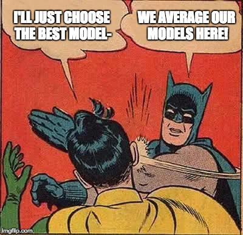

class: center, middle


# So Many Variables: Multiple Linear Regression and Variable Selection


```{r setup, include=FALSE}
library(knitr)
library(ggplot2)
library(dplyr)
library(tidyr)
library(broom)
library(readr)
library(brms)
library(ggdist)
library(tidybayes)
library(car)
library(AICcmodavg)
library(emmeans)
library(visreg)

opts_chunk$set(fig.height=6, 
               fig.width = 8,
               fig.align = "center",
               comment=NA, 
               warning=FALSE, 
               echo = FALSE,
               message = FALSE)

options(htmltools.dir.version = FALSE,
        knitr.kable.NA = '')
theme_set(theme_bw(base_size=28))

table_out <- . %>%
  knitr::kable("html") %>%
  kableExtra::kable_styling("striped")
```

---
class: center, middle

# Etherpad
<br><br>
<center><h3>https://etherpad.wikimedia.org/p/607-mlr-2020 </h3></center>

---
# So many variables.

1. Multiple linear regression review  

2. Multiple linear regression with interactions

3. Visualizaing MLR

4. The problem of what variables to choose: muti-model inference

---
# Previously On Multiple Regression and the General Linear Model!

.middle[.center[

]

With multiple regression, we estimate the effect of one variable as if we were controlling for the other, given the covariance between predictors.

]

---
background-image:url(images/23/fires.jpg)
background-size:contain
background-position:center
class: bottom, inverse

### Five year study of wildfires & recovery in Southern California shurblands in 1993. 90 plots (20 x 50m)  

(data from Jon Keeley et al.)

---
# What causes species richness?

- Distance from fire patch  

- Elevation  

- Abiotic index  

- Patch age  

- Patch heterogeneity  

- Severity of last fire  

- Plant cover  

---
# Our Model

$$Richness_i =\beta_{0} + \beta_{1} cover_i +\beta_{2} firesev_i + \beta_{3}hetero_i +\epsilon_i$$
--

```{r keeley_pairs}
keeley <- read.csv("data/23/Keeley_rawdata_select4.csv")
```

```{r mlr, echo=TRUE}

klm <- lm(rich ~ cover + firesev + hetero, data=keeley)
```

---
# Evaluating If Multicollinearity is a Problem
# Checking for Multicollinearity: Variance Inflation Factor
$$VIF_1 = \frac{1}{1-R^2_{1}}$$ 


```{r klm_vi, echo = TRUE}
vif(klm)
``` 

---
# Other Diagnostics as Usual!

```{r klm_diag, fig.height=6}
par(mfrow=c(2,2))
plot(klm, which=c(1,2,5))
par(mfrow=c(1,1))
```

---
# Modeled Results

```{r keeley_coe}
knitr::kable(coef(summary(klm)), digits=2)
``` 

- Coefficients are the change in units of y per change in 1 unit of X

- Intercept is value of y when all variables are 0
---
# Comparing Coefficients on the Same Scale

If we want to get Partial Correlation Coefficients, we can z-transform all predictors or use this formula:

$$r_{xy} = b_{xy}\frac{sd_{x}}{sd_{y}}$$ 

```{r keeley_std, size="normalsize"}
library(QuantPsyc) 
lm.beta(klm)
```

Now, $\beta$s are change in SD of Y per change in 1 SD of X

---
# Viz is an art

```{r klm_visreg, fig.height=6}
library(patchwork)
a <- visreg::visreg(klm, gg=TRUE)
a[[1]] + a[[2]] + a[[3]] + 
  plot_layout(ncol = 2, guides = 'collect')
```


---
# So many variables.

1. Multiple linear regression review  

2. .red[Multiple linear regression with interactions]

3. Visualizaing MLR

4. The problem of what variables to choose: muti-model inference

---
# Problem: What if Continuous Predictors are Not Additive?

```{r keeley_int_plot3d, fig.height=6, fig.width=7}
source("./3dplotting.R")
with(keeley, scatterPlot3d(age,elev,firesev, 
                           col="black", xlab="age", ylab="elev",
                           zlab="firesev",
                           phi=20, theta=-25))

```

---
# Problem: What if Continuous Predictors are Not Additive?

```{r keeley_int_plot}
keeley$egroup <- keeley$elev<600
k_plot <- qplot(age, firesev, data=keeley, color=elev, size=elev)  + theme_bw() +
  scale_color_continuous(low="blue", high="red")
k_plot 
```

---
# Problem: What if Continuous Predictors are Not Additive?

```{r keeley_int_plot2}
k_plot + stat_smooth(method="lm", aes(group=egroup))
```

---
# Model For Age Interacting with Elevation to Influence Fire Severity
$$y_i = \beta_0 + \beta_{1}x_{1i} + \beta_{2}x_{2i}+ \beta_{3}x_{1i}x_{2i} + \epsilon_{i}$$
- Interaction is product of X1 and X2

- Can be as many interactions as you'd like

- Honestly, you can do whatever feature engineering you want to make complex combinations of predictors!

- But, multiplication is common

--

Code just like factorial models!

```{r keeley_mod_int, echo=TRUE}
keeley_lm_int <- lm(firesev ~ age*elev, data=keeley)
```

---
# A Problem: Interactions are Collinear with Predictors

$$VIF_1 = \frac{1}{1-R^2_{1}}$$ 

```{r int_vif, echo = TRUE}
vif(keeley_lm_int)
```

--
This isn't that bad. But it can be. 

--

Often, interactions or nonlinear derived predictors are collinear with one or more of their predictors. 

--

To remove, this, we can **center** predictors - i.e., $X_i - mean(X)$

---
# Interpretation of Centered Coefficients
$$\huge X_i - \bar{X}$$


- Additive coefficients are the effect of a predictor at the mean value of the other predictors

--

-   Intercepts are at the mean value of all predictors 

--

- This is good practice for regression models in general when 0 is meaningless for predictors

--

- Also, relationships can become sharply nonlinear at 0, and you likely aren't modeling that correctly

--

-   Visualization will keep you from getting confused! 

---
# Interactions, VIF, and Centering
$$y = \beta_0 + \beta_{1}(x_{1}-\bar{x_{1}}) + \beta_{2}(x_{2}-\bar{x_{2}})+ \beta_{3}(x_{1}-\bar{x_{1}})(x_{2}-\bar{x_{2}})$$
--

Woof.  That looks ugly. But, read it. It is not as complex as you think.

--

Variance Inflation Factors for Centered Model:

```{r keeley_vif_cent}
keeley <- keeley %>%
  mutate(age_c = age-mean(age),
         elev_c = elev - mean(elev))

keeley_lm_int_cent <- lm(firesev ~ age_c*elev_c, data=keeley)

vif(keeley_lm_int_cent)
```

---
# F-Tests to Evaluate Model
What type of Sums of Squares??

--

```{r int_anova}
knitr::kable(Anova(keeley_lm_int))
```

---
# Coefficients (non-centered model)!
```{r int_coef}
knitr::kable(coef(summary(keeley_lm_int)))
```


R<sup>2</sup> = `r summary(keeley_lm_int)$r.square`

--

- Note that additive coefficients signify the effect of one predictor **in the absence of all others.**

- Intercept is value of Y when all coefficients are 0

---
# Centered Coefficients!
```{r int_coef_cent}
knitr::kable(coef(summary(keeley_lm_int_cent)))
```


R<sup>2</sup> = `r summary(keeley_lm_int_cent)$r.square`

--

- Note that additive coefficients signify the effect of one predictor **at the average level of all others.**

- Intercept is value of Y at the **average level** of all predictors.

---
# So many variables.

1. Multiple linear regression review  

2. Multiple linear regression with interactions

3. .red[Visualizaing MLR]

4. The problem of what variables to choose: muti-model inference


---
# Interpretation
- What the heck does an interaction effect mean?

--

- We can look at the effect of one variable at different levels of the other

--

- We can look at a surface 

--

- We can construct *counterfactual* plots showing how changing both variables influences our outcome

---
# Age at Different Levels of Elevation
```{r int_visreg}
visreg(keeley_lm_int, "age", by="elev", gg = TRUE)
```

---
# Elevation at Different Levels of Age
```{r int_visreg_2}
visreg(keeley_lm_int, "elev", by="age", gg = TRUE)
```

---
# Surfaces and Other 3d Objects
```{r surf_int, fig.height=8, fig.width=10}
abcSurf(keeley_lm_int, phi=20, theta=-65, col="lightblue") -> p 

with(keeley, scatterPlot3d(age,elev,firesev, add=T, background=p, col="black", alpha=0.4))
```

---
# Or all in one plot
```{r keeley_int_pred}
k_pred <- crossing(elev = 100:1200, age = quantile(keeley$age)) %>%
  modelr::add_predictions(keeley_lm_int, var="firesev") %>%
  mutate(age_levels = paste("Age = ", age, sep=""))

ggplot() +
  geom_point(keeley, mapping=aes(x=elev, y=firesev, color=age, size=age)) +
  geom_line(data=k_pred, mapping=aes(x=elev, y=firesev, color=age, group=age)) +
  scale_color_continuous(low="blue", high="red") +
  theme_bw(base_size=17)
```

---
# Without Data and Including CIs
```{r keeley_int_pred_nodata}

k <- predict(keeley_lm_int, newdata=k_pred, se.fit=TRUE, interval="confidence")
k_pred$lwr = k$fit[,2]
k_pred$upr = k$fit[,3]

ggplot() +
  geom_ribbon(data=k_pred, mapping=aes(x=elev, y=firesev, group=age, ymin = lwr, ymax=upr),
              alpha=0.1) +
  geom_line(data=k_pred, mapping=aes(x=elev, y=firesev, color=age, group=age)) +
  scale_color_continuous(low="blue", high="red") +
  theme_bw(base_size=17)
```

---
# A Heatmap Approach
```{r int_heatmap}
k_pred_grid <- crossing(elev = 100:1200, age = 3:60) %>%
  modelr::add_predictions(keeley_lm_int, var="firesev")

ggplot(k_pred_grid, mapping=aes(x=age, y=elev, colour=firesev)) +
  geom_tile() +
#  scale_color_continuous(low="lightblue", high="red")
  scale_color_gradient2(low = "blue", high="red", mid="white", midpoint=5)
```

---
# You know know all the models

- Interaction effects or other nonlinearities are often one of the most useful and yet hardest to grok parts of building models

- BUT, if you can learn *how to understand* interactions in your model, you've reached the upper echelons

- BUT, beware. Not every model needs an interaction - start with the fundamentals of theory and biology first

---
class:middle, center


---
# So many variables.

1. Multiple linear regression review  

2. Multiple linear regression with interactions

3. Visualizaing MLR

4. .red[The problem of what variables to choose: muti-model inference]


---
# So.... How do you Choose What Variables to Include?

```{r keeley_pairs, height = 5}
```

7 models alone with 1 term each  
`r sum(choose(7,1:7))` possible **without** interactions.

#


---
class: center, middle

##Hint: The real answer is to think about biology - it's coming - but sometimes, you are doing pure exploration, so...

---
# A Quantitative Measure of Relative Support

$$w_{i} = \frac{e^{-\Delta_{i}/2 }}{\displaystyle \sum^R_{r=1} e^{-\Delta_{i}/2 }}$$

Where $w_{i}$ is the relative supporfor model i
compared to other models in the set being considered.

Model weights summed together = 1

---
# Let's Begin with a Full Model

```{r fullmod0, echo=TRUE}
keeley_full <- lm(rich ~  elev + abiotic + hetero +
                          distance + firesev + 
                          age + cover,
                  data = keeley)
```
 We use this model as a jumping off point, and construct a series of nested models with subsets of the variables.  

Evaluate using AICc Weights!

---
# Sometimes, You Can Use a Models broken down by CLASSES of Predictors

```{r models1, echo=TRUE}
keeley_soil_fire <- lm(rich ~ elev + abiotic + hetero +
                          distance + firesev,
                  data = keeley)

keeley_plant_fire <- lm(rich ~  distance + firesev + 
                          age + cover,
                  data = keeley)

keeley_soil_plant <- lm(rich ~  elev + abiotic + hetero +
                          age + cover,
                  data = keeley)
```
---

# One Factor Models

.middle[

```{r models2, echo=TRUE}
keeley_soil <- lm(rich ~  elev + abiotic + hetero,
                  data = keeley)

keeley_fire <- lm(rich ~  distance + firesev,
                  data = keeley)

keeley_plant <- lm(rich ~  age + cover,
                  data = keeley)
```

]

---
# Null Model
.middle[

```{r models3, echo=TRUE}
keeley_null <- lm(rich ~  1,
                  data = keeley)

```

]

---
# Now Compare Models Weights

```{r modelList}
modelList <- list(keeley_full,
                  keeley_plant_fire,
                  keeley_soil_fire,
                  keeley_soil_plant,
                  keeley_soil,
                  keeley_plant,
                  keeley_fire,
                  keeley_null)

names(modelList) <- c("full",
     "plant_fire",
     "soil_fire",
     "soil_plant",
     "soil",
     "plant",
     "fire", "null")

```

```{r aicctab}
knitr::kable(aictab(modelList)[,-8], modnames = names(modelList), digits=3)
```

---
class:center, middle

## So, I have some sense of good models? What now?

---

class: center, middle



---
# Variable Weights

How to I evaluate the importance of a variable?   

--

Variable Weight = sum of all weights of all models including a variable. Relative support for inclusion of parameter in models. 

--

```{r importance2}
importance(modelList, parm="firesev", modnames=names(modelList))
```

--

But what about the estimand and its precision?
---
background-color: black
class: center, middle


---
# We can Use Model Averaged Parameters

$$\hat{\bar{\beta}} = \frac{\sum w_{i}\hat\beta_{i}}{\sum{w_i}}$$


$$var(\hat{\bar{\beta}}) = \left [ w_{i} \sqrt{var(\hat\beta_{i}) + (\hat\beta_{i}-\hat{\bar{\beta_{i}}})^2}  \right ]^2$$


Buckland et al. 1997

---

# Model Averaged Parameters

```{r varEst, echo = TRUE}
modavgShrink(modelList, parm="firesev",  modnames=names(modelList))
```

---
class:center, middle
background-color: black


---
# Best to Use Model Averaged Predictions

```{r Predict_data, echo=TRUE}

newData <- data.frame(distance = 50,
                      elev = 400,
                      abiotic = 48,
                      age = 2,
                      hetero = 0.5,
                      firesev = 10,
                      cover=0.4)
```

```{r predict}
modavgPred(modelList, modnames=names(modelList), newdata = newData)
```
---

# Death to single models!
- While sometimes the model you should use is clear, more often it is *not*  

--

- Further, you made those models for a reason: you suspect those terms are important  

--

- Better to look at coefficients across models  

--

- For actual predictions, ensemble predictions provide real uncertainty

---

# What about IC Analyses in Bayes?

.center[.middle[

]]
---

# Bayesian MMI

- We can calculate an IC and Model Weight using LOOIC or WAIC

- We can get weighted parameter estimates by sampling from the chains of different models in proportion to their IC weight

- We can get MMI predictions by doing the same with predictions!

---

# Final Notes on Many Models

- If you can, don't do this. Start by building models and working up. We will talk about this soon.

--

-   BUT, if you are exploring model space, IC analyses aid in model selection. One must still evaluate parameters and parameter error.  

--

-   Your inferences are constrained solely to the range of models
    you consider. You may have missed the ’best’ model for prediction.
    
--

- Remember, this is ALL ABOUT PREDICTION

--


-   All inferences <span>**MUST**</span> be based on <span>*a*
    priori</span> models. Post-hoc model dredging could result in an erroneous ’best’ model suited to your unique data set.  

--

-   Ensemble predictions are a powerful practice to show true uncertainty