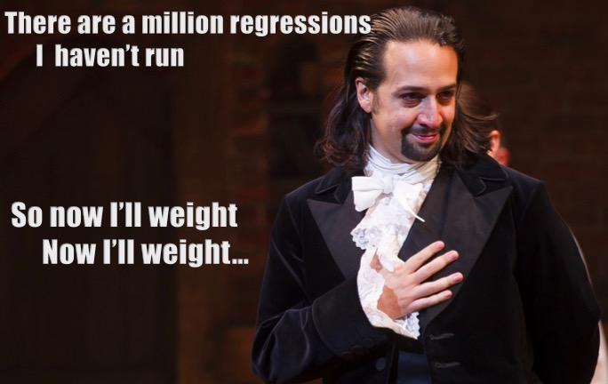

class: center, middle
# Modeling Error: From the Ordinary to the General(ized)




```{r prep, echo=FALSE, cache=FALSE, message=FALSE, warning=FALSE}
library(knitr)


opts_chunk$set(fig.height=7, 
               fig.width = 10,
               fig.align = "center",
               comment=NA, 
               warning=FALSE, 
               echo = FALSE,
               message = FALSE)

options(htmltools.dir.version = FALSE)

library(ggplot2)

library(dplyr)
library(tidyr)
library(broom)
library(broom.mixed)
library(MASS)
library(tibble)
library(performance)
library(glmmTMB)
library(nlme)
library(DHARMa)

theme_set(theme_bw(base_size = 16))
```

---
class: center, middle

# https://etherpad.wikimedia.org/p/607-glm-2022

---
# Oh, The Things We Have Done with this Model

$$\Large \boldsymbol{Y} = \boldsymbol{\beta X} + \boldsymbol{\epsilon}$$  
<br><br><br>
$$\Large \boldsymbol{\epsilon} \sim N(\boldsymbol{0}, \boldsymbol{\sigma})$$

---
# But THIS is Still Possible
```{r qqbad}
set.seed(2018)
mydat <- tibble(x = runif(100)) %>%
  mutate(y = rnorm(100, x, 2*x))

plot(lm(y~x, data = mydat), which = 2)
```

---
# Or this!

```{r groupbad}
set.seed(2018)
mydat <- tibble(x = factor(rep(letters[1:4], 25)), 
  y = rnorm(100, rep(c(1,3,5,9), 25), rep(c(1,3,5,9), 25)))

plot(lm(y~x, data = mydat), which = 1)
```

---
# Your Golem Can Now Blow Up Prague
.center[ ]

---
# Why Limit Ourselves?

$$\Large \boldsymbol{Y} = \boldsymbol{\beta X} + \boldsymbol{\epsilon}$$  
<br><br><br>
$$\Large \boldsymbol{\epsilon} \sim N(\boldsymbol{0}, \boldsymbol{\sigma})$$
--
Is this all there is?

---
# What if We Could Model Variance

$$\Large \boldsymbol{Y} = \boldsymbol{\beta X} + \boldsymbol{\epsilon}$$  
<br><bR>

$$\Large \boldsymbol{\epsilon} \sim N(\boldsymbol{0}, \boldsymbol{\sigma_i})$$
<br><br>
$$\Large \boldsymbol{\sigma_i} = ...$$

---
# What If We Could Harness Other Distributions?

$$\Large \boldsymbol{\hat{Y}} = \boldsymbol{\beta X} $$  
<br><bR>

$$\Large \boldsymbol{Y} \sim \mathcal{D}(\boldsymbol{\hat{Y}}, \boldsymbol{\theta})$$

---
# Out of the Normal

1. Modeling Variance & Generalized Least Squares (GLS)  

2. Robust Assumption Tests with Randomized Quantile Residuals  
  
3. Moving from Normality to Generalized Linear Models (GLM)


---
# Basic Principles of Linear Models

-   Y is determined by X: p(Y $|$ X=x)  

--

-   The relationship between X and Y is Linear  

--

-   The residuals of $\widehat{Y_i} = \beta_0 + \beta_1 X_i + \epsilon$ are normally distributed with constant variance   
  
      - $\epsilon_i \sim N(0,\sigma)$  

---
# Basic Principles of Ordinary Least Squares

$\widehat{Y} = \beta_0 + \beta_1 X + \epsilon$ where $\beta_0$ = intercept, $\beta_1$ = slope

```{r linefit, fig.width=5, fig.height=5}
set.seed(697)
x<-1:10
y<-rnorm(10, mean=x,sd=2)
a<-lm(y~x)
plot(x,y,pch=19, cex=1.5)
abline(a, lwd=2)
segments(x,fitted(a),x,y, col="red", lwd=2)
``` 

Minimize Residuals defined as $SS_{residuals} = \sum(Y_{i} - \widehat{Y})^2$

---
# Should Every Point get Equal Weight?

**Ordinary Least Squares:**  

$$SS_{residuals} = \sum(Y_{i} - \widehat{Y})^2$$

This implies each point contains as much information as every other

--

<hr>

**Weighted Least Squares:**  

$SS_{residuals} = \sum W_i(Y_{i} - \widehat{Y})^2$

Implies each data point might have less information - porportional to variance

---
# Weighted Least Squares and Our Model

$$\Large y_i \sim \mathcal{N}(\hat{y_i}, \sigma^2_i)$$

$$\Large \hat{y_i} = \beta_0 + \beta_1 x_i$$

--
What if

$$\Large \sigma^2_i =  \sigma^2 f(x_i)$$

or other predictors (maybe even different ones than in the linear model itself!)

--

If we also model the *off diagonal* of $\sigma^2$ we get into **generalized least squares**

---
# Iteratively Reweighted Least Squares Algorithm
$$\hat{y_i} = \beta_0 + \beta_1 x_i$$
$$\sigma^2_i =  \sigma^2 f(x_i)$$
$SS_{residuals} = \sum W_i(Y_{i} - \widehat{Y})^2$

1. Start with all wi = 1  

2. Use least squares to estimate $\beta$  

3. use the residuals to estimate f(x) (i.e., regress residuals on $x_1$)  

4. Recompute the weights and go back to 2.  

---
# SQUID!


```{r}
squid <- readr::read_delim("Lectures/data/gls/squid.txt") |>
  mutate(MONTH = as.character(MONTH))
```

---
# How does that Variance Look?

```{r}
ggplot(squid,
       aes(y = Testisweight, x = DML)) +
  geom_point() +
  labs(x = "Dorsal Mantle Length", y = "Testis Weight")
```

---
# How Bad Is It?

```{r, results = 'hide'}
squid_lm <- lm(Testisweight ~ DML, data = squid)
check_model(squid_lm, check = "linearity", panel = FALSE) |> plot()
```

---
# Weight by Inverse of Covariate
```{r}
#https://data.library.virginia.edu/modeling-non-constant-variance/ for gls
#https://www.flutterbys.com.au/stats/tut/tut8.2a.html
```
$$w_i = \frac{1}{\sqrt{x_i}}$$
$$\sigma^2_i = \sigma^2 w_i$$
--

- This means that we downweight the contribution of covariates with larger values  
  
- Common, as it is a simple solution using least squares  
  
- However, unsatisfying as it cannot accommodate some complex error structures

---
# Different Variance Structures

- `varFixed` - Linear continuous variance  

- `varIdent` - Variance differs by groups  

- `varPower` - Variance increases by a power  

- `varExp`  - Variance exponentiated  

- `varConstPower` - Variance is constant + power  

- `varComb` - Combines different variance functions

--

*All assume weights are porportional to some property, and do not estimate relationship underlying variance explicitly*

---
# Modeling Variance with Likelihood

$$\Large \hat{y_i} = \beta_0 + \beta_1 x_i$$
$$\Large \sigma^2_i =  \gamma_0 + \gamma_1x_i$$
--

- Flexible  
  
- Likelihood maximizes the probability density of $y_i$ given the above two equations  
  
- Isn't this a more general solution - LM, but for your variance!

---
# GLS versus Likelihood
GLS
```{r, echo = TRUE}
library(nlme)
squid_gls <- gls(Testisweight ~ DML, 
                 
                 weights = varFixed(~ DML),
                                  
                 data=squid)
```

--

Likelihood
```{r, echo = TRUE}
library(glmmTMB)
squid_lik <- glmmTMB(Testisweight ~ DML,
                     
                     dispformula = ~ DML,
                     
                     data = squid)
```

---
# GLS versus Likelihood - Coefficients

GLS
```{r}
tidy(squid_gls) |>
  dplyr::select(1:3) |>
  knitr::kable(digits = 3) |>
  kableExtra::kable_styling()
```

Likelihood
```{r}
tidy(squid_lik) |>
  dplyr::select(3:5) |>
  knitr::kable(digits = 3) |>
  kableExtra::kable_styling()
```

--

Difference in saying variance is porportional to predictor v. modeling variance explicitly

---
# GLS versus Likelihood - R2

GLS
```{r}
r2(squid_gls)
```


Likelihood
```{r}
r2(squid_lik)
```

---
# Out of the Normal

1. Modeling Variance & Generalized Least Squares (GLS)  

2. .red[Robust Assumption Tests with Randomized Quantile Residuals]  
  
3. Moving from Normality to Generalized Linear Models (GLM)


---
# Assessing Assumptions when Modeling Variance: Quantile Residuals

- Every residual point comes from a distribution  

--

- Every distribution has a *cummulative distribution function*

--

- The CDF of a probability distribution defines it's quantiles - from 0 to 1.

--

- We can determine the quantile of any point relative to its distribution

---
# A Quantile from a Distribution: Say this is your distribution 

```{r}
distplot <- tibble(x = seq(-3,3, length.out=200),
                   dens = dnorm(x),
                   cdf = pnorm(x))
x_obs <- 1.4

p <- ggplot(distplot, aes(x = x, y = dens)) +
  geom_line() +
  labs(x = "", y = "Density or Cummulative Density")

p
```

---
# A Quantile from a Distribution: Overlay the CDF
```{r}
 p <- p +
  geom_line(aes(y = cdf), color = "blue")

p
```

---
# A Quantile from a Distribution: This is our Point
```{r}
p + geom_point(x = x_obs, y = 0, color = "red", size = 2)
```

---
# A Quantile from a Distribution: We see where it lies on the CDF

```{r}
p + geom_point(x = x_obs, y = 0, color = "red", size = 2) +
  geom_segment(x = x_obs, y = 0,
               xend = x_obs, yend = pnorm(x_obs), 
               lty = 2, color = "red")
```

---
# A Quantile from a Distribution: And we can get its quantile


```{r}
p + geom_point(x = x_obs, y = 0, color = "red", size = 2) +
  geom_segment(x = x_obs, y = 0,
               xend = x_obs, yend = pnorm(x_obs), 
               lty = 2, color = "red") +
  geom_segment(x = x_obs, y = pnorm(x_obs),
               xend = -3.3, yend = pnorm(x_obs), 
               lty = 2, color = "red")

```

---
# Randomized quantile residuals

- Every observation is distributed around an estimated value

--

- We can calculate its quantile

--

- If model fits well, quantiles of residuals should be uniformly distributed  

--
- I.E., for any point, if we had its distribution, there should be no bias in its quantile  

--

- We do this via simulation for flexibility  

--

- Works for **many** (any?) models

---
# Randomized quantile residuals: Steps
1. Get 1000 (or more!) simulations of model coefficients 

--

2. For each response (y) value, create an empirical distribution from the simuations  

--

3. For each response, determine it's quantile from that empirical distribution

--
4. The quantiles of all y values should be uniformly distributed  
      - QQ plot of a uniform distribution!  
      
---
# Randomized quantile residuals: Visualize
```{r rqr}
z <- data.frame(vals=rpois(250, 20))
zdist <- ecdf(z$vals)

zplot <- ggplot() +
  geom_histogram(data=z, mapping=aes(vals, ..density..), bins=40) + 
  theme_bw(base_size=17) +
  ylab("Density\n(point or cummulative)")+
  xlim(c(0,35))

zplot
```

---
# Randomized quantile residuals: Visualize
```{r rqr1}
z <- data.frame(vals=rpois(250, 20))
zdist <- ecdf(z$vals)

zplot <- zplot + 
  stat_ecdf(data=z, mapping=aes(vals)) 

zplot
```

---
# Randomized quantile residuals: Visualize
```{r rqr2}
v <- data.frame(x=25, y=0, quant = zdist(25))
zplot <- zplot + 
  geom_point(data = v, color = "red",size = 5, mapping=aes(x=x, y=y))
zplot
```

---
# Randomized quantile residuals: Visualize
```{r rqr3}
zplot <- zplot + 
  geom_segment(data=v, color="red", lty=2, mapping=aes(x=x, y=y, xend=x, yend=quant)) +
  geom_point(data = v, color = "red",size = 5, mapping=aes(x=x, y=quant))
zplot
```

---
# Randomized quantile residuals: Visualize
```{r rqr4}
zplot <- zplot + 
  geom_segment(data=v, color="red", lty=2, mapping=aes(x=x, y=quant, xend=0, yend=quant))+
  geom_point(data = v, color = "red",size = 5, mapping=aes(x=0, y=quant)) 
zplot
```

---
# Randomized Quantile Residuals from Squid Model

```{r}
squid_res <- simulateResiduals(squid_lik, n = 1000)

plotQQunif(squid_res, testUniformity = FALSE,
           testOutliers = FALSE, testDispersion = FALSE)
```


---
# Interpretation and Everything Thereafter is The Same
```{r}
summary(squid_lik)
```


---
# Out of the Normal

1. Modeling Variance & Generalized Least Squares (GLS)  

2. Robust Assumption Tests with Randomized Quantile Residuals  
  
3. .red[Moving from Normality to Generalized Linear Models (GLM)]

---
# Not All Error Generating Processes Are Normal


---

# Remember our Wolves?

.pull-left[

```{r wolf_scatterplot, fig.height=5, fig.width=5}
wolves <- read.csv("lectures/data/11/16e2InbreedingWolves.csv")

wolfplot <- ggplot(data=wolves, mapping=aes(x=inbreeding.coefficient, y=pups)) +
xlab("Inbreeding Coefficient") + ylab("# of Pups") +
geom_point(size=3) +
theme_bw(base_size=24)

wolfplot
```

]

.pull-right[

<br><br>

]

---

# We Had to Log Transform The Count of Pups

$$log(y_i) = \beta_0 + \beta_1 x_i + \epsilon_i$$
  - relationship is curved
  - cannot have negative pups 
  

```{r logplot, fig.height=5, fig.width = 8}
wolfplot +
  stat_smooth(method = "glm", 
              method.args = list(family=gaussian(link = "log")))
```

---
# But...


--

Note, there is a healthy back-and-forth about this paper in the literature... but I think it has some REALLY good points

---
# Why? Count Data is Discrete - so we need something like a Poisson Distribution
In a Poisson, Variance = Mean

```{r}
pois_dat <- tidyr::crossing(lambda = c(4,20), x = 1:40) |>
  mutate(mass = dpois(x, lambda),
         lambda = as.character(lambda))

ggplot(pois_dat,
       aes(x = x, y = mass, fill = lambda)) +
  geom_col(alpha = 0.5, position = "nudge") +
  scale_fill_manual(values = c("red", "blue")) +
  labs(x = "", y = "probability mass", fill = "Lambda\n(mean)")
```

---
# How do we Make a Poisson Fit Into This Linear Model?


$$\Large \boldsymbol{Y} = \boldsymbol{\beta X} + \boldsymbol{\epsilon}$$  
<br><br><br>

$$\Large \boldsymbol{\epsilon} \sim N(\boldsymbol{0}, \boldsymbol{\sigma})$$
---
# Rewriting The General(ized) Linear Model

$$\Large {\hat{Y}_{i}} = {\beta X_i} $$ 
<br><br><br><br>

$$\Large Y_i \sim \mathcal{N}(\hat{Y_i},\sigma^{2})$$

---
# Rewriting The General(ized) Linear Model
$$\Large \boldsymbol{\eta_{i}} = \boldsymbol{\beta X_i} $$ 
<br><br>

$$\Large f(\hat{Y_i}) = \eta_{i}$$
.red[f is a link function]
<br><br>


$$\Large Y_i \sim \mathcal{N}(\hat{Y_i},\sigma^{2})$$

---
# The Generalized Linear Model
$$\Large \boldsymbol{\eta_{i}} = \boldsymbol{\beta X_i} $$ 
<br><br>


$$\Large f(\hat{Y_i}) = \eta_{i}$$
.red[f is a link function]
<br><br>

$$\Large Y_i \sim \mathcal{D}(\hat{Y_i}, \theta)$$
<br><br>

Here $\mathcal{D}$ is some distribution from the exponential family, and $\theta$ are additional parameters specifying the shape of the residual distribution

---
# So, the Linear Model is Just a Special Case
$$\Large \boldsymbol{\eta_{i}} = \boldsymbol{\beta X_i} $$ 
<br><br>


$$\Large \hat{Y_i} = \eta_{i}$$
.red[Identity link]
<br><br>

$$\Large Y_i \sim \mathcal{N}(\hat{Y_i},\sigma^{2})$$

---

# A Generalized Linear Model with a Log Link and Gaussian Error

$$\Large \boldsymbol{\eta_{i}} = \boldsymbol{\beta X_i} $$ 
<br><br>


$$\Large Log(\hat{Y_i}) = \eta_{i}$$
.red[Log Link Function]
<br><br>


$$\Large Y_i \sim \mathcal{N}(\hat{Y_i},\sigma^{2})$$
    
---
# Wait - isn't this just a log transform?

--
No.
--

$$\Large \boldsymbol{log(Y_{i})} = \boldsymbol{\beta X_i} + \boldsymbol{\epsilon_i}$$ 
implies...
 
--
$$\Large \boldsymbol{Y_{i}} = e^{\boldsymbol{\beta X_i} + \boldsymbol{\epsilon_i}}$$
--

This is multiplicative error!  

--

We want additive error - which we get from a GLM with a log link:

$$\Large y = e^{\beta X} + \epsilon$$

---

# A Generalized Linear Model with a Log Link and POISSON Error

$$\Large \boldsymbol{\eta_{i}} = \boldsymbol{\beta X_i} $$ 
<br><br>


$$\Large Log(\hat{Y_i}) = \eta_{i}$$
<br><br>


$$\Large Y_i \sim \mathcal{P}(\hat{Y_i})$$

---
# The Code is Only Slightly Different

```{r, echo=TRUE}
wolves_glm <- glm(pups ~ inbreeding.coefficient, 
                  
                  family = poisson(link = "log"),
                  
                  data = wolves)
```

--
Compare to...


```{r, echo=TRUE}
wolves_lm <- lm(pups ~ inbreeding.coefficient, 
                  
                  data = wolves)
```
---
# We Still Check Some of the Same Assumptions
```{r}
check_model(wolves_glm, check = c("pp_check", "outliers"))
```


---
# But Now Quantile Residuals Help Assessment
```{r}
wolves_res <- simulateResiduals(wolves_glm, n = 1e3)
plotQQunif(wolves_res,
           testDispersion = FALSE,
           testUniformity = FALSE,
           testOutliers = FALSE)
```

---

# Coefficients... Here Have the Same Meaning as a Log-Normal Model
```{r}
tidy(wolves_glm) |>
  dplyr::select(1:3) |>
  knitr::kable(digits = 3) |>
  kableExtra::kable_styling()
```

- If inbreeding is 0, there are ~ 7 pups

- An increase in 1 unit of inbreeding is a ~93% loss in # of pups

---
class: center, middle

