class: center, middle, inverse

# Power Analysis and Null Hypothesis Testing


```{r setup, include=FALSE}
library(knitr)
library(ggplot2)
library(dplyr)
library(purrr)
library(tidyr)
library(broom)

opts_chunk$set(fig.height=6, 
               fig.width = 8,
               fig.align = "center",
               comment=NA, 
               warning=FALSE, 
               echo = FALSE,
               message = FALSE)

options(htmltools.dir.version = FALSE)
theme_set(theme_bw(base_size=18))
```

---
# We've Talked About P-Values and Null Hypothesis Testing as a Means of Inference

- For Industrial Quality Control, NHST was introduced to establish cutoffs of reasonable p, called an $\alpha$

- This corresponds to Confidence intervals: 1 - $\alpha$ = CI of interest  

- Results with p $\le$ $\alpha$ are deemed **statistically significant**

---
# Alpha is Important as It Prevents us From Making Misguided Statements

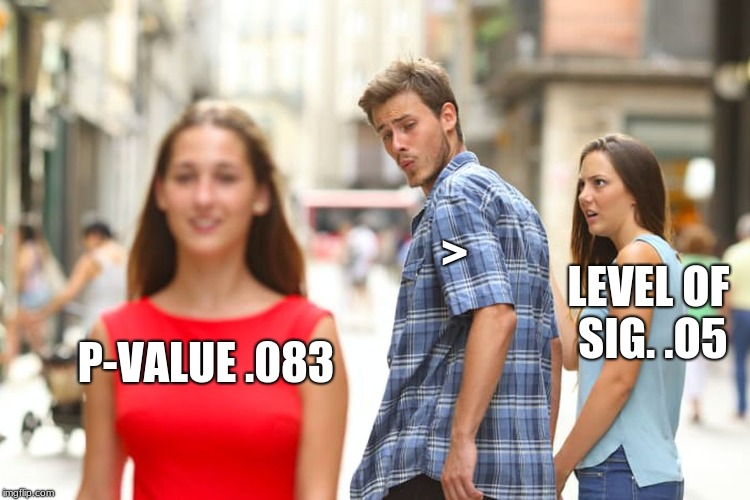

---
# Although if P is Continuous, You Avoid This - Mostly


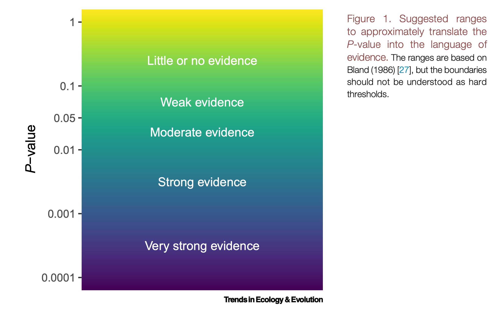
Muff et al. 2022 TREE

---
class:middle 

# Even So, You Can Still Make Mistakes

.pull-left[]

--

.pull-right[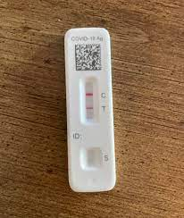 ]

--

.bottom[ You reject that null that everything is OK - but you're wrong! False Positive! AKA **TYPE I ERROR**] 

---
class:center, middle

# $\Large \alpha$ is the probability of comitting a Type I error - getting a False Positive

---
# You Could Also Have a False Negative!

.pull-left[]

--

.pull-right[]

--

.bottom[ .center[You fail to reject your null incorrectly - **Type II Error**] ]

---
class:center, middle

# $\Large \beta$ is the probability of comitting a Type II error - getting a False Negative

---
# Null Hypothesis: This is Not a Hotdog
.center[
.middle[
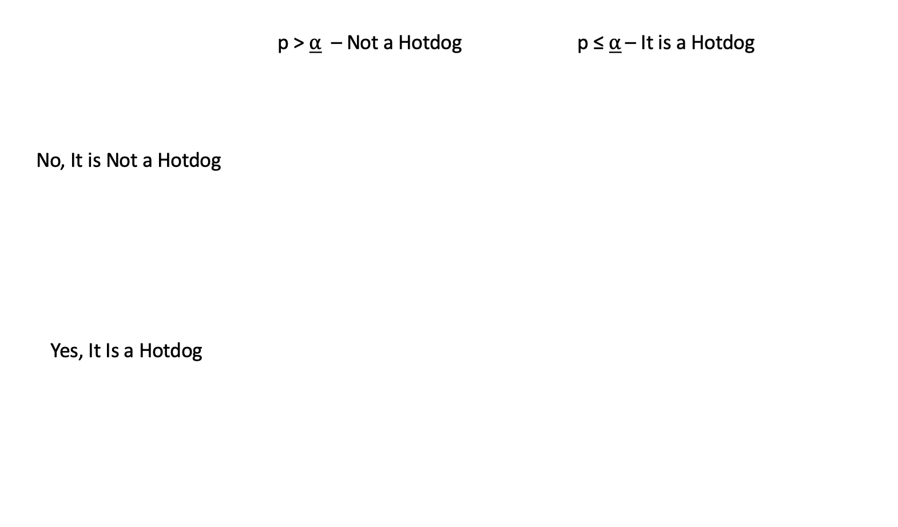
]
]


---
# Null Hypothesis: This is Not a Hotdog
.center[
.middle[
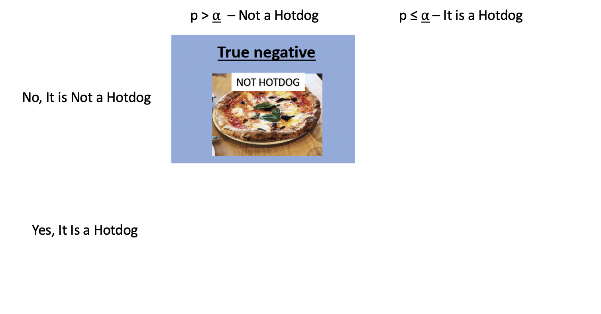
]
]

---
# Null Hypothesis: This is Not a Hotdog
.center[
.middle[
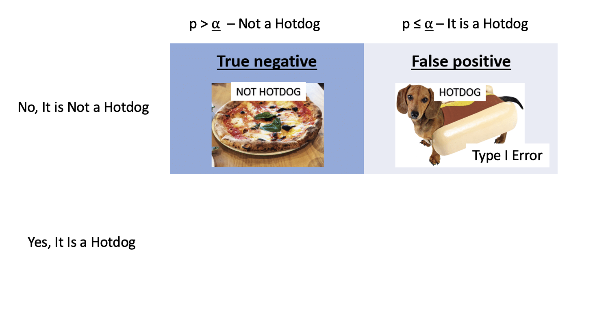
]
]

---
# Null Hypothesis: This is Not a Hotdog
.center[
.middle[
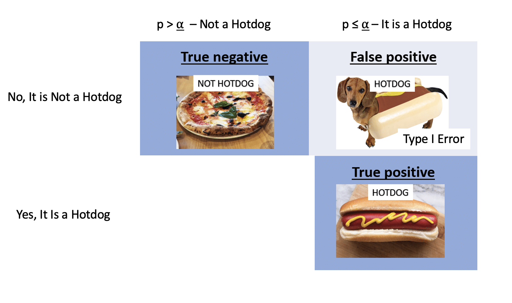
]
]

---
# Null Hypothesis: This is Not a Hotdog
.center[
.middle[
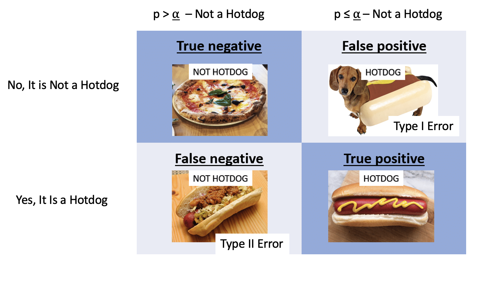
]
]

---
# Types of Errors in a NHST framework

```{r}
type_dat <- tibble::tribble(
  ~` `, ~`Fail to Reject Ho`, ~`Reject Ho`,
  "Ho is True", "-", "Type I Error",
  "Ho is False", "Type II Error", "-"
)
knitr::kable(type_dat) 
```


- Possibility of Type I error regulated by choice of $\alpha$
  
- Probability of Type II error regulated by choice of $\beta$


---

# There Can Be Dire Consequences for Type II Error

.center[ 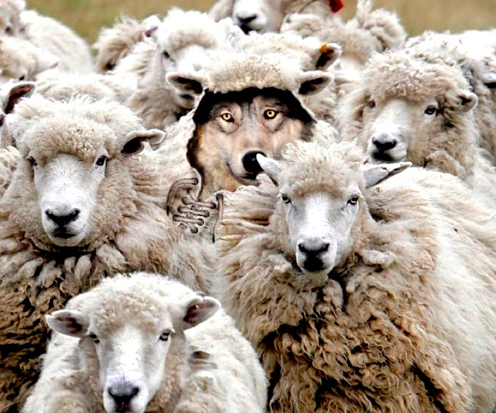 ]

--

You have left real information on the table! You did not have the **power** to reject your null.

---

class:center, middle

# Power = 1 - $\beta$

---
# Power of a Test

-   If $\beta$ is the probability of committing a type II error,
1 - $\beta$ is the power of a test.

-   The higher the power, the less of a chance of committing a type II
error.

-   We often want a power of 0.8 or higher. (20% chance of failing to reject a false null)

---

class: center, middle

# $\alpha = 0.05$ & $\beta = 0.20$

--

5% Chance of Falsely Rejecting the Null, 20% Chance of Falsely Failing to Reject the Null

--

Are you comfortable with this? Why or why not?

---

# What is Power, Anyway?

Given that we often begin by setting our acceptable $\alpha$, how do we
then determine $\beta$ given our sample design?

-   Formula for a specific test, using sample size, effect size, etc.

-   Simulate many samples, and see how often we get the wrong answer
assuming a given $\alpha$!

---

# Power to the Puffers

- Let's assume a slope of 3 (as we saw in the experiment)  

--

- Let's assume a SD of 5  

--

- We can now simulate results from experiments, with, say, different levels of replication  

---
# Puffer Simulation

```{r echo = TRUE}
make_puffers <- function(n, slope = 3, predator_sd = 5){
  
  #make some simulated data
  tibble(resemblance = rep(1:4, n),
             predators = rnorm(n*4, 
                               mean = slope*resemblance, 
                               sd = predator_sd))
  
}

set.seed(31415)
make_puffers(2)
```

---
# Lots of Sample Sizes and Simulations of Data

```{r, echo = TRUE}
puffer_sims <- tibble(n = 2:10) |>
  
  #for each sample size
  group_by(n) |>
  
  #simulate some data
  summarize(  map_dfr(1:1000, ~make_puffers(n), .id = "sim"))

puffer_sims
```

---
# Fit Models, Get Coefficients, Get P....

```{r, echo = TRUE, cache = TRUE}
puffer_results <- puffer_sims |>

  #for each simulation
  group_by(n, sim) |>
  nest() |>

  #fit a model, get it's coefficients and p-values
  summarize(fit = map(data, ~lm(predators ~ resemblance, data = .)),
            coefs = map(fit, broom::tidy)) |>
  
  unnest(coefs) |>
  
  #filter to just our resemblance term
  filter(term == "resemblance")
```


---
# We Can See What Estimates Would Cause Us to Reject the Null at $\alpha$

```{r}
ggplot(puffer_results, aes(x = estimate, fill = p.value <= 0.05)) + 
  geom_density(alpha = 0.2)
```

.center[Useful in seeing if you have a bias problem]
---
# Get the Power!

```{r, echo = TRUE}
puffer_power <- puffer_results |>
  
  group_by(n) |>
  
  summarize(false_neg_rate = sum(p.value > 0.05) / n(),
            
            power = 1 - false_neg_rate)
  
```

---
# Get the Power!

```{r}
ggplot(puffer_power,
       aes(x = n, y = power)) +
  geom_point() +
  geom_line() +
  geom_hline(yintercept = 0.8, lty = 2, color = "red")
```


---
class:middle, center
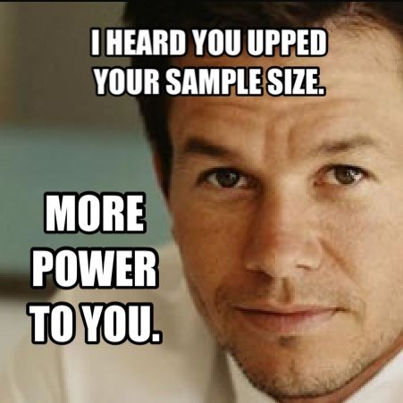
---

# Common Things to Tweak in a Power Analysis

- Sample Size  

- Effect Size  

- Residual Standard Deviation

- Omitted Variable Bias (OH NO! YOU SHOULD HAVE PLANNED FOR THIS!)

- And more, depending on complexity of the model

--

- Different levels of $\alpha$

---

# How $\alpha$ Influences Power

```{r}
puffer_power_alpha <- puffer_results |>
  
  crossing(alpha = c(0.001, 0.01, 0.05, 0.1)) |>
  
  group_by(n, alpha) |>
  
  summarize(false_neg_rate = sum(p.value > alpha) / n(),
            
            power = 1 - false_neg_rate)

ggplot(puffer_power_alpha,
       aes(x = n, y = power, color = as.factor(alpha))) +
  geom_point() +
  geom_line() +
  geom_hline(yintercept = 0.8, lty = 2, color = "red") +
  labs(color = "alpha")
```


---
# There is a Tradeoff Between $\alpha$ and Power

```{r}
puffer_power_alpha_power <- puffer_results |>
  
  filter(n == 6) |>
  
  crossing(alpha = seq(0.0001,0.2, length.out = 1000)) |>
  
  group_by(alpha) |>
  
  summarize(false_neg_rate = sum(p.value > alpha) / n(),
            
            power = 1 - false_neg_rate)

ggplot(puffer_power_alpha_power,
       aes(x = alpha, y = power)) +
  geom_point() +
  geom_line() +
  labs(subtitle= "n = 6") +
  scale_x_log10()#  + scale_x_log10()
```


---
# There is a Tradeoff Between $\alpha$ and $\beta$

```{r}

ggplot(puffer_power_alpha_power,
       aes(x = alpha, y = false_neg_rate)) +
  geom_point() +
  geom_line() +
  labs(subtitle= "n = 6", y = "beta (false negative rate)") +
  scale_x_log10()#  + scale_x_log10()
```

---
# This Can Lead to Some Sleepless Nights

.center[ 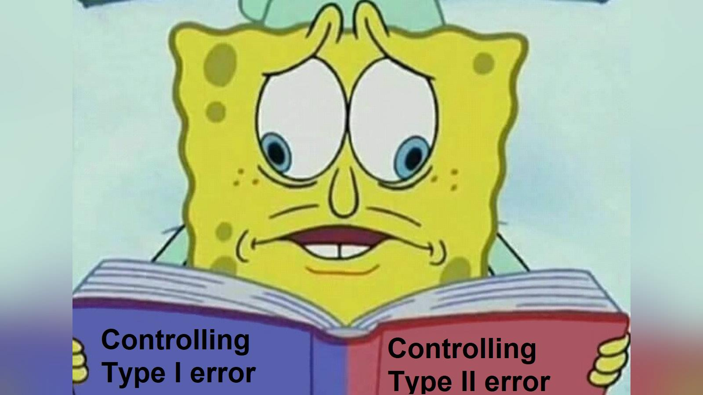 ]

---
# Solutions to $\alpha$ and $\beta$ Tradeoff?

- Optimize for  $\alpha$ or $\beta$
     - Which would be worse to get wrong?
     
--

- Choose a value that you can live with for both

--

- Mudge's optimal $\alpha$
     - Calculate $\omega = (\alpha + \beta)/2$
     - Use $\alpha$ at minimum value of $\omega$
     - Can incorporate a cost for $\alpha$ or $\beta$ in calculation
     
---
# Mudge's Optimal Alpha for N = 6

```{r}
ggplot(puffer_power_alpha_power,
       aes(x = alpha, y = (alpha + false_neg_rate)/2)) +
  geom_line()


puffer_power_alpha_power |>
  filter((alpha + false_neg_rate)/2 == min((alpha + false_neg_rate)/2)) |>
  knitr::kable()

```

---
# Don't Think That's the Only Way You Can Mess Up!


```{r}
type_dat <- tibble::tribble(
  ~` `, ~`Fail to Reject Ho`, ~`Reject Ho`,
  "Ho is True", "-", "Type I Error",
  "Ho is False", "Type II Error", "Correct or Type III or IV error"
)
knitr::kable(type_dat) 
```


- Type III error: Correctly reject the **wrong null**
    - Use the wrong-tailed test  
    - Type S error: Reject the null, but your estimand has the wrong *sign*
    - Type M error: Reject the null, but your estimand has the wrong *magnitude*
    - Bad theory leading to a bad null from a bad model

- Type IV error: Correctly reject the null, but for the wrong reason
    - Wrong test for the data
    - Collinearity among predictors
    - Assuming what is true for the group (in this test) is true for the individual  
    - Omitted variable bias colors interpretation

---
# NHST is Great, but Think of All The Ways You Can Misuse it!
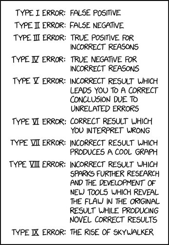

.bottom[xkcd]


---
class: center, middle
# But you have the power to plan around them!