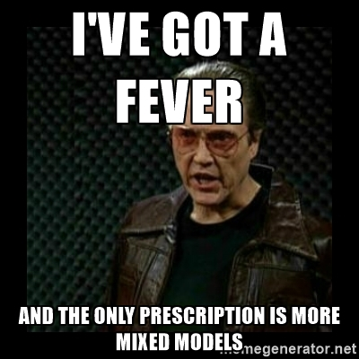
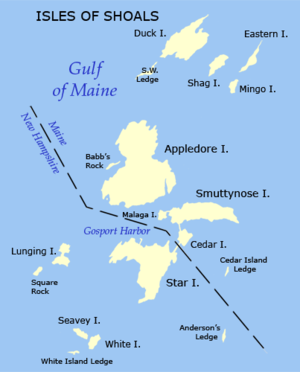
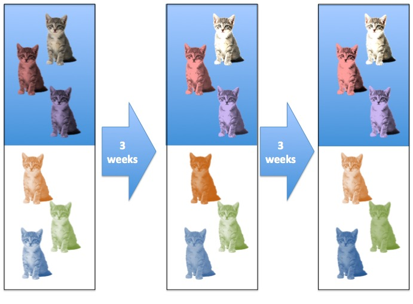
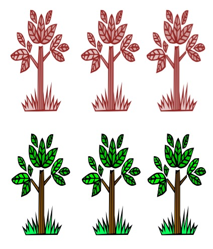
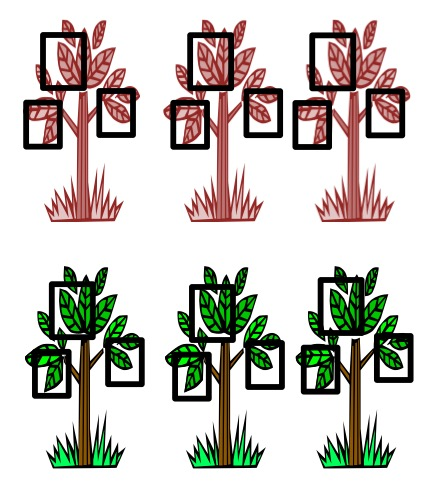
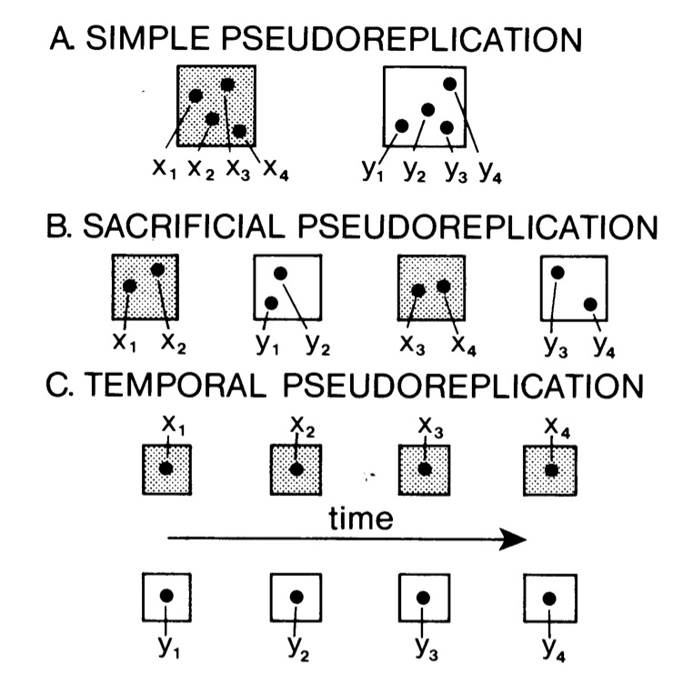

---
title:
css: style.css
output:
  revealjs::revealjs_presentation:
    reveal_options:
      slideNumber: true
      previewLinks: true
    theme: white
    center: false
    transition: fade
    self_contained: false
    lib_dir: libs
    code_download: true

---
  
## 
\
<center><h2>Random Effects</h2>
\

</center>

```{r prep, echo=FALSE, cache=FALSE, message=FALSE, warning=FALSE}
library(knitr)
library(pander)
opts_chunk$set(fig.height=5, fig.width=7, comment=NA, 
               warning=FALSE, message=FALSE, 
               dev="jpeg", echo=FALSE)

library(ggplot2)
library(patchwork)
library(car)
theme_set(theme_bw(base_size=17))

library(dplyr)
library(tidyr)
library(broom)
library(performance)
library(modelbased)

library(lme4)
library(merTools)
library(DHARMa)

```

## The Problem of Independence
<div id="left">

</div>
<div id="right">
>* Let's say you are sampling juvenile mussel lengths  
\
>* You sample at 10 sites around each island  
\
>* Can you just take the mean of all sites?  
\
>* Is it OK to pull out an "Island" effect if some sites are sampled more than others?
</div>

## How would you handle measuring the same subjects in an experiment over time?


## What is the Sample Size?


## What is the Sample Size?


## Pseudoreplication
{width=55%}

Hurlbert 1985

## What is the problem with Pseudoreplication?

$$\Large Y_i = \beta X_i + \epsilon_i$$
\

$$\Large \epsilon_i \overset{iid}{\sim} \mathcal{N}(0, \sigma^2)$$

\
\
This assumes that all replicates are **independent** and identically distributed


## How to deal with violation of Independence
> - Average at group level  
>       - Big hit to sample size and thus precision  
\
> - **Fixed effect** of group  
>       - Many parameters to estimate = higher coef SE  
>       - Big hit to Degrees of Freedom  
\
> - Model hierarchy explicitly with **Random effects**  
>       - Mixed models if fixed and random effects  
>       - Models **correlation within groups**  
>       - Creates *correct error structure*  
>       - Loses fewer DF  

## 
\
\
\
\
<h1>What is a random effect?</h1>

## Let's Say You're Sampling Mussel Lengths...
```{r mussel_hist}
mussels <- read.csv("lectures/data/random_effects/mussels.csv")

mussel_ggplot <- ggplot(data=mussels, 
                        mapping=aes(mussel_length, after_stat(count)))

mussel_ggplot +
  geom_histogram(bins=25)
```


## But, They come from different islands...
```{r mussel_hist2}
mussel_ggplot +
  geom_histogram(bins=5, mapping=aes(fill=site)) + 
  facet_wrap(~site)
```

## Are different islands that different?
```{r mussel_plot_2}
mussel_scatter <- ggplot(data=mussels,
                         mapping=aes(x=site, y=mussel_length)) +
                           geom_point() +
  theme_bw(base_size=17)

mussel_scatter
```


## Are different islands that different?
```{r mussel_plot_mean}
mussel_scatter_mean <- mussel_scatter +
  geom_hline(yintercept=mean(mussels$mussel_length), color="blue", lty=2)

mussel_scatter_mean
```

## The Problem with Pseudoreplication - Confidence Intervals

```{r, fig.width=9}
m_mussel <- mean(mussels$mussel_length)

se_mussel <- sd(mussels$mussel_length)/sqrt(nrow(mussels))

#simple CI
simple_ci <- mussel_scatter_mean +
  geom_rect(ymin = m_mussel - 2*se_mussel,
              ymax = m_mussel + 2*se_mussel,
            xmin = 0, xmax = 16,
            fill = "grey", alpha = 0.01) +
  labs(subtitle = "Mean and CI Across All Samples")

#avg CI
mussels_group <- mussels |>
  group_by(site) |>
  summarize(mussel_length = mean(mussel_length)) |>
  ungroup()

mussel_se_group <- sd(mussels_group$mussel_length)/sqrt(nrow(mussels_group))

group_ci <- mussel_scatter_mean +
  geom_rect(ymin = m_mussel - 2*mussel_se_group,
              ymax = m_mussel + 2*mussel_se_group,
            xmin = 0, xmax = 16,
            fill = "grey", alpha = 0.01) +
  labs(subtitle = "Mean and CI Across Site Means")

#the plots
simple_ci + group_ci

```


## The Problem with Pseudoreplication - Unbalanced Samples and Bias


```{r, fig.width=7}
set.seed(609)

mussels_ragged <- mussels |>
  slice_sample(n = 30)


mussel_scatter_ragged <- ggplot(data=mussels_ragged,
                         mapping=aes(x=site, y=mussel_length)) +
                           geom_point() +
  theme_bw(base_size=17)

m_mussel <- mean(mussels_ragged$mussel_length)

se_mussel <- sd(mussels_ragged$mussel_length)/sqrt(nrow(mussels))

#simple CI
simple_ci <- mussel_scatter_ragged +
  geom_hline(yintercept = m_mussel, color = "blue", lty = 2) +
  geom_rect(ymin = m_mussel - 2*se_mussel,
              ymax = m_mussel + 2*se_mussel,
            xmin = 0, xmax = 16,
            fill = "grey", alpha = 0.01) +
  labs(subtitle = "Mean and CI Across\nAll Samples")

#avg CI
mussels_group_ragged <- mussels_ragged |>
  group_by(site) |>
  summarize(mussel_length = mean(mussel_length)) |>
  ungroup()

m_mussel_group_ragged <- mean(mussels_group_ragged$mussel_length)

mussel_se_group_ragged <- sd(mussels_group_ragged$mussel_length)/sqrt(nrow(mussels_group_ragged))

group_ci <- mussel_scatter_ragged +
  geom_hline(yintercept = m_mussel_group_ragged, color = "blue", lty = 2) +
  geom_rect(ymin = m_mussel_group_ragged - 2*mussel_se_group_ragged,
              ymax = m_mussel_group_ragged + 2*mussel_se_group_ragged,
            xmin = 0, xmax = 16,
            fill = "grey", alpha = 0.01) +
  labs(subtitle = "Mean and CI Across\nSite Means")

#the plots
simple_ci + group_ci

```

## Are different islands that different?
```{r mussel_site_mean_plot, warning=FALSE}
mussels_summary <- mussels %>%
  group_by(site) %>%
  summarize(mussel_length = mean(mussel_length)) %>%
  ungroup()

mussels_mer <- lmer(mussel_length ~ 1|site, data=mussels)

mussels_summary$ranef <- ranef(mussels_mer)$site[,1] + fixef(mussels_mer)[1]

mussel_scatter <- mussel_scatter +
  stat_summary(color="red", fun="mean", size=4, geom="point")

mussel_scatter
```

## You Could Try a Fixed Effects Model...
\
\
$$\Large Y_{ij} = \beta_{j} + \epsilon_i$$
\
$$\Large \epsilon_i \sim \mathcal{N}(0, \sigma^2)$$
\
<div class="fragment">But this only tells you about **these** islands</div>

## What is the distribution of site means?
```{r site_hist}
ggplot(data=mussels_summary,
       mapping=aes(mussel_length, 
                   after_stat(count))) +
  geom_histogram(bins=5) +
  theme_bw(base_size=17)
```

<div class="fragment">A nice normal distribution</div>

## Random Effects
> - A *random effect* is a parameter that varies across groups following a (typically normal) distribution  
\
> - Implies that, while there is a grand mean *fixed* effect (slope or intercept), each group deviates randomly  
\
> - Implies that there is no one *true* value of a parameter in the world  
\
> - Allows us to estimate **variability** in how effects manifest  
\
> - We pull apart *variance components* driving our response


## Fixed Versus Random Effects Model

<span id="left">Fixed:</span>\
$$Y_{ij} =  \beta_{j} + \epsilon_i$$
$$\epsilon_i \sim \mathcal{N}(0, \sigma^2)$$
\
<div class="fragment">
<span id="left">Random:</span>\
$$Y_{ij} =  \beta_{j} + \epsilon_i$$
$$\beta_{j} \sim \mathcal{N}(\beta, \sigma^2_{site})$$
$$\epsilon_i \sim \mathcal{N}(0, \sigma^2)$$
</div>

## Consider what random effects mean - 1 model, 2 ways

$$Y_{ij} =  \beta_{j} + \epsilon_i$$
$$\beta_{j} \sim \mathcal{N}(\alpha, \sigma^2_{site})$$
$$\epsilon_i \sim \mathcal{N}(0, \sigma^2)$$
<hr>
<div class="fragment">
$$Y_{ij} =  \alpha + \beta_{j} + \epsilon_i$$
$$\beta_{j} \sim \mathcal{N}(0, \sigma^2_{site})$$
$$\epsilon_i \sim \mathcal{N}(0, \sigma^2)$$
</div>


## Consider what random effects mean - GLMM Notation
(yes, Generalized Linear Mixed Models - we will get there)  

$$\large \eta_{ij} =  \alpha + \beta_{j}$$
$$\ \beta_{j} \sim \mathcal{N}(0, \sigma^2_{site})$$
$$\large f(\widehat{Y_{ij}}) = \eta_{ij}$$
$$\large Y_{ij} \sim \mathcal{D}(\widehat{Y_{ij}}, \theta)$$  
where D is a distribution in the exponential family

## Fixed Versus Random Effects Model Visually
```{r visual_ranef}
library(DiagrammeR)
fixed <- create_graph(
  nodes_df = create_node_df(
  n = 3,
  label = c("site", "length", "error"),
  shape = c("rectangle", "rectangle", "circle"),
  x = c(1,2,2),
  y = c(1,1,2)),
  
  edges_df = create_edge_df(
    from = c(1, 3),
    to = c(2,2),
    rel = "leading_to")
)

random <- create_graph(
  nodes_df = create_node_df(
  n = 4,
  label = c("site", "length", "residual\nerror", "total\nerror"),
  shape = c("circle", "rectangle", "circle", "circle"),
  x = c(1,2,2,2),
  y = c(2,1,3,2),
  width = 0.6),
  
  edges_df = create_edge_df(
    from = c(1,3,4),
    to = c(4,4,2),
    rel = "leading_to")
)
```

<div id = "left">
```{r}
render_graph(fixed, title = "Fixed")

```
</div>
<div id = "right">
```{r}
render_graph(random, title = "Random")
```
</div>


## Wait, but what about good old blocks and fixed effects?
> - We used to model blocks via estimation of means/parameters within a block  
\
> - But - there was no distribution of parameters assumed  
\
> - Assumed blocks could take any value  
>       - Is this biologically plausible?  
>       - What are blocks but collections of nuissance parameters?  

## The Shrinkage Factor!
```{r show_ranef}
mussel_scatter +
  geom_point(data=mussels_summary, 
             mapping=aes(x=site, y=ranef),
             color="darkorange", size=4)
```

Orange = random effects estimates, Red = fixed effects estimate


## Shrinkage
> - Random effects assume each observation is drawn from a grand mean  
\
> - This we can **draw strength** from samples in other groups to estimate a group mean  
\
> - It **reduces variance** between groups by biasing results towards grand mean  
\
> - Philosophically, group means are always likely to be incorrect due to sampling

## Shrunken Group Mean - Note influence of sample size

$$\hat{Y_j} = \rho_j\bar{y_j} + (1-\rho_j)\bar{y}$$
\
where $\rho_j$ is the shrinkage coefficient  
\
\
<div class="fragment">
$$\rho_j = \frac{\tau^2}{\tau^2 + \frac{\sigma^2}{n_j}}$$
\
Where $\tau^2$ is the variance of the random effect, and $n_j$ is the group sample size
</div>

## What Influences Shrinkage?
$$\rho_j = \frac{\tau^2}{\tau^2 + \frac{\sigma^2}{n_j}}$$

- If your random effect variance is large ($\tau^2$), very little shrinkage.  
\
- If your residual variance is small ($\sigma^2$), very little shrinkage.  
\
- If your sample size for a group is small, shrinkage can be large.  
\
- If your sample size for a group is large, shrinkage is minimal.


## For example, unbalanced sample sizes
```{r unbalanced}
mussels_ragged <- read.csv("lectures/data/random_effects/mussels_ragged.csv")
mussels_ragged_mer <- lmer(mussel_length ~ (1|site)-1, data=mussels_ragged)

adf <- data.frame(site = unique(mussels_ragged$site),
                  mussel_length = ranef(mussels_ragged_mer)$site[,1] + fixef(mussels_ragged_mer)[1])

mussel_unbal <- ggplot(data=mussels_ragged, mapping=aes(x=site, y=mussel_length)) +
  geom_point() +
  geom_hline(yintercept=fixef(mussels_ragged_mer), color="blue", lty=2)

mussel_unbal
```

## For example, unbalanced sample sizes
```{r unbalanced_2}
mussel_unbal+
  stat_summary(color="red", fun.y="mean", size=4, geom="point") +
  geom_point(data=adf,
             color="darkorange", size=4) +
  theme_bw(base_size=17)
```

## It effects more than means - Confidence!
```{r showShirnk}
# shrunk <- plot_model(mussels_ragged_mer, type="est") +
#   theme_bw(base_size=17) +
#   ggtitle("Random Effects Model")+ 
#  theme(strip.background = element_blank(),
#        strip.text.x = element_blank())+ ylim(c(9,40))
# 
 mussels_ragged_lm <- lm(mussel_length ~ site-1, data=mussels_ragged)
# 
# 
# not_shrunk <- plot_model(mussels_ragged_lm, show.values=FALSE, 
#                      prnt.plot=FALSE, show.p=FALSE, sort.est=FALSE) +
#   theme_bw(base_size=17) +
#   ggtitle("Fixed Effects Model") + ylim(c(9,40)) +
#   ylab("")
# 
# library(gridExtra)
# grid.arrange(not_shrunk, shrunk, ncol=2)

effs <- rbind(predictInterval(mussels_ragged_mer, 
                newdata = data.frame(site = unique(mussels_ragged$site)), 
                level = 0.95, include.resid.var = FALSE) %>%
  mutate(upr = upr, lwr = lwr, 
         type = "Random Effect Model",
         site = unique(mussels_ragged$site)),

predict(mussels_ragged_lm, interval = "confidence",
        newdata = data.frame(site = unique(mussels_ragged$site))) %>%
  as_tibble() %>%
  mutate(type = "Fixed Effect Model", 
         site = unique(mussels_ragged$site)))

ggplot(effs, 
       aes(x=site, y = fit, ymin = lwr, ymax = upr)) +
  geom_pointrange() +
  facet_wrap(~type) +
  coord_flip()

```

## Fixed versus Random Effects
<div style="text-align:left">
<div class="fragment">**Fixed Effect:** Effects that are constant across populations.  
**Random Effect:** Effects that vary are random outcomes of underlying processes.\
</div>
\
<div class="fragment">Gelman and Hill (2007) see the distinction as artificial. Fixed effects
are special cases of random effects where the variance is infinite. The
model is what you should focus on.\
</div>
\
<div class="fragment">You will also hear that ’random effects’ are effects with many levels,
but that you have not sampled all of them, wheras with fixed effects,
you have sampled across the entire range of variation. This is subtly
different, and artificial.
</div>
</div>

## BUT - The big assumption
<br><br>
<h2><center>The Random Effect is Uncorrelated with Any Fixed Effects</center></h2>
<br><br>
<h3><center>Violating this is a violation of the assumption of endogeneity (aka the Random Effects assumption)</center></h3>

## A Visual Explanation of Endogeneity Problems: Fixed Effects
```{r visual_fixef_assume}


fixed %>%
  add_node_df(create_node_df(n=1,label = "predictor", 
           shape = "rectangle",
           x = 1, y = 0, width = 0.6)) %>% 
  set_edge_attrs("dir", "forward") %>%
  set_edge_attrs("dir", "forward") %>%
  add_edge_df(create_edge_df(from = c(4,4), to = c(1,2),
                             dir = c("both", "forward"))) %>%
render_graph()
```

## A Visual Explanation of Endogeneity Problems: Random Effects
```{r visual_random_assume}


random %>%
  add_node_df(create_node_df(n=1,label = "predictor", 
           shape = "rectangle",
           x = 1, y = 1, width = 0.6)) %>% 
  set_edge_attrs("dir", "forward") %>%
  set_edge_attrs("dir", "forward") %>%
  add_edge_df(create_edge_df(from = 5, to = 2,
                             dir = "forward")) %>%
render_graph()
```
<div class = "fragment">Note the lack of correlation</div>

## Fixed versus Random Effects Revisited
> - If your groups are correlated with predictors, use fixed effects  
>     - See also upcoming lecture  
\
> - If your groups are not "exchangeable", use fixed effects  
\
> - Fixed effects aren't **bad**, they're just inefficient  
\
> - However, fixed effects are harder to generalize from

## More on when to avoid random effects: estimation concerns
> 1. Do you have <4 blocks? **Fixed**  
\
> 2. Do you have <3 points per block? **Fixed**\
\
> 3. Is your 'blocking' variable continuous? **Fixed**\
>     - But slope can vary by discrete blocks - wait for it!  
\
> 4. Do you have lots of blocks, but few/variable points per block? **Random**\
>     - Save DF as you only estimate $\sigma^2$
\

## Other Ways to Avoid Random Effects
> - Are you not interested in within subjects variability?\
>       - AVERAGE at the block level  
>       - But, loss of power  
\
> - Is block level correlation simple?\
>       - GLS with compound symmetry varying by block\
>       - `corCompSym(form = ~ 1|block)`  
\
> - OH, JUST EMBRACE THE RANDOM!

## 
\
\
\
<h1>Estimating Random Effects</h1>

## Restricted Maximum Likelihood
> - We typically estimate a $\sigma^2$ of random effects, not the effect of each block  
>      - But later can derive Best Least Unbiased Predictors of each block (**BLUPs**)  
\      
> - ML estimation can underestimate random effects variation ($\sigma^2_{block}$)
\
> - REML seeks to decompose out fixed effects to estimate random effects \
\
> - Works iteratively - estimates random effects, then fixed, then back, and converges \
>        - Lots of algorithms, computationally expensive
        
## What other methods are available to fit GLMMs?

<font size = "-1">(adapted from Bolker et al TREE 2009 and https://bbolker.github.io/mixedmodels-misc/glmmFAQ.html)</font>

```{r glmmtab,echo=FALSE,results="asis"}
methtab <- read.table(sep="|",header=TRUE,text="
Method | Advantages | Disadvantages | Packages
Penalized quasi-likelihood | Flexible, widely implemented | Likelihood inference may be inappropriate; biased for large variance or small means |  glmmPQL (R:MASS), ASREML-R
Laplace approximation | More accurate than PQL | Slower and less flexible than PQL | glmer (R:lme4), glmm.admb (R:glmmADMB), INLA, glmmTMB
Gauss-Hermite quadrature | More accurate than Laplace | Slower than Laplace; limited to 2‑3 random effects | glmer (R:lme4, lme4a), glmmML (R:glmmML)"
)
set.alignment(default="left")
pander(methtab,split.table=Inf)
```

## In R....
\
{width=55%}
<div style="text-align:left"><font size = "-1">Thank you Tim Doherty</font></div>

## THE ONE SOURCE
<br><br><br>
<center>https://bbolker.github.io/mixedmodels-misc/</center>


## NLME and LMER
- `nlme` was created by Pinhero and Bates for linear and nonlinear mixed models  
        - Also fits `gls` models with REML  
        - Enables very flexible correlation structures  
        - Uses Satterthwaite corrected DF
\
\
- `lme4` started by Bates, many developers  
        - Much faster for complex models  
        - Can fit generalized linear mixed models  
        - Simpler syntax adapted by many other packages  
        - Does not allow you to model correlation structure  
        - Does not allow you to model variance structure  

## Other R packages (functions) fit GLMMs?

- MASS::glmmPQL (penalized quasi-likelihood)
- lme4::glmer (Laplace approximation and adaptive Gauss-Hermite quadrature [AGHQ])
- glmmML (AGHQ)
- glmmAK (AGHQ?)
- glmmADMB (Laplace)
- **glmmTMB** (Laplace)
- glmm (from Jim Lindsey's `repeated` package: AGHQ)
- gamlss.mx
- ASREML-R
- sabreR
\
<font size = "-1">(from https://bbolker.github.io/mixedmodels-misc/glmmFAQ.html)</font>
        
## Don't you... Forget about Bayes
- `rstanarm` uses `lme4` syntax  
\
- `brms` uses `lme4` syntax and more  
\
- Once a mixed model gets to sufficient complexity, it's Bayes, baby!

## Fitting a Mixed Model with lme4
\
```{r lme4_start, echo=TRUE}
library(lme4)

mussels_mer <- lmer(mussel_length ~ (1 |site), 
                    
                    data = mussels)
```
<div class="fragment" style="text-align:left">Note `1 | group` syntax!</div>

## Fitting a Mixed Model with nlme
\
```{r nlme_start, eval=FALSE, echo=TRUE}
library(nlme)

mussels_lme <- lme(mussel_length ~ 1,
                   
                   random =~ 1 |site, 
                    
                    data = mussels)
```
<div class="fragment" style="text-align:left">We could include correlations, etc.</div>


## Evaluating...
```{r lmer resid}
#plot(mussels_mer)
check_model(mussels_mer, detrend = FALSE)
```

## We Look at Normality of Residuals
```{r lmer_resid_qq}
check_normality(mussels_mer) |> plot(detrend = FALSE)
```

## We Also Look at Normality of Group Mean Residuals
```{r lmer_group_qq}
check_normality(mussels_mer,
                effects = "random") |> 
  plot(detrend = FALSE)
```


## We can also look at quantile residuals
```{r lmer_quantiles, echo=FALSE, warning=FALSE, error=FALSE, fig.width = 8}
library(DHARMa)
r <- simulateResiduals(mussels_mer)
plot(r, asFactor=TRUE)
```


## Evaluating Coefficients
```{r broom_mod, echo=TRUE, warning=FALSE}
knitr::kable(broom::tidy(mussels_mer))
```

- Same as with a linear model!  
- But also we have a new SD for our random effect

## Seeing the Fixed Effects
```{r fixef_effects, echo=TRUE}
fixef(mussels_mer)
```

## Seeing the Random Effects
```{r ranef_effects, echo=TRUE}
ranef(mussels_mer)
```

## Combined Effects
```{r coef_effects, echo=TRUE}
coef(mussels_mer)
```


## Visualizing Random Effects
```{r sjp_re, echo=TRUE, eval = TRUE}
estimate_grouplevel(mussels_mer) |> plot()
```

## Visualizing Fixed Effects
```{r sjp_fe}
estimate_means(mussels_mer, backend = "marginaleffects", by = "site") |>
  as_tibble() |>
  mutate(site = letters[1:15]) |>
  ggplot(aes(y = site, 
             x = Mean,
             xmin = CI_low, xmax = CI_high)) +
  geom_pointrange() +
  xlim(c(0, 27)) +
  geom_vline(xintercept = 0, color = "red", lty = 2)
```


## Visualizing using Simulation for Total Effects
```{r sjp}
library(merTools)

#make data for coefficients
test_data <- data.frame(site = unique(mussels$site))

#get simulated predictions
coef_df <- predictInterval(mussels_mer, 
                           newdata = test_data,
                           level = 0.95, include.resid.var = FALSE) |>
  cbind(test_data)

#plot
ggplot(coef_df, aes(x = site, y = fit, ymin = lwr, ymax = upr)) +
  geom_pointrange() + coord_flip()+
  geom_hline(yintercept = 0, color = "red", lty = 2)
```

## Why Did We Do This?

> - Working with random effects opens up a world of *more efficient* models with clustering  
\
> - Random and fixed effects correctly handle pseudoreplication  
\
> - Random effects allow us to assume *nothing is truly fixed*  
\
> - Random effects allow us to generalize beyond our sampled clusters
