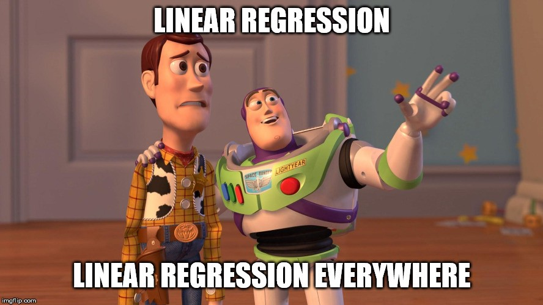
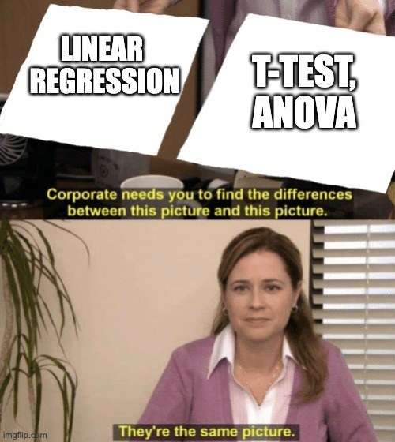

class: center, middle

# It's All Linear Models: T-Test Edition



```{r setup, include=FALSE}
library(knitr)
library(ggplot2)
library(dplyr)
library(tidyr)
library(broom)
library(readr)
library(emmeans)
library(broom.mixed)
library(nlme)

opts_chunk$set(fig.height=6, 
               fig.width = 8,
               fig.align = "center",
               comment=NA, 
               warning=FALSE, 
               echo = FALSE,
               message = FALSE)

options(htmltools.dir.version = FALSE)
theme_set(theme_bw(base_size=24))
```

---
class: center, middle

# Etherpad
<br><br>
<center><h3>https://etherpad.wikimedia.org/p/607-categorical_lm-2022</h3></center>


---
# So, We've Done this Linear Deliciousness
$$y_i = \beta_0 + \beta_1 x_i + \epsilon_i$$
$$\epsilon_i \sim \mathcal{N}(0, \sigma)$$

```{r pp}
library(palmerpenguins)
penguins <- penguins %>% drop_na(sex)
ggplot(penguins,
       aes(x = body_mass_g, y = flipper_length_mm)) +
  geom_point() +
  stat_smooth(method = "lm", color = "red")
```

---

# What if our X Variable Is Categorical
### Comparing Two Means

```{r}
ggplot(penguins,
       aes(y = body_mass_g, x = sex)) +
  geom_point(alpha = 0.3, position = position_jitter(width = 0.2))  +
  stat_summary(fun.data = mean_cl_boot, color = "red") +
  labs(subtitle = "Is Body Mass Different Between\nDifferent Penguin Sexes?")
```

--
$$mass_i = \beta_0 + \beta_1 sex_i + \epsilon_i$$
---

# What if it Has Many Levels
### Comparing Many Means

```{r}
ggplot(penguins,
       aes(y = body_mass_g, x = species)) +
  geom_point(alpha = 0.3, position = position_jitter(width = 0.2))  +
  stat_summary(fun.data = mean_cl_boot, color = "red") +
  labs(subtitle = "Is Body Mass Different Between\nDifferent Penguin Species?")
```

--
$$mass_i =  \beta_1 adelie_i + \beta_2 chinstrap_i + \beta_3 gentoo_i + \epsilon_i$$


---
class:center



---

# Dummy Codding for Dummy Models

1. The Categorical as Continuous

2. Assumptions of the Categorical

3. Interpretation of Categorical Results

4. Variations on a Theme

---

# We Know the Linear Model
.large[
$$y_i = \beta_0 + \beta_1 x_i + \epsilon_i$$
  
$$\epsilon_i \sim N(0, \sigma)$$
]

But, what if $x_i$ was just 0,1?


---
# Consider Comparing Two Means
#### Consider the Horned Lizard 
.center[

]


Horns prevent these lizards from being eaten by birds. Are horn lengths different between living and dead lizards, indicating selection pressure?

---
background-image: url("./images/09/guiness_full.jpg")
background-position: center
background-size: contain

---
class: center, middle


---

# The T-Test

.center[]
--

- Briefly, data is used to calculate a value to compare to a reference distribution  

--

- Different distributions correspond to different assumptions

--

- But we have a more general solution in the linear model

---
# The Data
```{r lizard_load, warning=FALSE}
library(readr)
library(dplyr)
lizards <- read_csv("lectures/data/09/12e3HornedLizards.csv",
                    col_types = "di") %>%
  mutate(Status = ifelse(Survive==1, "Living", "Dead")) %>%
  filter(!is.na(`Squamosal horn length`))

ggplot(lizards) +
  aes(x=Status, y=`Squamosal horn length`, fill=Status) +
  geom_boxplot() +
  theme_bw(base_size=17)
```

---
# Looking at Means and SE
```{r lizard_mean, warning=FALSE}
liz_mean <- ggplot(lizards) +
  aes(x=Status, y=`Squamosal horn length`) +
  geom_jitter(alpha = 0.2) +
  stat_summary(color = "red", fun.data = mean_cl_boot)

liz_mean
```


---
# What is Really Going On?
```{r lizard_mean, warning=FALSE}
```
--
What if we think of Dead = 0, Living = 1

---
# Let's look at it a different way

.center[

]


---
# First, Recode the Data with Dummy Variables
```{r design_matrix}
l_dat <- lizards |> 
  arrange(`Squamosal horn length`) 

l_dat |> head() |>
  knitr::kable() |>
  kableExtra::kable_styling()
```

---
# First, Recode the Data with Dummy Variables
```{r design_matrix_2}
l_dat_mat <- bind_cols(l_dat, 
          l_dat |>
  modelr::model_matrix(`Squamosal horn length` ~ Status-1, data = _)
)

l_dat_mat |> head()|>
  knitr::kable() |>
  kableExtra::kable_styling()
```

---
# But with an Intercept, we don't need Two Dummy Variables
```{r design_matrix_3}
l_dat_mat_int <- bind_cols(l_dat, 
          l_dat |>
  modelr::model_matrix(`Squamosal horn length` ~ Status, data = _)
)

l_dat_mat_int |> head()|>
  knitr::kable() |>
  kableExtra::kable_styling()
```

--

.center[This is known as a Treatment Contrast structure]

---
# This is Just a Linear Regression
```{r}
lizards <- lizards %>%
  mutate(Status_numeric = as.numeric(as.factor(Status))-1)

ggplot(lizards) +
  aes(x=Status_numeric, y=`Squamosal horn length`) +
  geom_point(alpha = 0.2) +
  stat_summary(color = "red", fun.data = mean_cl_boot) +
stat_smooth(method = "lm", color = "red")
```

$$Length_i = \beta_0 + \beta_1 Status_i + \epsilon_i$$

---

# You're Not a Dummy, Even If You Code a Dummy Variable


$$Length_i = \beta_0 + \beta_1 Status_i + \epsilon_i$$

- Setting $Status_i$ to 0 or 1 (Dead or Living) is called Dummy Coding

- We can always turn groups into "Dummy" 0 or 1

- We could even fit a model wit no $\beta_0$ and code Dead = 0 or 1 and Living = 0 or 1

- This approach works for any **unordered categorical (nominal) variable**


---
# Coding this in R

```{r, echo = TRUE}
horn_mod <- lm(`Squamosal horn length` ~ Status, 
               data = lizards)

horn_mod
```


---

# Dummy Codding for Dummy Models

1. The Categorical as Continuous

2. .red[Assumptions of the Categorical]

3. Interpretation of Categorical Results

4. Variations on a Theme

---

# Assumptions are the Same as Linear Regression.... Because this is Linear Regression

1. Validity

2. Representativeness

3. Model captures features in the data

4. Additivity and Linearity

5. Independence of Errors

6. Equal Variance of Errors 

7. Normality of Errors

8. Minimal Outlier Influence
---

# Check Distribution of Predictions

```{r posterior}
library(performance)
check_predictions(horn_mod) |> plot() +
  theme_bw(base_size = 18)
```

---
# Check Normality of Residuals

```{r}
check_normality(horn_mod) |> plot() +
  theme_bw(base_size = 18)
```

---
# Check Normality of Residuals

```{r}
check_normality(horn_mod) |> plot("qq") +
  theme_bw(base_size = 18)
```

---
# Homogeneity of Variance Important for CI Estimation

```{r}
check_heteroscedasticity(horn_mod) |> plot() +
  theme_bw(base_size = 18)
```

---

# Oh No, I can't meet the HOV Assumption!

- You can transform the response variable  
     - log() or asinh()
     
--
     
- You can model the RANKS of the outcome variable
     - This is classically known as a Mann-Whitney U or Wilcoxon Rank Sum test  
     - Your question is does the variable effect the *ranks* of the outcome  
     - Need large sample size, not very precise

--


- You can model the variance  
     - Classically, this is known as Welch's T-Test  
     - Relax assumption of HOV


---

# Transformed Model  - Did it Work?

```{r, echo = TRUE}
horn_mod_log <- lm(log(`Squamosal horn length`) ~ Status, 
                    data = lizards)
```

```{r}
check_normality(horn_mod_log) |> plot()
```

---

# What About Ranks? The Mann Whitney U

.large[$$rank(y_i) = \beta_0 + \beta_1 x_i + \epsilon_i$$]

```{r}
lizards |> arrange(`Squamosal horn length`) |>
  mutate(`Rank Horn` = rank(`Squamosal horn length`)) |>
  select(`Rank Horn`, everything()) |>
  head()
```

---
# Rank versus Original Values

```{r ranks}
lizards <- lizards %>%
  mutate(horn_rank = rank(`Squamosal horn length`))

ggplot(lizards,
       aes(x = horn_rank, y = `Squamosal horn length`, 
           color = Status)) +
  geom_point(size = 4, alpha = 0.5) +
  scale_color_manual(values = c("red", "blue"))
```

---
# Rank as Data

```{r ranks_data}
lizards <- lizards %>%
  mutate(horn_rank = rank(`Squamosal horn length`))

ggplot(lizards,
       aes(y = horn_rank, x = Status, 
           color = Status)) +
  geom_point(size = 2, alpha = 0.5) +
  scale_color_manual(values = c("red", "blue"))
```

---
# Rank as Boxplots

```{r ranks_boxplot}
lizards <- lizards %>%
  mutate(horn_rank = rank(`Squamosal horn length`))

ggplot(lizards,
       aes(y = horn_rank, x = Status, 
           fill = Status)) +
  geom_boxplot() +
  scale_fill_manual(values = c("red", "blue"))
```

---

# Ranked Categorical Model aka Mann-Whitney U 

- It's just regression on ranks  

- Why memorize a lot of non-parametrics when they are just transforms?

--

```{r, echo = TRUE}
horn_mod_rank <- lm(rank(`Squamosal horn length`) ~ Status, 
                    data = lizards)
```

```{r}
horn_mod_rank |> tidy() |>
  select(-c(4:5)) |>
  knitr::kable() |>
  kableExtra::kable_styling()
```

---
# How about those residuals?


```{r}
check_heteroscedasticity(horn_mod_rank) |> plot() +
  see::theme_lucid(base_size = 18)
```


---
# But What if we Just Let Variance.... Vary!

Or.... let variance be different between groups.
i = data point, j = group

$$y_{ij} = \beta_0 + \beta_1x_j + \epsilon_{ij}$$
$$\epsilon_{ij} \sim N(0, \sigma_j)$$

--

Fit using **weighted least squares** - we weight LS by inverse of variance  

--

Classically, this is known as Welch's T-Test, and is the default for R's `t.test()`
   - Computes a pooled variance based on unequal variance/sample size

---
# Weighting by Variance

```{r}

lizards <- lizards %>%
  mutate(squamosal_horn_length = `Squamosal horn length`)
```

```{r wls, echo = TRUE}
library(nlme)
weighted_mod <- gls(squamosal_horn_length ~ Status,
                  weights = varIdent(form = ~1|Status),
                  data = lizards)
```

--

Weighted Least Squares Results versus Unweighted
```{r}
bind_rows(broom.mixed::tidy(weighted_mod)[2,1:3],
          broom::tidy(horn_mod)[2,1:3]) |>
  mutate(type = c("Modeling Variance", "Constant Variance")) |>
  kable( "html") %>%
  kableExtra::kable_styling()

```

--

Not the hugest difference - remember, these are robust methods!
---

# Dummy Codding for Dummy Models

1. The Categorical as Continuous

2. Assumptions of the Categorical

3. .red[Interpretation of Categorical Results]

4. Variations on a Theme

---

# Our Coefficients and Their Meaning: Treatment Contrasts
$$y_i = \beta_0 + \beta_1 x_i + \epsilon_i$$

```{r trt_cont}
broom::tidy(horn_mod)[,1:3] |>
  kable( "html") %>%
  kableExtra::kable_styling()
```

--
- The baseline category is Dead - it's alphabetical 

--

- It has a mean of ~21.98 ± 0.48SE
     - This is $\beta_0$

--

- Living lizards have horns that are ~ 2.29 ± 0.52SE bigger
      - This is $\beta_1$
     
     
     
---

# I Hate Treatment Contrasts - Let's Look at Model Expected Means

```{r}
emmeans(horn_mod, ~Status) |>
  tidy() |>
  select(Status:std.error) |>
  knitr::kable(digits = 2) |>
  kableExtra::kable_styling()
  
liz_mean
```

---

# We can also see if they are different from each other

```{r contrast}
emmeans(horn_mod, ~Status) |>
  contrast("pairwise") |>
  tidy() |>
  select(contrast:std.error) |>
  knitr::kable(digits = 2) |>
  kableExtra::kable_styling()
```

--

.center[This is the 'treatment contrast' from before!]

---

# We can also see if they are different from each other (with 95% CI)

```{r contrast_plt}
emmeans(horn_mod, ~Status) |>
  contrast("pairwise") |>
  plot() +
  geom_vline(xintercept = 0, lty = 2, color = "red")
```

--
A One Sample T-Test.


---

# How Much Variation was Explained?

R<sup>2</sup> = `r glance(horn_mod) |> pull(1) |> round(2)`


```{r lizard_mean, warning=FALSE}
```

---

# Dummy Codding for Dummy Models

1. The Categorical as Continuous

2. Assumptions of the Categorical

3. Interpretation of Categorical Results

4. .red[Variations on a Theme]

---

# The One-Sample T-Test

- We take some data

- We estimate it's mean and SE

- The "Test" and T come in in assessing if it's different from zero
     - We'll be talking about paradigms of inference later

--

- And.... isn't this just an intercept only model?

$$\Large y_i = \beta_0 + \epsilon_i$$
$$\epsilon_i \sim \mathcal{N}(0, \sigma)$$

---

# Consider Climate-Change Driven Range Shifts

- Is the distribution of range-shifts 0?

```{r}
shift <- read_csv("https://whitlockschluter.zoology.ubc.ca/wp-content/data/chapter11/chap11q01RangeShiftsWithClimateChange.csv")

library(patchwork)
(ggplot(shift,
       aes(x = elevationalRangeShift)) +
  geom_density()) +
(ggplot(shift,
       aes(x = elevationalRangeShift)) +
  geom_histogram(bins = 10)) 

```

.small[Chen, I-C., J. K. Hill, R. Ohlemüller, D. B. Roy, and C,. D. Thomas. 2011. Science 333:1024-1026.]

---

# Testing a Mean with an Intercept Only Model

```{r in_only, echo = TRUE}
shift_mod <- lm(elevationalRangeShift ~ 1, data = shift)
```

Coefficient
```{r}
display_tab <- . %>%
  select(term:std.error) %>%
  kable("html") %>%
  kableExtra::kable_styling()

tidy(shift_mod) %>% display_tab

```

---

# What if we are looking at Change Between Pairs

- Classically, we have the **Paired T-Test**

- We look at differences between pairs
     - Could be One Individual over time
     - Could be two plots next to each other
     - Deliciously simple
     
- This is just an intercept only model where the Difference is our response variable

$$\Large (y1 - y2)_i = \beta_0 + \epsilon_i$$

---
# Does bird immunococompetence decrease after a testosterone implant?
.center[

]

```{r load_blackbird}
blackbird <- read.csv("lectures/data/09/12e2BlackbirdTestosterone.csv") %>%
  mutate(Bird = 1:n())

b_tidy <- gather(blackbird, When, Antibody, -c(Bird)) %>%
  filter((When %in% c("Before", "After"))) %>%
  mutate(When = forcats::fct_rev(When))
```

---
# Differences in Antibody Performance
```{r blackbird_plot}
ggplot(data=b_tidy, aes(x=When, y=Antibody, group=Bird)) +
  geom_point(color="red") +
  geom_line() +
  theme_bw(base_size=18)
```

---
# Again, Intercept Only Model
```{r diff_mod}
diff_mod <- lm((After - Before) ~ 1, data = blackbird)

```

LM Coefficients versus T-Test
```{r}
tidy(diff_mod) %>% display_tab

```


---
# Excess Baggage

- In this framework, you have to do ALL assumption tests

--

- BUT, t-tests have THE SAME ASSUMPTIONS

--

- BECASUE THEY ARE JUST LINEAR MODELS RE-ARRANGED

--

- AND, you gain flexibility in execution

--

- AND, you don't have to remember an arcane taxonomy of tests

--

$$\large Y = \beta X + \epsilon$$

---
# Remember - Even Under These Scenarios, Care for Your Golem
.center[


Even with the simplest data, you can still burn down Prague!]
