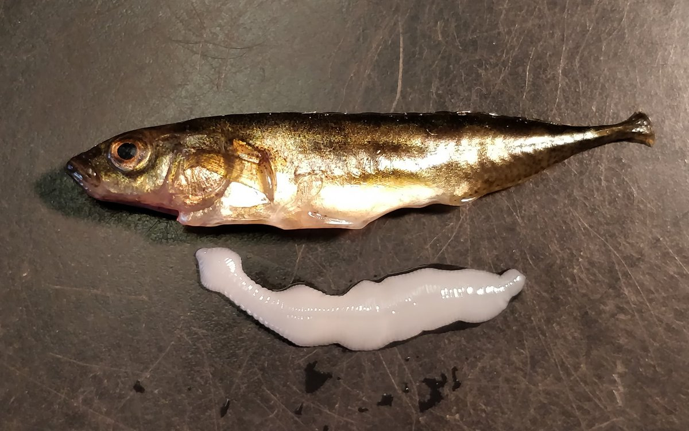

class: center, middle

# It's All Linear Models: T-Test Edition


```{r setup, include=FALSE}
library(knitr)
library(ggplot2)
library(dplyr)
library(tidyr)
library(broom)
library(readr)

opts_chunk$set(fig.height=6, 
               fig.width = 8,
               fig.align = "center",
               comment=NA, 
               warning=FALSE, 
               echo = FALSE,
               message = FALSE)

options(htmltools.dir.version = FALSE)
theme_set(theme_bw(base_size=24))
```

---
class: center, middle

# Etherpad
<br><br>
<center><h3>https://etherpad.wikimedia.org/p/607-linear_everywhere-2020</h3></center>

---
# YES, YOU KNOW EVERYTHING

1. Beastiary of Everything As a Linear Model

2. T-Tests as a Linear Model

---
# Up until now, we've done this
$$y_i = \beta_0 + \beta_1 x_i + \epsilon_i$$
$$\epsilon_i \sim N(0, \sigma)$$

```{r pp}
library(palmerpenguins)
penguins <- penguins %>% drop_na(sex)
ggplot(penguins,
       aes(x = body_mass_g, y = flipper_length_mm)) +
  geom_point() +
  stat_smooth(method = "lm", color = "red")
```

---

# But we have wider classes of problems...
### Comparing Two Means

```{r}
ggplot(penguins,
       aes(y = body_mass_g, x = sex)) +
  geom_point(alpha = 0.3, position = position_jitter(width = 0.2))  +
  stat_summary(fun.data = mean_cl_boot, color = "red") +
  labs(subtitle = "Is Body Mass Different Between\nDifferent Penguin Sexes?")
```

--
$$mass_i = \beta_0 + \beta_1 sex_i + \epsilon_i$$
---

# But we have wider classes of problems...
### Comparing Many Means

```{r}
ggplot(penguins,
       aes(y = body_mass_g, x = species)) +
  geom_point(alpha = 0.3, position = position_jitter(width = 0.2))  +
  stat_summary(fun.data = mean_cl_boot, color = "red") +
  labs(subtitle = "Is Body Mass Different Between\nDifferent Penguin Species?")
```

--
$$mass_i =  \beta_1 adelie_i + \beta_2 chinstrap_i + \beta_3 gentoo_i + \epsilon_i$$
---

# But we have wider classes of problems...
### Many Predictors

```{r}
library(modelr)

bill_mod <- lm(bill_length_mm ~ bill_depth_mm + flipper_length_mm, data = penguins)

pred <- data_grid(penguins,
                  flipper_length_mm=seq_range(flipper_length_mm,2),
                  bill_depth_mm = seq_range(bill_depth_mm,4)
                  )

pred <- pred %>%
  add_predictions(bill_mod, var = "bill_length_mm")

ggplot(penguins,
       aes(x = flipper_length_mm, y = bill_length_mm, color = bill_depth_mm, group = cut_interval(bill_depth_mm, 6))) +
  geom_point(alpha = 0.3, position = position_jitter(width = 0.2))  +
  geom_line(data = pred, aes(group = bill_depth_mm),
            size = 1.3) +
  labs(subtitle = "How do flipper length and bill depth\ninfluence bill length?",
        color = "Bill Depth\n(mm)",
       x = "Flipper Length (mm)", y = "Bill Length (mm)") +
  scale_color_binned(type = "viridis")
```
--
$$length_i = \beta_0 + \beta_1 flipper_i + \beta_2 depth_i+ \epsilon_i  $$
---

# But we have wider classes of problems...
### One Predictor Modifies Another
```{r, fig.height = 5}
ggplot(penguins,
       aes(x = body_mass_g, y = flipper_length_mm, color = species)) +
  geom_point(alpha = 0.3, position = position_jitter(width = 0.2))  +
  stat_smooth(method = "lm") +
  labs(subtitle = "How do body mass and species influence\nflipper length?")
```

--
$$\small flipper_i = \beta_0 mass_i + \beta_1 adelie_i + \beta_2 chinstrap_i + \beta_3 gentoo_i +$$
$$\small\beta_4 mass_iadelie_i + \beta_5 mass_ichinstrap_i + \beta_6 mass_igentoo_i + \epsilon_i  $$
---
class:center, middle

---

# But we have wider classes of problems...
### Nonlinear Models and Transformation

```{r metabolism, fig.height = 5}
metabolism <- read.csv("./data/25/17q16PrimateMassMetabolicRate.csv")
mod <- lm(log(bmr.watts) ~ I(log(mass.g)), data = metabolism)

pred_m <- data.frame(mass.g = seq(0.1,80000, length.out = 200)) 

pred_m <- cbind(pred_m, 
                    predict(mod, newdata = pred_m,
                  interval = "confidence") %>%
  as_tibble() %>%
  mutate(bmr.watts = exp(fit),
         lwr = exp(lwr),
         upr = exp(upr)))

  
meta_plot <- ggplot(metabolism, mapping=aes(x=mass.g, y=bmr.watts)) +
  geom_point(size=2) +
  theme_bw(base_size=17) +
  geom_line(data = pred_m, color = "red", size = 1.5) +
  geom_ribbon(data = pred_m, aes(ymin = lwr, ymax = upr), 
              color = "lightgrey", alpha = 0.3)+
  labs(subtitle = "How does body mass influence\nmetabolic rate?")

meta_plot
```

--

$$log(bmr_i) = log(\beta_0) + \beta_1 log(mass_i) + \epsilon_i$$
$$bmr_i = \beta_0 mass_i^{\beta_1}  \epsilon_i$$
---

# But we have wider classes of problems...
### Non-Normal Nonlinear Models
```{r crypto_data, fig.height = 5}
crypto <- read.csv("data/25/cryptoDATA.csv") %>%
  mutate(success=Y/N)

qplot(Dose, success, data=crypto) +
  theme_bw(base_size=16) +
  ylab("Fraction of Mice Infected") +
  stat_smooth(aes(weight = N),
              method = "glm",
              method.args = list(family = binomial),
              color = "red") +
  labs(subtitle = "Dose-Infection Curve for Mouse\nDrug Trial")
```

--

$$infected_i \sim B(prob.\ infected_i, size = trials)$$
$$logit(prob.\ infected_i) = \beta_0 + \beta_1 Dose_i$$
---

# But we have wider classes of problems...
### Goodness of Fit
.pull-left[
```{r}
library(tibble)
days <- c("Sunday", "Monday", "Tuesday", "Wednesday", "Thursday", "Friday", "Saturday")
birth_vec <- c(33,	41,	63,	63,	47,	56,	47)
births <- tibble(`Day of the Week` = days, Births = birth_vec)

kable(births, "html") %>% 
  kableExtra::kable_styling(bootstrap_options = "striped")
```
]

.pull-right[
```{r, fig.height = 8}
glm_chisq <- glm(Births ~ `Day of the Week`,
                 family = poisson(),
                 data = births)

ggplot(births,
       aes(x = Births, y = `Day of the Week`)) +
  geom_point(size = 2) +
  labs(subtitle = "Are births spread evenly\nacross the week?")+
  theme_bw(base_size = 24)
```
]
--

$$births_i \sim P(\widehat{births_i})$$
$$log(\widehat{births_i}) = \beta_1Monday_i + \beta_2Tuesday_i+...$$

---

# But we have wider classes of problems...
### Contingency Tables

.pull-left[

```{r ctab, echo=FALSE}
my_counts <- tribble(
  ~Is_Eaten, ~Infection, ~Count,
  "Eaten by Birds", "Uninfected", 1,
  "Eaten by Birds", "Lightly Infected", 10, 
  "Eaten by Birds", "Heavily Infected", 37,
  "Not Eaten by Birds", "Uninfected", 49,
  "Not Eaten by Birds", "Lightly Infected", 35,
  "Not Eaten by Birds", "Heavily Infected", 9
  
)

ctab <- xtabs(Count ~ Is_Eaten + Infection, data = my_counts)

#kable(ctab, "html") %>% kableExtra::kable_styling("striped")

```

]

.pull-right[
```{r, fig.height = 8}
ggplot(my_counts,
       aes(y = Count, fill = Infection, x = Is_Eaten)) +
  geom_col(position = "dodge") +
  xlab("") +
  theme_bw(base_size = 25)
```
]

--

$$count_i \sim P(\widehat{count_i})$$
$$log(\widehat{count_i}) = \beta_1eaten_i + \beta_2infection_i+ \beta_3 eaten_i *infection_i$$

---
# IT'S ALL VARIANTS OF A (GENERALIZED) LINEAR MODEL

$$\large f(\widehat{y_i}) = \beta_0 + \beta_1 x1_i + \beta_2 x2_i + \ldots$$

<br>
  
$$\large y_i \sim Dist(mean = \widehat{y_i}, dispersion = s(\widehat{y_i}))$$
  


  

- X can be continuous OR discrete (turned into 1 and 0)   
- Y can be continous, ranks, etc.  
- f(Y) can be an identity, log, logit, or other relationship  
- Dist can be normal, or really anything  
- s(Y) can be just a single number, a linear, or nonlinear function  

---
class:center, middle


---
# YES, YOU KNOW EVERYTHING

1. Beastiary of Everything As a Linear Model

2. .red[T-Tests as a Linear Model]

---
# Classical Approach: T-test


---
# Classical Approach: T-test


---

# The One-Sample T-Test

- We take some data

- We estimate it's mean and SE

- We calculate whether it is different from some hypothesis (usually 0)

--

- But.... isn't this just an intercept only model?

$$\Large y_i = \beta_0 + \epsilon_i$$

---

# Consider Climate-Change Driven Range Shifts

- Is the distribution of range-shifts 0?

```{r}
shift <- read_csv("https://whitlockschluter.zoology.ubc.ca/wp-content/data/chapter11/chap11q01RangeShiftsWithClimateChange.csv")

library(patchwork)
(ggplot(shift,
       aes(x = elevationalRangeShift)) +
  geom_density()) +
(ggplot(shift,
       aes(x = elevationalRangeShift)) +
  geom_histogram(bins = 10)) 

```

.small[Chen, I-C., J. K. Hill, R. Ohlemüller, D. B. Roy, and C,. D. Thomas. 2011. Science 333:1024-1026.]

---

# Testing a Mean with an Intercept Only Model

```{r in_only, echo = TRUE}
shift_mod <- lm(elevationalRangeShift ~ 1, data = shift)

shift_t <- t.test(shift$elevationalRangeShift)
```

LM Coefficients versus T-Test
```{r}
display_tab <- . %>%
  kable("html") %>%
  kableExtra::kable_styling()

tidy(shift_mod) %>% display_tab

tidy(shift_t)[,1:3] %>% display_tab
```

---

# What if we are looking at Change Between Pairs

- Classically, we have the **Paired T-Test**

- We look at differences between pairs
     - Could be One Individual over time
     - Could be two plots next to each other
     - Deliciously simple
     
- This is just an intercept only model where the Difference is our response variable

$$\Large (y1 - y2)_i = \beta_0 + \epsilon_i$$
---
# Does bird immunococompetence decrease after a testosterone implant?
.center[

]

```{r load_blackbird}
blackbird <- read.csv("./data/09/12e2BlackbirdTestosterone.csv") %>%
  mutate(Bird = 1:n())

b_tidy <- gather(blackbird, When, Antibody, -c(Bird)) %>%
  filter((When %in% c("Before", "After"))) %>%
  mutate(When = forcats::fct_rev(When))
```

---
# Differences in Antibody Performance
```{r blackbird_plot}
ggplot(data=b_tidy, aes(x=When, y=Antibody, group=Bird)) +
  geom_point(color="red") +
  geom_line() +
  theme_bw(base_size=18)
```

---
# Again, Intercept Only Model v. T-Test
```{r diff_mod}
diff_mod <- lm((After - Before) ~ 1, data = blackbird)

diff_t <- t.test(blackbird$After, blackbird$Before,
                 paired = TRUE)
```

LM Coefficients versus T-Test
```{r}
tidy(diff_mod) %>% display_tab

tidy(diff_t)[,1:3] %>% display_tab
```

---
# Consider Comparing Two Means
#### Consider the Horned Lizard 
.center[

]


Horns prevent these lizards from being eaten by birds. Are horn lengths different between living and dead lizards, indicating selection pressure?

---
# The Data
```{r lizard_load, warning=FALSE}
library(readr)
lizards <- read_csv("./data/09/12e3HornedLizards.csv",
                    col_types = "di") %>%
  mutate(Status = ifelse(Survive==1, "Living", "Dead")) %>%
  filter(!is.na(`Squamosal horn length`))

ggplot(lizards) +
  aes(x=Status, y=`Squamosal horn length`, fill=Status) +
  geom_boxplot() +
  theme_bw(base_size=17)
```

---
# Looking at Means and SE
```{r lizard_mean, warning=FALSE}
liz_mean <- ggplot(lizards) +
  aes(x=Status, y=`Squamosal horn length`) +
  geom_jitter(alpha = 0.2) +
  stat_summary(color = "red", fun.data = mean_cl_boot)

liz_mean
```


---
# What is Really Going On?
```{r lizard_mean, warning=FALSE}
```
--
What if we think of Dead = 0, Living = 1

---
# Let's look at it a different way

.center[

]
---
# This is Just a Linear Regression
```{r}
lizards <- lizards %>%
  mutate(Status_numeric = as.numeric(as.factor(Status))-1)

ggplot(lizards) +
  aes(x=Status_numeric, y=`Squamosal horn length`) +
  geom_point(alpha = 0.2) +
  stat_summary(color = "red", fun.data = mean_cl_boot) +
stat_smooth(method = "lm", color = "red")
```

$$Length_i = \beta_0 + \beta_1 Status_i + \epsilon_i$$
---
# You're Not a Dummy, Even if Your Code Is


$$Length_i = \beta_0 + \beta_1 Status_i + \epsilon_i$$

- Setting $Status_i$ to 0 or 1 (Dead or Living) is called Dummy Coding

- We can always turn groups into "Dummy" 0 or 1

- We could even fit a model wit no $\beta_0$ and code Dead = 0 or 1 and Living = 0 or 1

- This approach works for any **nominal variable**

---
# How Do We Analyze This?

- T-Test of Coefficients tells you difference between dead and live

--

- Wait, did you say **T-Test**?
     - Yes, we're doing *the same thing* in coefficient evaluation
     
--

- F-tests still useful for looking at variation explained
    - Also $R^2$
    
--

- You can even use likelihood, Bayes, CV, and other tools

--

- You get more for your money with linear models!

---
# Fit and Compare!

```{r t_mod, echo = TRUE}
t_mod <- lm(`Squamosal horn length` ~ Status, 
            data = lizards)
```

Coefficients from Linear Model:
```{r t_comp}
tidy(t_mod)[2,] %>% 
  kable() %>%
  kableExtra::kable_styling()
```
<!--
F-Test
```{r}
tidy(anova(t_mod)) %>% 
  kable() %>%
  kableExtra::kable_styling()
```
-->

T-Test
```{r}
tidy(t.test(`Squamosal horn length` ~ Status, 
            data = lizards,
            var.equal = TRUE))[,c(1:5)]%>% 
  kable() %>%
  kableExtra::kable_styling()

```

---
# Variatons on a theme: Non-Parametric Mann-Whitney U

How about those residuals?

```{r}
tidy(shapiro.test(residuals(t_mod))) %>% 
  kable() %>%
  kableExtra::kable_styling()

hist(residuals(t_mod))
```

--

Classical approach: Non-Parametric Mann-Whitney-U Test

- But, are you really going to remember that?

- Simpler to remember, we just transform Y values to ranks, and voila, we have a general technique

---
# Signed Rank versus Original Values

```{r ranks}
lizards <- lizards %>%
  mutate(horn_rank = rank(`Squamosal horn length`))

ggplot(lizards,
       aes(x = horn_rank, y = `Squamosal horn length`, 
           color = Status)) +
  geom_point(size = 4, alpha = 0.5) +
  scale_color_manual(values = c("red", "blue"))
```

---
# Signed Rank as Data

```{r ranks_data}
lizards <- lizards %>%
  mutate(horn_rank = rank(`Squamosal horn length`))

ggplot(lizards,
       aes(y = horn_rank, x = Status, 
           color = Status)) +
  geom_point(size = 2, alpha = 0.5) +
  scale_color_manual(values = c("red", "blue"))
```

---
# Signed Rank as Boxplots

```{r ranks_boxplot}
lizards <- lizards %>%
  mutate(horn_rank = rank(`Squamosal horn length`))

ggplot(lizards,
       aes(y = horn_rank, x = Status, 
           fill = Status)) +
  geom_boxplot() +
  scale_fill_manual(values = c("red", "blue"))
```

---
# Variations on a theme: Welch's T-Test

```{r mwrank, echo = TRUE}
mwu_mod <- lm(rank(`Squamosal horn length`) ~ Status, 
            data = lizards)

mwu <- wilcox.test(`Squamosal horn length` ~ Status, 
            data = lizards,)
```

Linear Model on Ranks
```{r}
tidy(mwu_mod)[2,] %>% kable("html")
```

Mann-Whitney-U/Wilcoxon Rank Test
```{r}
tibble(MWU_p_value = mwu$p.value) %>% kable("html")
```

---
# Variations on a theme: Welch's T-Test

Or.... let variance be different between groups.
i = data point, j = group

$$y_{ij} = \beta_0 + \beta_1x_j + \epsilon_{ij}$$
$$\epsilon_{ij} \sim N(0, \sigma_j)$$

--

Fit using **weighted least squares** - we weight LS by inverse of variance  


--

Classically, this is known as Welch's T-Test, and is the default for R
   - Computes a pooled variance based on unequal variance/sample size

---
# Weighting by Variance

```{r}

lizards <- lizards %>%
  mutate(squamosal_horn_length = `Squamosal horn length`)
```

```{r wls, echo = TRUE}
library(nlme)
weighted_mod <- gls(squamosal_horn_length ~ Status,
                  weights = varIdent(form = ~1|Status),
                  data = lizards,
                  method = "ML")
```

Weighted Least Squares Results
```{r}
broom.mixed::tidy(weighted_mod)[2,] %>%
  kable( "html") %>%
  kableExtra::kable_styling()
```

Welch's T-Test Results
```{r welch}
tidy(t.test(squamosal_horn_length ~ Status,
            data = lizards,
            var.equal=FALSE)
     )[,1:5] %>%
    kable("html") %>%
  kableExtra::kable_styling()

```
---
# Don't forget...

.center[


]
---
# Excess Baggage

- In this framework, you have to do ALL assumption tests

--

- BUT, t-tests have THE SAME ASSUMPTIONS

--

- BECASUE THEY ARE JUST LINEAR MODELS RE-ARRANGED

--

- AND, you gain flexibility in execution

--

- AND, you don't have to remember an arcane taxonomy of tests

--

$$\large Y = \beta X + \epsilon$$

---
# Care for Your Golem
.center[


Just remember, if you are not careful, even with the simplest data, you can still burn down Prague!]

---
class: center, middle

